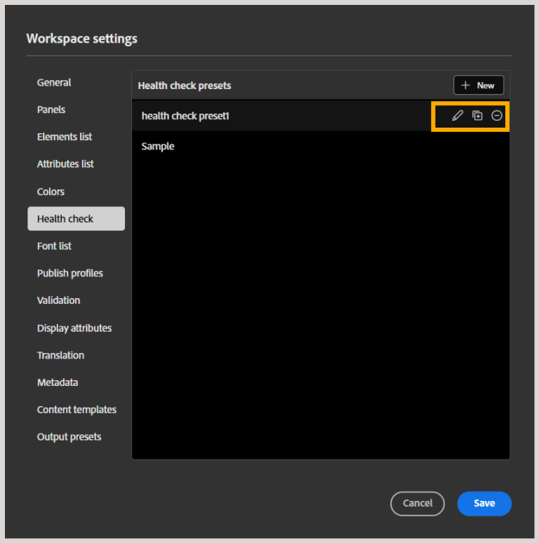

# Création et gestion des paramètres prédéfinis de contrôle de l’intégrité

>[!NOTE]
>
> Cette fonctionnalité est activée par défaut. Si vous préférez ne pas utiliser cette fonctionnalité dans votre environnement, contactez votre équipe du succès client.

En tant qu’administrateur, vous pouvez configurer la fonction de contrôle de l’intégrité au niveau du profil de dossier dans Experience Manager, ce qui permet aux auteurs et aux éditeurs d’exécuter des contrôles de l’intégrité sur un plan DITA. Cela inclut la détection précoce de problèmes tels que des liens rompus, des identifiants en double et des échecs de validation du schéma sur une carte avant la publication, au lieu de vérifier chaque fichier individuellement. Les contrôles exécutés sont définis par un paramètre prédéfini de contrôle de l’intégrité, un ensemble de règles que les auteurs et les éditeurs peuvent sélectionner et exécuter.

Cet article fournit des informations sur la création et la gestion des paramètres prédéfinis de contrôle de l’intégrité.

## Création d’un paramètre prédéfini de contrôle de l’intégrité

Pour créer un paramètre prédéfini de contrôle de l’intégrité au niveau du profil de dossier, procédez comme suit :

1. Accédez aux [paramètres de ](./workspace-settings.md) puis sélectionnez **Contrôle de l’intégrité** dans la liste.
1. Dans le panneau **Paramètres prédéfinis de contrôle de l’intégrité**, sélectionnez **Nouveau**.

   
1. La boîte de dialogue **Nouveau paramètre prédéfini de contrôle de l’intégrité** s’affiche. Ajoutez un nom de paramètre prédéfini et sélectionnez les règles ou contrôles à inclure. Les options disponibles sont les liens rompus, les identifiants en double et les validations de schéma.

   
1. Sélectionnez **Créer**.
1. Sélectionnez **Enregistrer** pour enregistrer le paramètre.

Ce paramètre prédéfini est désormais disponible pour les auteurs et les éditeurs. Pour les auteurs, cette fonctionnalité est disponible dans le menu Options d’une carte en mode Carte et dans le panneau de rapport Contrôle de l’intégrité à côté du panneau de recherche, ce qui leur permet d’exécuter un contrôle de l’intégrité sur la carte sélectionnée à l’aide de l’un des paramètres prédéfinis de contrôle de l’intégrité configurés pour leur profil. Pour plus d’informations, consultez [Fonctionnalités supplémentaires de l’éditeur de cartes](../user-guide/map-editor-other-features.md#run-health-check-on-a-map).

Pour les éditeurs, le bouton (bascule) **Exécuter le contrôle d’intégrité avant la génération de la sortie** s’affiche dans le panneau des paramètres prédéfinis, qu’ils peuvent activer ou désactiver selon leurs besoins. Lorsqu’il est activé, le rapport de contrôle de l’intégrité est ajouté aux journaux au début du processus de publication, mais ne bloque pas la génération de sortie.

## Gestion des paramètres prédéfinis de contrôle de l’intégrité

Une fois créé, le paramètre prédéfini est ajouté au panneau Paramètres prédéfinis de contrôle de l’intégrité à partir duquel vous pouvez effectuer les opérations de modification, de duplication ou de suppression sur le paramètre prédéfini.

- **Modifier** : permet de modifier les champs de paramètre prédéfini, tels que le nom du paramètre prédéfini, les contrôles (sélection ou désélection des contrôles), et d’ajouter ou de supprimer des fichiers Schematron joints au paramètre prédéfini.
- **Dupliquer** : crée un doublon du préréglage dans la même liste.
- **Supprimer** : supprime le paramètre prédéfini du panneau.

Sélectionnez **Enregistrer** pour enregistrer vos modifications.
