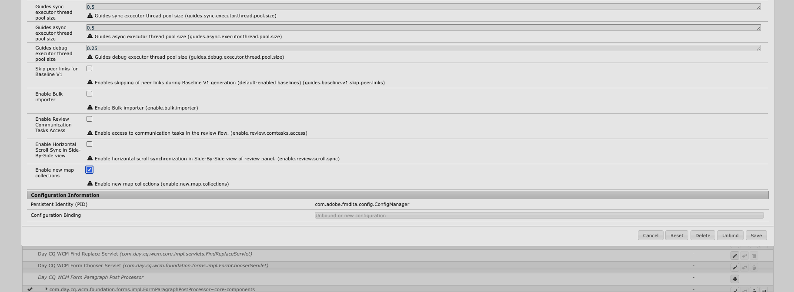

# Configurer une nouvelle collection de cartes pour On-Premise

Les étapes suivantes expliquent comment activer la nouvelle collection de cartes dans votre environnement On-Premise.

1. Ouvrez la page de configuration de la console web Adobe Experience Manager .

   L’URL par défaut pour accéder à la page de configuration est :

   ```http
   http://<server name>:<port>/system/console/configMgr
   ```

1. Recherchez et sélectionnez le lot **com.adobe.fmdita.config.ConfigManager**.

1. Activez le paramètre **Activer de nouvelles collections de mappage** (enable.new.map.collections).

   {width="800"}

1. Sélectionnez **Enregistrer**.
