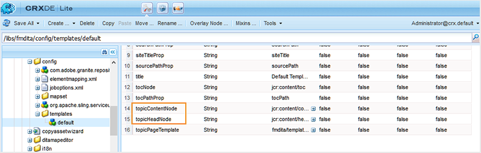

# Configurer les paramètres de génération de sortie {#id181AI0B0E30}

AEM Guides s’accompagne de nombreuses options de configuration vous permettant de personnaliser le processus de génération de sortie. Cette rubrique couvre toutes les configurations et personnalisations qui vous aideraient à configurer votre processus de génération de sortie.

## Configurer l&#39;onglet Ligne de base dans le tableau de bord du plan DITA {#id223MD0D0YRM}

Les onglets suivants fournissent des instructions pour masquer l&#39;onglet Ligne de base dans le tableau de bord du plan DITA en fonction de votre configuration Experience Manager Guides : Cloud Service ou On-Premise.

>[!BEGINTABS]

>[!TAB Tab]

1. Suivez les instructions fournies dans [Remplacements de la configuration](download-install-config-override.md#) pour créer le fichier de configuration.
1. Dans le fichier de configuration, fournissez les détails \(property\) suivants pour configurer l’onglet de ligne de base sur le tableau de bord de mappage.

| PID | Clé de la propriété | Valeur de la propriété |
|---|------------|--------------|
| `com.adobe.fmdita.config.ConfigManager` | `hide.tabs.baseline` | Booléen\(`true/false`\).**Valeur par défaut** : `true` |

>[!NOTE]
>
> Cette configuration est activée par défaut et l’onglet Ligne de base n’est pas disponible sur le tableau de bord des cartes.

>[!TAB  On-Premise ]

1. Ouvrez la page de configuration de la console web Adobe Experience Manager .

   L’URL par défaut pour accéder à la page de configuration est :

   ```http
   http://<server name>:<port>/system/console/configMgr
   ```

1. Recherchez et cliquez sur le lot **com.adobe.fmdita.config.ConfigManager** et cliquez dessus.

1. Sélectionnez l’option **Masquer l’onglet Ligne de base**.

1. Cliquez sur **Enregistrer**.

>[!NOTE]
>
> Cette configuration est désactivée par défaut et l’onglet Ligne de base est disponible dans le tableau de bord des cartes.

>[!ENDTABS]


## Configuration de la publication mixte dans un site AEM existant {#id1691I0V0MGR}

Si vous disposez d&#39;un site AEM contenant du contenu DITA, vous pouvez configurer la sortie de votre site AEM pour publier du contenu DITA vers un emplacement prédéfini de votre site. Par exemple, dans la capture d&#39;écran ci-dessous d&#39;une page de site AEM, le nœud `ditacontent` est réservé au stockage du contenu DITA :


Les nœuds restants dans la page sont créés directement à partir de l’éditeur de site AEM. La configuration du paramètre de publication pour publier du contenu DITA à un emplacement prédéfini garantit qu&#39;aucun de vos contenus non DITA existants ne sera modifié par le processus de publication AEM Guides.

Vous devez effectuer les configurations suivantes sur votre site existant pour autoriser la publication de contenu DITA sur un nœud prédéfini :

- Configurer les propriétés du modèle de votre site

- Ajouter des nœuds dans votre site pour publier du contenu DITA


Les onglets suivants fournissent des instructions pour configurer les propriétés de modèle de votre site existant en fonction de votre configuration Experience Manager Guides : Cloud Service ou On-Premise.

>[!BEGINTABS]

>[!TAB Tab]

1. Utilisez le gestionnaire de packages pour télécharger le fichier /libs/fmdita/config/templates/default.

   >[!NOTE]
   >
   > Ne rendez aucune personnalisation dans les fichiers de configuration par défaut disponibles dans le nœud `libs`. Vous devez créer un recouvrement du nœud `libs` dans le nœud `apps` et mettre à jour les fichiers requis dans le nœud `apps` uniquement.

1. Ajoutez les propriétés suivantes :

   | Nom de la propriété | Type | Valeur |
   |-------------|----|-----|
   | `topicContentNode` | Chaîne | Indiquez le nom du nœud dans lequel vous souhaitez publier le contenu DITA. Par exemple, le nœud par défaut dans lequel AEM Guides publie le contenu DITA est : <br> `jcr:content/contentnode` |
   | `topicHeadNode` | Chaîne | Indiquez le nom du nœud dans lequel vous souhaitez stocker les informations de métadonnées de votre contenu DITA. Par exemple, le nœud par défaut où AEM Guides stocke les informations de métadonnées est : <br> `jcr:content/headnode` |


La prochaine fois que vous publierez du contenu DITA à l&#39;aide des configurations de modèle de votre site, le contenu sera publié dans les nœuds spécifiés dans les propriétés `topicContentNode` et `topicHeadNode`.

>[!TAB  On-Premise ]

1. Connectez-vous à AEM et ouvrez le mode CRXDE Lite .

1. Accédez au nœud de configuration du modèle de votre site. Par exemple, AEM Guides stocke les configurations de modèle par défaut dans le nœud suivant :

   `/libs/fmdita/config/templates/default`

   >[!NOTE]
   >
   > Ne rendez aucune personnalisation dans les fichiers de configuration par défaut disponibles dans le nœud `libs`. Vous devez créer un recouvrement du nœud `libs` dans le nœud `apps` et mettre à jour les fichiers requis dans le nœud `apps` uniquement.

1. Ajoutez les propriétés suivantes :

   | Nom de la propriété | Type | Valeur |
   |-------------|----|-----|
   | `topicContentNode` | Chaîne | Indiquez le nom du nœud dans lequel vous souhaitez publier le contenu DITA. Par exemple, le nœud par défaut dans lequel AEM Guides publie le contenu DITA est : <br>`jcr:content/contentnode` |
   | `topicHeadNode` | Chaîne | Indiquez le nom du nœud dans lequel vous souhaitez stocker les informations de métadonnées de votre contenu DITA. Par exemple, le nœud par défaut où AEM Guides stocke les informations de métadonnées est : <br>`jcr:content/headnode` |


La capture d’écran ci-dessous montre les propriétés ajoutées dans le nœud de modèle par défaut d’AEM Guides :

{width="800" align="left"}

La prochaine fois que vous publierez du contenu DITA à l&#39;aide des configurations de modèle de votre site, le contenu sera publié dans les nœuds spécifiés dans les propriétés `topicContentNode` et `topicHeadNode`.

Toutefois, pour les sites existants, vous devez ajouter manuellement les nœuds `topicContentNode` et `topicHeadNode`.

Pour ajouter les nœuds requis à votre site existant, procédez comme suit :

1. Connectez-vous à AEM et ouvrez le mode CRXDE Lite .

1. Localisez `jcr:content` dans le nœud de votre site.

1. Ajoutez des nœuds `topicContentNode` et `topicHeadNode` portant le même nom que celui spécifié dans les configurations de modèle du site.

>[!ENDTABS]

## Configurer l’emplacement de sortie de base pour la publication

Les onglets suivants fournissent des instructions pour configurer l’emplacement de sortie de base en fonction de votre configuration Experience Manager Guides : Cloud Service ou On-Premise.

>[!BEGINTABS]

>[!TAB Tab]

1. Suivez les instructions fournies dans [Remplacements de la configuration](download-install-config-override.md) pour créer le fichier de configuration.

1. Dans le fichier de configuration, fournissez les détails (propriété) suivants pour configurer l’emplacement de sortie de base :

   | PID | Clé de la propriété | Valeur de la propriété |
   |---|---|---|
   | `com.adobe.fmdita.config.ConfigManager` | `base.output.path` | **Valeur par défaut :** « /content/dam/fmdita-output » |

>[!TAB  On-Premise ]

1. Ouvrez la page de configuration de la console web Adobe Experience Manager .

   L’URL par défaut pour accéder à la page de configuration est :

   ```http
   http://<server name>:<port>/system/console/configMgr
   ```

1. Recherchez et sélectionnez le lot *com.adobe.fmdita.config.ConfigManager*.

1. Mettez à jour la propriété **Emplacement de sortie de base** pour spécifier le chemin par défaut dans le référentiel AEM où le PDF sera enregistré après publication. De plus, si un chemin non valide est saisi, il revient automatiquement au chemin par défaut : `/content/dam/fmdita-outputs`.

1. Cliquez sur **Enregistrer**.

>[!ENDTABS]

## Utilisation des métadonnées dans la publication d’une sortie via DITA-OT {#id191LF0U0TY4}

AEM Guides permet de transmettre des métadonnées personnalisées lors de la publication d’une sortie à l’aide de DITA-OT. En tant qu’administrateur et éditeur, vous devez effectuer les tâches suivantes pour configurer et utiliser des métadonnées personnalisées dans la sortie publiée :

- En tant qu&#39;administrateur, ajoutez les métadonnées requises dans le système afin qu&#39;elles soient disponibles dans la page Propriétés du plan DITA.

- En tant qu&#39;administrateur, ajoutez les métadonnées personnalisées dans la liste de métadonnées afin qu&#39;elles s&#39;affichent dans la console de mappage DITA.

- En tant qu&#39;éditeur, configurez et ajoutez les métadonnées personnalisées avec le plan DITA et générez la sortie requise.


Pour ajouter les métadonnées requises dans le système, procédez comme suit :

1. Connectez-vous à Adobe Experience Manager en tant qu’administrateur.

1. Cliquez sur le lien Adobe Experience Manager en haut et choisissez **Outils**.

1. Sélectionnez **&#x200B;**&#x200B;dans la liste des outils.

1. Cliquez sur la mosaïque **Schémas de métadonnées**.

   La page Forms du schéma de métadonnées s’affiche.

1. Sélectionnez le formulaire **par défaut** dans la liste.

   >[!NOTE]
   >
   > Les propriétés affichées sur la page Propriétés d&#39;un plan DITA sont extraites de ce formulaire.

1. Cliquez sur **Modifier**.

1. Ajoutez les métadonnées personnalisées que vous souhaitez utiliser dans les sorties publiées. Par exemple, nous ajouterons des métadonnées d’audience en procédant comme suit :

   1. Dans la liste des composants **Créer le formulaire**, faites glisser et déposez le composant **Une seule ligne de texte** sur le formulaire.

   2. Sélectionnez le nouveau champ pour ouvrir la **Paramètres** du champ.

   3. Dans le **Libellé du champ**, saisissez le nom des métadonnées : Audience.

   4. Dans le paramètre **Mapper à la propriété**, spécifiez ./jcr:content/metadata/&lt;nom des métadonnées\>. Dans notre exemple, nous la définirons sur ./jcr:content/metadata/audience.

   En procédant comme suit, ajoutez tous les paramètres de métadonnées requis.

1. Cliquez sur **Enregistrer**.


Le nouveau paramètre apparaît désormais dans la page Propriétés de tous les mappages DITA.


Vous devez ensuite rendre les métadonnées personnalisées disponibles dans la console de plan DITA. Les onglets suivants fournissent des instructions pour rendre les métadonnées personnalisées disponibles dans le tableau de bord de plan DITA en fonction de votre configuration Experience Manager Guides : Cloud Service ou On-Premise.

>[!BEGINTABS]

>[!TAB Tab]

1. Utilisez le gestionnaire de packages pour accéder au fichier metadataList disponible à l’emplacement suivant de votre référentiel Git Cloud Manager :

   /libs/fmdita/config/metadataList

   >[!NOTE]
   >
   > Le fichier metadataList contient une liste des propriétés affichées dans la liste déroulante **Propriétés** d&#39;un plan DITA dans le tableau de bord du plan. Par défaut, ce fichier répertorie quatre propriétés : docstate:language dc:description, dc et dc:title.

1. Ajoutez les métadonnées personnalisées que vous avez ajoutées à la page Forms de schéma de métadonnées . Dans notre exemple, ajoutez le paramètre audience à la fin de la liste par défaut.

>[!TAB  On-Premise ]

1. Connectez-vous à AEM et ouvrez le mode CRXDE Lite .

1. Accédez au fichier metadataList disponible à l’emplacement suivant :

   /libs/fmdita/config/metadataList

   >[!NOTE]
   >
   > Le fichier metadataList contient une liste des propriétés affichées dans la liste déroulante **Propriétés** d&#39;un plan DITA dans le tableau de bord du plan. Par défaut, ce fichier répertorie quatre propriétés : docstate:language dc:description, dc et dc:title.

1. Ajoutez les métadonnées personnalisées que vous avez ajoutées à la page Forms de schéma de métadonnées . Dans notre exemple, ajoutez le paramètre audience à la fin de la liste par défaut.

1. Cliquez sur **Enregistrer tout**.

>[!ENDTABS]

Désormais, les métadonnées personnalisées s&#39;affichent dans la liste déroulante **Propriétés** de la console Plan DITA.

Enfin, en tant qu’éditeur, vous devez inclure les métadonnées personnalisées dans la sortie publiée. Pour traiter les métadonnées personnalisées lors de la génération de la sortie, procédez comme suit :

1. Dans l’interface utilisateur d’Assets, accédez au plan DITA à publier.

1. Sélectionnez le fichier de mappage DITA et ouvrez sa page de propriétés.

1. Sur la page Propriétés , spécifiez la valeur des métadonnées personnalisées. Dans notre exemple, nous avons spécifié une valeur externe pour le paramètre d’audience.

   

1. Cliquez sur **Enregistrer et fermer**.

1. Cliquez sur le fichier de plan DITA pour ouvrir la console de plan DITA.

1. Dans l’onglet **Paramètres prédéfinis de sortie**, sélectionnez le paramètre prédéfini de sortie que vous souhaitez utiliser pour générer la sortie.

1. Cliquez sur **Modifier**.

1. Dans la liste déroulante **Propriétés**, sélectionnez les propriétés que vous souhaitez transmettre au processus de publication.

   


Les propriétés/métadonnées sélectionnées sont transmises au processus de publication et sont mises à disposition dans la sortie finale.

### Validez les métadonnées transmises au DITA-OT pour traitement (uniquement pour Cloud Service).

Pour valider les valeurs de métadonnées transmises à DITA-OT, vous pouvez utiliser un environnement local à l’aide d’un fichier jar prêt pour le cloud. Comme nous ne pouvons pas accéder au système de fichiers local sur le cloud, la seule façon de valider le fichier de métadonnées est via le fichier jar prêt pour le cloud.

- Nom de fichier : metadata.xml
- Emplacement du fichier : crx-quickstart/profiles/ditamaps/&lt;ditamap-1234\>

  Pour accéder au fichier metadata.xml :

   - Connectez-vous à l’emplacement du serveur sur lequel l’instance AEM est en cours d’exécution.
   - Migrez vers crx-quickstart/profiles/ditamaps/&lt;newly-created-directory-name\>/metadata.xml.
- Exemple de format de fichier :

  **metadata.xml**

  ```XML
  <?xml version="1.0" encoding="UTF-8" standalone="no"?>
  <root>
     <Path id="/absolutePath/sampleMap.ditamap">
        <metadata>
           <meta isArray="false" key="dc:description">This is a file</meta>
           <meta isArray="false" key="dc:title">Myfile</meta>
           <meta isArray="true" key="multivalueText">One;Two;Three</meta>
        </metadata>
     </Path>
     <Path id="/absolutePath/sampleTopic.dita">
        <metadata>
           <meta isArray="false" key="dc:description">description for the accountability</meta>
           <meta isArray="false" key="dc:title">accountability title</meta>
           <meta isArray="true" key="multivalueText">value1</meta>
        </metadata>
     </Path>
  </root>
  ```


- isArray : attribut booléen qui définit si les métadonnées sont une propriété \(Array\) à plusieurs valeurs ou non. Les valeurs sont délimitées par un point-virgule.
- ID de chemin d’accès : chemin d’accès absolu au fichier stocké dans le répertoire temporaire.

>[!NOTE]
>
> Si des métadonnées particulières ne sont pas présentes pour le fichier, la balise &lt;meta\> avec la clé n’apparaîtra pas comme propriété pour ce fichier dans le fichier metadata.xml.

## Configurez le champ d&#39;argument de ligne de commande DITA-OT pour accepter les métadonnées de carte racine (uniquement pour Cloud Service)

Pour utiliser le champ d&#39;argument de ligne de commande DITA-OT afin de transmettre des métadonnées de carte racine, procédez comme suit :

1. Suivez les instructions fournies dans [Remplacements de la configuration](download-install-config-override.md#) pour créer le fichier de configuration.
1. Dans le fichier de configuration, fournissez les détails \(property\) suivants pour configurer le champ d’argument de ligne de commande DITA-OT dans le préréglage :

| PID | Clé de la propriété | Valeur de la propriété |
|---|------------|--------------|
| `com.adobe.fmdita.config.ConfigManager` | `pass.metadata.args.cmd.line` | Booléen\(`true/false`\).**Valeur par défaut** : `true` |

- La définition de la valeur de la propriété sur **true** active la fonctionnalité de ligne de commande DITA-OT, ce qui vous permet de transmettre les métadonnées via la ligne de commande DITA-OT.
- Définir la valeur de la propriété sur **false** désactive la fonctionnalité de ligne de commande DITA-OT. Vous pouvez ensuite utiliser le champ Propriété dans le paramètre prédéfini pour transmettre les métadonnées.

## Personnaliser la console de plan DITA {#id188HC08M0CZ}

AEM Guides vous offre la possibilité d&#39;étendre les fonctionnalités de la console de plan DITA. Par exemple, si vous disposez d’un ensemble de rapports différent de celui disponible dans AEM Guides, vous pouvez ajouter ces rapports à la console Carte. Pour personnaliser la console de mappage, vous devez créer une bibliothèque cliente AEM \(ou ClientLib\) qui contiendra le code permettant d’exécuter les fonctionnalités dont vous avez besoin.

>[!NOTE]
>
> Il n’est pas recommandé de modifier directement les composants de page, car ils seront remplacés par de nouvelles versions du produit.

AEM Guides fournit la catégorie `apps.fmdita.dashboard-extn` pour la personnalisation de Map Console. Chaque fois que la console de mappage est chargée, la fonctionnalité créée sous la catégorie `apps.fmdita.dashboard-extn` est exécutée et chargée.

>[!NOTE]
>
> Pour plus d’informations sur la création de la bibliothèque cliente AEM, voir [&#x200B; Utilisation de bibliothèques côté client &#x200B;](https://experienceleague.adobe.com/docs/experience-manager-cloud-service/implementing/developing/full-stack/clientlibs.html?lang=en).

## Gérer le rendu des images pendant la génération de la sortie {#id177BF0G0VY4}

AEM s’accompagne d’un ensemble de workflows et de descripteurs de médias par défaut destinés au traitement des ressources. Dans AEM, il existe des workflows prédéfinis pour gérer le traitement des ressources pour les types MIME les plus courants. En règle générale, pour chaque image chargée, AEM crée plusieurs rendus de la même image au format binaire. Ces rendus peuvent être de tailles différentes, avec une résolution différente, avec un filigrane ajouté ou une autre caractéristique modifiée. Pour plus d’informations sur la façon dont AEM gère les ressources, voir [Traitement d’Assets à l’aide de gestionnaires de médias et de workflows](https://experienceleague.adobe.com/docs/experience-manager-cloud-service/assets/asset-microservices-overview.html?lang=en) dans la documentation d’AEM.

AEM Guides vous permet de configurer le rendu d’image à utiliser au moment de la génération de la sortie de vos documents. Par exemple, vous pouvez choisir l’un des rendus d’image par défaut ou en créer un et l’utiliser pour publier vos documents. Le mappage de rendu d’image pour la publication de vos documents est stocké dans le fichier `/libs/fmdita/config/ **renditionmap.xml**`. Un extrait de fichier `renditionmap.xml` est le suivant :

>[!NOTE]
>
> Il est recommandé de créer une copie du fichier `renditionmap.xml` dans le dossier `apps` pour toutes les personnalisations.

```XML
<renditionmap>
   <mapelement>
      <mimetype>image/png</mimetype>
      <rendition output="AEMSITE">cq5dam.web.1280.1280.jpeg</rendition>
      <rendition output="PDF">original</rendition>
      <rendition output="HTML5">cq5dam.web.1280.1280.jpeg</rendition>
      <rendition output="HTML5" outputName="ditahtml5">cq5dam.thumbnail.319.319.png</rendition>
      <rendition output="EPUB">cq5dam.web.1280.1280.jpeg</rendition>
      <rendition output="CUSTOM">cq5dam.web.1280.1280.jpeg</rendition>
   </mapelement>
...
</renditionmap>
```

L’élément `mimetype` spécifie le type MIME du format de fichier. L’élément `rendition output` spécifie le type de format de sortie et le nom du rendu \(par exemple, `cq5dam.web.1280.1280.jpeg`\) qui doit être utilisé pour publier la sortie spécifiée. Vous pouvez spécifier les rendus d’image à utiliser pour tous les formats de sortie pris en charge (AEMSITE, PDF, HTML5, EPUB et CUSTOM).

Si vous souhaitez spécifier des rendus d’image différents pour un paramètre prédéfini de sortie, vous pouvez utiliser l’attribut `outputName`, avec sa valeur définie sur le titre du paramètre prédéfini, pour définir des rendus personnalisés pour des paramètres prédéfinis de sortie spécifiques sous le même type de sortie. Cela s’avère utile lorsque vous avez besoin de différentes tailles ou formats d’image pour différents scénarios de publication.

Par exemple :


```XML
<renditionmap>
   <mapelement>
      <mimetype>image/png</mimetype>
      
      <rendition output="HTML5">cq5dam.web.1280.1280.jpeg</rendition>
      <rendition output="HTML5" outputName="ditahtml5">cq5dam.thumbnail.319.319.png</rendition>
      
   </mapelement>
...
</renditionmap>
```

Dans les rendus ci-dessus, lorsque l’attribut `outputName` est défini sur `ditahtml5` (titre du paramètre prédéfini), le paramètre prédéfini de `ditahtml5` utilise le `cq5dam.thumbnail.319.319.png` d’image miniature. Si l’attribut `outputName` n’est pas spécifié, toutes les sorties HTML5 utilisent la `cq5dam.web.1280.1280.jpeg` d’image plus grande.

Si le rendu spécifié n’est pas présent, le processus de publication AEM Guides recherche d’abord le rendu web de l’image donnée. Si le rendu web est introuvable, le rendu original de l’image est utilisé.

>[!NOTE]
>
> Ces rendus d’image contrôlent uniquement la génération de sortie. Le rendu web d’une image est utilisé lorsque vous ouvrez un document pour le prévisualiser ou le réviser.

## Configurer la période de purge automatique pour l’historique de sortie {#id19AAI070V8Q}

Lorsque vous générez une sortie, celle-ci est créée avec les journaux de sortie. Pour les plans DITA volumineux, ces journaux peuvent occuper une grande quantité d&#39;espace dans votre référentiel. Par défaut, les journaux sont stockés à l’emplacement suivant dans le référentiel :

`/var/dxml/metadata/outputHistory`

Sur une période de temps, la taille collective de tous les fichiers journaux pouvait atteindre Go. AEM Guides vous permet de configurer une période pour conserver ces fichiers journaux dans le référentiel. Au bout de la période spécifiée, les journaux ainsi que l’historique de génération de sortie sont supprimés du référentiel.

>[!NOTE]
>
> L’historique de génération des sorties est l’entrée du journal dans la liste Sorties générées de l’onglet Sorties .

La configuration de la fonction de purge de l&#39;historique a un impact sur la génération de sortie pour tous les plans DITA du référentiel. Dans l&#39;onglet Sorties d&#39;un plan DITA, l&#39;historique est purgé après le nombre de jours spécifié et à l&#39;heure spécifiée dans le paramètre.

>[!NOTE]
>
> La suppression des fichiers journaux et de l’historique de génération de sortie n’a aucun impact sur la sortie générée.

Les onglets suivants fournissent des instructions pour définir un jour et une heure pour purger l’historique de sortie et les journaux en fonction de votre configuration Experience Manager Guides : Cloud Service ou On-Premise.

>[!BEGINTABS]

>[!TAB Tab]

Suivez les instructions fournies dans [Remplacements de la configuration](download-install-config-override.md#) pour créer le fichier de configuration. Dans le fichier de configuration, fournissez les détails \(property\) suivants pour définir le jour et l’heure de la purge de l’historique et des journaux de sortie :

| PID | Clé de la propriété | Valeur de la propriété |
|---|------------|--------------|
| `com.adobe.fmdita.config.ConfigManager\|output.history.purgeperiod` | Spécifiez le nombre de jours après lesquels l’historique de sortie et les journaux de sortie sont purgés. Si vous souhaitez désactiver cette fonctionnalité, définissez cette propriété sur 0.Everyday à l’heure spécifiée pour l’exécution du processus de purge sur les sorties générées avant le nombre de jours spécifié dans cette propriété. | **Valeur par défaut** : 5 |
| `output.history.purgetime` | Spécifiez l’heure à laquelle le processus de purge est lancé. | **Valeur par défaut** : 0:00 \(ou 12:00 minuit\) |

>[!TAB  On-Premise ]

1. Ouvrez la page de configuration de la console web Adobe Experience Manager .

   L’URL par défaut pour accéder à la page de configuration est :

   ```http
   http://<server name>:<port>/system/console/configMgr
   ```

1. Recherchez et cliquez sur le lot **com.adobe.fmdita.config.ConfigManager** et cliquez dessus.

1. Dans la propriété **Période de purge de l’historique de sortie**, indiquez le nombre de jours après lesquels l’historique de sortie et les journaux de sortie sont purgés. Par défaut, elle est définie sur 5 jours. Si vous souhaitez désactiver cette fonctionnalité, définissez cette propriété sur 0.

1. Dans la propriété **Heure de purge de l’historique de sortie**, indiquez l’heure à laquelle le processus de purge est lancé. Par défaut, elle est définie sur 0:00 \(ou 12:00 minuit\). Actuellement, le processus de purge s’exécute tous les jours sur les sorties générées avant le nombre de jours spécifié dans la propriété **Période de purge de l’historique de sortie**.

   >[!NOTE]
   >
   > Par défaut, la fonction de purge est exécutée tous les minuits sur les sorties de plus de 5 jours.

1. Cliquez sur **Enregistrer**.

>[!ENDTABS]

## Modifier la limite de la liste de sorties récemment générée {#id1679JH0H0O2}

Vous pouvez modifier le nombre maximal de sorties générées affichées dans l&#39;onglet Sorties d&#39;un plan DITA.

>[!BEGINTABS]

>[!TAB Tab]

Suivez les instructions fournies dans [Remplacements de la configuration](download-install-config-override.md#) pour créer le fichier de configuration. Dans le fichier de configuration, fournissez les détails \(property\) suivants pour modifier le nombre de sorties à afficher dans la liste :

| PID | Clé de la propriété | Valeur de la propriété |
|---|------------|--------------|
| `com.adobe.fmdita.config.ConfigManager` | `output.historylimit` | Valeur entière.<br> **Valeur par défaut** : 25 |

>[!TAB  On-Premise ]

Par défaut, une liste des 25 dernières sorties générées s’affiche. Pour modifier le nombre de sorties à afficher dans la liste, mettez à jour le paramètre **Limite de la liste de sorties** dans le lot de `com.adobe.fmdita.config.ConfigManager`.

>[!ENDTABS]

>[!TIP]
>
> Consultez la section *Historique de sortie* du [guide des bonnes pratiques](https://helpx.adobe.com/content/dam/help/en/xml-documentation-solution/cs-mar-22/Adobe-Experience-Manager-Guides_Best-Practices_EN.pdf) pour connaître les bonnes pratiques relatives à l’utilisation de l’historique de sortie.

## Optimisation des performances de la génération de sortie (uniquement pour On-Premise) {#id176LB050VUI}

AEM Guides vous permet de configurer la taille du pool de processus de génération de sortie qui contrôle le nombre de processus de génération de sortie qui s’exécutent simultanément. Par défaut, la taille du pool de processus est définie sur le nombre de cœurs de traitement disponibles dans votre système, plus un. Vous pouvez modifier cette valeur sur 1 si vous souhaitez effectuer une publication séquentielle. Dans ce cas, la première tâche de publication est exécutée et la tâche de publication suivante est stockée dans la file d’attente de publication.

Pour modifier la taille du pool de traitement de génération de sortie, mettez à jour le paramètre **Taille du pool de génération** dans le lot de `com.adobe.fmdita.publish.manager.PublishThreadManagerImpl`.

## Configuration de FrameMaker Publishing Server (uniquement pour On-Premise) {#id1678G0Z0TN6}

Vous pouvez utiliser FrameMaker Publishing Server \(FMPS\) pour générer une sortie pour votre contenu DITA. La configuration de FMPS vous permet de générer des sorties dans plusieurs formats pris en charge par FMPS.

>[!NOTE]
>
> Pour générer une sortie à l&#39;aide de FMPS, vous devez disposer de la configuration du serveur FMPS. Pour les détails d’installation et de configuration, consultez le Guide de l’utilisateur de FrameMaker Publishing Server.

Pour configurer AEM Guides afin d’utiliser FMPS, mettez à jour les propriétés suivantes du lot `com.adobe.fmdita.config.ConfigManager` dans la console web.

>[!NOTE]
>
> Accédez à http://&lt;nom du serveur\>:&lt;port\>/system/console/configMgr URL pour ouvrir la console web.

| Propriété | Description |
|--------|-----------|
| Domaine de connexion FrameMaker Publishing Server | Indiquez le nom de domaine ou le nom du groupe de travail sur lequel le FrameMaker Publishing Server est hébergé. En fonction de la version FMPS, indiquez le nom de domaine comme suit :-   **FMPS 2020** : adresse IP en 192.168.1.101 <br>- **FMPS 2019 et versions antérieures** : adresse IP ou nom de domaine |
| URL FRAMEMAKER PUBLISHING SERVER | Spécifiez l’URL du FrameMaker Publishing Server. En fonction de la version FMPS, indiquez l’URL FMPS comme suit : <br>- **FMPS 2020** : `http://<fmps_ip>:<port>` \(http://192.168.1.101:7000\) <br> - **FMPS 2019 et versions antérieures** : `http://<fmps_ip>:<port>/fmserver/v1/` |
| Version FMPS | Spécifiez le numéro de version du FrameMaker Publishing Server. En fonction de la version du FMPS, fournissez les informations de version comme suit : <br>- **FMPS 2020** : 2020 <br> - **FMPS 2019 et versions antérieures** : 2019 ou 2017. |
| Nom d’utilisateur et mot de passe FrameMaker Publishing Server | Indiquez le nom d’utilisateur et le mot de passe pour accéder au FrameMaker Publishing Server. |
| Timeout FMPS | \(*Facultatif*\) Spécifiez la durée \(en secondes\) pendant laquelle AEM Guides attend une réponse du FrameMaker Publishing Server. Si aucune réponse n’est reçue dans le délai spécifié, AEM Guides met fin à la tâche de publication et celle-ci est marquée comme ayant échoué. <br> Valeur par défaut : 300 secondes \(5 minutes\) |
| URL externe d’AEM | *\(Facultatif\)* URL d’AEM dans laquelle le FrameMaker Publishing Server placera les fichiers de sortie générés. Par exemple, `http://<server-name>:<port>/`. |
| Nom d’utilisateur et mot de passe de l’administrateur AEM | *\(Facultatif\)* Nom d’utilisateur et mot de passe d’un administrateur de votre configuration AEM. Il sera utilisé par FrameMaker Publishing Server pour communiquer avec AEM. |
| Délai d&#39;attente d&#39;exécution de la tâche FMPS | Ce paramètre s&#39;applique uniquement à FMPS 2020. Spécifiez la durée \(en secondes\) au-delà de laquelle FMPS cessera d&#39;attendre l&#39;exécution de ce processus. |


