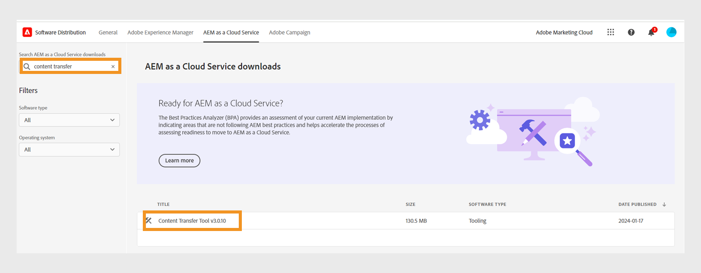
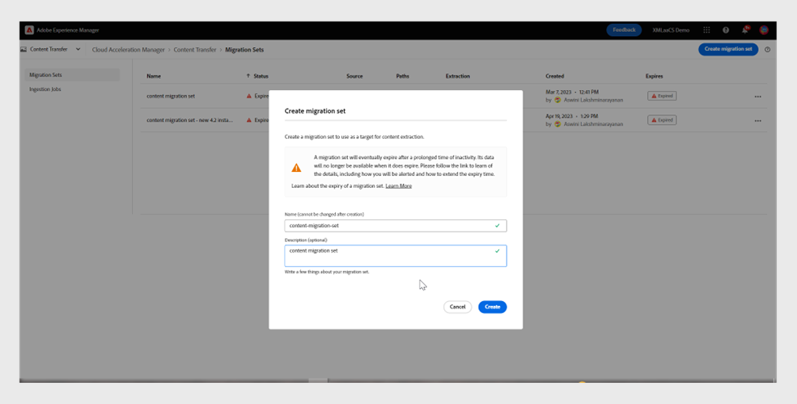
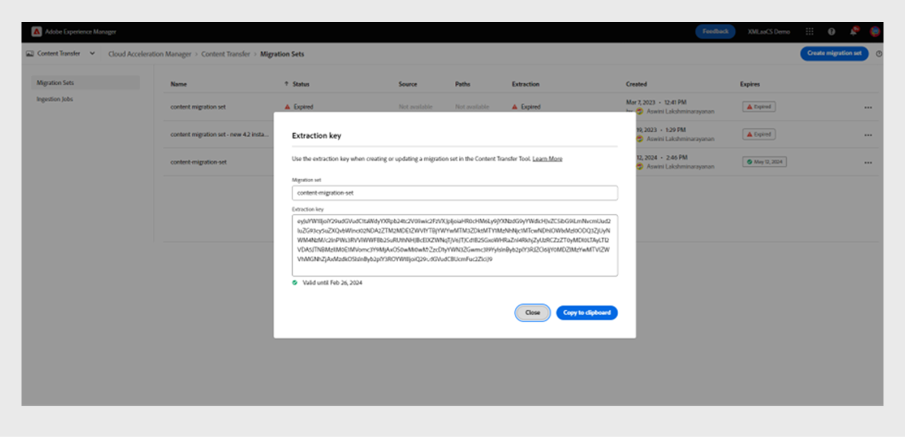
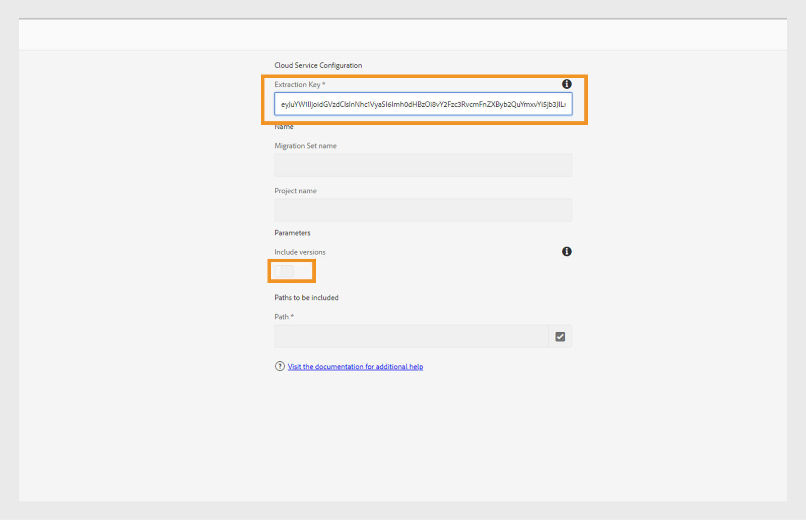
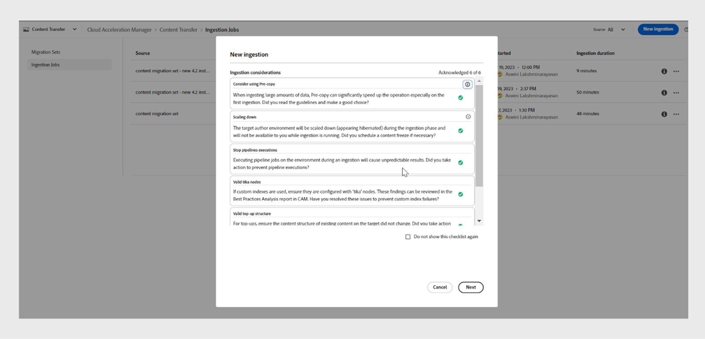

# Migration de contenu d’On-premise vers Cloud Service

Experience Manager as a Cloud Service fournit une base technologique évolutive, sécurisée et agile pour Experience Manager Guides, Assets, Forms et Screens. Cela permet aux professionnels du marketing et de l’informatique de se concentrer sur la création d’expériences percutantes à grande échelle.
Avec Experience Manager as a Cloud Service, vos équipes peuvent se concentrer sur l’innovation plutôt que sur la planification des mises à niveau de produits. Les nouvelles fonctionnalités du produit sont soigneusement testées et mises en permanence à la disposition de vos équipes afin qu’elles puissent toujours accéder à la dernière version de Adobe Experience Manager.

Cet article décrit un processus détaillé et détaillé pour migrer votre contenu On-premise ou Managed Services Experience Manager Guides vers les services cloud, afin d’assurer une transition en douceur vers la plateforme cloud.

## Conditions préalables

* Adobe Experience Manager 6.4 ou versions ultérieures
* Experience Manager Guides doit être sur la version de l’UUID. Si vous utilisez une version non-UUID d’Adobe Experience Manager Guides, migrez d’abord vers UUID en suivant les étapes décrites dans la section [Migrer du contenu non-DITA](../install-conf-guide/uuid-non-uuid.md).
* Accès à **&#x200B;**&#x200B;pour l&#39;instance cloud dans laquelle vous souhaitez migrer le contenu
* La taille du référentiel prise en charge peut atteindre 20 To
* Taille totale de l’index Lucene de 25 Go
* La longueur d’un nom de nœud doit être inférieure à 150 octets

## Processus de migration

Développé par **l’**&#x200B;outil de transfert de contenu est utilisé pour lancer la migration de contenu existant entre une instance source Adobe Experience Manager On-premise ou Managed Services et l’instance cible Experience Manager Cloud Service.
Cet outil transfère également automatiquement les entités principales (utilisateurs, utilisatrices ou groupes).

Vous pouvez télécharger l’**outil de transfert de contenu** sous la forme d’un fichier ZIP à partir du portail **Distribution logicielle** :

1. Sélectionnez l’onglet **&#x200B;**&#x200B;sur le portail **Distribution logicielle**.
1. Recherchez **Outil de transfert de contenu**.
1. Sélectionnez **Outil de transfert de contenu** dans la liste et téléchargez-le.

Installez ensuite le package via **Gestionnaire de packages** sur votre instance Adobe Experience Manager source. Veillez à télécharger la dernière version.
Pour plus d’informations sur la dernière version, voir [Notes de mise à jour](https://experienceleague.adobe.com/docs/experience-manager-cloud-service/content/release-notes/release-notes/release-notes-current.html?lang=en).

>[!NOTE]
> 
> Seules les versions 2.0.0 et ultérieures sont prises en charge et il est recommandé d’utiliser la dernière version.

Pour migrer le contenu Experience Manager Guides vers Experience Manager as a cloud service, procédez comme suit.

1. Connectez-vous à [experience.adobe.com](https://experience.adobe.com/) et sélectionnez **Experience Manager**.

   

1. Cliquez sur **Launch** sur la mosaïque **Cloud Acceleration Manager**.
   

1. Créez votre premier projet.
   

1. Ajoutez le nom et la description, puis cliquez sur **Créer**. Votre projet est créé.
1. Sélectionnez le projet créé et ouvrez l’écran du projet.
1. Cliquez sur **Vérifier** dans la mosaïque **Transfert de contenu**.

   

1. Cliquez sur **Créer un jeu de migration**.

1. Indiquez le nom et la description du jeu de migration.

   

1. Après la création, sélectionnez les trois points et sélectionnez **Copier la clé d’extraction**.

1. Cliquez sur **Copier dans le presse-papiers**. Créez votre premier projet.
   

1. Sélectionnez **&#x200B;**&#x200B;dans la partie supérieure, puis sélectionnez la mosaïque **Distribution logicielle**.
   

1. Sur le portail **Distribution logicielle**, sélectionnez **Adobe Experience Manager comme onglet Cloud Service**, recherchez « outil de transfert de contenu » et téléchargez le package d’outil de transfert de contenu.

   >[!NOTE]
   >
   >  Veillez à télécharger la dernière version.

1. Téléchargez et installez le `content-transfer.all-3.0.10.zip` de package dans le **Gestionnaire de packages** de votre instance On-premise.
   

1. Sur l’instance On-premise, sélectionnez **Outils** > **Opérations** > **Migration de contenu** > **Transfert de contenu**.

1. Sélectionnez **Transfert de contenu**, créez un jeu de migration et collez la clé d’extraction copiée à partir du gestionnaire d’accélération cloud. Cela établit une connexion entre la source et la cible. Ensuite, il vérifie la clé et affiche la validité après avoir saisi la valeur.

1. Activez l’option **Inclure des versions** pour inclure les versions de fichier.
   

1. Indiquez le chemin d’accès à migrer et cliquez sur **Enregistrer**.
Par exemple, `/content/sites`
ou
   `/content/dam/tech-docs`
   

   >[!NOTE]
   >
   > Vous devez migrer les chemins d’accès suivants de manière obligatoire pour le contenu **&#x200B;**.

   * `/content/dam`
   * `/var/dxml`

   Les chemins suivants sont restreints lors de la création d’un jeu de migration :
   * `/apps`
   * `/libs`
   * `/home`
   * `/etc` Vous êtes autorisé à sélectionner certains chemins `/etc` dans le CTT.

1. Cliquer sur **Enregistrer**
1. Sélectionnez le **jeu de migration** puis sélectionnez **Extraire** dans la partie supérieure.
   

1. Vérifiez les détails des chemins et des configurations que vous avez sélectionnés dans la fenêtre contextuelle **Extraction du jeu de migration**, puis cliquez sur **Extraire**. L’extraction prendra minutes et vous verrez le statut comme mis à jour.
   

1. Une fois l’extraction terminée et indiquée par le `finished` d’état, accédez à Cloud Acceleration Manager et sélectionnez le projet que vous avez créé à l’étape 18.
Pour plus d’informations, sélectionnez les trois points, puis sélectionnez **Afficher les détails**.

1. Dans la fenêtre contextuelle Détails du jeu de migration , vérifiez la configuration du jeu de migration et fermez la fenêtre contextuelle. Vous pouvez afficher les chemins d’accès et d’autres paramètres comme illustré dans la capture d’écran suivante :
   

1. Cliquez sur **Tâches d’ingestion** > **Nouvelle ingestion**.
1. Notez les valeurs de coche requises, puis cliquez sur **Créer**.
   

1. Sélectionnez le jeu de migration, sélectionnez le serveur requis de votre environnement, puis cliquez sur **Ingérer**.

   

## Exécution de l’outil de transfert de contenu sur une instance de publication

Installez l’outil de transfert de contenu sur l’instance de publication source pour déplacer le contenu vers l’instance de publication cible.
L’outil de transfert de contenu ne fait pas de distinction entre le contenu publié et le contenu dépublié lors de l’ingestion de contenu dans un environnement de publication. Le contenu spécifié dans le jeu de migration est ingéré dans l’instance cible choisie. L’utilisateur peut ingérer un jeu de migration dans une instance de création, une instance de publication ou les deux.

### Approche recommandée

Tenez compte des recommandations suivantes :

* Utilisez la même version de l’outil de transfert de contenu **Content Transfer Tool** qui a été utilisée sur l’instance de création.
* Lors de l’ingestion vers la publication, le niveau de publication ne sera pas réduit (contrairement à l’auteur).
* Migrez un seul nœud de publication. Avant de commencer l’extraction, supprimez-la de la répartition de charge.

>[!NOTE]
>
> Par mesure de précaution, assurez-vous qu’aucune opération d’écriture ne se produit sur les instances de publication, y compris les actions initiées par l’utilisateur telles que :
> * La distribution de contenu de la création dans AEM as a Cloud Service à la publication dans cet environnement
> * Synchronisation des utilisateurs entre les instances de publication

## Résolution des problèmes

Si l’extraction échoue en raison de l’erreur suivante, vous pouvez la résoudre en important le certificat d’autorité de certification approprié :

`javax.net.ssl.SSLHandshakeException: sun.security.validator.ValidatorException: PKIX path building failed: sun.security.provider.certpath.SunCertPathBuilderException: unable to find valid certification path to requested target`

**Raison** : le serveur Adobe Experience Manager présente des restrictions de pare-feu. Ajoutez donc le point d’entrée suivant à la liste autorisée.

`casstorageprod.blob.core.windows.net`

*Activer la journalisation SSL.*
