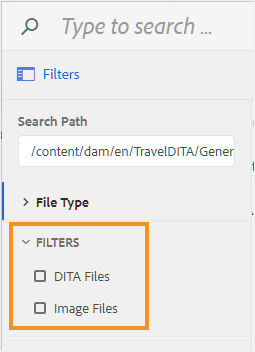

# Configurer des filtres pour la boîte de dialogue de navigation des fichiers {#id20CIL7009GN}

Lorsque vous travaillez dans l’éditeur, vous devez utiliser la boîte de dialogue de navigation du fichier pour insérer des éléments tels qu’une image, une référence ou une référence de clé. La boîte de dialogue de navigation par défaut ne propose aucune option de filtrage de fichiers. Vous pouvez ajouter vos propres filtres qui vous permettront d’accéder facilement et rapidement aux fichiers requis.

Effectuez les étapes suivantes pour ajouter vos options de filtrage de fichiers personnalisées à la boîte de dialogue de navigation dans les fichiers :

1. Connectez-vous à AEM et ouvrez le mode CRXDE Lite .

1. Accédez au fichier de configuration par défaut disponible à l’emplacement suivant :

   `/libs/fmdita/clientlibs/clientlibs/xmleditor/ui_config.json`

1. Créez une copie du fichier de configuration par défaut à l’emplacement suivant :

   `/apps/fmdita/xmleditor/ui_config.json`

1. Accédez au fichier `ui_config.json` et ouvrez-le dans le nœud `apps` pour le modifier.

1. Dans le fichier `ui_config.json`, ajoutez la définition des filtres que vous souhaitez ajouter.

   Le fragment de code suivant montre comment ajouter deux options de filtrage : Fichiers DITA et Fichiers image.

   ```json
   "browseFilters": [
       {
         "title": "DITA Files",
         "property": "jcr:content/metadata/dita_class",
         "operation": "exists"
       },
       {
         "title": "Image Files",
         "property": "jcr:content/metadata/dc:format",
         "value": [        
           "image/jpeg",
           "image/gif",
           "image/png"
         ]
       }
   ]
   ```

   Dans le fragment de code ci-dessus, le premier filtre concerne les fichiers DITA. La définition du filtre utilise les paramètres suivants :

   - **title:** nom d’affichage du filtre. Ce titre apparaît comme option de filtrage dans la boîte de dialogue de navigation des fichiers.

   - **property :** propriété à faire correspondre dans les métadonnées du fichier. Par exemple, pour autoriser uniquement les fichiers dont la propriété contient les métadonnées `dita_class`, le filtre de propriété prend la valeur « `jcr:content/metadata/dita_class` ».

   - **operation :** spécifiez « `exists` » pour correspondre à l’existence de la valeur spécifiée dans le paramètre de propriété.

   Le deuxième filtre concerne les fichiers image. Les paramètres sont similaires au premier filtre, à l’exception du paramètre `value`. Le paramètre `value` prend pour valeur un tableau de types d’images. Tous les types de fichiers spécifiés dans le paramètre value sont recherchés et affichés dans la boîte de dialogue de navigation des fichiers, tous les autres types de fichiers sont ignorés.

1. Enregistrez le fichier *ui\_config.json* et rechargez l’éditeur.

   Lorsque vous lancez la boîte de dialogue de recherche de fichier, les options de filtre configurées dans le fichier ui\_config.json s’affichent.

   {width="300"}
