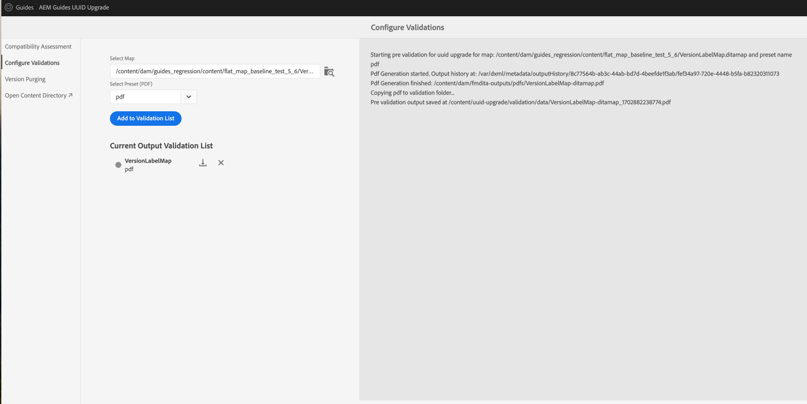

# 4.6.0 Service Pack 4 - Migration de contenu non UUID vers 4.6.1 UUID

Effectuez les étapes suivantes pour migrer votre contenu de la version 4.6.0 Service Pack 4 non-UUID vers la version 4.6.1 UUID.

>[!IMPORTANT]
>
> * Avant de commencer le processus de migration, vérifiez que vous disposez des éléments suivants :
>
>   1. Fermeture de tous les avis actifs.
>   1. A fermé toutes les tâches de traduction.
> * Avant de migrer le contenu vers le serveur UUID, assurez-vous de disposer d’un serveur non UUID sur lequel est installé une version d’AEM Guides compatible.
> * Si vous utilisez une version antérieure au pack de services 4.6.0, vous devez d’abord effectuer la mise à niveau vers le pack de services 4.6.0. Suivez les [&#x200B; instructions de mise à niveau](./upgrade-xml-documentation.md) spécifiques à la version sous licence de votre produit.
> * Si vous utilisez un pack de services spécifique publié après le pack de services 4.6.0, vous devez désinstaller ce pack de services et revenir au pack de services 4.6.0.

## Installation du package

Téléchargez les packages requis à partir du portail de distribution logicielle Adobe, en fonction de votre version :

1. **Pré-migration** : [com.adobe.guides.pre-uuid-migration-2.0.zip](https://experience.adobe.com/#/downloads/content/software-distribution/en/aem.html?package=%2Fcontent%2Fsoftware-distribution%2Fen%2Fdetails.html%2Fcontent%2Fdam%2Faem%2Fpublic%2Faemdox%2Fother-packages%2Fuuid-migration%2F4-0%2Fcom.adobe.guides.pre-uuid-migration-2.0.zip)
1. **Télécharger UUID version 4.6.1** : [com.adobe.fmdita.feature-uuid-4.6.1.5886.zip](https://experience.adobe.com/#/downloads/content/software-distribution/en/aem.html?package=%2Fcontent%2Fsoftware-distribution%2Fen%2Fdetails.html%2Fcontent%2Fdam%2Faem%2Fpublic%2Faemdox%2Fother-packages%2Fuuid-migration%2F4-0%2Fcom.adobe.fmdita.feature-uuid-4.6.1.5886.zip)
1. **Migration** : [com.adobe.guides.uuid-upgrade-2.0.zip](https://experience.adobe.com/#/downloads/content/software-distribution/en/aem.html?package=%2Fcontent%2Fsoftware-distribution%2Fen%2Fdetails.html%2Fcontent%2Fdam%2Faem%2Fpublic%2Faemdox%2Fother-packages%2Fuuid-migration%2F4-0%2Fcom.adobe.guides.uuid-upgrade-2.0.zip)

## Contrôles de pré-migration

Effectuez les vérifications suivantes sur le pack de services 4.6.0 non-UUID :

1. Installez le package de pré-migration [com.adobe.guides.pre-uuid-migration-2.0.zip](https://experience.adobe.com/#/downloads/content/software-distribution/en/aem.html?package=%2Fcontent%2Fsoftware-distribution%2Fen%2Fdetails.html%2Fcontent%2Fdam%2Faem%2Fpublic%2Faemdox%2Fother-packages%2Fuuid-migration%2F4-0%2Fcom.adobe.guides.pre-uuid-migration-2.0.zip) sur la version 4.6.0 Service Pack 4.

   >[!NOTE]
   >
   >* Vous avez besoin d’une autorisation administrateur pour exécuter la migration.
   >* Il est recommandé de corriger les fichiers comportant des erreurs avant de poursuivre la migration.

1. Si le système contient plus de 100 000 fichiers DITA, mettez à jour les configurations de limite de requête pour que le script fonctionne :

   * Accéder à `/system/console/configMgr and increase both the configs to more than number of assets - queryLimitInMemory` et `queryLimitReads under org.apache.jackrabbit.oak.query.QueryEngineSettingsService`

1. `http://<server-name>/libs/fmdita/clientlibs/xmleditor_uuid_upgrade/page.html` de lancement.
1. Sélectionnez **Évaluation de la compatibilité** dans le panneau de gauche et parcourez le chemin d’accès au dossier `/content/dam` pour toutes les ressources.
1. Vérifiez la compatibilité pour répertorier les informations suivantes :
   * Total des fichiers
   * Temps estimé pour la migration
   * Nombre de fichiers en erreur
   * Fichiers avec GUID filename

   

1. Si l’erreur s’affiche, analysez les journaux et corrigez-les. Vous pouvez réexécuter la matrice de compatibilité après avoir corrigé les erreurs.

1. Sélectionnez **Configurer les validations** dans le panneau de gauche. Ensuite, **Sélectionner un mappage** et **Sélectionner un paramètre prédéfini** du mappage pour les configurer. La liste actuelle de validation des sorties affiche les fichiers de sortie présents avant la migration et peut être validée par rapport aux fichiers de sortie générés ultérieurement après la migration.

   En sélectionnant plusieurs plans DITA volumineux, vous pouvez vérifier que tout le contenu a bien été migré sans problème. La sélection de paramètres prédéfinis comportant des lignes de base garantit également la réussite de la migration des lignes de base et des versions.

   

1. (Facultatif) Effectuez une purge de version du contenu pour supprimer les versions inutiles et accélérer le processus de migration. Pour effectuer la purge des versions, sélectionnez l’option **Purge de version** dans l’écran de migration et accédez à l’interface utilisateur à l’aide de l’`http://<server- name>/libs/fmdita/clientlibs/xmleditor_uuid_upgrade/page.html` URL.
   >[!NOTE]
   >
   >Cet utilitaire ne supprime aucune version utilisée dans les références ou les révisions et ne comporte aucun libellé.

Pour plus d’informations, voir [purger les anciennes versions](../install-guide/version-management.md#purge-older-versions-of-dita-files).

## Conditions préalables à la migration

1. Exécutez la migration UUID uniquement sur une instance de création.
1. Assurez-vous que les éléments suivants sont prêts pour l’infrastructure :
   * L’instance d’auteur est mise à niveau en termes de CPU et de mémoire afin de prendre en charge un traitement plus rapide et la mémoire supplémentaire nécessaire à l’activité en bloc. par exemple, si la mémoire et le CPU actuellement alloués sont de 8 processeurs virtuels et un tas de 24 Go, utilisez le double de la taille de cette activité.
   * L’espace disque global et l’espace disque temporaire `(crx-quickstart directory)` doivent avoir une mémoire tampon 10 fois supérieure à celle déjà consommée. Une fois la migration terminée, vous pouvez récupérer la majeure partie de l’espace disque en exécutant la compression.
   * N’exécutez **compression Tar hors ligne** avant de démarrer cette activité.
   * Assurez-vous qu’aucune indexation ou maintenance système n’est prévue pendant cette migration.

1. Installez la version UUID de la version prise en charge plutôt que la version non UUID. Par exemple, si vous utilisez la version 4.6.0 Service Pack 4 non-UUID, vous devez installer UUID version 4.6.1 [com.adobe.fmdita.feature-uuid-4.6.1.5886.zip](https://experience.adobe.com/#/downloads/content/software-distribution/en/aem.html?package=%2Fcontent%2Fsoftware-distribution%2Fen%2Fdetails.html%2Fcontent%2Fdam%2Faem%2Fpublic%2Faemdox%2Fother-packages%2Fuuid-migration%2F4-0%2Fcom.adobe.fmdita.feature-uuid-4.6.1.5886.zip) et exécuter la migration.

1. Installez le package de mise à niveau de la migration uuid [com.adobe.guides.uuid-upgrade-2.0.zip](https://experience.adobe.com/#/downloads/content/software-distribution/en/aem.html?package=%2Fcontent%2Fsoftware-distribution%2Fen%2Fdetails.html%2Fcontent%2Fdam%2Faem%2Fpublic%2Faemdox%2Fother-packages%2Fuuid-migration%2F4-0%2Fcom.adobe.guides.uuid-upgrade-2.0.zip).
1. Désactivez les lanceurs pour les workflows suivants en utilisant l’URL : `http://<server-name>/libs/cq/workflow/content/console.html`.

   * Workflow Ressource de mise à jour de la gestion des DAM
   * Workflow d’écriture différée des métadonnées de gestion des ressources numériques

   >[!NOTE]
   >
   >Idéalement, tous les lanceurs de workflow qui s’exécutent sur n’importe quel chemin dans `content/dam` doivent être désactivés.

1. Mettez à jour les configurations suivantes en fonction des modifications suggérées :

   | Configuration | Propriété | Valeur |
   |---|---|---|
   | `com.adobe.fmdita.config.ConfigManager` | Activer les lanceurs de workflow de post-traitement | Désactiver |
   | `com.adobe.fmdita.config.ConfigManager` | uuid. regex | `^GUID-(?<id>.*)` |
   | `com.adobe.fmdita.postprocess.version.PostProcessVersionObservation` | Activer le post-traitement de version | Désactiver |
   | Service de balisage Day CQ | Activer la validation (validation.enabled) | Désactiver |

1. Ajoutez un enregistreur distinct pour :
   * `com.adobe.fmdita.uuid`
   * `com.adobe.guides.uuid`.

1. (Si ce n&#39;est pas fait plus tôt) S&#39;il y a plus de 100 000 fichiers DITA dans le système, mettez à jour le `queryLimitReads` sous `org.apache.jackrabbit.oak.query.QueryEngineSettingsService` à une valeur plus grande (toute valeur supérieure au nombre de ressources présentes, par exemple 200 000).

   | PID | Clé de la propriété | Valeur de la propriété |
   |---|---|---|
   | org.apache.jackrabbit.oak.query.QueryEngineSettingsService | queryLimitReads | Valeur : 200000   Valeur par défaut : 100000 |

## Migration

1. `http://<server-name>/libs/fmdita/clientlibs/xmleditor_uuid_upgrade/page.html` de lancement.

   
   >[!NOTE]
   >
   > Si vous choisissez « Activer la sauvegarde des ressources DITA », les fichiers de sauvegarde temporaires sont stockés sous `/content/uuid-upgrade` et les sauvegardes de fichiers DITA sont supprimées une fois la migration d&#39;un fichier terminée.

1. Sélectionnez **Mise à niveau du système** dans le panneau de gauche pour exécuter la migration. Il est recommandé de migrer toutes les données en une seule fois, car le système gère de manière optimale les traitements par lots en interne. Seuls les fichiers qui ne sont pas des ressources DITA et qui ne sont pas utilisés dans des ressources DITA peuvent être ignorés pour la migration.

1. (Facultatif) Sélectionnez les dossiers pour lesquels vous souhaitez ignorer la migration. Utilisez cette option pour migrer ces dossiers ultérieurement ou ignorez leur migration. Assurez-vous que ces dossiers ne comportent aucune ressource DITA et qu&#39;ils ne sont pas référencés par (et ne seront plus référencés par) aucune ressource DITA. Par exemple, `content/dam/projects`.

1. Sélectionnez *Activer la sauvegarde de ressources dita* pour créer une sauvegarde de la ressource avant la migration. Cette sauvegarde est utilisée pour effectuer une restauration en cas d’erreur lors de la migration d’un fichier. La sauvegarde est supprimée, si la migration est réussie. Toutefois, cela ralentit le processus de migration.

1. Démarrez la migration.
   >[!NOTE]
   >
   > Téléchargez les journaux complets et vérifiez s’il y a eu des erreurs. Si une erreur ou une exception est trouvée *Ne continuez pas* mais corrigez d’abord l’erreur. Les erreurs courantes sont répertoriées à la fin de cet article.

1. Une fois la migration terminée, le rapport peut être téléchargé et des journaux entiers peuvent également être téléchargés.

1. Sélectionnez **Télécharger le rapport** pendant l’exécution de la migration pour vérifier si tous les fichiers du dossier sont correctement mis à niveau et si toutes les fonctionnalités fonctionnent uniquement pour ce dossier.

   >[!NOTE]
   >
   > La migration du contenu peut être exécutée au niveau d’un dossier, du `/content/dam` complet ou du même dossier (migration à nouveau).

   En outre, il est important de s&#39;assurer que la migration du contenu est effectuée pour toutes les ressources multimédias, telles que les images et les graphiques que vous avez utilisés dans le contenu DITA.

1. Une fois tous les fichiers migrés, sélectionnez **Mise à niveau de référence/révision** dans le panneau de gauche pour migrer les lignes de base et les réviser au niveau du dossier.

>[!NOTE]
>
>Si vous redémarrez le système ou si la migration est abandonnée, le script reprendra lorsque vous le réexécuterez avec les mêmes paramètres que précédemment. Contactez votre équipe du succès client si vous rencontrez des problèmes dus à l’arrêt.

## Analyse des rapports de chaque étape

**Étape : mise à niveau du système**

| Résumé à l’issue du processus | Comment interpréter ? | Action |
|---|---|---|
| Nombre total de fichiers : 488 | Nombre total de fichiers traités dans l’ensemble de dossiers donné. | S/O |
| Nombre de fichiers migrés : 488 | Nombre de fichiers migrés avec succès vers UUID. | S/O |
| Nombre de fichiers ignorés : 0 | Certains fichiers du référentiel de gestion des ressources numériques peuvent comporter des sous-ressources, lesquelles sont ignorées car elles ne sont pas éligibles à la migration UUID. | S/O |
| Nombre de fichiers n&#39;ayant pas pu être mis à niveau : 0 | Si le nombre n’est pas égal à 0, les journaux doivent être analysés pour détecter d’éventuels problèmes. | Vérifiez l’exception, vous devrez peut-être corriger l’erreur et réexécuter la migration. |
| Temps total pris : 00:01:18 |  |  |

De plus, une liste des **Fichiers mis à niveau avec des erreurs** et des **Fichiers ayant échoué** pendant le processus de migration est accessible dans le tableau de synthèse du rapport.

**Étape : Mettre à niveau les niveaux de référence**

| Résumé à l’issue du processus | Comment interpréter ? | Action |
|---|---|---|
| Nombre total de fichiers : 288 | Nombre de plans DITA avec au moins 1 ligne de base. |  |
| Nombre de fichiers migrés : 13 | Nombre de plans DITA mis à niveau avec toutes les lignes de base. |  |
| Nombre de fichiers ignorés : 275 | Nombre de plans DITA sans ligne de base |  |
| Nombre de fichiers n&#39;ayant pas pu être mis à niveau : 0 | Le nombre d&#39;objets de référence qui n&#39;étaient pas valides (ils étaient vides) est répertorié dans le rapport (Excel). | Vérifier s&#39;il y a d&#39;autres erreurs que : `baselineObj not found on` |

De plus, une liste des **Fichiers mis à niveau avec des erreurs** et des **Fichiers ayant échoué** pendant le processus de migration est accessible dans le tableau de synthèse du rapport.

## Post-migration

1. Une fois la migration terminée, sélectionnez **Valider la mise à niveau du système** dans le panneau de gauche et validez les fichiers de sortie avant et après la migration pour vous assurer que la migration est réussie.

   

1. Une fois la migration du serveur terminée, activez les configurations et workflows suivants (y compris tous les autres workflows qui ont été désactivés initialement lors de la migration) pour continuer à travailler sur le serveur :

   * Workflow Ressource de mise à jour de la gestion des DAM
   * Workflow des métadonnées de gestion des ressources numériques

   >[!NOTE]
   >
   >Idéalement, tous les lanceurs de workflow qui s’exécutaient sur n’importe quel chemin dans `content/dam` avant la migration doivent être activés.

1. Activez les configurations suivantes :

   | Configuration | Propriété | Valeur |
   |---|---|---|
   | `com.adobe.fmdita.config.ConfigManager` | *Activer les lanceurs de workflow de post-traitement* | Activer |
   | `com.adobe.fmdita.postprocess.version.PostProcessVersionObservation` | *Activer le post-traitement de version* | Activer |
   | Service de balisage Day CQ | *Activer la validation (validation.enabled)* | Activer |

1. Propriétés Assets à vérifier après la migration :

   | Configuration | Propriété | Valeur de pré-migration sur Non-UUID | Valeur de post-migration sur UUID |
   |---|---|---|---|
   | `com.adobe.fmdita.config.ConfigManager` | **Utiliser le titre pour les noms de page du site AEM** | False (valeur par défaut) | True |

   >[!NOTE]
   >
   > Si, avant la migration, la propriété **Utiliser le titre pour les noms de page du site AEM** dans `com.adobe.fmdita.config.ConfigManager`, définie sur *False*, après la migration, cette propriété doit être mise à jour.

1. Une fois la validation terminée, la majeure partie de l’espace disque peut être récupérée en exécutant la compression (voir la section `https://experienceleague.adobe.com/docs/experience-manager-65/deploying/deploying/revision-cleanup.html?lang=en`).

