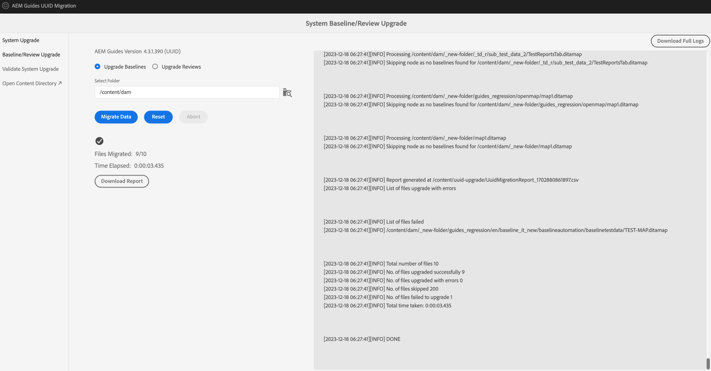

# Migration du contenu non UUID vers UUID {#id226TI0U20XA}

Effectuez les étapes suivantes pour migrer votre contenu de la version 4.3.1 non UUID vers la version 4.3.2 de l’UUID.

>[!IMPORTANT]
>
> * Avant de démarrer le processus de migration, vérifiez que vous disposez des éléments suivants :
>
>   1. Fermer toutes les révisions actives.
>   1. Fermeture de toutes les tâches de traduction
> * Avant de migrer le contenu vers le serveur UUID, assurez-vous qu’un serveur non UUID avec une version AEM Guides compatible est installé sur celui-ci.
> * Si vous utilisez une version antérieure à 4.3.1, mettez à niveau vers la version 4.3.1. Suivez les [instructions de mise à niveau](./upgrade-xml-documentation.md) spécifiques à la version sous licence de votre produit.
> * Actuellement, les versions ultérieures à la version 4.3.1 ne sont pas prises en charge pour la migration.

## Installation du package

Téléchargez les packages requis à partir du portail de distribution de logiciels Adobe, en fonction de votre version :

1. **Avant la migration** : [com.adobe.guides.pre-uuid-migration-1.2.27.zip](https://experience.adobe.com/#/downloads/content/software-distribution/en/aem.html?package=%2Fcontent%2Fsoftware-distribution%2Fen%2Fdetails.html%2Fcontent%2Fdam%2Faem%2Fpublic%2Faemdox%2Fother-packages%2Fuuid-migration%2F3-0%2Fcom.adobe.guides.pre-uuid-migration-1.2.27.zip)
1. **Télécharger l’UUID version 4.3.2** : [com.adobe.fmdita-6.5-uuid-4.3.2.1977.zip](https://experience.adobe.com/#/downloads/content/software-distribution/en/aem.html?package=%2Fcontent%2Fsoftware-distribution%2Fen%2Fdetails.html%2Fcontent%2Fdam%2Faem%2Fpublic%2Faemdox%2Fother-packages%2Fuuid-migration%2F3-0%2Fcom.adobe.fmdita-6.5-uuid-4.3.2.1977.zip)
1. **Migration** : [com.adobe.guides.uuid-upgrade-1.2.110.zip](https://experience.adobe.com/#/downloads/content/software-distribution/en/aem.html?package=%2Fcontent%2Fsoftware-distribution%2Fen%2Fdetails.html%2Fcontent%2Fdam%2Faem%2Fpublic%2Faemdox%2Fother-packages%2Fuuid-migration%2F3-0%2Fcom.adobe.guides.uuid-upgrade-1.2.110.zip)

## Vérifications préalables

Effectuez les vérifications suivantes sur la version 4.3.1 non UUID :

1. Installez le package de pré-migration [com.adobe.guides.pre-uuid-migration-1.2.27.zip](https://experience.adobe.com/#/downloads/content/software-distribution/en/aem.html?package=%2Fcontent%2Fsoftware-distribution%2Fen%2Fdetails.html%2Fcontent%2Fdam%2Faem%2Fpublic%2Faemdox%2Fother-packages%2Fuuid-migration%2F3-0%2Fcom.adobe.guides.pre-uuid-migration-1.2.27.zip) sur la version 4.3.1.

   >[!NOTE]
   >
   >* Vous avez besoin de l’autorisation d’administrateur pour exécuter la migration.
   >* Il est recommandé de corriger les fichiers en erreur avant de poursuivre la migration.

1. Si le système contient plus de 100 000 fichiers DITA, mettez à jour les configurations de limite de requête pour que le script fonctionne :

   * Accédez à `/system/console/configMgr and increase both the configs to more than number of assets - queryLimitInMemory` et `queryLimitReads under org.apache.jackrabbit.oak.query.QueryEngineSettingsService`

1. Lancez `http://<server-name>/libs/fmdita/clientlibs/xmleditor_uuid_upgrade/page.html`.
1. Sélectionnez **Évaluation de la compatibilité** dans le panneau de gauche et parcourez le chemin du dossier `/content/dam` pour toutes les ressources.
1. Vérifiez la compatibilité pour lister les informations suivantes :
   * Total des fichiers
   * Durée estimée de la migration
   * Nombre de fichiers en erreur
   * Fichiers avec nom de fichier GUID

   

1. Si l’erreur s’affiche, analysez les journaux et corrigez-les. Vous pouvez réexécuter la matrice de compatibilité après avoir corrigé les erreurs.

1. Sélectionnez **Configurer les validations** dans le panneau de gauche. Ensuite, **Sélectionner la carte** et **Sélectionner le paramètre prédéfini** de la carte pour les configurer. La liste de validation de sortie actuelle affiche les fichiers de sortie présents avant la migration et peut être validée par rapport aux fichiers de sortie générés après la migration.

   En sélectionnant plusieurs mappages DITA de grande taille, vous pouvez vérifier que tout le contenu a bien été migré sans problème. La sélection de paramètres prédéfinis avec des lignes de base permet également de s’assurer que les lignes de base et les versions sont migrées avec succès.

   

1. (Facultatif) Effectuez la purge des versions sur le contenu pour supprimer les versions inutiles et accélérer le processus de migration. Pour effectuer la purge de version, sélectionnez l’option **Purge de version** dans l’écran de migration et accédez à l’interface utilisateur à l’aide de l’URL `http://<server- name>/libs/fmdita/clientlibs/xmleditor_uuid_upgrade/page.html`.
   >[!NOTE]
   >
   >Cet utilitaire ne supprime aucune version utilisée dans les lignes de base ou les révisions, ni ne comporte d’étiquettes.

Pour plus d’informations, voir [purger les anciennes versions](../install-guide/version-management.md#purge-older-versions-of-dita-files).

## Conditions préalables à la migration

1. Exécutez la migration UID uniquement sur une instance d’auteur.
1. Assurez-vous que l’infrastructure suivante est prête :
   * L’instance d’auteur est mise à niveau en termes de processeur et de mémoire afin de prendre en charge un traitement plus rapide et une mémoire supplémentaire nécessaire pour l’activité en masse. par exemple, si le processeur et la mémoire alloués actuels sont 8 vCPU et 24 Go heap, utilisez le double de la taille pour cette activité.
   * L’espace disque global et l’espace disque temporaire `(crx-quickstart directory)` doivent avoir une mémoire tampon de 10 fois ce qui est déjà consommé. Une fois la migration terminée, vous pouvez récupérer la plus grande partie de l’espace disque en exécutant la compression.
   * Exécutez **Compression Tar hors ligne** avant de démarrer cette activité.
   * Assurez-vous qu&#39;aucune indexation ou maintenance du système n&#39;est planifiée pendant la fenêtre de cette migration.

1. Installez la version UID de la version prise en charge sur la version non UUID. Par exemple, si vous utilisez la version 4.3.1 non UUID, vous devez installer l’UUID version 4.3.2 [com.adobe.fmdita-6.5-uuid-4.3.2.1977.zip](https://experience.adobe.com/#/downloads/content/software-distribution/en/aem.html?package=%2Fcontent%2Fsoftware-distribution%2Fen%2Fdetails.html%2Fcontent%2Fdam%2Faem%2Fpublic%2Faemdox%2Fother-packages%2Fuuid-migration%2F3-0%2Fcom.adobe.fmdita-6.5-uuid-4.3.2.1977.zip)) et lancer la migration.

1. Installez le package de mise à niveau de migration uuid [com.adobe.guides.uuid-upgrade-1.2.110.zip](https://experience.adobe.com/#/downloads/content/software-distribution/en/aem.html?package=%2Fcontent%2Fsoftware-distribution%2Fen%2Fdetails.html%2Fcontent%2Fdam%2Faem%2Fpublic%2Faemdox%2Fother-packages%2Fuuid-migration%2F3-0%2Fcom.adobe.guides.uuid-upgrade-1.2.110.zip).
1. Désactivez les lanceurs pour les workflows suivants à l’aide de l’URL : `http://<server-name>/libs/cq/workflow/content/console.html`.

   * Workflow Ressource de mise à jour de la gestion des DAM
   * Workflow d’écriture différée des métadonnées de gestion des actifs numériques

   >[!NOTE]
   >
   >Idéalement, tous les lanceurs de workflow qui s’exécutent sur n’importe quel chemin dans `content/dam` doivent être désactivés.

1. Mettez à jour les configurations suivantes en fonction des modifications suggérées :

   | Configuration | Propriété | Valeur |
   |---|---|---|
   | `com.adobe.fmdita.config.ConfigManager` | Activation des lanceurs de workflow de post-traitement | Désactiver |
   | `com.adobe.fmdita.config.ConfigManager` | uuid. regex | `^GUID-(?<id>.*)` |
   | `com.adobe.fmdita.postprocess.version.PostProcessVersionObservation` | Activation du post-traitement des versions | Désactiver |
   | Service de balisage Day CQ | Activation de la validation (validation.enabled) | Désactiver |

1. Ajoutez un journal distinct pour :
   * `com.adobe.fmdita.uuid`
   * `com.adobe.guides.uuid`.

1. (Si ce n’est pas le cas précédemment) S’il existe plus de 100 000 fichiers DITA dans le système, mettez à jour le `queryLimitReads` situé sous `org.apache.jackrabbit.oak.query.QueryEngineSettingsService` vers une valeur plus grande (toute valeur supérieure au nombre de ressources présentes, par exemple 200 000).

   | PID | Clé de propriété | Valeur de la propriété |
   |---|---|---|
   | org.apache.jackrabbit.oak.query.QueryEngineSettingsService | queryLimitReads | Valeur : 200000   Valeur par défaut : 100000 |

## Migration

1. Lancez `http://<server-name>/libs/fmdita/clientlibs/xmleditor_uuid_upgrade/page.html`.

   
   >[!NOTE]
   >
   > Si vous sélectionnez &quot;Activer la sauvegarde des ressources DITA&quot;, les fichiers de sauvegarde temporaires sont stockés sous `/content/uuid-upgrade` et les sauvegardes des fichiers DITA sont supprimées lorsque la migration d’un fichier est terminée.

1. Sélectionnez **Mise à niveau du système** dans le panneau de gauche pour exécuter la migration. Il est recommandé de migrer toutes les données à la fois, car le système gère de manière optimale le traitement par lot en interne. Seuls les fichiers qui ne sont pas des ressources DITA et qui ne sont utilisés dans aucune ressource DITA peuvent être ignorés pour la migration.

1. (Facultatif) Sélectionnez les dossiers pour lesquels vous souhaitez ignorer la migration. Utilisez cette option pour migrer ces dossiers ultérieurement ou omettez de les migrer. Assurez-vous que ces dossiers ne contiennent aucune ressource DITA et ne sont référencés par aucune ressource DITA (et qu’à l’avenir, ils ne le seront pas). Par exemple, `content/dam/projects`.

1. Sélectionnez *Activer la sauvegarde de ressource dita* pour créer une sauvegarde de ressource avant la migration. Cette sauvegarde est utilisée pour la restauration en cas d’erreur lors de la migration d’un fichier. La sauvegarde est supprimée si la migration aboutit. Toutefois, cela ralentit le processus de migration.

1. Lancez la migration.
   >[!NOTE]
   >
   > Téléchargez les logs complets et observez s’il y a eu des erreurs. Si une erreur ou une exception est trouvée *Ne procédez pas* mais corrigez d&#39;abord l&#39;erreur. Les erreurs courantes sont répertoriées à la fin de cet article.

1. Une fois la migration terminée, le rapport peut être téléchargé et des logs entiers peuvent également être téléchargés.

1. Sélectionnez **Télécharger le rapport** pendant la migration pour vérifier si tous les fichiers du dossier sont correctement mis à niveau et si toutes les fonctionnalités ne fonctionnent que pour ce dossier.

   >[!NOTE]
   >
   > La migration du contenu peut être exécutée au niveau du dossier, la `/content/dam` complète ou le même dossier (réexécuter la migration).

   En outre, il est important de s’assurer que la migration du contenu est effectuée pour toutes les ressources multimédias, telles que les images et les graphiques que vous avez utilisés dans le contenu DITA.

1. Une fois tous les fichiers migrés, sélectionnez **Baseline/Review Upgrade** dans le panneau de gauche pour migrer les lignes de base et effectuer une révision au niveau du dossier.

>[!NOTE]
>
>Si vous redémarrez le système ou si la migration est abandonnée, le script reprend lorsque vous le réexécutez avec les mêmes paramètres qu’auparavant. Contactez votre équipe de succès client si vous rencontrez des problèmes en raison de la fermeture.

## Analyse des rapports de chaque étape

**Étape : mise à niveau du système**

| Résumé après la fin du processus | Comment interpréter ? | Action |
|---|---|---|
| Nombre total de fichiers : 345997 | Nombre total de fichiers traités sous l’ensemble donné de dossiers. | S/O |
| Nombre de fichiers mis à niveau avec succès : 344516 | Nombre de fichiers migrés avec succès vers UUID. | S/O |
| Nombre de fichiers mis à niveau en erreur : 29 | Des erreurs se sont produites dans ces fichiers et doivent être identiques à celles signalées à l’étape de prémigration. | S/O |
| Nombre de fichiers ignorés : 1452 | Certains fichiers du référentiel DAM peuvent comporter des sous-ressources et ces sous-ressources sont ignorées car elles ne sont pas éligibles à la migration UID. | S/O |
| Nombre de fichiers dont la mise à niveau a échoué : 0 | Si le décompte n’est pas 0, les logs doivent être analysés pour tout problème. | Vérifiez l’exception, vous devrez peut-être corriger l’erreur et relancer la migration. |
| Durée totale : 2:40:06.157 |  |  |

**Étape : mise à niveau des lignes de base**

| Résumé après la fin du processus | Comment interpréter ? | Action |
|---|---|---|
| Nombre total de fichiers : 4833 | Nombre de mappages DITA avec au moins 1 ligne de base. |
| Nombre de fichiers mis à niveau : 4705 | Nombre de mappages DITA, mise à niveau réussie avec toutes les lignes de base. |
| Nombre de fichiers mis à niveau en erreur : 0 | Nombre de mappages DITA dont les lignes de base n’ont pas été mises à niveau. |
| Nombre de fichiers ignorés : 1647 | Nombre de mappages DITA sans aucune ligne de base. |
| Nombre de fichiers dont la mise à niveau a échoué : 128 | Le nombre d’objets de base non valides (ils étaient vides) est indiqué dans le rapport (Excel). | Vérifiez s&#39;il existe des erreurs autres que : `baselineObj not found on` |

## Postmigration

1. Une fois la migration terminée, sélectionnez **Valider la mise à niveau du système** dans le panneau de gauche et validez les fichiers de sortie avant et après la migration pour vous assurer que la migration est réussie.

   

1. Après la migration du serveur, activez les workflows et configurations suivants (y compris tous les autres workflows désactivés initialement pendant la migration) pour continuer à fonctionner sur le serveur :

   * Workflow Ressource de mise à jour de la gestion des DAM
   * Workflow de métadonnées de gestion des actifs numériques

   >[!NOTE]
   >
   >Idéalement, tous les lanceurs de workflow qui s’exécutaient sur n’importe quel chemin dans `content/dam` avant la migration doivent être activés.

1. Activez les configurations suivantes :

   | Configuration | Propriété | Valeur |
   |---|---|---|
   | `com.adobe.fmdita.config.ConfigManager` | *Activer les lanceurs de workflow de post-traitement* | Activer |
   | `com.adobe.fmdita.postprocess.version.PostProcessVersionObservation` | *Activer le posttraitement de version* | Activer |
   | Service de balisage Day CQ | *Activer la validation (validation.enabled)* | Activer |

1. Propriétés Assets pour examiner la post-migration :

   | Configuration | Propriété | Valeur de pré-migration sur Non UUID | Valeur après migration sur UUID |
   |---|---|---|---|
   | `com.adobe.fmdita.config.ConfigManager` | **Utiliser le titre pour AEM noms de page du site** | False (valeur par défaut) | True |

   >[!NOTE]
   >
   > Si, avant la migration, la propriété, **Utilisez le titre pour AEM noms de page du site** dans `com.adobe.fmdita.config.ConfigManager`, est définie sur *False*, puis, après la migration, cette propriété doit être mise à jour.

1. Une fois la validation terminée, la plupart de l’espace disque peut être récupéré en exécutant la compression (voir `https://experienceleague.adobe.com/docs/experience-manager-65/deploying/deploying/revision-cleanup.html?lang=en`).