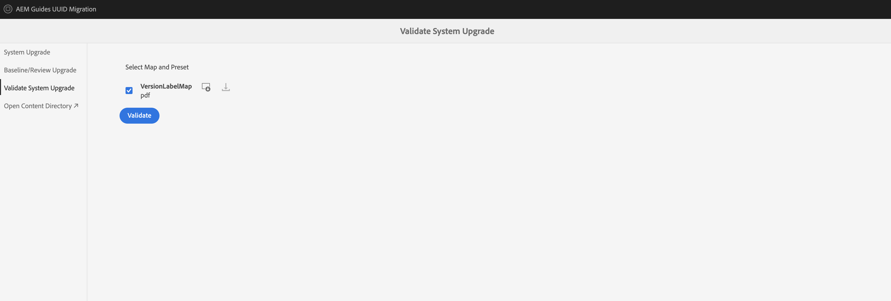

# Migration de contenu non UUID avec des versions depuis l’interface utilisateur

Si vous utilisez la version 4.3.x ou ultérieure, procédez comme suit pour migrer votre contenu non UUID avec des versions vers le contenu UUID.

## Matrice de compatibilité

| Version actuelle des guides AEM (non UUID) | Version requise pour la migration vers UUID | Chemin de mise à niveau pris en charge |
|---|---|---|
| 4.3.x ou version ultérieure | 4.3.0 non UUID | Installation de 4.3.1 (UUID) |

## Packages requis

1. **Purge de version**: `com.adobe.guides.version-purge-1.0.11.zip` (facultatif)
1. **Avant migration**: `com.adobe.guides.pre-uuid-migration-1.1.2 .zip`
1. **Migration**: `com.adobe.guides.uuid-upgrade-1.1.13.zip`

## Avant migration

1. (Facultatif) Effectuez la purge des versions sur le contenu pour supprimer les versions inutiles et accélérer le processus de migration. Pour effectuer la purge de version sur la version 4.1 (NON pris en charge sur la version 4.0), installez le module . `com.adobe.guides.version-purge-1.0.11.zip`et accédez à l’interface utilisateur à l’aide de cette URL. `http://<server-name> /libs/fmdita/clientlibs/xmleditor_version_purge/page.html`.

   >[!NOTE]
   >
   >Cet utilitaire ne supprime aucune version utilisée dans les lignes de base ou les révisions, ni ne comporte d’étiquettes.
1. Installez le package de pré-migration (`ccom.adobe.guides.pre-uuid-migration-1.1.2 .zip`).

   >[!NOTE]
   >
   >* Vous avez besoin de l’autorisation d’administrateur pour exécuter la migration.
   >* Il est recommandé de corriger les fichiers en erreur avant de poursuivre la migration.

1. Sélectionner **Évaluation de la compatibilité**  dans le panneau de gauche, puis parcourez un chemin d’accès au dossier.
1. Vérifiez la compatibilité pour lister les informations suivantes :
   * Fichiers totaux
   * Versions totales
   * Durée estimée de la migration
   * Nombre de fichiers en erreur

{width="800" align="left"}

1. Sélectionner **Configuration des validations** dans le panneau de gauche. Alors **Sélectionner une carte** et **Sélectionner un paramètre prédéfini** de la carte pour les configurer. La liste de validation de sortie actuelle affiche les fichiers de sortie présents avant la migration et peut être validée par rapport aux fichiers de sortie générés après la migration.

{width="800" align="left"}

## Migration

### Etape 1 : mise à jour de la configuration

1. Assurez-vous que l’espace disponible est au moins 10 fois supérieur à l’espace utilisé par AEM (répertoire crx-quickstart) pendant la migration. Une fois la migration terminée, vous pouvez récupérer la plus grande partie de l’espace disque en exécutant la compression (voir [Nettoyage des révisions](https://experienceleague.adobe.com/docs/experience-manager-65/deploying/deploying/revision-cleanup.html?lang=fr)).

1. Activer *Activation des lanceurs de workflow de post-traitement* in `com.adobe.fmdita.config.ConfigManager` et *Activation du post-traitement des versions* in `com.adobe.fmdita.postprocess.version.PostProcessVersionObservation.`

1. Installez la version UID de la version prise en charge sur la version non UUID. Par exemple, si vous utilisez une version 4.0 non UUID ou une version 4.1 non UUID, vous devez installer UID version 4.1.

1. Installez le nouveau package pour la migration uuid (`com.adobe.guides.uuid-upgrade-1.1.13`).

1. Désactivez les workflows suivants et tout autre workflow qui s’exécute sur `/content/dam` utilisation des lanceurs dans `http://localhost:4502/libs/cq/workflow/content/console.html`.

   * Workflow Ressource de mise à jour de la gestion des DAM
   * Workflow d’écriture différée des métadonnées de gestion des actifs numériques

1. Désactiver *Activation des lanceurs de workflow de post-traitement* in `com.adobe.fmdita.config.ConfigManager` et désactiver *Activation du post-traitement des versions* in `com.adobe.fmdita.postprocess.version.PostProcessVersionObservation`.

1. Désactivez la propriété Activer la validation (`validation.enabled`) dans le service de balisage Day CQ.

1. Assurez-vous que `uuid.regex` Le dossier de propriétés est correctement défini dans `com.adobe.fmdita.config.ConfigManager`. S’il est vide, définissez-le sur la valeur par défaut - `^GUID-(?<id>.*)`.
1. Ajouter un journal distinct pour `com.adobe.fmdita.uuid.upgrade.UuidUpgrade` La réponse du navigateur est également disponible sur la page `/content/uuid-upgrade/logs`.

### Etape 2 : lancer la migration et valider

#### Installation du package de migration

{width="800" align="left"}

* Sélectionner **Mise à niveau du système** dans le panneau de gauche pour exécuter la migration. Commencez sur un dossier contenant des données plus petites avant de l’exécuter sur `/content/dam`.

* Sélectionner **Télécharger le rapport** pendant la migration pour vérifier si tous les fichiers du dossier sont correctement mis à niveau et si toutes les fonctionnalités ne fonctionnent que pour ce dossier.

>[!NOTE]
>
> La migration du contenu peut être exécutée au niveau du dossier ou l’intégralité de la `/content/dam` ou sur le même dossier (réexécuter la migration).

En outre, il est important de s’assurer que la migration du contenu est également effectuée pour toutes les ressources multimédias, telles que les images et les graphiques que vous avez utilisés dans le contenu DITA.

#### Migration de référence et de révision

Sélectionner **Mise à niveau de référence/révision** dans le panneau de gauche pour migrer les lignes de base et effectuer une révision au niveau du dossier.

{width="800" align="left"}

### Etape 3 : restauration de la configuration

Une fois la migration du serveur terminée, activez les workflows de post-traitement, de balisage et suivants (y compris tous les autres workflows initialement désactivés lors de la migration) pour continuer à fonctionner sur le serveur.

* Workflow Ressource de mise à jour de la gestion des DAM
* Workflow de métadonnées de gestion des actifs numériques

>[!NOTE]
>
>Si certains fichiers ne sont pas traités ou sont corrompus avant la migration, ils seront corrompus avant la migration et resteront corrompus même après la migration.

## Validation de la migration

Une fois la migration terminée, sélectionnez **Validation de la mise à niveau du système** dans le panneau de gauche et validez les fichiers de sortie avant et après la migration pour vous assurer que la migration est réussie.

{width="800" align="left"}

1. Une fois la migration terminée, la plus grande partie de l’espace disque peut être récupérée en exécutant la compression (voir `https://experienceleague.adobe.com/docs/experience-manager-65/deploying/deploying/revision-cleanup.html?lang=en`).

