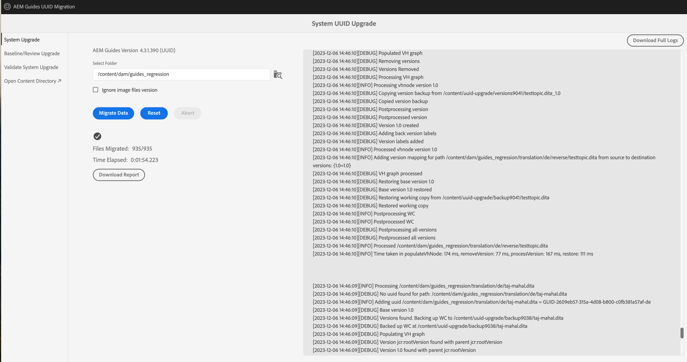

# Migration de contenu versionné

>[!NOTE]
>
> Vous pouvez migrer votre contenu non UUID vers le contenu UID dans Experience Manager Guides. Cet article sera archivé en novembre 2024.
>Affichez la [**migration de contenu non UUID vers UUID**](./migrate-non-uuid-uuid-new.md) pour obtenir la documentation la plus récente et détaillée.

Effectuez les étapes suivantes pour migrer votre contenu versionné non UUID vers le contenu UID.

>[!NOTE]
>
>Suivez les [instructions de mise à niveau](./upgrade-xml-documentation.md) spécifiques à la version sous licence de votre produit.

## Matrice de compatibilité

| Version actuelle de Experience Manager Guides (non UUID) | Version requise pour la migration vers UUID | Chemin de mise à niveau pris en charge |
|---|---|---|
| 3.8.5, 4.0.x ou 4.1.x | 4.1 non UUID | Installez la version 4.1 (UUID) et exécutez la migration |
| 4.2, 4.2.x ou 4.3 | 4.3.0 non UUID | Installez la version 4.3.1 (UUID) et exécutez la migration |
| 4.3.1 | N/A | N/A |

## Installation du package

Téléchargez les packages requis à partir du portail de distribution de logiciels Adobe, en fonction de votre version :

  Packages pour le chemin de mise à niveau version 4.1

1. **Avant la migration** : [com.adobe.guides.pre-uuid-migration-1.0.9.zip](https://experience.adobe.com/#/downloads/content/software-distribution/en/aem.html?package=%2Fcontent%2Fsoftware-distribution%2Fen%2Fdetails.html%2Fcontent%2Fdam%2Faem%2Fpublic%2Faemdox%2Fother-packages%2Fuuid-migration%2F1-0%2Fcom.adobe.guides.pre-uuid-migration-1.0.9.zip)
1. **Migration** : [com.adobe.guides.uuid-upgrade-1.0.19.zip](https://experience.adobe.com/#/downloads/content/software-distribution/en/aem.html?package=%2Fcontent%2Fsoftware-distribution%2Fen%2Fdetails.html%2Fcontent%2Fdam%2Faem%2Fpublic%2Faemdox%2Fother-packages%2Fuuid-migration%2F1-0%2Fcom.adobe.guides.uuid-upgrade-1.0.19.zip)

 Packages pour le chemin de mise à niveau version 4.3.1

1. **Avant la migration** : [com.adobe.guides.pre-uuid-migration-1.1.3.zip](https://experience.adobe.com/#/downloads/content/software-distribution/en/aem.html?package=%2Fcontent%2Fsoftware-distribution%2Fen%2Fdetails.html%2Fcontent%2Fdam%2Faem%2Fpublic%2Faemdox%2Fother-packages%2Fuuid-migration%2Fcom.adobe.guides.pre-uuid-migration-1.1.3.zip)
1. **Migration** : [com.adobe.guides.uuid-upgrade-1.1.15.zip](https://experience.adobe.com/#/downloads/content/software-distribution/en/aem.html?package=%2Fcontent%2Fsoftware-distribution%2Fen%2Fdetails.html%2Fcontent%2Fdam%2Faem%2Fpublic%2Faemdox%2Fother-packages%2Fuuid-migration%2Fcom.adobe.guides.uuid-upgrade-1.1.15.zip)

## Avant migration

Effectuez les vérifications suivantes sur la version non UUID (4.1 non UUID ou 4.3.0 non UUID) :

1. Installez le package de pré-migration en fonction de votre version.

   >[!NOTE]
   >
   >* Vous avez besoin de l’autorisation d’administrateur pour exécuter la migration.
   >* Il est recommandé de corriger les fichiers en erreur avant de poursuivre la migration.

1. (Facultatif) Effectuez la purge des versions sur le contenu pour supprimer les versions inutiles et accélérer le processus de migration. Pour effectuer la purge de version, sélectionnez l’option **Purge de version** dans l’écran de migration et accédez à l’interface utilisateur à l’aide de l’URL `http://<server- name>/libs/fmdita/clientlibs/xmleditor_uuid_upgrade/page.html`.
   >[!NOTE]
   >
   >Cet utilitaire ne supprime aucune version utilisée dans les lignes de base ou les révisions, ni ne comporte d’étiquettes.

1. Lancez `http://<server-name>/libs/fmdita/clientlibs/xmleditor_uuid_upgrade/page.html`.
1. Sélectionnez **Évaluation de la compatibilité** dans le panneau de gauche et recherchez un chemin d’accès au dossier.
1. Vérifiez la compatibilité pour lister les informations suivantes :
   * Total des fichiers
   * Versions totales
   * Durée estimée de la migration
   * Nombre de fichiers en erreur

   {width="800" align="left"}

1. Sélectionnez **Configurer les validations** dans le panneau de gauche. Ensuite, **Sélectionner la carte** et **Sélectionner le paramètre prédéfini** de la carte pour les configurer. La liste de validation de sortie actuelle affiche les fichiers de sortie présents avant la migration et peut être validée par rapport aux fichiers de sortie générés après la migration.

   {width="800" align="left"}

## Migration

### Etape 1 : mise à jour de la configuration

1. Assurez-vous que l’espace disponible est au moins dix fois supérieur à l’espace utilisé par AEM (répertoire crx-quickstart) pendant la migration. Une fois la migration terminée, vous pouvez récupérer la plus grande partie de l’espace disque en exécutant la compression (voir [Nettoyage des révisions](https://experienceleague.adobe.com/docs/experience-manager-65/deploying/deploying/revision-cleanup.html?lang=fr)).

1. Activez *Activer les lanceurs de workflow de post-traitement* dans `com.adobe.fmdita.config.ConfigManager` et *Activer le post-traitement de version* dans `com.adobe.fmdita.postprocess.version.PostProcessVersionObservation.`

1. Installez la version UID de la version prise en charge sur la version non UUID. Par exemple, si vous utilisez une version 4.1 non UUID, vous devez installer UID version 4.1 et exécuter la migration.

1. Installez le nouveau package pour la migration uuid.

1. Désactivez les workflows suivants et tout autre workflow s&#39;exécutant sur `/content/dam` à l&#39;aide de lanceurs dans `http://<server-name>/libs/cq/workflow/content/console.html`.

   * Workflow Ressource de mise à jour de la gestion des DAM
   * Workflow d’écriture différée des métadonnées de gestion des actifs numériques

1. Désactivez *Activer les lanceurs de workflow de post-traitement* dans `com.adobe.fmdita.config.ConfigManager` et désactivez *Activer le post-traitement de version* dans `com.adobe.fmdita.postprocess.version.PostProcessVersionObservation`.

1. Désactivez la propriété Activer la validation (`validation.enabled`) dans le service de balisage Day CQ.

1. Assurez-vous que le dossier de propriétés `uuid.regex` est correctement défini dans `com.adobe.fmdita.config.ConfigManager`. S’il est vide, définissez-le sur la valeur par défaut : `^GUID-(?<id>.*)`.
1. Ajoutez un journal distinct pour `com.adobe.fmdita.uuid`. La réponse du navigateur est également disponible à l’adresse `/content/uuid-upgrade/logs`.

### Etape 2 : lancer la migration et valider

#### Installation du package de migration

1. Lancez `http://<server-name>/libs/fmdita/clientlibs/xmleditor_uuid_upgrade/page.html`.

   {width="800" align="left"}

1. Sélectionnez **Mise à niveau du système** dans le panneau de gauche pour exécuter la migration. Démarrez sur un dossier contenant des données plus petites avant de l’exécuter sur `/content/dam`.

1. Sélectionnez **Télécharger le rapport** pendant la migration pour vérifier si tous les fichiers du dossier sont correctement mis à niveau et si toutes les fonctionnalités ne fonctionnent que pour ce dossier.

>[!NOTE]
>
> La migration du contenu peut être exécutée au niveau du dossier, la `/content/dam` complète ou le même dossier (réexécuter la migration).

En outre, il est important de s’assurer que la migration du contenu est effectuée pour toutes les ressources multimédias, telles que les images et les graphiques que vous avez utilisés dans le contenu DITA.

#### Migration de référence et de révision

Sélectionnez **Mise à niveau de référence/révision** dans le panneau de gauche pour migrer les lignes de base et effectuer une révision au niveau du dossier.

{width="800" align="left"}

### Etape 3 : restauration de la configuration

Une fois la migration du serveur réussie, activez le post-traitement, le balisage et les workflows suivants (y compris tous les autres workflows désactivés initialement pendant la migration) pour continuer à fonctionner sur le serveur.

* Workflow Ressource de mise à jour de la gestion des DAM
* Workflow de métadonnées de gestion des actifs numériques

>[!NOTE]
>
>Si certains fichiers ne sont pas traités ou corrompus avant la migration, ils seront corrompus avant la migration et resteront corrompus même après la migration.

## Validation de la migration

1. Une fois la migration terminée, sélectionnez **Valider la mise à niveau du système** dans le panneau de gauche et validez les fichiers de sortie avant et après la migration pour vous assurer que la migration est réussie.

   {width="800" align="left"}

1. Une fois la validation terminée, la plupart de l’espace disque peut être récupéré en exécutant la compression (voir `https://experienceleague.adobe.com/docs/experience-manager-65/deploying/deploying/revision-cleanup.html?lang=en`).
