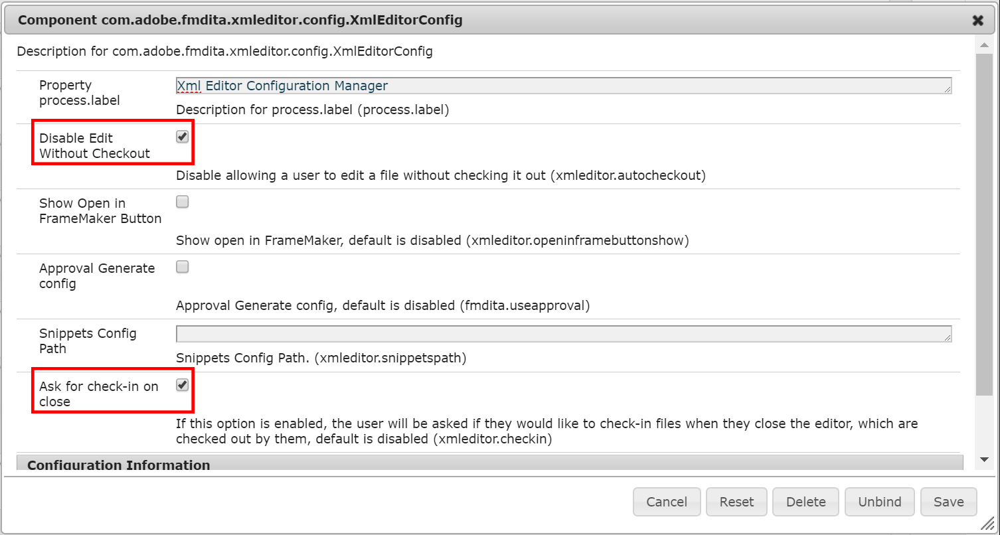
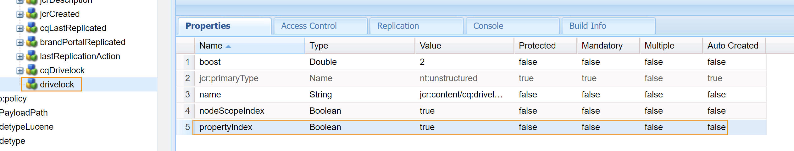

# Gestion des versions {#id181GB000XY4}

Le contrôle de version est un aspect important de tout système de gestion de contenu. Il vous permet de créer un instantané de votre ressource numérique à un moment donné. Une fois une version de ressource numérique en place, vous pouvez restaurer la version requise de la ressource et la mettre à jour. En règle générale, pour créer une version d’une ressource, vous devez extraire et archiver la ressource requise.

En tant qu’administrateur, vous pouvez appliquer des règles qui empêcheront les utilisateurs de modifier un fichier sans l’extraire. De même, vous pouvez vous assurer que tous les fichiers extraits sont archivés pour éviter toute perte de données.

Dans un environnement à usages multiples, il est également important de s’assurer que les utilisateurs et utilisatrices ne suppriment pas de fichiers du système. Cette exigence est plus critique pour les fichiers extraits par d’autres utilisateurs. Vous pouvez autoriser ou empêcher les utilisateurs d’écraser les fichiers extraits par d’autres utilisateurs. Pour empêcher les utilisateurs de supprimer accidentellement des fichiers extraits du système, AEM Guides propose une configuration que vous pouvez utiliser. Outre les fichiers extraits, vous pouvez également contrôler la suppression de fichiers qui contiennent des références ou qui sont référencés à partir d’autres fichiers. En outre, vous pouvez également créer une nouvelle version pour le fichier chargé.

## Créer une nouvelle version pour le fichier chargé

>[!NOTE]
>
> Cette configuration s’applique uniquement lors du chargement de fichiers.

Pour créer une nouvelle version du fichier chargé, procédez comme suit :

1. Ouvrez la page de configuration de la console web Adobe Experience Manager .

   L’URL par défaut pour accéder à la page de configuration est :

   ```http
   http://<server name>:<port>/system/console/configMgr
   ```

1. Recherchez et cliquez sur le lot **com.adobe.fmdita.config.ConfigManager** et cliquez dessus.

1. Sélectionnez l’option **Créer une version pour le fichier téléchargé**.

   Par défaut, cette option est désactivée.

   Lorsque l’option est sélectionnée, un nouveau mécanisme de gestion de version a lieu et remplace le comportement de chargement par défaut de pour tout chargement ultérieur, le contenu du fichier chargé est enregistré en tant que nouvelle version. Si cette option est désélectionnée, AEM Guides utilise le mécanisme de gestion des versions par défaut d’AEM.

1. Cliquez sur **Enregistrer**.


>[!NOTE]
>
> Vous pouvez charger des fichiers par lots de 70 ou moins, si vous activez la propriété **Créer une nouvelle version pour le fichier chargé** \(create.ver.new.content\) et utilisez **l’interface utilisateur d’Assets** pour charger des ressources en bloc.

## Configurer les paramètres pour autoriser la modification des fichiers extraits

L&#39;éditeur Web d&#39;AEM Guides vous permet de créer et de mettre à jour des rubriques DITA. Vous pouvez configurer l’éditeur web afin de permettre la modification des seuls documents qui ont été extraits du référentiel. Ainsi, aucun autre rédacteur ne remplace accidentellement un sujet ouvert pour modification par un autre rédacteur. Une fois qu’une rubrique est ouverte pour modification, un auteur peut archiver le fichier au moment de sa fermeture.

Une autre règle importante consiste à s’assurer que les fichiers qui ont été extraits sont de nouveau archivés dans le système. Cela empêche les utilisateurs de fermer accidentellement les fichiers sans les archiver à nouveau.

Pour activer ces fonctionnalités, procédez comme suit :

1. Ouvrez la page de configuration de la console web Adobe Experience Manager .

   L’URL par défaut pour accéder à la page de configuration est :

   ```http
   http://<server name>:<port>/system/console/configMgr
   ```

1. Recherchez et cliquez sur le lot **com.adobe.fmdita.xmleditor.config.XmlEditorConfig** et cliquez dessus.

1. Sélectionnez l’option **Désactiver la modification sans passage en caisse**.

   {width="650" align="left"}

   Avec cette option, les utilisateurs ne verront pas l’option Modifier dans la barre d’outils tant qu’ils n’auront pas extrait un fichier.

1. Sélectionnez l’option **Demander l’archivage à la fermeture** pour afficher un message d’avertissement chaque fois qu’un fichier extrait est fermé sans l’enregistrer ou le réarchiver dans le référentiel.

1. Cliquez sur **Enregistrer**.


>[!NOTE]
>
> Que vous activiez ou désactiviez cette fonctionnalité, les options d&#39;extraction et d&#39;intégration du fichier sont toujours disponibles dans un aperçu de rubrique.

## Remplacer le fichier extrait lors du chargement

>[!NOTE]
>
> Cette configuration s’applique uniquement lorsque vous créez des fichiers à partir de l’interface utilisateur d’Assets et non lorsque vous chargez des fichiers à l’aide de l’outil WebDAV.

Pour permettre aux utilisateurs de remplacer le fichier lors du chargement qui a été extrait par eux-mêmes ou par un autre utilisateur, procédez comme suit :

1. Ouvrez la page de configuration de la console web Adobe Experience Manager .

   L’URL par défaut pour accéder à la page de configuration est :

   ```http
   http://<server name>:<port>/system/console/configMgr
   ```

1. Recherchez et cliquez sur le lot **com.adobe.fmdita.config.ConfigManager** et cliquez dessus.

1. Sélectionnez l’option **Remplacer le fichier extrait lors du chargement**.

   Par défaut, cette option est ACTIVÉE. Lorsque cette option est sélectionnée, les utilisateurs peuvent remplacer les fichiers extraits. Si cette option n’est pas sélectionnée, le fichier ne peut pas être remplacé s’il est extrait par lui-même ou par un autre utilisateur.

1. Cliquez sur **Enregistrer**.


## Empêcher la suppression des fichiers extraits

Pour empêcher les utilisateurs de supprimer accidentellement des fichiers qu&#39;ils ont extraits ou qu&#39;un autre utilisateur a récupérés, procédez comme suit :

1. Ouvrez la page de configuration de la console web Adobe Experience Manager .

   L’URL par défaut pour accéder à la page de configuration est :

   ```http
   http://<server name>:<port>/system/console/configMgr
   ```

1. Recherchez et cliquez sur le lot **com.adobe.fmdita.xmleditor.config.XmlEditorConfig** et cliquez dessus.

1. Sélectionnez l’option **Empêcher la suppression du contenu extrait**.

   Par défaut, cette option est ACTIVÉE. Lorsque cette option est sélectionnée, les utilisateurs ne pourront pas supprimer les fichiers extraits.

1. Cliquez sur **Enregistrer**.


Pour prendre en charge cette fonctionnalité, une nouvelle `drivelock` de propriété d’index est ajoutée dans `oak:index` :

`/oak:index/damAssetLucene/indexRules/dam:Asset/properties/drivelock`

{width="800" align="left"}

Outre la nouvelle propriété d’index, assurez-vous que les propriétés suivantes sont définies sur `/oak:index/damAssetLucene` :

- `jcr:primaryType`=`"oak:QueryIndexDefinition"`
- `async`=`"async"`
- `compatVersion`=`"{Long}2"`
- `evaluatePathRestrictions`=`"{Boolean}true"`
- `reindex`=`"{Boolean}false"`
- `reindexCount`=`"{Long}3"` *\(il s’agit du nombre de fois où la réindexation est effectuée, qui est remplacé par l’installation de notre package\)*
- `type`=`"lucene"`

>[!NOTE]
>
> Vous pouvez modifier la valeur de `reindex` en `"{Boolean}true"`. Cela permet d’obtenir des résultats de recherche plus rapides pour les fichiers extraits dans une hiérarchie de dossiers.

## Empêcher la suppression des fichiers référencés

En tant qu’administrateur, vous pouvez contrôler qui peut supprimer des fichiers du référentiel AEM. En particulier, si un fichier contient des références ou est référencé par un autre fichier, vous pouvez définir qui peut supprimer ces fichiers.

Cette configuration vous permet d’autoriser ou de refuser la suppression de fichiers à tous les utilisateurs, ou de n’autoriser la suppression de fichiers qu’à un groupe d’utilisateurs spécifique. Si la suppression de fichier est autorisée, le processus suivant est suivi :

- Si vous supprimez un dossier qui contient tous les fichiers référencés et de référence, tous les fichiers sont supprimés. Le processus supprimera d’abord tous les fichiers qui ne contiennent aucune référence, puis les fichiers qui contiennent des références ou qui sont référencés.

- Si vous supprimez un dossier et qu’un fichier du dossier est référencé par un fichier en dehors de ce dossier, vous êtes invité à supprimer la référence avant de supprimer le fichier.


Pour définir qui peut supprimer un fichier contenant des références ou référencé par d’autres fichiers, procédez comme suit :

1. Ouvrez la page de configuration de la console web Adobe Experience Manager .

   L’URL par défaut pour accéder à la page de configuration est :

   ```http
   http://<server name>:<port>/system/console/configMgr
   ```

1. Recherchez et cliquez sur le lot **com.adobe.fmdita.config.ConfigManager** et cliquez dessus.

1. Recherchez l’option **Bloquer la suppression pour Assets référencé**.

1. Selon la personne à qui vous souhaitez accorder l’accès pour la suppression, spécifiez l’une des constantes suivantes :

   - allow\_unsafe\_delete\_for\_all : autorisez tous les utilisateurs à supprimer des fichiers. Dans ce cas, si le(s) fichier(s) contient(nt) des références ou est référencé(s) par d’autres fichiers, vous pouvez également supprimer de force ce(s) fichier(s). Avant de supprimer le fichier, une invite contenant les références s’affiche. Vous pouvez annuler l’opération de suppression, supprimer les références, puis supprimer définitivement le(s) fichier(s). Vous pouvez également supprimer de force le ou les fichiers sans supprimer les références.

     {width="550" align="left"}

   - allow\_unsafe\_delete\_for\_delete\_assets\_group : un administrateur ou un utilisateur appartenant au groupe *delete-assets* est autorisé à supprimer des fichiers. Si un autre utilisateur tente de supprimer des fichiers avec des références, il ne sera pas autorisé à supprimer ces fichiers jusqu&#39;à ce que toutes les références soient supprimées. La capture d’écran suivante s’affiche lorsqu’un utilisateur, qui ne dispose pas des autorisations nécessaires, tente de supprimer des fichiers.

     {width="550" align="left"}

   - block\_unsafe\_delete\_for\_all : interdire à tous les utilisateurs \(y compris aux administrateurs\) de supprimer des fichiers jusqu’à ce que les références à et depuis le ou les fichiers\\) soient supprimées.

1. Cliquez sur **Enregistrer**.


## Purge des anciennes versions des fichiers DITA

Lorsque vous mettez à jour le contenu et créez de nouvelles versions, les versions précédentes des fichiers DITA sont conservées dans le référentiel. De nombreuses versions peuvent être créées pour vos fichiers DITA sur une période et peuvent collectivement occuper une grande quantité d&#39;espace dans votre référentiel. AEM Guides vous permet de configurer les anciennes versions qui doivent être supprimées du référentiel.

Vous pouvez accéder à cet utilitaire à l’aide de l’URL indiquée si vous disposez de droits d’administration :

`<server folder path> /libs/fmdita/clientlibs/xmleditor_version_purge/page.html`

La version d&#39;un fichier DITA qui répond à l&#39;un des critères donnés est conservée et non purgée :

- Est la première version d’un fichier
- Est inclus dans une ligne de base
- est inclus dans tout workflow de traduction ou de révision ;
- Est associé à un libellé
- Répond aux critères d’âge ou de nombre de versions définis

Pour purger les anciennes versions, procédez comme suit :

1. Saisissez les informations suivantes sur les fichiers à purger :

   {width="350" align="left"}

1. 
   - **Nombre de versions à conserver à partir de la dernière version** : saisissez le nombre de versions à conserver et à ne pas purger. Par exemple, si nous entrons 5 , les 5 dernières versions sont conservées, et les versions antérieures sont qualifiées pour être purgées si d’autres conditions de purge sont remplies.
- **Conserver les versions créées dans la période \(En jours\)** : saisissez l’âge maximal d’une version en jours. Les versions antérieures au nombre de jours donné peuvent être purgées si d’autres conditions de purge sont remplies. Par exemple, si nous entrons 100, toutes les versions créées avant 100 jours peuvent être purgées si d’autres conditions de purge sont remplies.
- **Chemin d’accès** : sélectionnez le chemin d’accès du fichier ou du dossier dont vous souhaitez purger les fichiers.

  >[!NOTE]
  >
  > Vous pouvez purger uniquement les fichiers DITA.

1. Cliquez sur **Aperçu du rapport de purge**.

   >[!NOTE]
   >
   > Il ne peut y avoir qu&#39;une seule tâche de purge à la fois. Vous ne pouvez pas lancer une autre opération de purge de version si une autre est en cours de traitement.

   Le rapport de purge de version est généré.

1. Téléchargez le rapport de purge des versions et vérifiez les fichiers et les versions qui seront purgés.
1. Vous pouvez choisir entre **Annuler la purge** ou **Démarrer la purge**.

   {width="350" align="left"}

   Le statut de purge s’affiche.

   Cliquez sur **Télécharger le rapport de purge des versions** pour afficher les versions purgées. Ce rapport fournit le statut de purge de toutes les versions ainsi que les raisons pour lesquelles une version particulière a été conservée ou purgée.


>[!NOTE]
>
> Le rapport est téléchargé à l’emplacement suivant : /var/dxml/versionpurge
