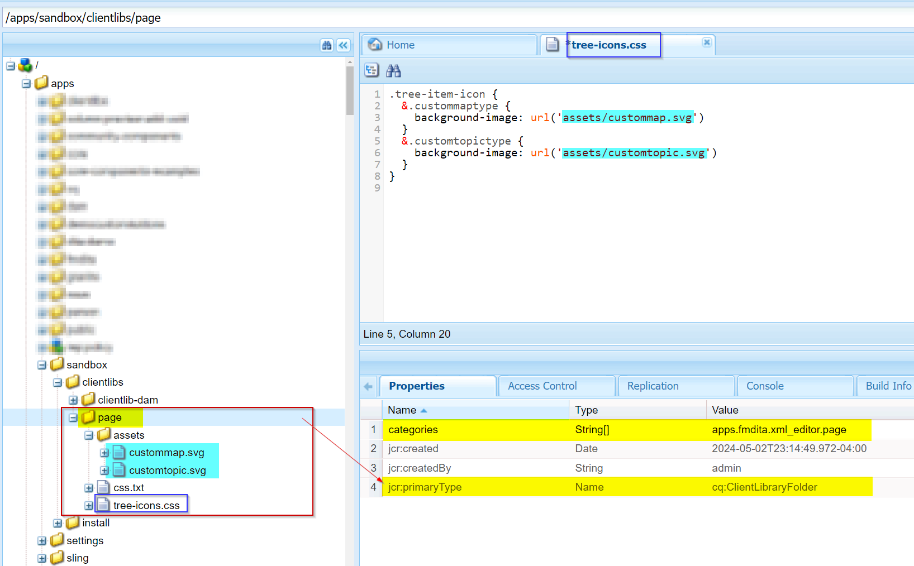

# Configuration des icônes pour les types de données personnalisés/spécialisés (rubriques ou mappages)


## Énoncé de problème

Avec le schéma personnalisé utilisé dans AEM Guides, vous pouvez créer des types de rubriques ou de mappages personnalisés. Vous remarquerez peut-être alors que les types de rubriques/mappages personnalisés n’affichent pas d’icône dans l’éditeur web ou l’interface utilisateur d’Assets. Voir la capture d’écran ci-dessous à titre de référence


Pour attribuer une icône aux types de rubrique/carte personnalisés, vous devez donc effectuer les opérations suivantes :
- Recherche du type de topic/map personnalisé
- Écrivez des styles pour ajouter l’icône souhaitée pour le type personnalisé


Nous pouvons implémenter les étapes ci-dessus pour afficher l’icône dans l’éditeur web (vue du référentiel) ainsi que dans l’interface utilisateur d’Assets. Vous trouverez ci-dessous les étapes pour les deux


## Affichage de l’icône pour la rubrique/carte personnalisée en mode éditeur web

_Étape 1 :_déterminer le type de dita pour la rubrique/application dita personnalisée
- Ouvrez la vue du référentiel dans éditeur web > ouvrez la console de développement dans le navigateur
- Examinez l’espace de l’icône en regard de la rubrique/carte répertoriée
- Vérifiez la classe affectée à la rubrique personnalisée
- Voir la capture d’écran ci-dessous pour plus d’informations 
- Nous utiliserons cette classe pour affecter une icône et écrire un css pour ce

_Étape 2 :_créer un fichier css et affecter une icône à ce type dita
- Créez une bibliothèque cliente sous /apps, par exemple, vous créez un cq:ClientLibraryFolder sous le chemin d’accès souhaité
   - ajoutez-y les catégories « apps.fmdita.xml_editor.page »
- créez un dossier « ressources » sous ce répertoire et ajoutez toutes les icônes que vous souhaitez utiliser pour les types de données personnalisés
- ajoutez un fichier css sous le dossier de bibliothèque cliente, par exemple « tree-icons.css »
   - ajouter le code suivant :

```
            .tree-item-icon {
                &.custommaptype {
                    background-image: url('assets/custommap.svg')
                }
                &.customtopictype {
                    background-image: url('assets/customtopic.svg')
                }
            }
```

- ajoutez le fichier css.txt sous le dossier de bibliothèque cliente et ajoutez la référence à « tree-icon.css » qui vient d’être créé
- enregistrer/déployer ces modifications

Consultez la capture d’écran ci-dessous pour plus d’informations.


La sortie finale est présentée dans la capture d’écran ci-dessous


## Affichage de l’icône pour la rubrique/carte personnalisée dans l’interface utilisateur d’Assets

_Étape 1 :_déterminer le type dita de la rubrique/carte dita personnalisée
- Cela est expliqué à l’étape 1 des méthodes précédentes

_Étape 2 :_créez un script JavaScript pour définir les icônes à charger pour le type dita personnalisé pour les types topic/map personnalisés
- Créez une bibliothèque cliente sous /apps, par exemple, vous créez un cq:ClientLibraryFolder sous le chemin d’accès souhaité
   - ajoutez-y les propriétés suivantes :
      - valeur « categories » (chaîne à plusieurs valeurs) : « dam.gui.admin.coral »
      - valeur « dependencies » (chaîne à plusieurs valeurs) sous la forme « libs.fmdita.versioncontrol »
- Créez une copie du fichier « /libs/fmdita/clientlibs/clientlibs/xmleditor/clientlib-dam/topic_type.js » dans ce répertoire /apps
   - modifiez le fichier « topic_type.js » copié et modifiez/ajoutez customtopictype sous la variable « typeImageNameMap »
   - Vous pouvez également modifier le chemin d’accès du dossier d’images en modifiant la valeur de la variable « parentImagePath » sur l’emplacement de stockage des icônes personnalisées
- Créez un fichier nommé js.txt sous le dossier de bibliothèque cliente et ajoutez la référence à « topic_type.js »
- enregistrer/déployer ces modifications
Consultez la capture d’écran ci-dessous pour plus d’informations.
  

Et la sortie finale s’affichera comme illustré dans la capture d’écran 
