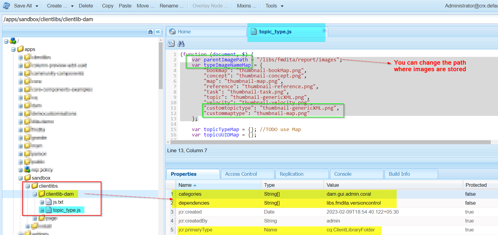
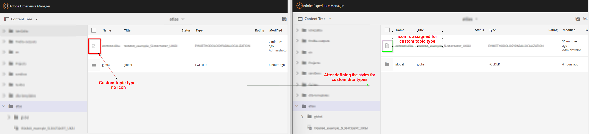

# Icône de configuration pour les types DITA (rubrique ou mappage) personnalisés/spécialisés


## Énoncé du problème

Avec le schéma personnalisé utilisé dans AEM Guides, vous pouvez créer des types de rubrique ou de mappage personnalisés. Vous remarquerez peut-être que les types de rubrique/mappage personnalisés n’affichent pas d’icône dans l’éditeur web ou l’interface utilisateur d’Assets. Voir ci-dessous la capture d’écran pour référence


Ainsi, pour affecter une icône aux types de rubrique/mappage personnalisés, vous devez effectuer les opérations suivantes :
- Rechercher le type de rubrique/mappage personnalisé
- Écrire des styles pour ajouter l’icône de votre choix pour le type personnalisé


Nous pouvons mettre en oeuvre les étapes ci-dessus pour afficher l’icône dans l’éditeur web (affichage du référentiel) ainsi que dans l’interface utilisateur d’Assets. Vous trouverez ci-dessous les étapes pour les deux


## Affichage de l’icône pour une rubrique/un mappage personnalisé dans la vue de l’éditeur web

_Étape 1 :_ Déterminez le type de dictionnaire personnel pour la rubrique/application de dictionnaire personnel
- Ouvrez l’affichage du référentiel dans l’éditeur web > ouvrez la console du développeur dans le navigateur.
- Inspect : espace de l’icône en regard de la rubrique/du mappage répertorié
- Vérification de la classe affectée à la rubrique personnalisée
- Voir la capture d’écran ci-dessous pour plus de détails 
- Nous utiliserons cette classe pour attribuer une icône et écrire des CSS pour cette classe.

_Étape 2 :_ Créez un CSS et affectez une icône à ce type de DIA
- Créez une bibliothèque cliente sous /apps, par exemple vous pouvez créer un cq:ClientLibraryFolder sous le chemin souhaité.
   - ajoutez-lui les catégories &quot;apps.fmdita.xml_editor.page&quot;.
- créez un dossier &quot;assets&quot; sous ce répertoire et ajoutez toutes les icônes que vous souhaitez utiliser pour les types de dictionnaire de données personnalisés.
- ajoutez un fichier css sous le dossier de bibliothèque cliente, par exemple &quot;tree-icons.css&quot;.
   - ajouter le code suivant

```
            .tree-item-icon {
                &.custommaptype {
                    background-image: url('assets/custommap.svg')
                }
                &.customtopictype {
                    background-image: url('assets/customtopic.svg')
                }
            }
```

- ajoutez css.txt sous le dossier de bibliothèque cliente et ajoutez une référence à &quot;tree-icon.css&quot; qui vient d’être créé.
- enregistrer/déployer ces modifications ;

Pour plus d’informations, reportez-vous à la capture d’écran ci-dessous.


Et le résultat final est affiché ci-dessous.


## Affichage de l’icône pour une rubrique/un mappage personnalisé dans l’interface utilisateur d’Assets

_Étape 1 :_ déterminant le type de dictionnaire personnel de la rubrique/carte de dictionnaire personnel
- cela est expliqué à l’étape 1 des méthodes précédentes.

_Étape 2 :_ Créez un script JavaScript pour définir les icônes à charger pour le type de dictionnaire de données personnalisé pour les types de rubrique/mappage personnalisés.
- Créez une bibliothèque cliente sous /apps, par exemple vous pouvez créer un cq:ClientLibraryFolder sous le chemin souhaité.
   - ajoutez-lui les propriétés suivantes :
      - Valeur &quot;categories&quot; (chaîne à plusieurs valeurs) sous la forme &quot;dam.gui.admin.coral&quot;
      - Valeur &quot;dependencies&quot; (chaîne à plusieurs valeurs) sous la forme &quot;libs.fmdita.versioncontrol&quot;
- Créez une copie du fichier &quot;/libs/fmdita/clientlibs/clientlibs/xmleditor/clientlib-dam/topic_type.js&quot; dans ce répertoire /apps .
   - modifiez le &quot;topic_type.js&quot; copié et modifiez/ajoutez customtopictype sous la variable &quot;typeImageNameMap&quot;.
   - Vous pouvez également modifier le chemin d’accès du dossier des images en définissant la valeur de la variable &quot;parentImagePath&quot; sur l’emplacement de stockage des icônes personnalisées.
- Créez un fichier nommé js.txt sous le dossier de bibliothèque cliente et ajoutez une référence à &quot;topic_type.js&quot;.
- enregistrer/déployer ces modifications ;
Pour plus d’informations, reportez-vous à la capture d’écran ci-dessous.
  

Et la sortie finale apparaîtra comme illustré dans la capture d’écran 
