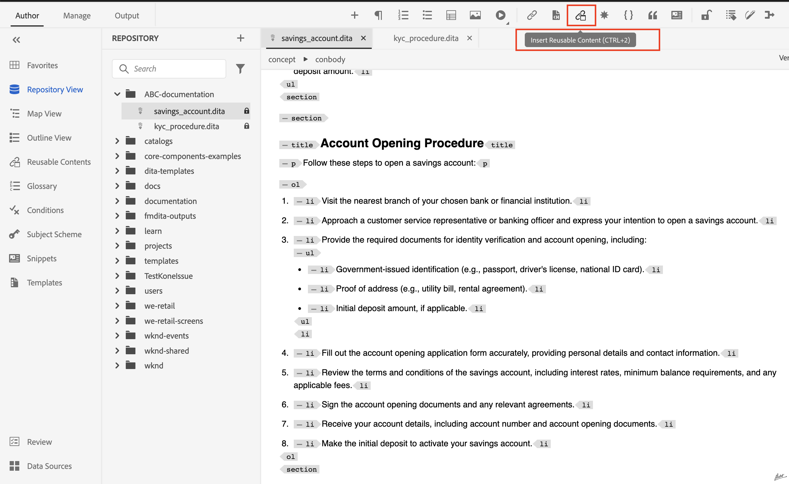
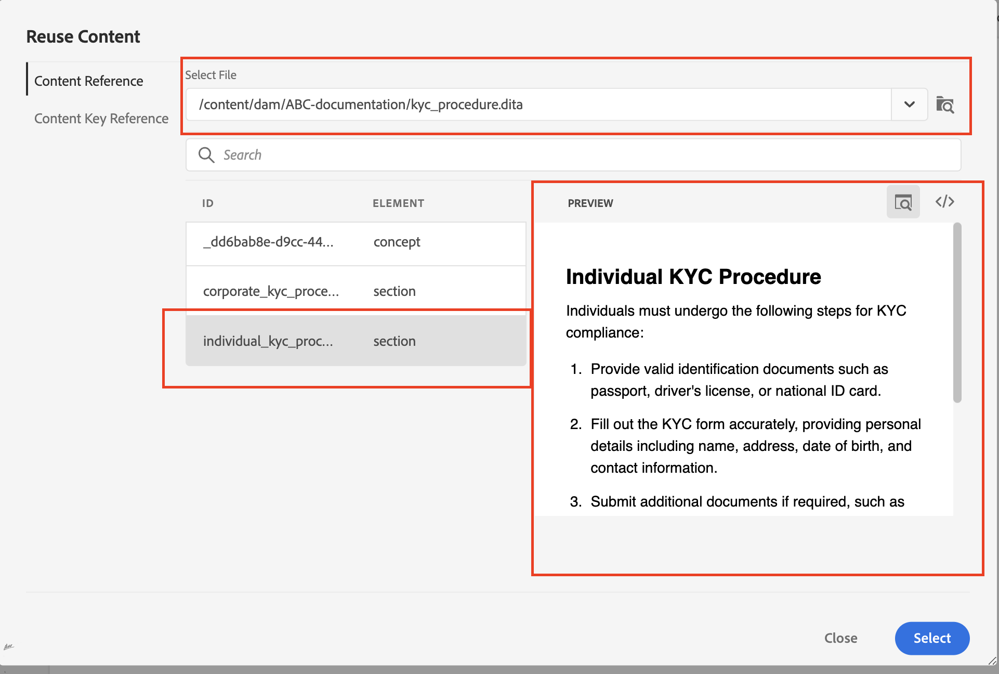

# Réutilisation du contenu dans AEM Guides

Adobe AEM Guides exploite les points forts de DITA pour fournir une interface conviviale pour la réutilisation du contenu.

Cet article aborde les sujets suivants :

1. [Réutilisation à l’aide de la référence de rubrique (`topicrefs`)](#reusability-using-topic-referencestopicref)
2. [Réutilisation à l’aide de la référence de contenu (`conref` et `conkeyref`)](#reusability-using-content-reference-conref--conkeyref)
3. [Conseil bonus pour réutiliser le contenu par glisser-déposer dans AEM Guides](#reuse-content-with-a-single-click-in-aem-guides)

## Réutilisation à l’aide de références de rubrique (topicref)


Supposons que vous êtes un fabricant et que vous ayez des rubriques génériques pour les précautions de sécurité ou les techniques de dépannage.

Ils peuvent être référencés et adaptés dans des manuels d’utilisation spécifiques pour chaque modèle de machine, ce qui réduit la redondance et garantit que les informations de base sur la sûreté restent cohérentes.

```
<map id="user_manual_model 100" title="ABC Model 100 User Manual ">


<topicref href="Safety_Information.dita" format="dita">
</topicref>
.
.
.
.
.
</map>
```


De même pour le modèle 200

```
<map id="user_manual_model 200" title="ABC Model 200 User Manual ">

<topicref href="Safety_Information.dita" format="dita">
</topicref>
.
.
.
.
.
  
</map>
```

## Réutilisation à l’aide de la référence de contenu (conref et conkeyref)

L’attribut référence de contenu (conref) vous permet de créer des liens vers d’autres parties de votre contenu. Cela favorise la réutilisation et réduit la redondance.

Par exemple :

Supposons que vous êtes une entreprise financière et que vous ayez un sujet générique pour KYC qui contient des procédures KYC pour les individus, les entreprises, etc.

Vous souhaitez réutiliser un fragment de clé USB individuel pour les rubriques « Enregistrement d’un compte » et « Compte de démonstration ».

```
<section id="kyc_requirements_saving_account">
  <title>Know Your Customer (KYC) Requirements</title>
  <p>To comply with regulations and ensure customer identification, all individual applicants for savings  accounts must fulfill the KYC requirements as outlined below</p>
  <p conref=kyc_procedures.dita#individual_kyc></p>
</section>
```

Ici, `conref=kyc_procedures.dita#indvidual_kyc` kyc_procédures.dita est l’identifiant du fichier et #individual_kyc est l’identifiant du fragment.

Kyc_PROCEDURE.dita reste la seule source d&#39;information. Si des modifications réglementaires nécessitent des mises à jour du processus de CLÉ de connaissance, mettez à jour le chemin du sujet avec le nouveau. Les modifications seront répercutées automatiquement dans toutes les rubriques qui y font référence.

Avec AEM Guides, les deux clics s’effectuent

Étape 1 : cliquez sur Insérer du contenu réutilisable


<br>

Étape 2 : sélectionnez le fichier et le fragment qui doivent être réutilisés.


Comme pour « conref », vous pouvez également utiliser « conkeyref » où, au lieu de donner un chemin de contenu, vous faites référence au contenu par clé

Exemple de code :

```
<section conkeyref="kyc_procedure/individual_kyc_procedure" id="individual_kyc_procedure"></section>
```

La définition de la clé est la suivante :

```
<map id="ABC_manual">
  <title>ABC_Manual</title>
  <topicref href="kyc_procedure_2020.dita" keys="kyc_procedure" processing-role="resource-only" type="concept">
  </topicref>
  <topicref href="savings_account.dita" type="concept">
  </topicref>
</map>
```

Clé - &#39;Kyc_procedure&#39; reste la seule source d&#39;information. Si des modifications sont apportées au processus de création des clés de connaissance comme l’exige la réglementation, vous devez simplement mettre à jour un chemin de rubrique avec un nouveau chemin de rubrique. Ces modifications sont automatiquement répercutées dans toutes les rubriques qui y font référence.

```
<map id="ABC_manual">
  <title>ABC_Manual</title>
  <topicref href="kyc_procedure_2024.dita" keys="kyc_procedure" processing-role="resource-only" type="concept">
  </topicref>
  <topicref href="savings_account.dita" type="concept">
  </topicref>
</map>
```

Ici, le chemin d&#39;accès à la rubrique est modifié de « kyc_PROCEDURE_2020.dita » en « kyc_PROCEDURE_2024.dita » en raison de modifications récentes de la réglementation.

Avec AEM Guides, les deux clics s’effectuent

Étape 1 : cliquez sur Insérer du contenu réutilisable


Étape 2 : sélectionnez la carte racine (facultative), la clé et le fragment qui doivent être réutilisés.


Ici, la carte racine a été sélectionnée automatiquement, car elle était déjà ouverte dans la vue Carte.


## Réutiliser du contenu en un seul clic dans AEM Guides

AEM Guides offre une fonctionnalité de « contenu réutilisable » permettant d’ajouter des références de contenu en un seul clic.

Étape 1 : ajouter une rubrique générique aux contenus réutilisables


Étape 2 : une fois ajouté, faites glisser et déposez le fragment que vous souhaitez réutiliser dans l’une de vos rubriques de destination.


## Questions fréquentes

### Tout le contenu ne s’affiche pas après la sélection du fichier/de la clé dans la boîte de dialogue Réutiliser le contenu .

Attribuez des identifiants à des fragments (éléments Dita) que vous souhaitez réutiliser dans d’autres rubriques

## Les clés ne s’affichent pas dans la boîte de dialogue Réutiliser le contenu .

Assurez-vous d’avoir ouvert la carte racine/le mappage parent dans map-view, qui possède une définition de clé, ou ajoutez manuellement le chemin de la carte racine dans la même boîte de dialogue.


<br>
<br>
<br>


Publiez sur le [forum](https://experienceleaguecommunities.adobe.com/t5/experience-manager-guides/ct-p/aem-xml-documentation?profile.language=fr) de la communauté AEM Guides pour toute requête.
