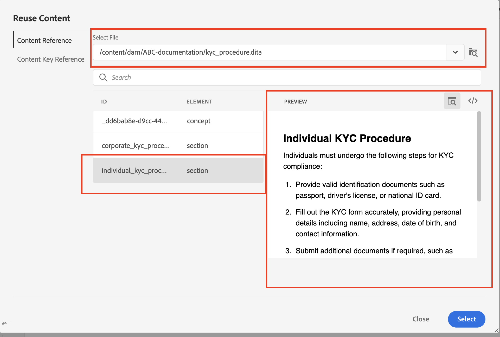
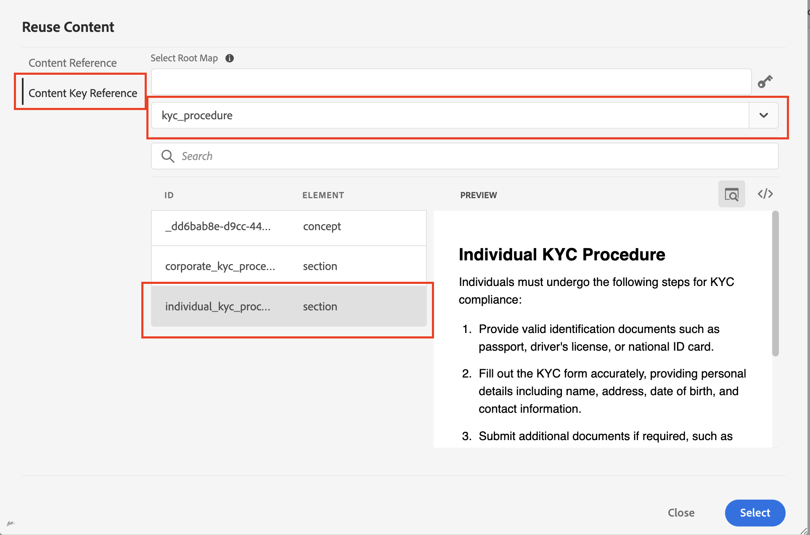
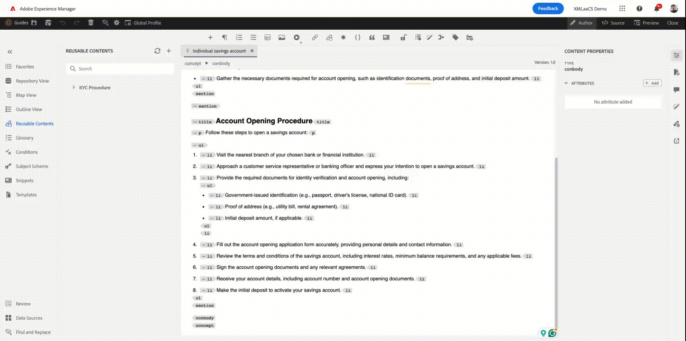

# Réutilisation du contenu dans AEM Guides

Les guides Adobe AEM exploitent les avantages de DITA pour offrir une interface conviviale pour la réutilisation du contenu.

## Réutilisation à l’aide des références de rubrique (topicref)


Supposons que vous soyez une société de fabrication et que vous ayez des rubriques génériques pour les mesures de sécurité ou les techniques de dépannage.

Ils peuvent être référencés et adaptés dans des manuels d’utilisation spécifiques pour chaque modèle de machine, ce qui réduit la redondance et garantit la cohérence des informations de sécurité de base.

```
<map id="user_manual_model 100" title="ABC Model 100 User Manual ">


<topicref href="Safety_Information.dita" format="dita">
</topicref>
.
.
.
.
.
</map>
```


De même pour le modèle 200

```
<map id="user_manual_model 200" title="ABC Model 200 User Manual ">

<topicref href="Safety_Information.dita" format="dita">
</topicref>
.
.
.
.
.
  
</map>
```

## Réutilisation à l’aide de la référence de contenu (conref &amp; conkeyref

L’attribut de référence de contenu (conref) vous permet de créer des liens vers d’autres parties de votre contenu. Cela favorise la réutilisation et réduit la redondance.

Par exemple :

Supposons que vous soyez une entreprise financière et que vous ayez un sujet générique pour KYC qui contient des procédures de KYC pour les individus, les entreprises, etc.

Vous souhaitez réutiliser un fragment de code de visite individuel pour les rubriques &quot;Enregistrement du compte&quot; et &quot;Compte de démonstration&quot;.

```
<section id="kyc_requirements_saving_account">
  <title>Know Your Customer (KYC) Requirements</title>
  <p>To comply with regulations and ensure customer identification, all individual applicants for savings  accounts must fulfill the KYC requirements as outlined below</p>
  <p conref=kyc_procedures.dita#individual_kyc></p>
</section>
```

Ici `conref=kyc_procedures.dita#indvidual_kyc` kyc_procédures.dita est l’identifiant du fichier et #individual_kyc est l’identifiant du fragment.

Kyc_process.dita reste la seule source d&#39;information. S’il existe des modifications au processus de création de parcours, comme l’exigent les réglementations, vous devez simplement mettre à jour un sujet. Ces modifications sont automatiquement répercutées dans toutes les rubriques qui y font référence.

À l’aide des AEM Guides, Ses deux clics

Etape 1 : cliquez sur Insérer du contenu réutilisable


<br>

Étape 2 : sélectionnez le fichier et le fragment qui doivent être réutilisés.


Tout comme &quot;conref&quot;, vous pouvez également utiliser &quot;conkeyref&quot; où, au lieu de donner un chemin d’accès au contenu, vous pouvez référencer le contenu par le biais de clés.

Exemple de code :

```
<section conkeyref="kyc_procedure/individual_kyc_procedure" id="individual_kyc_procedure"></section>
```

La définition de clé se présente comme suit :

```
<map id="ABC_manual">
  <title>ABC_Manual</title>
  <topicref href="kyc_procedure_2020.dita" keys="kyc_procedure" processing-role="resource-only" type="concept">
  </topicref>
  <topicref href="savings_account.dita" type="concept">
  </topicref>
</map>
```

Clé : &quot;Kyc_process&quot; restera la seule source d’informations. S’il existe des modifications au processus de création de rapports d’expérience (KYC) requises par les réglementations, vous devez simplement mettre à jour un chemin de rubrique avec un nouveau chemin de rubrique. Ces modifications seront automatiquement répercutées dans toutes les rubriques qui y font référence.

```
<map id="ABC_manual">
  <title>ABC_Manual</title>
  <topicref href="kyc_procedure_2024.dita" keys="kyc_procedure" processing-role="resource-only" type="concept">
  </topicref>
  <topicref href="savings_account.dita" type="concept">
  </topicref>
</map>
```

Ici, le chemin d’accès à la rubrique est remplacé par &quot;kyc_process_2020.dita&quot; en raison de modifications récentes de la réglementation.

À l’aide des AEM Guides, Ses deux clics

Etape 1 : cliquez sur Insérer du contenu réutilisable


Étape 2 : sélectionnez le mappage racine (facultatif), la clé et le fragment qui doivent être réutilisés.


Ici, la carte racine a été automatiquement sélectionnée, car elle était déjà ouverte dans la vue map.


### Réutilisation de contenu en un seul clic dans AEM Guides

AEM Guides offre une fonctionnalité &quot;Contenu réutilisable&quot; pour ajouter des références de contenu en un seul clic.

Étape 1 : Ajout d’une rubrique générique au contenu réutilisable


Étape 2 : une fois ajouté, faites glisser et déposez le fragment que vous souhaitez réutiliser dans l’une de vos rubriques de destination.




## Questions fréquentes

- ### Tout le contenu ne s’affiche pas après la sélection d’un fichier/d’une clé dans la boîte de dialogue Réutiliser le contenu .

Vous devez attribuer des identifiants aux fragments (éléments Dita ) que vous souhaitez réutiliser dans d’autres rubriques.

- ## Les clés ne s’affichent pas dans la boîte de dialogue Réutiliser le contenu

Assurez-vous d’avoir ouvert le mappage racine/parent dans map-view qui comporte une définition de clé ou ajoutez le chemin de mappage racine manuellement dans la même boîte de dialogue.


<br>


Publication sur la communauté AEM Guides [forum](https://experienceleaguecommunities.adobe.com/t5/experience-manager-guides/ct-p/aem-xml-documentation) pour toutes les requêtes.

