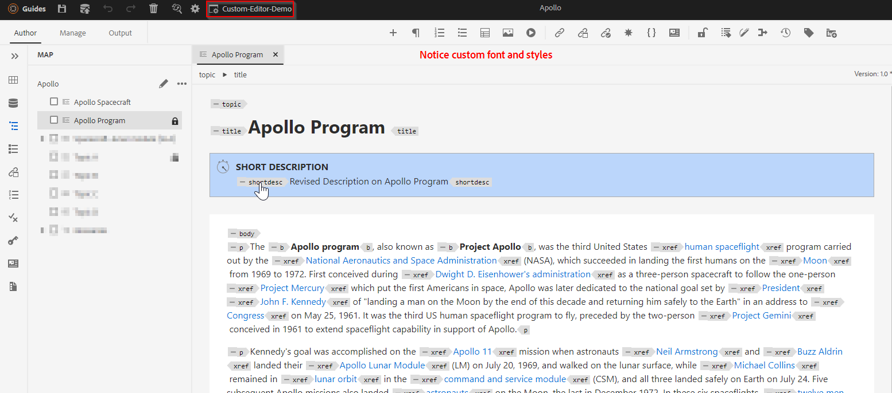

# Ajout de styles personnalisés à l’éditeur de guides

Dans cet article, nous allons découvrir comment ajouter des styles personnalisés pour modifier l’aspect par défaut de l’éditeur de weets.

Les étapes sont les suivantes :
- Ajout de styles personnalisés via la configuration de l’éditeur XML de profil de dossier
- Choix du profil de dossier respectif dans l’éditeur Web et test des modifications


## Mise en oeuvre en prenant un exemple

Comprenons cela avec un exemple où nous voulons afficher la brève description et le titre comme bloc distinct avec certains aspects de style dans l’éditeur.




## Implémenter


### Ajout du CSS personnalisé au profil de dossier

Utilisez les profils de dossier pour vérifier la variable *css_layout.css* sous l’onglet &quot;Configuration de l’éditeur XML&quot; et ajoutez le CSS avec des styles personnalisés

[utiliser ce lien pour en savoir plus sur le profil de dossier et la configuration de la mise en page du modèle CSS](https://experienceleague.adobe.com/docs/experience-manager-guides-learn/videos/advanced-user-guide/editor-configuration.html?lang=en#customize-the-css-template-layout)

Utilisez ce qui suit pour configurer le style ci-dessus dans votre éditeur de sites web :
- Utilisation [css_layout.css](../../../assets/authoring/webeditor-customstyles-css_layout.css) et chargez-le dans le profil de dossier de votre choix.
- Installer le package joint [webeditor-styles-resources.zip](../../../assets/authoring/webeditor-styles-resources.zip) utilisation d’AEM gestionnaire de packages pour installer les ressources utilisées dans le fichier CSS ci-dessus

```
This will install the resources at path "/content/dam/resources" which will include sub-folders "fonts" and "images"
```


### Tests

- Ouvrir l’éditeur web
- Dans les préférences utilisateur, choisissez le profil de dossier dans lequel vous avez ajouté les styles personnalisés. Si vous l’avez ajouté au profil global, vous l’utilisez probablement déjà.
- Ouvrez une rubrique. Vous remarquerez que la zone de modification doit avoir une interface utilisateur personnalisée.

```
Please note this is compatible to AEM Guides version 4.2 and AEM Guides cloud version 2303 (March)
```


## Références

La session d’experts portant sur les configurations et la personnalisation des éditeurs de sites web peut également vous intéresser. [Session d&#39;experts sur webeditor](https://experienceleague.adobe.com/docs/experience-manager-guides-learn/tutorials/knowledge-base/expert-session/webbased-authoring-jan2023.html?lang=en)
