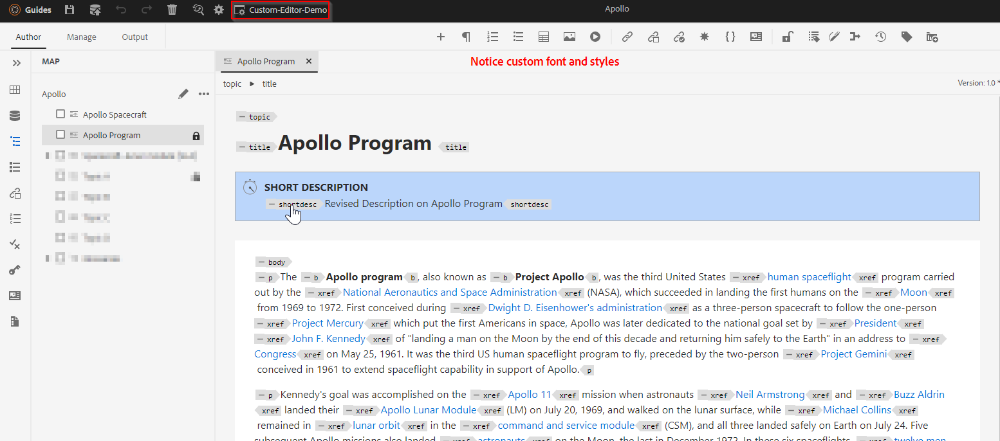

# Ajout de styles personnalisés à l’éditeur web de Guides

Dans cet article, nous allons découvrir comment ajouter des styles personnalisés pour modifier l’aspect par défaut de l’éditeur web.

Pour ce faire, les étapes sont les suivantes :
- Ajout de styles personnalisés via la configuration de l’éditeur XML de profil de dossier
- Sélection du profil de dossier correspondant dans l’éditeur web et test des modifications


## Implémentation en prenant un exemple

Comprenons ceci avec un exemple où nous voulons afficher la description courte et le titre sous la forme d’un bloc distinct avec certains aspects de style dans l’éditeur.




## Mise en œuvre de ceci


### Ajout du CSS personnalisé au profil de dossier

Utilisez les profils de dossier pour vérifier le fichier *css_layout.css* sous l’onglet « Configuration de l’éditeur XML » et ajoutez le fichier CSS avec des styles personnalisés

[Utilisez ce lien pour en savoir plus sur le profil de dossier et la configuration de la disposition du modèle CSS](https://experienceleague.adobe.com/docs/experience-manager-guides-learn/videos/advanced-user-guide/editor-configuration.html?lang=fr#customize-the-css-template-layout)

Utilisez les éléments suivants pour configurer le style ci-dessus dans votre éditeur web :
- Utilisez [css_layout.css](../../../assets/authoring/webeditor-customstyles-css_layout.css) et chargez-le dans le profil de dossier de votre choix
- Installez le package joint [webeditor-styles-resources.zip](../../../assets/authoring/webeditor-styles-resources.zip) à l’aide du gestionnaire de packages AEM pour installer les ressources utilisées dans le fichier CSS ci-dessus

```
This will install the resources at path "/content/dam/resources" which will include sub-folders "fonts" and "images"
```


### Tests

- Ouvrir l’éditeur web
- Dans les préférences utilisateur , choisissez le profil de dossier dans lequel vous avez ajouté les styles personnalisés. Si vous l’avez ajouté au profil global, vous l’utilisez probablement déjà.
- Ouvrez une rubrique pour constater que la zone de modification doit comporter une interface utilisateur personnalisée

```
Please note this is compatible to AEM Guides version 4.2 and AEM Guides cloud version 2303 (March)
```


## Références

Vous pouvez également être intéressé par la session d’experts sur les configurations et la personnalisation de l’éditeur web, abordée dans la section [Session d’experts sur l’éditeur web](https://experienceleague.adobe.com/docs/experience-manager-guides-learn/tutorials/knowledge-base/expert-session/webbased-authoring-jan2023.html?lang=fr)
