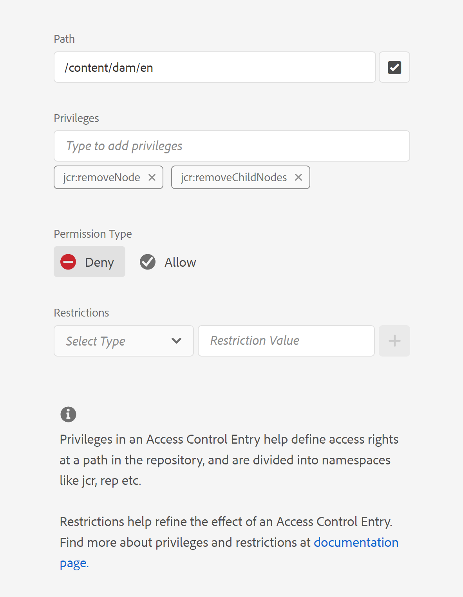
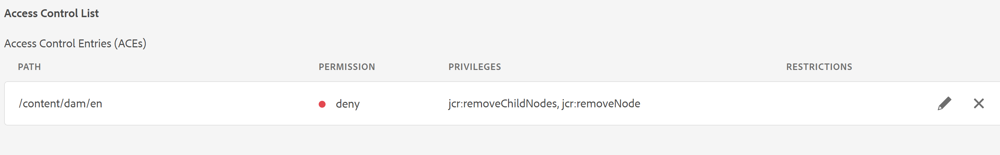

# Supprimer l’option &quot;Supprimer&quot; du menu contextuel du fichier dans l’éditeur de webeiter

Dans cet article, nous allons découvrir comment masquer l’option &quot;Supprimer&quot; du menu contextuel du fichier dans l’éditeur web AEM Guides pour des utilisateurs ou des groupes spécifiques. Pour d’autres personnalisations des options de menu contextuel du fichier, consultez la structure de l’extension Guides . Vous trouverez plus de détails [ici](https://github.com/adobe/guides-extension/tree/main).

Comme vous pouvez le voir sous l’extrait de code, le menu contextuel du fichier comporte l’option &quot;Supprimer&quot; disponible pour cet utilisateur spécifique.


Maintenant, voyons comment masquer l’option &quot;Supprimer&quot; pour cet utilisateur.

## Procédure de mise en oeuvre :

- Accédez à Outils > Sécurité > Autorisations dans AEM page d’accueil.
- Sélectionnez le groupe ou l’utilisateur dans la zone de recherche.
- Cliquez sur &quot;Ajouter ACE&quot; dans le coin supérieur droit.
- Sélectionnez le chemin du dossier.
- Incluez les privilèges &quot;jcr:removeChildNodes&quot; et &quot;jcr:removeNode&quot;.
- Sélectionnez &quot;Type d’autorisation&quot; comme &quot;refus&quot; et cliquez sur &quot;Ajouter&quot; comme illustré ci-dessous.





### Tests

- Connectez-vous à AEM en tant qu’utilisateur pour lequel les listes ACE ont été ajoutées.
- Ouvrez l’éditeur web.
- Accédez à la vue du référentiel et sélectionnez le dossier pour lequel les listes ACE ont été ajoutées.
- Ouvrez le menu contextuel du fichier.
- L’option &quot;Supprimer&quot; n’apparaît pas dans le menu contextuel.

Le menu contextuel du fichier se présente désormais comme suit :


```
Please note that these steps would also remove 'move' and 'rename' options from the Web Editor as they are also tied to delete process at the backend.
```
