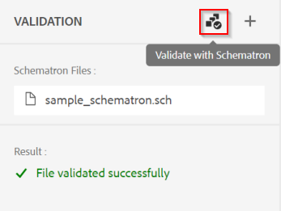

# Contrôle de la qualité du contenu dans l’éditeur web

Cet article donne un aperçu des possibilités de validation dans l’éditeur web des Guides d’AEM.
Par défaut, l’éditeur web de conception exploite la configuration du schéma DITA dans le système pour obliger les utilisateurs à créer du contenu compatible DITA. Ainsi, tout le contenu stocké dans le système est du contenu DITA structuré, réutilisable et valide.

Outre la prise en charge des règles DITA, l’éditeur web prend également en charge la validation du contenu basé sur &quot;*Schéma*&quot;.

&quot;*Schéma*&quot; fait référence à un langage de validation basé sur des règles utilisé pour définir des tests pour un fichier XML. Vous pouvez importer les fichiers de schéma et les modifier dans l’éditeur web. À l’aide d’un fichier &quot;Schéma&quot;, vous pouvez définir certaines règles, puis les valider pour une rubrique DITA ou un mappage. Les règles de schéma peuvent assurer la cohérence de la structure XML en imposant des restrictions définies comme règles. Ces restrictions sont motivées par les PME qui détiennent la qualité et la cohérence du contenu.

    REMARQUE : l’éditeur web prend en charge le schéma ISO.


## Fonctionnement de &quot;Schéma&quot; dans l’éditeur web

### Configuration des règles de schéma

Reportez-vous à la section &quot;Prise en charge des fichiers de schéma&quot; dans [Guide de l’utilisateur](https://helpx.adobe.com/content/dam/help/en/xml-documentation-solution/4-2/Adobe-Experience-Manager-Guides_UUID_User-Guide_EN.pdf#page=148)


### Application des règles de validation à l’enregistrement du fichier

Les paramètres de l’éditeur Web permettent aux utilisateurs expérimentés de configurer des règles/fichiers de schéma qui seront exécutés chaque fois qu’un utilisateur met à jour le contenu. Pour plus d’informations, reportez-vous à la section &quot;Validation&quot; dans [Guide de l’utilisateur](https://helpx.adobe.com/content/dam/help/en/xml-documentation-solution/4-2/Adobe-Experience-Manager-Guides_UUID_User-Guide_EN.pdf#page=58)


### Pouvez-vous exécuter la validation manuellement ?

Oui, en tant qu’auteur/utilisateur lors de la création de contenu, vous pouvez utiliser le panneau Schéma de l’éditeur de texte web pour charger un fichier de schéma et exécuter des validations sur le fichier ouvert dans l’éditeur.

    Pour que cela fonctionne, l’administrateur de profil de dossier doit permettre à tous les utilisateurs d’ajouter des fichiers de schéma dans le panneau Validation. Voir Paramètres de l’éditeur (capture d’écran ci-dessus)





### Règles prises en charge

La version actuelle des Guides d’AEM prend en charge la validation à l’aide de règles basées sur l’affirmation uniquement. (voir [ressource/rapport](https://schematron.com/document/205.html)) Les règles basées sur &quot;Rapports&quot; ne sont pas encore prises en charge.


### Exemples et plus d’aide sur les règles de schéma

#### Exemples de cas d’utilisation

- Vérifier si un lien est externe et s’il a une portée &quot;externe&quot;

  ```
  <sch:pattern>
      <sch:rule context="xref[contains(@href, 'http') or contains(@href, 'https')]">
          <sch:assert test="@scope = 'external' and @format = 'html'">
              All external xref links must be with scope='external' and format='html'
          </sch:assert>
      </sch:rule>
  </sch:pattern>
  ```

- Vérifiez s’il existe au moins un &quot;topicref&quot; sur une carte ou au moins un &quot;li&quot; sous un &quot;ul&quot;

  ```
  <sch:pattern>
      <sch:rule context="map">
          <sch:assert test="count(topicref) > 0">
              There should be atleast one topicref in map
          </sch:assert>
      </sch:rule>
  
      <sch:rule context="ul">
          <sch:assert test="count(li) > 1" >
              A list must have more than one item.
          </sch:assert>
      </sch:rule>
  </sch:pattern>
  ```

- L’élément &quot;indexterm&quot; doit toujours être présent dans un &quot;prolog&quot;.

  ```
  <sch:pattern>
      <sch:rule context="*[contains(@class, ' topic/indexterm ')]">
          <sch:assert test="ancestor::node()/local-name() = 'prolog'">
              The indexterm element should be in a prolog.
          </sch:assert>
      </sch:rule>
  </sch:pattern>
  ```

#### Ressources

- Compréhension  [Principes de base des schémas](https://da2022.xatapult.com/#what-is-schematron)
- En savoir plus sur [Règles d’assertion dans le schéma](https://www.xml.com/pub/a/2003/11/12/schematron.html#Assertions)
- [Exemple de fichier de schéma](../../../assets/authoring/sample_schematron.sch)
