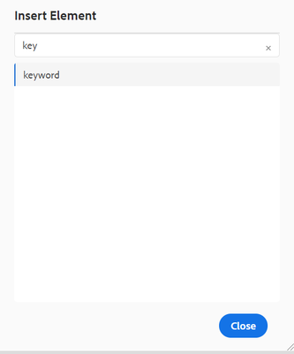

# Création de clés

Les entreprises doivent utiliser les clés lorsque du texte réutilisable et commun, comme le nom du produit ou la présentation du produit, est utilisé à de nombreux endroits, mais peut être modifié. L’utilisation de touches pour ce type de texte réutilisable vous permet de pousser une mise à jour à plusieurs endroits en effectuant la modification à un seul emplacement, comme dans la valeur de clé.

## Étape 1 : créer une carte globale pour stocker vos clés

Créez un mappage et ajoutez-y l’élément [!UICONTROL keyref].

```
<?xml version="1.0" encoding="UTF-8"?>
<!DOCTYPE map PUBLIC "-//OASIS//DTD DITA Map//EN" "technicalContent/dtd/map.dtd">
<mapid="map.ditamap_ffbdbf06-8658-4311-ad84-1c631bba904f">
  <title>global-keys-map</title>
  <keydefkeys="adobe">
    <topicmeta>
      <linktext>Adobe Systems</linktext>
    </topicmeta>
  </keydef>
  <keydefkeys="AEM">
    <topicmeta>
      <linktext>Adobe Experience Manager</linktext>
    </topicmeta>
  </keydef>
</map>
```

Ici, vous avez défini deux définitions, comme illustré ci-dessus, et fourni une [!UICONTROL keyref] en tant que _AEM_ pour le texte _Adobe Experience Manager_.

## Étape 2 : ajouter ce mappage à votre mappage de publication

```
<?xml version="1.0" encoding="UTF-8"?>
<!DOCTYPE map PUBLIC "-//OASIS//DTD DITA Map//EN" "technicalContent/dtd/map.dtd">
<mapid="map.ditamap_cbf4a96d-e382-4e8c-8830-bcc093fe6638">
  <title>sample-map</title>
  <topicrefhref="sample-topic-using-the-keys.dita"type="topic">
  </topicref>
  <maprefformat="ditamap"href="global-keys-map.ditamap"type="map">
  </mapref>
</map>
```

## Étape 3 : Utilisez les clés pour faire référence aux variables définies dans la carte de clés globale

+ Modifiez la rubrique et ajoutez la valeur de clé à l’aide de la [!UICONTROL keyref].
+ Comme le montre la capture d’écran, une petite fenêtre s’affiche à partir de laquelle vous pouvez choisir les mots-clés. Cela s’affiche lorsque vous ajoutez l’élément « mot-clé ».
  
  

```
<?xml version="1.0" encoding="UTF-8"?>
<!DOCTYPE topic PUBLIC "-//OASIS//DTD DITA Topic//EN" "technicalContent/dtd/topic.dtd">
<topicid="topic.dita_31b00e61-04b5-4193-af7a-68503e88b087">
  <title>sample-topic-using-the-keys</title>
  <shortdesc></shortdesc>
  <body>
    <p>This is a sample topic using the keys defined in the global map</p>
    <p>here i am using the key definition for AEM :<keyword keyref="AEM"></keyword></p>
  </body>
</topic>
```
