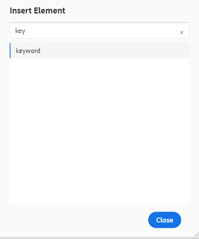

# Création de clés

Les entreprises doivent utiliser des clés dans les cas où elles disposent d’un texte réutilisable et commun, comme le nom du produit ou le pitch du produit, qui est utilisé à de nombreux endroits, mais qui est susceptible de changer. L’utilisation de clés pour ce texte réutilisable vous permet de pousser une mise à jour à plusieurs endroits en effectuant la modification à un seul emplacement, par exemple dans la valeur de clé.

## Étape 1 : créer une carte globale pour stocker vos clés

Créez une carte et ajoutez le [!UICONTROL keyref] à cet élément.

```
<?xml version="1.0" encoding="UTF-8"?>
<!DOCTYPE map PUBLIC "-//OASIS//DTD DITA Map//EN" "technicalContent/dtd/map.dtd">
<mapid="map.ditamap_ffbdbf06-8658-4311-ad84-1c631bba904f">
  <title>global-keys-map</title>
  <keydefkeys="adobe">
    <topicmeta>
      <linktext>Adobe Systems</linktext>
    </topicmeta>
  </keydef>
  <keydefkeys="AEM">
    <topicmeta>
      <linktext>Adobe Experience Manager</linktext>
    </topicmeta>
  </keydef>
</map>
```

Ici, vous avez défini deux définitions, comme illustré ci-dessus, qui vous ont fourni une [!UICONTROL keyref] as _AEM_ pour le _Adobe Experience Manager_ texte.

## Étape 2 : Ajouter ce mappage à votre plan de publication

```
<?xml version="1.0" encoding="UTF-8"?>
<!DOCTYPE map PUBLIC "-//OASIS//DTD DITA Map//EN" "technicalContent/dtd/map.dtd">
<mapid="map.ditamap_cbf4a96d-e382-4e8c-8830-bcc093fe6638">
  <title>sample-map</title>
  <topicrefhref="sample-topic-using-the-keys.dita"type="topic">
  </topicref>
  <maprefformat="ditamap"href="global-keys-map.ditamap"type="map">
  </mapref>
</map>
```

## Étape 3 : utilisation des clés pour faire référence aux variables définies dans la carte des clés globales

+ Modifiez la rubrique et ajoutez la valeur de clé à l’aide du [!UICONTROL keyref].
+ Comme illustré dans la capture d’écran, une petite fenêtre s’affiche à partir de laquelle vous pouvez choisir des mots-clés. Cela s’affiche lorsque vous ajoutez l’élément &quot;mot-clé&quot;.
  
  

```
<?xml version="1.0" encoding="UTF-8"?>
<!DOCTYPE topic PUBLIC "-//OASIS//DTD DITA Topic//EN" "technicalContent/dtd/topic.dtd">
<topicid="topic.dita_31b00e61-04b5-4193-af7a-68503e88b087">
  <title>sample-topic-using-the-keys</title>
  <shortdesc></shortdesc>
  <body>
    <p>This is a sample topic using the keys defined in the global map</p>
    <p>here i am using the key definition for AEM :<keywordkeyref="AEM"></keyword></p>
  </body>
</topic>
```
