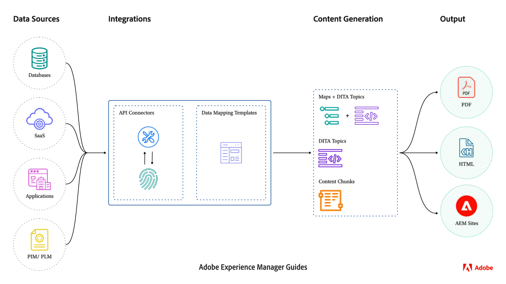

# Intégration des sources de données externes

Les données provenant de systèmes externes peuvent être facilement intégrées à votre instance Experience Manager Guides. La connexion à des sources de données externes peut améliorer considérablement les fonctionnalités et la convivialité de votre système de gestion de contenu.


Vous pouvez connecter et récupérer efficacement des données à partir de sources externes à l’aide de l’intégration de données. Avec cette fonctionnalité, vous n’avez pas besoin de l’équipe informatique pour obtenir les données, puis les copier manuellement et les coller ou mettre à jour constamment les modifications du système externe.

Cette fonctionnalité assure la synchronisation avec la source d’origine et permet des mises à jour harmonieuses de la documentation sans recourir à des opérations de copier-coller manuelles. Il permet également de maintenir la cohérence des données entre Experience Manager Guides et la source de données externe.

De plus, après avoir récupéré le contenu de sources de données externes, vous pouvez le créer au format DITA et réutiliser le contenu intégré.


## Structure de l’intégration des sources de données

La structure d’intégration d’une source de données englobe principalement deux composants principaux : les sources de données externes et leur intégration dans l’instance Experience Manager Guides.

### Sources de données externes

Certaines des sources de données que vous pouvez vous connecter à partir de Experience Manager Guides sont les suivantes :

- Bases de données relationnelles (SGBD)
   - PostgreSQL, MySQL, Microsoft SQL Server, MariaDB et SQLite
- Bases de données non relationnelles
   - MongoDB, Apache Cassandra, Apache CouchDB et Redis
- Gestion des informations sur les produits (PIM) / Gestion du cycle de vie des produits (PLM)
   - Pimcore, Salsify, Akeneo et Informatica
- Systèmes de gestion des produits
   - JIRA et forums Azure DevOps (ADO) de Microsoft
- Systèmes de traitement Analytics en ligne (OLAP) et Analytics

### Intégration à Experience Manager Guides


Grâce à un connecteur authentifié, les données sont transférées à partir d’un système externe et génèrent des données dans Experience Manager Guides.



### Intégration à Experience Manager Guides

Effectuez les étapes suivantes pour intégrer le contenu dans Experience Manager Guides :

1. **Configuration du connecteur de source de données**
   - Le connecteur de source de données sert d’interface pour établir la connectivité avec les sources de données externes. Vous devez configurer le connecteur pour établir la connexion et inclure les méthodes d’authentification, telles que `Basic Auth` ou `API key Auth`. Tous les détails de configuration, y compris les informations chiffrées, sont stockés en toute sécurité dans Adobe Experience Manager.
   - La couche de connecteur est conçue pour être extensible, ce qui vous permet de créer vos implémentations pour vous connecter à différents systèmes qui ne sont pas fournis prêts à l’emploi par Experience Manager Guides.
     
   >[!NOTE]
   >
   > Accédez au module de définition Connector et implémentez l’interface Connector pour créer un connecteur personnalisé. En savoir plus sur la [configuration des connecteurs de source de données personnalisés](./conf-custom-data-source-connector.md).

1. **Personnaliser les modèles Velocity**

   - Experience Manager Guides prend en charge Velocity (https://velocity.apache.org/), un moteur de création de modèles très robuste permettant de transformer les données des fichiers JSON en contenu DITA. Velocity offre la possibilité de parcourir les structures JSON à l’aide de n’importe quel niveau d’imbrication.
   - L’exemple suivant explique comment intégrer des modèles de vitesse et des données provenant de Jira pour générer facilement des tableaux ou des listes ordonnées.
      - Réponse Jira

        ```
        {
            "expand": "schema,names",
            "total": 5,
            "hostname": "https://jira.corp.adobe.com",
            "maxResults": "200",
            "issues": [
                {
                    "key": "DXML-12756",
                    "fields": {
                        "description": "Implement the snippet generator in External Data Source integration",
                        "summary": "Implement the snippet generator in External Data Source integration"
                    }
                },
                {
                    "key": "DXML-12755",
                    "fields": {
                        "description": "Implement the topic generator in External Data Source integration",
                        "summary": "Implement the topic generator in External Data Source integration"
                    }
                },
                {
                    "key": "DXML-12745",
                    "fields": {
                        "description": "Implement the ability to register a new connector",
                        "summary": "Implement the ability to register a new connector"
                    }
                }
            ],
            "startAt": 0
        }
        ```

      - Modèles
        {width="800" align="left"}
      - Données générées à partir d’une même source de données mais de modèles différents
        {width="800" align="left"}

1. **Générer du contenu à l’aide des modèles**
   - Vous pouvez générer le contenu à partir des modèles que vous avez créés.
   - Vous pouvez générer différents types de contenu :
      - Extrait de code : il s’agit d’un contenu utilisable une seule fois. Vous pouvez générer les données du connecteur dans le modèle défini, puis les incorporer dans la balise désirable.
      - Rubrique DITA : Générez différentes rubriques à utiliser en l’état dans le contenu ou pouvez être réutilisé en tant que *Composant réutilisable*.
      - Rubrique DITA + carte : vous pouvez également générer une carte complète avec la rubrique, puis utiliser les données pour la publication directement ou les utiliser comme *composant réutilisable* dans d’autres données.


1. **Publish the integrated content**
   - La publication est la fonctionnalité prête à l’emploi de Experience Manager Guides. Vous pouvez publier directement toutes les données générées à partir du système externe en tant que sortie PDF ou AEM site.

>[!MORELIKETHIS]
>
> Les documents suivants fournissent des informations supplémentaires sur la configuration des connecteurs et leur utilisation dans votre instance.
> - [Configurer un connecteur de source de données](../../../install-guide/conf-data-source-connector-tools.md)
> - [Générer du contenu à l’aide de fragments de code ou de rubriques](../../../user-guide/web-editor-content-snippet.md)