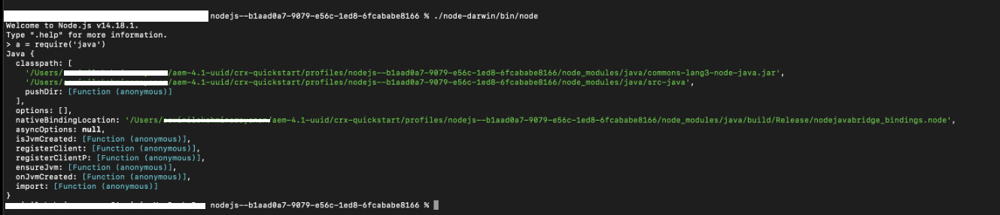

# Configuration de l’environnement AEM pour la publication de PDF natifs

AEM Guides comprend un moteur de publication de PDF natif qui permet aux utilisateurs de concevoir, développer et publier le contenu au format PDF.

Il permet de créer différentes mises en page, modèles CSS et de concevoir les modèles de PDF conjointement avec les mises en page et CSS.

Les étapes de configuration de cet PDF natif dans AEM Guides diffèrent selon le système d’exploitation. Suivez les étapes de configuration ci-dessous en fonction du système d’exploitation sur lequel AEM est installé.

## Conditions préalables

Configuration de l’PDF natif :

- Installation de Java Platform, Standard Edition 8 ou 11 JDK (Java SE Development Kit) et JRE (Java SE Runtime Environment)
- AEM 6.5 SP13, SP12, SP11 ou SP10
- Guides 4.1 et versions ultérieures (non UUID ou UUID)

Le moteur de publication de PDF natif a besoin d’un JDK d’Oracle pour générer les modules de noeud dans le dossier AEM crx-quickstart. Par défaut, il prend en charge les systèmes d’exploitation suivants :

- Windows 10, serveur Windows 2019 et versions ultérieures.
- Linux - (RHEL 8 et versions ultérieures, CentOS 7 et versions ultérieures, Ubuntu 18 et versions ultérieures)
- Système d’exploitation Mac (Intel)

## Étapes de configuration pour Windows Server (JAVA 11/8)

1. Vérifiez que le serveur AEM est hors service.
2. Dans la barre des tâches de Windows, cliquez avec le bouton droit de la souris sur l’icône Windows et sélectionnez Système.
3. Dans la fenêtre Paramètres, sous Paramètres associés, cliquez sur Paramètres système avancés.
4. Dans l’onglet Avancé, cliquez sur Variables d’environnement.
5. Dans la section des variables système, cliquez sur &quot;_New_&quot; pour créer une variable d’environnement.
6. Saisissez le nom de la variable JAVA_HOME.
7. Dans le champ value , indiquez le chemin d’installation Java et cliquez sur OK.

   Par exemple :

   JAVA 11 :

   C:\Program Files\JAVA\jdk-11.0.15.1

   JAVA 8 :

   C:\Program Files\JAVA\ jdk1.8.0_144

8. Ajoutez sélectionnez Chemin dans les variables système et cliquez sur Modifier.

9. Désormais, dans les variables Path , indiquez la valeur du chemin du serveur et cliquez sur OK.

   Par exemple :

   JAVA 11 :

   %JAVA_HOME%\bin\server\

   JAVA 8 :

   %JAVA_HOME%\jre\bin\server\

10. Cliquez à nouveau sur &quot;OK&quot; dans la boîte de dialogue Variables d’environnement .
11. Cliquez à nouveau sur &quot;OK&quot; dans la boîte de dialogue Propriétés du système.
12. Maintenant, démarrez le serveur AEM.
13. Générez un PDF natif à partir des paramètres prédéfinis dans l’éditeur web.

## Étapes de configuration pour le serveur Linux (RHEL7/centOS 7)

1. Vérifiez que le serveur AEM est hors service.
2. Vérifiez la variable JAVA_HOME en effectuant l’écho $JAVA_HOME
3. Si la variable JAVA_HOME n’est pas définie, suivez l’étape 4. Sinon, passez directement à l’étape 5.
4. Définissez la variable JAVA_HOME à l’aide des commandes ci-dessous en fonction de la version Java installée.

   Par exemple :

   JAVA 11 :

   1. export JAVA\_HOME=/usr/lib/jvm/java-11.0.15.1
   2. export PATH=$PATH : $JAVA\_HOME/bin
   3. export LD\_LIBRARY\_PATH=/usr/lib/jvm/jdk-11.0.15.1/lib/server:/usr/java/jdk-11.0.15.1/lib/server

   JAVA 8 :

   1. export JAVA\_HOME=/usr/lib/jvm/java-11.0.15.1
   2. export PATH=$PATH : $JAVA\_HOME/bin

5. Redémarrez AEM serveur et passez à l’étape 12, si vous utilisez les Guides version 4.2 et ultérieure.
6. Copiez le &quot;_node_modules.zip_&quot; joint au bas de cet article dans le répertoire crx-quickstart/profiles/nodejs—b1aad0a7-9079-e56c-1ed8-6fcababe8166/.
7. Ouvrez le terminal à l’emplacement crx-quickstart/profiles/nodejs—b1aad0a7-9079-e56c-1ed8-6fcababe8166/ .
8. Supprimez le répertoire node_modules en utilisant la commande ci-dessous

   **rm -rf node_modules**

9. Décompressez node_modules.zip à l’aide de la commande ci-dessous.

   **unzip node_modules.zip**

10. Si la commande unzip n’est pas installée/reconnue, elle peut être installée à l’aide de la commande suivante :

    **yum install unzip**

11. Installez le package fontconfig.
Commande : yum install fontconfig
12. Générez un PDF natif à partir des paramètres prédéfinis dans l’éditeur web.

**REMARQUE** : le package node_modules.zip peut être téléchargé [ici](https://acrobat.adobe.com/link/track?uri=urn:aaid:scds:US:295d8f03-41e1-429b-8465-2761ce3c2fb3).

L’importation manuelle des modules de noeud téléchargés pour le système d’exploitation Linux est une solution de contournement pour les utilisateurs qui utilisent les guides 4.1 ou les versions antérieures (Étape 6-12).

## Étapes de configuration de la machine Mac (JAVA 11/8)

1. Installez Oracle JAVA 11 ou Oracle JAVA 8.
2. Définissez la variable d’environnement JAVA_HOME sur le répertoire JAVA installé.
3. Ouvrez un shell Unix.
(Bash est utilisé ici pour configurer la configuration)

   Commande : nano ~/.bashrc

4. Définissez la variable JAVA_HOME à l’aide des commandes ci-dessous en fonction de la version Java installée.

   Par exemple :

   JAVA 11 :

   export JAVA\_HOME= /Library/Java/JavaVirtualMachines/jdk-11.0.15.1.jdk/Contents/Home

5. Rechargez bashrc

   Commande : source ~/.bashrc.

6. Vérifiez que JAVA_HOME est défini à l’aide de la commande echo $JAVA_HOME

7. Exécutez les trois commandes ci-dessous à partir du chemin d’installation AEM

   C:/{aem-installation-folder}/crx-quickstart/profiles/nodejs—b1aad0a7-9079-e56c-1ed8-6fcababe8166

   i) find . -type d -exec chmod 0755 {} \;
ii) find . -type f -exec chmod 0755 {} \;
iii) ./node-darwin/bin/node node-darwin/lib/node_modules/npm/bin/npm-cli.js —prefix . install —unsafe-perm —scripts-prepend-node-path

8. Vérifiez si Java est installé à l’aide de la commande ci-dessous

   i) Exécutez **./node-darwin/bin/node** à partir du dossier /crx-quickstart/profiles/nodejs—b1aad0a7-9079-e56c-1ed8-6fcababe8166

   

   ii) a = require(&#39;java&#39;)

9. Installez le package fontconfig.
Commande : apt install fontconfig

10. Générez un PDF natif à partir des paramètres prédéfinis dans l’éditeur web.

## Résolution des problèmes

Vous trouverez ci-dessous les erreurs courantes qui peuvent se produire pendant la génération du PDF lorsque les variables d’environnement ne sont pas correctement définies.

### Exception de pointeur nul sous Windows/Mac OS

Si le problème persiste même après la correction des paramètres de l’environnement Java, veuillez revalider les éléments suivants :

1. Vérifiez si le paramètre prédéfini de sortie est défini correctement ou créez un nouveau paramètre prédéfini de sortie sans espaces.

2. Vérifiez le répertoire des ressources de noeud dans /libs/fmdta/node_resources pour vous assurer que toutes les bibliothèques requises sont installées pendant l’installation.

### Bibliothèques manquantes dans RHEL 7 Linux OS

### Délai d’expiration du processus Publish. Le processus ne s’est pas terminé pendant une période donnée de 0 ms

Validez la valeur de la propriété timeout pour le noeud nodejs dans /var/dxml/profiles/b1aad0a7-9079-e56c-1ed8-6fcababe8166/nodejs dans le référentiel CRX. La valeur par défaut est 300.

Si vous rencontrez des problèmes lors de l’exécution de l’une des étapes ci-dessus, publiez votre question sur le [forum](https://experienceleaguecommunities.adobe.com/t5/experience-manager-guides/ct-p/aem-xml-documentation) de la communauté AEM Guides pour obtenir de l’aide.
