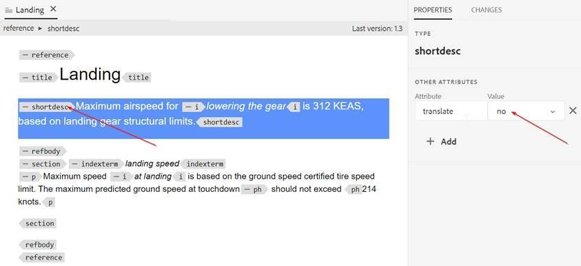

# Comment exclure des paragraphes d’une rubrique de la traduction

Le moyen le plus simple est d’utiliser l’attribut translation=no .

+ Les auteurs peuvent insérer l’attribut supplémentaire **translation=no** sur les paragraphes qu’ils ne souhaitent pas traduire. Le fournisseur de traduction doit être informé et il peut effectuer une configuration de son côté pour ignorer le texte avec cet attribut.
+ La traduction automatique prête à l’emploi (avec le connecteur de traduction Microsoft d’évaluation) présente le même comportement.
+ Tests avec traduction Microsoft : si vous définissez l’attribut **translate=no** au niveau du paragraphe, il ne traduit pas le paragraphe complet. Cet attribut peut être défini sur n’importe quel élément et le contenu à l’intérieur de cet élément ne sera pas traduit.

Voici quelques captures d’écran qui expliquent cela :

**Contenu Source**

**Contenu traduit en espagnol**

