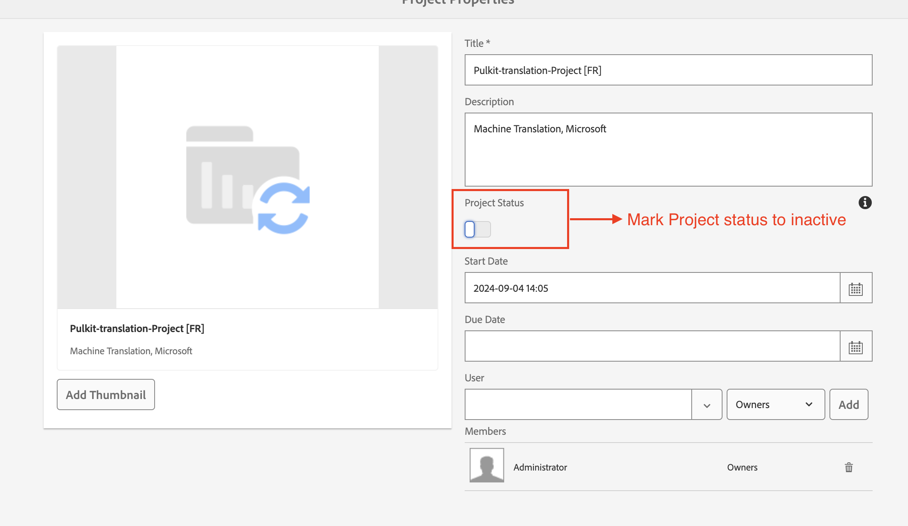

# Bonnes pratiques à suivre pour la traduction dans AEM Guides

Les performances de votre projet de traduction peuvent diminuer à mesure que l’activité de traduction sur le système augmente au fil du temps.

Chaque projet de traduction génère plusieurs groupes d’utilisateurs auxquels l’accès est autorisé, ce qui entraîne une augmentation du nombre de groupes d’utilisateurs dans le système. À mesure que le nombre de groupes d’utilisateurs augmente, il peut ralentir progressivement les opérations CRUD liées aux autorisations d’utilisateur, ce qui peut affecter les performances globales de l’AEM. En outre, si les projets de traduction restent actifs une fois la traduction terminée, cela peut avoir un impact négatif sur les performances de synchronisation de traduction entre AEM et le fournisseur de traduction.

**Suivre les bonnes pratiques décrites ci-dessous permettra de maintenir un environnement efficace.**

## Si vous utilisez un build antérieur à 4.6 (on-prem) ou 2404 (cloud) :

- Marquez tous les projets comme &quot;inactifs&quot; une fois la traduction terminée et approuvée. Le projet reste disponible pour révision et est simplement marqué comme inactif.
   - Suivez ces étapes pour maintenir les performances globales de traduction en bonne santé.
     

- Pour les dossiers de projets plus anciens, qui est marqué comme inactif, approuvé et révisé, doit être supprimé.
   - Suivez ces étapes pour maintenir les performances globales de traduction en bon état de fonctionnement en nettoyant les fichiers de traduction temporaires et les groupes d’utilisateurs associés à ce dossier de projet.
     

## Si vous utilisez , créez la version 4.6 ou 2404 ou ultérieure :

Vous pouvez continuer à suivre les mêmes étapes que celles mentionnées ci-dessus. À compter de la version 4.6/2404, AEM Guides introduit un paramètre d’éditeur permettant aux administrateurs de désactiver la suppression automatisée des projets de traduction.

Voir : [Supprimer ou désactiver automatiquement un projet de traduction terminé](https://experienceleague.adobe.com/en/docs/experience-manager-guides/using/user-guide/author-content/create-preview-topics/author-content-aem-guides/work-with-web-editor/translate-documents-web-editor#automatically-delete-or-disable-a-completed-translation-project)

