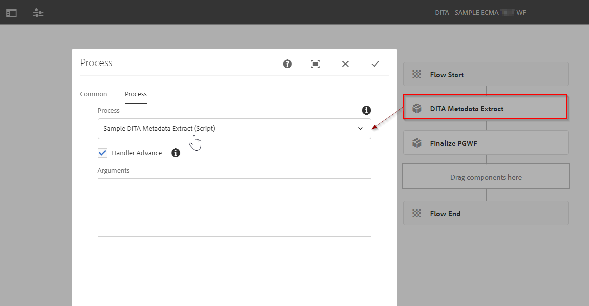
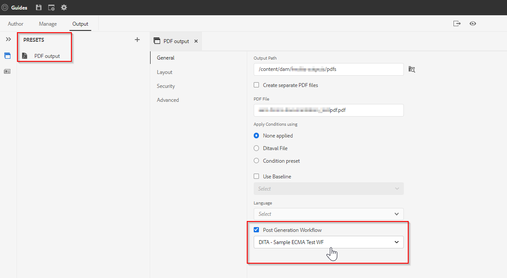

# Publication AEM Guides - Workflow de génération de publication

AEM Guides vous offre la possibilité de spécifier un workflow de génération de post-sortie. Vous pouvez effectuer certaines tâches de post-traitement sur la sortie générée à l’aide des AEM Guides.
Par exemple, vous pouvez définir certaines propriétés sur la sortie du PDF ou envoyer un email à un ensemble d’utilisateurs une fois la sortie générée.

## Quelles sont les étapes à suivre pour utiliser les workflows de génération de publication ?

### Création d’un processus de workflow

Créez un processus de workflow basé sur Java ou ECMA qui effectue l’opération sur la sortie générée. Par exemple, copier certaines métadonnées de la source vers le contenu généré ou manipuler les métadonnées de la sortie générée.

- Nous allons prendre un exemple de création d’un tel processus à l’aide du script ECMA (vous pouvez consulter le package joint).
- Pour le processus de workflow Java, reportez-vous à la section &quot;*Personnaliser le workflow de génération après la sortie*&quot; de [Guide d&#39;installation et de configuration](/help/product-guide/install-guide/customize-workflows.md#id17A6GI004Y4)

### Créer un modèle de processus

Avec le processus de workflow personnalisé que vous avez créé à l’étape précédente, créez un modèle de workflow et ajoutez-lui cette étape de processus.

- Vous devez également ajouter une étape de processus obligatoire &quot;*Finalisation de la génération de publication*&quot; comme dernière étape du workflow.

Reportez-vous à l’exemple de modèle de workflow illustré ci-dessous :

### Utiliser ce workflow de génération de publication sur une carte

Le workflow de génération de publication est une propriété qui peut être configurée sur n’importe quel paramètre prédéfini de sortie dans le mécanisme de publication AEM Guides. Exemple :

En supposant que le modèle sélectionné est déjà créé.

### Tests

Vous pouvez maintenant exécuter la publication à l’aide de ce paramètre prédéfini et valider la sortie de l’étape de processus.

## Échantillon

À titre de référence, vous pouvez utiliser le package ci-dessous et l’installer via le gestionnaire de packages pour tester l’exemple de workflow de post-génération (*comme indiqué dans les captures d’écran ci-dessus*)

[Exemple de modèle de workflow de post-génération basé sur ECMA](../assets/workflows/sample-pgwf-ecma-test-wfmetadata.zip)
