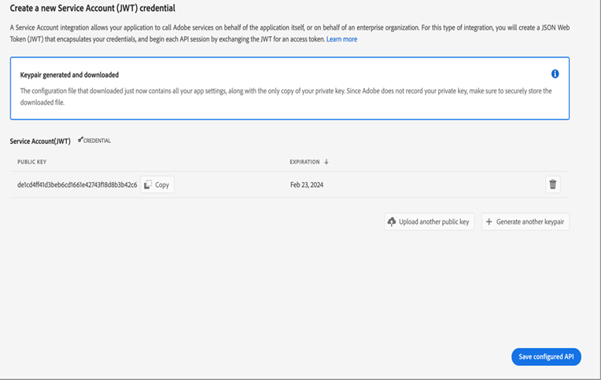

# Configuration de la publication sur microservice avec authentification JWT

[!BADGE Cloud Service]{type=Informative}

>[!NOTE]
>
> Les informations d’identification du compte de service (JWT), ont été rendues obsolètes au profit des informations d’identification OAuth serveur à serveur. Vos applications utilisant les informations d’identification du compte de service (JWT) cesseront de fonctionner après le 1er janvier 2025. Vous devez migrer vers les nouvelles informations d’identification d’ici le 1er janvier 2025, afin de vous assurer que votre application continue de fonctionner. En savoir plus sur la [migration des informations d’identification du compte de service (JWT) vers les informations d’identification OAuth Server-to-Server](https://developer.adobe.com/developer-console/docs/guides/authentication/ServerToServerAuthentication/migration/).


La publication basée sur les microservices dans pour Adobe Experience Manager Guides as a Cloud Service prend en charge les types de paramètres prédéfinis de sortie PDF (natifs et DITA-OT), HTML5, JSON et personnalisés.

Comme les informations d’identification du compte de service (JWT) ont été abandonnées, il est donc recommandé d’utiliser l’authentification basée sur OAuth d’Adobe IMS. Découvrez comment [configurer la publication basée sur un microservice avec l’authentification OAuth](configure-microservices-imt-config.md).

Pour le service de publication cloud sécurisé par l’authentification basée sur JWT Adobe IMS, les clients doivent suivre les étapes ci-dessous pour intégrer leurs environnements aux workflows d’authentification par jeton sécurisés d’Adobe et commencer à utiliser la nouvelle solution de publication évolutive basée sur le cloud.


## Création de configurations IMS dans Adobe Developer Console

**Rôle requis pour créer les configurations** : administrateur système

Effectuez les étapes suivantes pour créer des configurations IMS dans Adobe Developer Console :

1. Ouvrez Developer Console : `https://developer.adobe.com/console`.

1. Passez à l’onglet **Projets** depuis le haut.

   

1. Pour créer un projet vide, sélectionnez **Projet vide** dans la liste déroulante **Créer un projet** .

   

1. Sélectionnez **API** dans la liste déroulante **Ajouter au projet** pour ajouter l’API IO Management à votre projet.

   

   

1. Créez une nouvelle paire de clés privée/publique lors de l’ajout de l’API. La clé privée sera alors automatiquement téléchargée sur votre système.

   

1. Enregistrez l’API configurée.

   

1. Revenez à l’onglet **Projets** et cliquez sur **Aperçu du projet** à gauche.

   

1. Cliquez sur le bouton **Télécharger** en haut pour télécharger le service JSON.

   

Vous avez maintenant configuré les détails de l’authentification JWT et téléchargé également la clé privée et les détails du service JSON. Conservez ces deux fichiers à portée de main, car ces fichiers sont requis dans la section suivante.

### Ajout de la configuration IMS à l’environnement

Effectuez les étapes suivantes pour ajouter la configuration IMS à l’environnement :

1. Ouvrez le gestionnaire d’expériences, puis sélectionnez le programme contenant l’environnement que vous souhaitez configurer.
1. Passez à l’onglet **Environnements** .
1. Cliquez sur le nom de l’environnement que vous souhaitez configurer. Cela vous permet d’accéder à la page Informations sur l’environnement .
1. Passez à l’onglet **Configuration** .
1. Téléchargez la clé privée et le fichier JSON du projet, comme illustré dans la capture d’écran ci-dessous. Veillez à utiliser les mêmes noms et configuration que ceux présentés ci-dessous.

   

>[!NOTE]
>
> Vous devez ouvrir, copier et coller le contenu du fichier JSON des détails de clé privée et de service dans la colonne des valeurs du panneau Configuration, comme illustré dans la capture d’écran ci-dessus.

Une fois la configuration IMS ajoutée à l’environnement, procédez comme suit pour lier ces propriétés à Experience Manager Guides à l’aide d’OSGi :

1. Dans le code de votre projet Git Cloud Manager, ajoutez les deux fichiers ci-dessous (pour le contenu du fichier, voir [Annexe](#appendix)).

   * `com.adobe.aem.guides.eventing.ImsConfiguratorService.cfg.json`
   * `com.adobe.fmdita.publishworkflow.PublishWorkflowConfigurationService.xml`
1. Assurez-vous que les fichiers nouvellement ajoutés sont couverts par votre `filter.xml`.
1. Validez et poussez vos modifications Git.
1. Exécutez le pipeline pour appliquer les modifications à l’environnement.

Une fois cela fait, vous devriez pouvoir utiliser la nouvelle publication cloud basée sur un microservice.

## FAQ

1. Une seule clé peut-elle être utilisée dans plusieurs environnements cloud ?
   * Oui, vous pouvez générer une clé privée et l’utiliser pour tous les environnements, mais vous devez configurer des variables d’environnement pour tous les environnements et utiliser la même clé.
1. Si les configurations OSGi pour utiliser le microservice sont activées , le processus de publication fonctionnera-t-il sur le serveur d’AEM local avec la même base de code ?
   * Non, si l’indicateur `dxml.use.publish.microservice` est défini sur `true`, il recherche toujours des configurations de microservice. Définissez `dxml.use.publish.microservice` sur `false` pour que la publication fonctionne sur votre instance locale.
1. Quelle quantité de mémoire est allouée au processus DITA lors de l’utilisation de la publication basée sur un microservice ? Est-ce piloté par les paramètres de fourmi de profil DITA ?
   * Avec la publication basée sur un microservice, l’allocation de mémoire n’est pas pilotée par les paramètres de fourmi de profil DITA. La mémoire totale disponible sur le conteneur de services est de 8 Go, dont 6 Go sont affectés au processus DITA-OT.


## Annexe {#appendix}

**Fichier** :
`com.adobe.aem.guides.eventing.ImsConfiguratorService.cfg.json`

**Contenu** :

```
{
  "service.account.details": "$[secret:SERVICE_ACCOUNT_DETAILS]",
  "private.key": "$[secret:PRIVATE_KEY]"
}
```

**Fichier** : `com.adobe.fmdita.publishworkflow.PublishWorkflowConfigurationService.xml`

**Contenu** :
* `dxml.use.publish.microservice` : basculez pour activer la publication sur microservice à l’aide de DITA-OT
* `dxml.use.publish.microservice.native.pdf` : basculez pour activer la publication de PDF natifs en fonction du microservice.

```
<?xml version="1.0" encoding="UTF-8"?>
<jcr:root xmlns:jcr="http://www.jcp.org/jcr/1.0" xmlns:sling="http://sling.apache.org/jcr/sling/1.0"
          jcr:primaryType="sling:OsgiConfig"
          dxml.publish.microservice.url="https://adobeioruntime.net/api/v1/web/543112-guidespublisher/default/publishercaller.json"
          dxml.use.publish.microservice="{Boolean}true"
          dxml.use.publish.microservice.native.pdf="{Boolean}true"
/>
```
