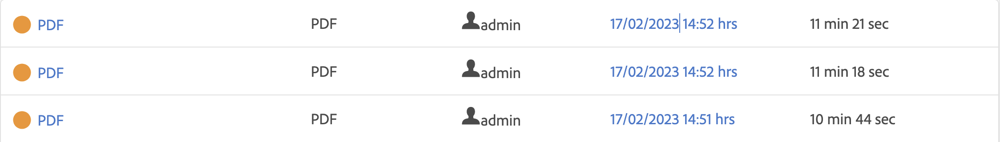

# Architecture du microservice de publication dans le cloud et analyse des performances

Cet article partage les informations sur l’architecture et les performances du nouveau microservice de publication cloud.

>[!NOTE]
>
> La publication basée sur les microservices dans AEM Guides prend en charge les types de paramètres prédéfinis de sortie PDF (natif et basé sur DITA-OT), AEM Site (à l’aide du mappage de composants composites), HTML5, JSON et CUSTOM.

## Problèmes liés aux workflows de publication existants sur le cloud

La publication DITA est un processus gourmand en ressources qui dépend principalement de la mémoire système disponible et de CPU. Le besoin de ces ressources augmente encore si les éditeurs publient des cartes volumineuses avec de nombreuses rubriques ou si plusieurs demandes de publication parallèles sont déclenchées.

Si vous n’utilisez pas le nouveau service, toutes les publications ont lieu sur le même pod Kubernetes(k8) qui exécute également le serveur cloud AEM. Un pod k8 type a une limite sur la quantité de mémoire et de CPU qu&#39;il peut utiliser. Si les utilisateurs d’AEM Guides publient des charges de travail volumineuses ou parallèles, cette limite peut rapidement être dépassée. K8 redémarre les capsules qui tentent d’utiliser plus de ressources que la limite configurée, ce qui peut avoir de graves répercussions sur l’instance cloud AEM elle-même.

Cette contrainte de ressources a été la principale motivation pour mettre en place un service dédié qui peut nous permettre d’exécuter plusieurs workloads de publication simultanées et volumineuses sur le cloud.

Pour en savoir plus sur la publication de workflows sur le cloud, consultez les [FAQ sur la publication de workflows et l’évolutivité](/help/product-guide/user-guide/publishing-scalability-faq.md).

## Présentation de la nouvelle architecture

Le service utilise des solutions cloud de pointe d’Adobe telles qu’App Builder, les événements IO et IMS pour créer une offre sans serveur. Ces services sont eux-mêmes basés sur les normes industrielles largement acceptées telles que Kubernetes et Docker.

Chaque requête au nouveau microservice de publication est exécutée dans un conteneur Docker isolé qui n’exécute qu’une seule requête de publication à la fois. Plusieurs nouveaux conteneurs sont automatiquement créés au cas où de nouvelles demandes de publication seraient reçues. Cette configuration de conteneur unique par demande permet au microservice de fournir les meilleures performances aux clients sans introduire de risques de sécurité. Ces conteneurs sont ignorés une fois la publication terminée, libérant ainsi toutes les ressources inutilisées.

Toutes ces communications sont sécurisées par Adobe IMS à l’aide de l’authentification et de l’autorisation basées sur JWT et sont exécutées via HTTPS.

>[!NOTE]
>
> Le processus de publication exécute certaines parties de la requête qui dépendent du contenu sur le serveur AEM lui-même, telles que la génération de la liste de dépendances. Toutefois, les parties les plus exhaustives du processus de publication, telles que l’exécution de DITA-OT ou d’un moteur natif, ont été déchargées vers le nouveau service.

## Analyse des performances

Cette section présente les numéros de performance du microservice. Il compare les performances du microservice avec celles de l’offre On-Prem d’AEM Guides, car l’ancienne architecture cloud rencontrait des problèmes de publication simultanée ou de publication de très grandes cartes.

Si vous publiez une carte volumineuse sur site, vous devrez peut-être ajuster les paramètres de tas Java, ou vous pouvez rencontrer des erreurs de mémoire insuffisante. Sur le cloud, le microservice est déjà profilé et possède un tas Java optimal ainsi que d’autres configurations prêtes à l’emploi.

### Exécution d’une publication sur le cloud ou sur site

* Cloud

  Si vous exécutez une publication unique sur le cloud à l’aide du nouveau service, la publication peut prendre un peu plus de temps par rapport à la publication unique sur site. Ce léger surcroît de temps est dû à la nature répartie de la nouvelle architecture cloud.

  

* On-prem

  Les résultats de la publication unique sont meilleurs sur l’ancienne architecture cloud ou sur site, car la publication complète a lieu sur le même pod/la même machine que celle sur laquelle s’exécute AEM.

  

### Exécution de plusieurs publications sur le cloud ou sur site

* Cloud

  Un nouveau microservice de publication brille dans ce scénario. Comme vous pouvez le voir dans l’image ci-dessous, avec l’augmentation du nombre de tâches de publication simultanées, cloud est en mesure de les publier sans augmentation significative du temps de publication.

  

* On-prem

  L’exécution de la publication simultanée sur un serveur On-Prem entraîne une grave dégradation des performances. Cette baisse de performances est plus importante si les éditeurs publient encore plus de cartes simultanément.

  

## Autres avantages

Une partie de chaque requête de publication doit s’exécuter sur l’instance AEM pour récupérer le contenu de publication correct à envoyer au microservice. La nouvelle architecture cloud utilise les traitements AEM à la place des workflows AEM, comme c&#39;était le cas dans l&#39;ancienne architecture. Cette modification permet aux administrateurs AEM Guides de configurer individuellement les paramètres de la file d’attente de publication dans le cloud sans affecter les autres tâches AEM ou configurations de workflow.

Vous trouverez des détails sur la configuration du nouveau microservice de publication ici : [Configurer le microservice](configure-microservices.md)
