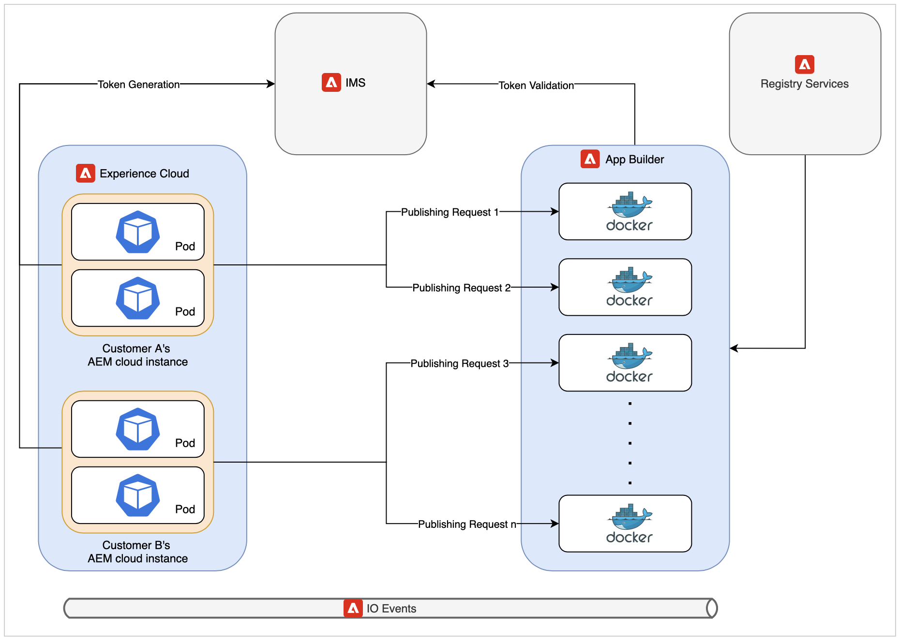
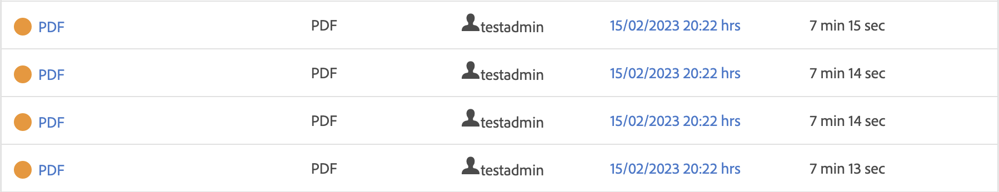

# Architecture du microservice de publication dans le cloud et analyse des performances

Cet article partage les informations sur l’architecture et les performances du nouveau microservice de publication dans le cloud.

>[!NOTE]
>
> La publication basée sur les microservices dans AEM Guides prend en charge les types de paramètres prédéfinis de sortie PDF (natifs et basés sur DITA-OT), HTML5, JSON et PERSONNALISÉS.

## Problèmes liés aux workflows de publication existants sur le cloud

La publication DITA est un processus gourmand en ressources qui dépend principalement de la mémoire système et du processeur disponibles. La nécessité de ces ressources augmente davantage si les éditeurs publient des cartes volumineuses avec de nombreuses rubriques ou si plusieurs demandes de publication parallèles sont déclenchées.

Si vous n’utilisez pas le nouveau service, toutes les publications se produisent sur la même capsule Kubernetes(k8) qui exécute également le serveur cloud d’AEM. Une capsule k8 standard est limitée à la quantité de mémoire et au processeur qu’elle peut utiliser. Si les utilisateurs d’AEM Guides publient des charges de travail volumineuses ou parallèles, cette limite peut rapidement dépasser les limites. K8 redémarre les capsules qui tentent d’utiliser plus de ressources que la limite configurée, ce qui peut avoir un impact important sur l’instance de cloud AEM elle-même.

Cette contrainte de ressources était la principale motivation pour proposer un service dédié qui peut nous permettre d’exécuter plusieurs charges de travail de publication simultanées et volumineuses sur le cloud.

## Présentation de la nouvelle architecture

Le service utilise les solutions cloud de pointe d’Adobe telles que App Builder, IO Eventing, IMS pour créer une offre sans serveur. Ces services sont eux-mêmes basés sur les standards largement acceptés de l&#39;industrie comme Kubernetes et Docker.

Chaque requête au nouveau microservice de publication est exécutée dans un conteneur Docker isolé qui exécute une seule requête de publication à la fois. Plusieurs nouveaux conteneurs sont automatiquement créés en cas de nouvelle demande de publication. Cette configuration de conteneur unique par requête permet au microservice de fournir les meilleures performances aux clients sans introduire de risques de sécurité. Ces conteneurs sont ignorés une fois la publication terminée, libérant ainsi toutes les ressources inutilisées.

Toutes ces communications sont sécurisées par Adobe IMS à l’aide de l’authentification et de l’autorisation JWT et exécutées via HTTPS.

>[!NOTE]
>
> Le processus de publication exécute certaines parties dépendantes du contenu de la requête sur le serveur AEM lui-même, comme la génération de la liste de dépendances. Toutefois, les parties les plus complètes du processus de publication, telles que l’exécution de DITA-OT ou le moteur natif, ont été déchargées vers le nouveau service.

## Analyse des performances

Cette section présente les numéros de performances du microservice. Il compare les performances du microservice avec l’offre sur site d’AEM Guides, car l’ancienne architecture cloud présentait des problèmes lors de la publication simultanée ou de la publication de cartes très volumineuses.

Si vous publiez une carte volumineuse sur le site, vous devrez peut-être ajuster les paramètres du tas Java, sinon vous pourrez rencontrer des erreurs de mémoire insuffisante. Sur le cloud, le microservice est déjà profilé et dispose d’un tas Java optimal et d’autres configurations prêtes à l’emploi.

### Exécution d’une publication sur le cloud par rapport à sur-site

* Cloud

  Si vous exécutez une publication unique sur le cloud à l’aide du nouveau service, la publication peut prendre un peu plus de temps par rapport à la publication unique sur site. Ce léger temps élevé est dû à la nature répartie de la nouvelle architecture cloud.

  

* On-prem

  Les résultats de la publication unique sont meilleurs sur l’ancienne architecture cloud ou sur site, car la publication complète s’effectue sur le même module/ordinateur sur lequel AEM est exécuté.

  

### Exécution de plusieurs publications sur le cloud et sur le site web

* Cloud

  Le nouveau microservice de publication apparaît dans ce scénario. Comme vous pouvez le voir sur l’image ci-dessous, avec l’augmentation des plusieurs tâches de publication simultanées, le cloud peut les publier sans augmentation significative du temps de publication.

  

* On-prem

  L’exécution simultanée de la publication sur un serveur on-premise entraîne une grave dégradation des performances. Cette baisse des performances est plus grave si les éditeurs publient encore plus de cartes simultanément.

  

## Avantages supplémentaires

Une partie de chaque requête de publication doit s’exécuter sur l’instance AEM pour récupérer le contenu de publication correct à envoyer au microservice. La nouvelle architecture cloud utilise AEM tâches au lieu de processus AEM, comme c’était le cas dans l’ancienne architecture. Cette modification permet aux administrateurs d’AEM Guides de configurer individuellement les paramètres de la file d’attente de publication dans le cloud sans affecter d’autres tâches AEM ou configurations de workflow.

Vous trouverez des informations détaillées sur la configuration du nouveau microservice de publication ici : [Configuration de Microservice](configure-microservices.md)
