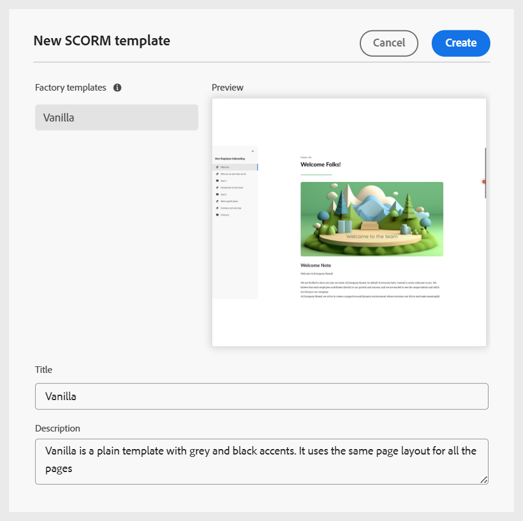

# Configuration des profils de dossier

Un profil de dossiers est nécessaire pour séparer les configurations pour différents services ou produits de votre entreprise. Pour le contenu de formation et d’apprentissage, vous pouvez créer et configurer un profil au niveau du dossier pour gérer la création de modèles, de modèles de sortie, de paramètres prédéfinis de sortie et d’autres paramètres au niveau du dossier.

Pour commencer à utiliser la configuration de profil de dossiers pour le contenu de formation, vous devez :

1. [Créer un profil de dossier](../cs-install-guide/conf-folder-level.md#create-and-configure-a-folder-level-profile).
2. **Sélectionner le profil de dossier à configurer** : une fois le profil de dossier créé, vous devez sélectionner le profil de dossier sur la page [Préférences utilisateur](../user-guide/intro-home-page.md#user-preferences) pour vous assurer que les auteurs et les éditeurs ont accès aux modèles appropriés.

   {width="650" align="left"}

3. **Configurer les paramètres de profil de dossier** : pour le contenu d’apprentissage et de formation, les paramètres suivants peuvent être configurés au niveau d’un dossier :
   - [Panneaux](#configure-panels)
   - [Modèles](#configure-templates)
   - [Paramètres prédéfinis de sortie](#configure-output-presets)
   - [éditeur HTML](#html-editor-settings)
   - [Publication de profils](#manage-publish-profiles)

Pour accéder à ces paramètres, basculez vers la vue Éditeur et sélectionnez **Paramètres** dans le menu **Options** comme illustré ci-dessous :

## Configuration des panneaux

Ce paramètre contrôle les panneaux qui s’affichent dans les panneaux de gauche et de droite de la **Éditeur** et de la **Console Carte** dans Experience Manager Guides. Vous pouvez activer/désactiver le bouton pour afficher ou masquer le panneau souhaité.

Pour le contenu de formation théorique et pratique, assurez-vous que seules les fonctionnalités suivantes sont activées pour l’éditeur et la console de mappage.

{width="350" align="left"}

### Éditeur

**Panneau de gauche**

- **Collections** : permet d’organiser et d’enregistrer les fichiers fréquemment utilisés ou d’accéder rapidement aux fichiers partagés.
- **Référentiel** : permet d’afficher toutes vos cartes, rubriques, images et autres ressources stockées dans le référentiel de contenu, et d’y accéder.
- **Responsable de cours** : fournit un espace de travail dédié à la création et à la gestion des cours.
- **Fragments de code** : permet de créer et de réutiliser de petits fragments de contenu dans divers sujets de vos cours.
- **Conditions** : permet de configurer des attributs conditionnels au niveau global et du dossier.
- **Variables** : permet de créer et de gérer des variables à utiliser dans votre contenu de formation.
- **Variables de langue** : permet de définir des chaînes localisées pour la sortie publiée ou du texte statique dans les modèles.
- **Modèles** : permet de créer et de gérer des modèles à l’intention des auteurs.
- **Modèles de sortie** : permet de créer et de gérer des modèles de sortie pour générer une sortie dans différents formats.
- **Rechercher et remplacer** : propose des options permettant de rechercher et de remplacer du texte dans les fichiers d’un mappage ou d’un dossier du référentiel. 

**Panneau droit**

- **Propriétés du contenu** : contient des informations sur le type et les attributs de l’élément actuellement sélectionné dans l’éditeur.
- **Propriétés du fichier** : permet d’afficher et de gérer les propriétés du fichier sélectionné.
- **Styles** : affichez les options de style globales basées sur les classes à utiliser dans votre contenu d’apprentissage.
- **Filtres** : permet de filtrer le contenu en fonction des conditions appliquées dans le mode Prévisualisation d’une rubrique.

### Console Carte

**Panneau de gauche**

- **Paramètres prédéfinis** : permet de configurer des paramètres prédéfinis de sortie pour publier le cours de formation.
- **Traduction** : propose des options pour traduire votre contenu dans plusieurs langues.
- **Rapports** : permet de générer et de gérer des rapports afin d’obtenir une insight utile dans l’intégrité globale du contenu de votre cours.
- **Paramètres prédéfinis de condition** : fournit des options pour configurer des paramètres prédéfinis de sortie basés sur des conditions pour différentes audiences, différents services, etc.

**Panneau droit**

- **Filtres** : permet d’utiliser des filtres lors de l’utilisation de rapports et de la traduction.

## Configurer les modèles

Ce paramètre vous permet de gérer les modèles de création et de publication présents dans le panneau [Gauche) de l’éditeur](../user-guide/web-editor-left-panel.md). Vous pouvez ajouter, supprimer ou réorganiser des modèles de création et de sortie, qui seront ensuite accessibles aux auteurs et aux éditeurs.

{width="350" align="left"}

Les modèles de création sont disponibles dans quatre catégories : cours d’apprentissage, contenu d’apprentissage, quiz et banque de questions. Si des modèles prédéfinis sont configurés dans votre instance, ils s’affichent par défaut.

{width="350" align="left"}

### Ajouter des modèles

Pour ajouter un nouveau modèle, procédez comme suit :

1. Accédez à la catégorie de modèles dans laquelle vous souhaitez ajouter un modèle et sélectionnez **Ajouter**.
2. Dans la boîte de dialogue Sélectionner le chemin d’accès, sélectionnez le modèle souhaité.
3. Choisissez **Sélectionner**.

   {width="350" align="left"}

Le modèle est ajouté dans la catégorie correspondante dans le panneau Paramètres .

De même, vous pouvez ajouter les autres modèles Création et Sortie . Une fois ajoutés, ces modèles sont mis à la disposition des auteurs et des éditeurs dans leurs boîtes de dialogue de cours respectives. Par exemple, le modèle de cours d’apprentissage ajouté par l’administrateur sera disponible pour les auteurs lorsqu’ils créeront un nouveau cours.

{width="350" align="left"}

### Utiliser de nouveaux modèles de création et de sortie

Pour utiliser un modèle différent de ceux affichés dans la boîte de dialogue **Sélectionner le chemin d’accès**, créez un modèle de création ou de sortie personnalisé.

**Création de modèles**

Pour utiliser un autre mappage ou modèle de rubrique, créez un modèle de création à partir du panneau Modèles dans l’éditeur. Utilisez des modèles de carte pour créer des cours d’apprentissage et des modèles de sujet pour le contenu d’apprentissage, le quiz ou le résumé d’apprentissage.

Pour plus d’informations, consultez la section [Créer des modèles personnalisés à partir de l’éditeur](../user-guide/create-maps-customized-templates.md).

{width="350" align="left"}

**Créer des modèles de sortie**

Pour créer un modèle de sortie pour le contenu d’apprentissage et de formation, procédez comme suit :

1. Dans le panneau de gauche de l’éditeur, sélectionnez **Plus** > **Modèles de sortie**.

   Le panneau Modèles de sortie s’affiche.

   {width="350" height="" align="left"}
2. Dans le panneau Modèles de sortie , sélectionnez (+) pour créer un modèle de sortie.

   {width="350" align="left"}
3. Sélectionnez un modèle de sortie dans le menu déroulant.

   {width="650" align="left"}
4. En fonction du type de modèle de sortie sélectionné, une boîte de dialogue s’affiche dans laquelle vous pouvez créer un modèle basé sur les modèles disponibles.

   {width="350" align="left"}

5. Sélectionnez **Créer**.

   Un nouveau modèle de sortie est créé.

6. Pour accéder au modèle de sortie pour les éditeurs et l’ajouter, accédez à **Paramètres** > **Modèles** > **Modèles de sortie** et sélectionnez **Ajouter**.

   {width="350" align="left"}

   Le modèle de sortie s’affiche dans la boîte de dialogue Sélectionner le chemin d’accès .
7. Sélectionnez le modèle et choisissez **Confirmer**.

   {width="350" align="left"}

   Le modèle de sortie sélectionné est maintenant ajouté au panneau Paramètres.

   {width="350" align="left"}

### Supprimer ou réorganiser des modèles

Une fois ajoutés, vous pouvez supprimer ou réorganiser les modèles du panneau Paramètres.

Pour supprimer un modèle, sélectionnez l’icône **Supprimer** située en regard de celui-ci.

{width="350" align="left"}

Vous pouvez également définir l’ordre d’affichage des modèles présents dans une catégorie. Pour modifier l’ordre d’affichage des modèles, sélectionnez les barres en pointillés et faites glisser un modèle à l’emplacement souhaité.

{width="350" align="left"}

## Configuration des paramètres prédéfinis de sortie

L’onglet Paramètres prédéfinis de sortie vous permet de définir les formats de sortie disponibles pour publier un cours. Il contient deux sections : **Types de paramètres prédéfinis de sortie autorisés** et **Paramètres prédéfinis de sortie courants**.

{width="350" align="left"}

- **Types de paramètres prédéfinis de sortie autorisés** : cette section répertorie tous les paramètres prédéfinis de sortie pris en charge dans l’instance Experience Manager Guides. Pour la publication de cours, seuls les formats **SCORM** et **PDF** sont applicables. Vous pouvez sélectionner une ou les deux options. Les paramètres prédéfinis sélectionnés seront disponibles pour les éditeurs lors de la génération de la sortie du cours.

  {width="350" align="left"}

- **Paramètres prédéfinis de sortie courants** : cette section affiche les paramètres prédéfinis de sortie généralement créés et ajoutés par les éditeurs à un profil de dossier spécifique. Vous pouvez également supprimer tout paramètre prédéfini qui n’est plus nécessaire.

  {width="350" align="left"}

## Paramètres de l’éditeur HTML

Ce paramètre vous permet de configurer l’éditeur pour la création basée sur HTML. Les principales options de configuration de ce paramètre sont les suivantes :

{width="350" align="left"}

- **Masquer le style intégré** : activez cette option pour empêcher les auteurs d’appliquer un formatage en ligne au contenu du cours. Lorsqu’elles sont activées, toutes les options de style intégrées telles que Polices, Bordure, Disposition, Arrière-plan et Colonnes présentes dans le panneau de droite de l’éditeur restent masquées pour les auteurs. Cependant, les créateurs peuvent toujours utiliser les options de style globales basées sur les classes disponibles dans le panneau **Styles**. Cela permet de maintenir la cohérence avec les directives de style de votre organisation.
- **Masquer la vue Source pour les auteurs** : activez cette option pour restreindre l’accès au code source HTML. Cela s’avère utile si vous souhaitez simplifier l’expérience de modification ou éviter des modifications accidentelles du code sous-jacent.

## Gestion des profils de publication

Cette section vous permet d’afficher, de créer et de gérer des profils de publication utilisés pour publier des cours sur SCORM Cloud. Chaque profil définit les paramètres de connexion et les détails de configuration requis pour publier un cours de formation dans un environnement SCORM Cloud spécifique.

Vous pouvez créer plusieurs profils si vous devez publier sur différents comptes SCORM Cloud, ce qui vous offre flexibilité et contrôle sur votre processus de publication.

Fournissez les détails du serveur ainsi que l’ID client et le secret client de l’application cloud SCORM associée pour configurer le profil de publication pour SCORM cloud.

{width="350" align="left"}