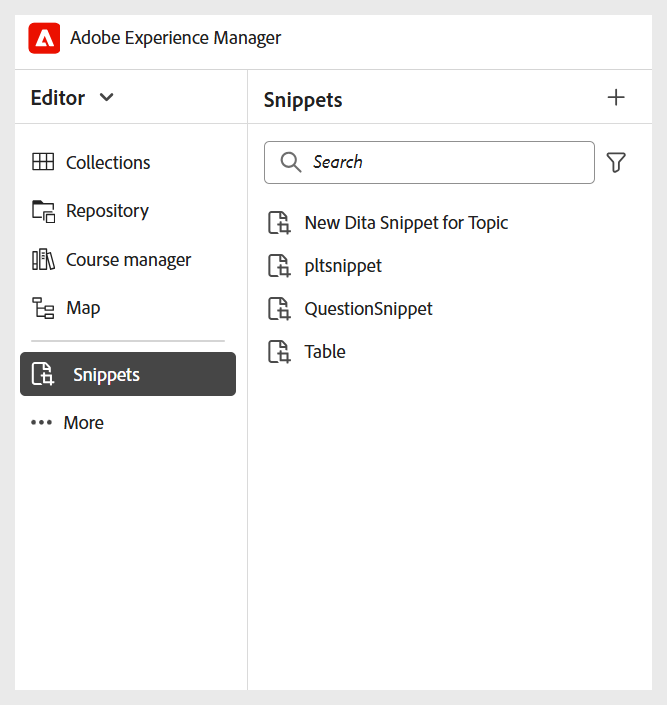

# Configurer d’autres paramètres

En tant qu’administrateur, vous pouvez également configurer les paramètres suivants pour les auteurs et éditeurs des cours de formation :

- **Fragments de code** : vous pouvez configurer les fragments de code au niveau du dossier pour vous assurer que les auteurs ont accès aux fragments de code appropriés. Seuls les administrateurs peuvent créer des fragments de code dans Experience Manager Guides, qui peuvent ensuite être utilisés par les auteurs dans l’éditeur.

  Vous pouvez accéder à Fragments de code à partir du panneau de gauche dans l’éditeur.

  {width="350"}
- **Conditions** : en tant qu&#39;administrateur, vous pouvez configurer des attributs conditionnels standard pris en charge par DITA au niveau global ou au niveau du dossier. Les auteurs utilisent ensuite les conditions configurées en faisant simplement glisser et en déposant la condition souhaitée sur leur contenu.

  Vous pouvez accéder aux Conditions dans le panneau de gauche de l’éditeur.

  {width="350"}
- **Variables** : vous pouvez définir des variables pour rendre votre contenu plus portable, cohérent et facile à mettre à jour. Lors de la génération de la sortie, les variables sont remplacées par les valeurs de l’ensemble de variables sélectionné, ce qui vous permet de produire efficacement des sorties personnalisées.

  Pour plus d’informations, consultez la section [Créer une variable](../native-pdf/native-pdf-variables.md#create-a-new-variable)

- **Barre d’outils de l’éditeur** : vous pouvez personnaliser la barre d’outils de l’éditeur en fonction des besoins de votre organisation. Par exemple, vous pouvez préférer modifier le nom d’un bouton de barre d’outils, changer son emplacement, etc.

  Pour plus d’informations, consultez [Configuration et personnalisation de l’éditeur XML](../cs-install-guide/conf-folder-level.md#configure-and-customize-the-xml-editor-id2065g300o5z).
