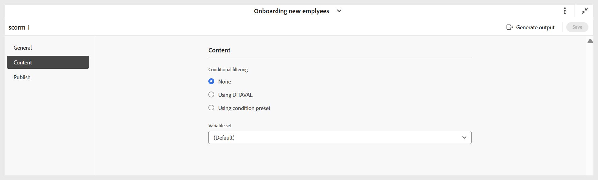

# Configuration du paramètre prédéfini de sortie SCORM

Une fois le paramètre prédéfini créé, configurez-le. Les options de configuration des paramètres prédéfinis sont organisées sous les onglets Général, Contenu et Publication .

- **Général :** utilisé pour spécifier des paramètres de sortie de base, tels que la version prise en charge, le chemin de sortie, le nom de fichier ZIP, le modèle de sortie et d’autres options liées à l’expérience de l’élève.

  {width="650" align="left"}

  **Expérience de l’élève**

   - **Les élèves doivent progresser dans le contenu dans un ordre séquentiel** : garantit que les élèves passent par le quiz dans une séquence fixe et ne peuvent pas sauter d’une question à l’autre.
   - **Les élèves doivent répondre à chaque question pour continuer** : nécessite que les élèves répondent à toutes les questions avant de pouvoir envoyer le quiz, ce qui empêche les envois incomplets.
   - **Ordre aléatoire des questions pour chaque tentative** : affiche les questions du quiz dans un ordre différent pour chaque tentative, ce qui contribue à réduire la prévisibilité.
   - **Randomiser les choix de réponses pour chaque tentative** : mélange les options de réponse pour chaque question à chaque tentative, ce qui réduit les risques de suppositions en fonction de la position.
   - **Utiliser l’ID de question dans les rapports de quiz** : inclut l’ID de question unique dans les rapports de quiz, ce qui facilite le suivi, l’analyse et le mappage des résultats à des questions spécifiques.
   - **Workflow de post-génération** : lorsque vous sélectionnez cette option, une nouvelle liste déroulante Workflow de post-génération contenant tous les workflows configurés s’affiche.

- **Contenu :** permet de spécifier le filtrage conditionnel disponible (à l’aide de DITAVAL ou d’un paramètre prédéfini de condition) et le jeu de variables.

  {width="650" align="left"}

- **Publier :** utilisez ce paramètre uniquement si vous souhaitez publier la sortie dans SCORM Cloud pour un accès direct.

  {width="650" align="left"}

Une fois toutes les modifications configurées, enregistrez-les pour le paramètre prédéfini SCORM à l’aide de l’option **Enregistrer** dans le coin droit de la barre d’outils de la page du paramètre prédéfini SCORM.
