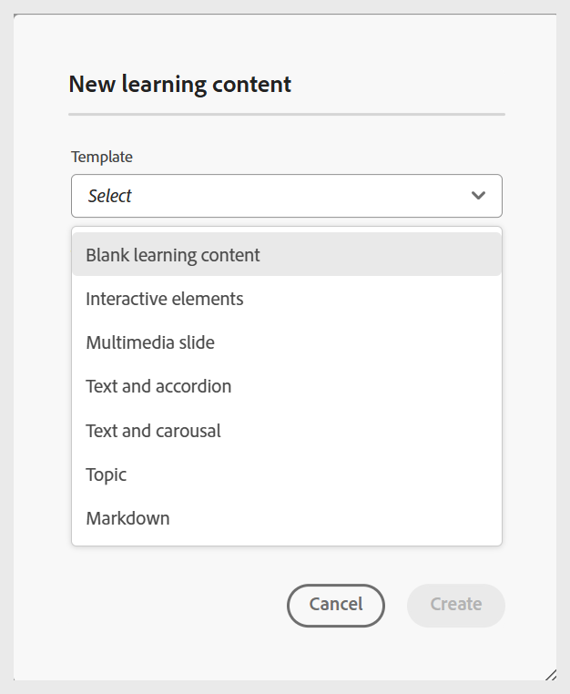

# Créer une rubrique

Avant d’aborder le processus étape par étape, nous vous proposons d’accéder à un aperçu vidéo rapide pour vous aider à visualiser comment créer un sujet d’apprentissage.

>[!VIDEO](https://video.tv.adobe.com/v/3475211/learning-content-aem-guides)

**Étapes pour ajouter une rubrique à un cours**

Pour ajouter une rubrique à un cours, procédez comme suit :

1. Ouvrez un cours dans le **Gestionnaire de cours** et sélectionnez **Ajouter** dans le menu **Options**.

   {width="650"}

1. Sélectionnez **Sujet**.

   La boîte de dialogue **Nouvelle rubrique d’apprentissage** s’affiche.

   {width="350"}

1. Sélectionnez le modèle souhaité dans le menu déroulant.

   {width="350"}

1. Fournissez un titre approprié pour la rubrique.
1. Sélectionnez **Créer**.

Une nouvelle rubrique d’apprentissage est créée dans le cours et s’affiche dans le panneau du responsable du cours.

>[!NOTE]
>
> Une fois que vous avez créé une nouvelle rubrique d’apprentissage, la version 1.0 lui est automatiquement attribuée.
