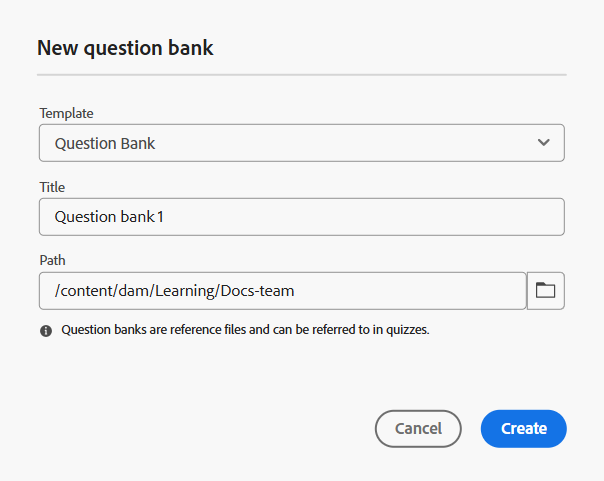

# Créer une banque de questions

Vous pouvez simplifier le processus de création de quiz en insérant des questions directement depuis une banque de questions. Cette fonctionnalité vous permet de réutiliser des questions existantes, de maintenir la cohérence entre les évaluations et de gagner du temps lors de la création du quiz.
Pour rationaliser la création et la réutilisation des quiz, vous pouvez créer une banque de questions personnalisée et adaptée à vos besoins.

Avant d’aborder le processus étape par étape, voici une courte vidéo qui explique comment créer une banque de questions et l’utiliser dans le cadre d’un quiz.

>[!VIDEO](https://video.tv.adobe.com/v/3475212/learning-content-aem-guides)

Pour créer une banque de questions, procédez comme suit :

1. Ouvrez un cours dans le **Gestionnaire de cours** et sélectionnez **Ajouter** dans le menu **Options**.
1. Sélectionnez **Banque de questions**.
La boîte de dialogue **Nouvelle banque de questions** s’ouvre. Vous pouvez sélectionner le modèle dans la liste déroulante, spécifier un titre approprié pour la banque de questions et indiquer le chemin d’accès où vous souhaitez que cette banque de questions soit stockée dans votre référentiel.

   {width="350" align="left"}

1. Sélectionnez **Créer**.
Une banque de questions est ajoutée dans le cadre du cours et s’affiche dans le panneau du gestionnaire de cours.
1. Vous pouvez ajouter des questions à la banque de questions de la même manière que pour un quiz, tout en ayant la possibilité de configurer les propriétés de chaque question pendant le processus. Pour plus d’informations, voir [Insérer des questions dans un quiz](./quiz-insert-questions.md).
