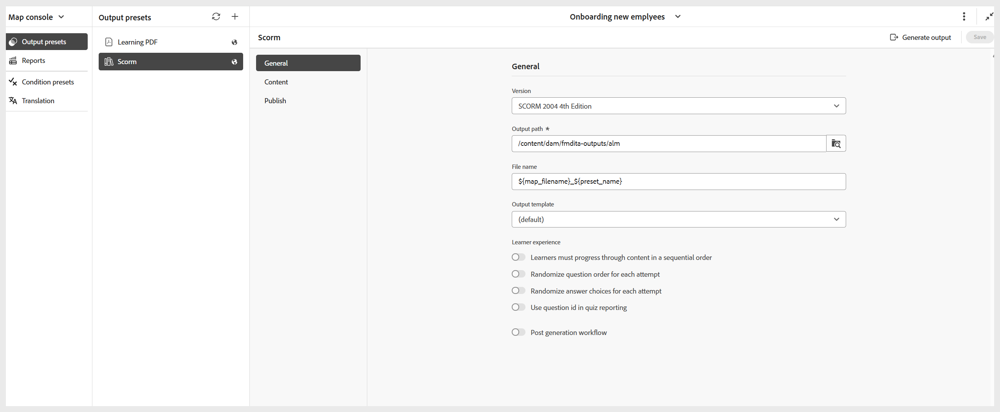

# Créer un paramètre prédéfini de sortie SCORM

Pour créer un paramètre prédéfini de sortie SCORM, procédez comme suit :

1. Ouvrez le cours dans **Console Map**.

   {width="350" align="left"}

1. Dans le panneau **Paramètres prédéfinis de sortie**, sélectionnez l’icône + pour créer un paramètre prédéfini de sortie.
1. Sélectionnez **SCORM** dans la liste déroulante **Type** de la boîte de dialogue **Nouveau paramètre prédéfini de sortie**.

   {width="350" align="left"}

1. Dans le champ **Nom**, attribuez un nom à ce paramètre prédéfini.
1. Sélectionnez l’option **Ajouter au profil du dossier actuel** pour créer un paramètre prédéfini de sortie dans le profil du dossier actuel.
1. Sélectionnez **Ajouter**.

Le paramètre prédéfini SCORM est créé. Une page de paramètres prédéfinis SCORM s’ouvre, dans laquelle vous pouvez effectuer les configurations nécessaires.

{width="800" align="left"}