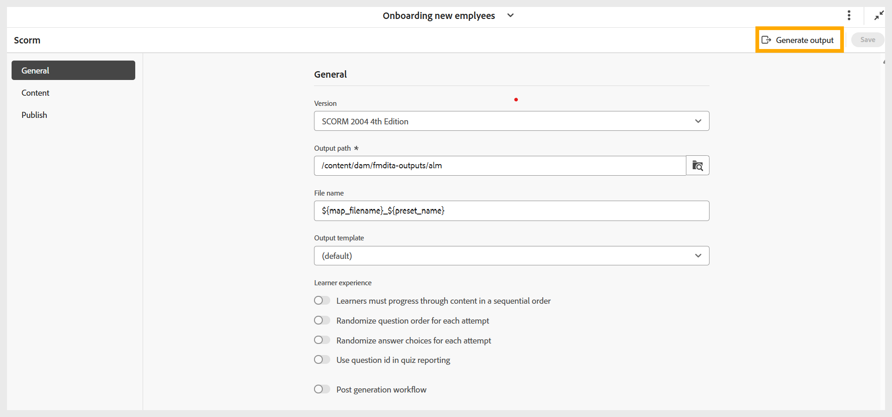
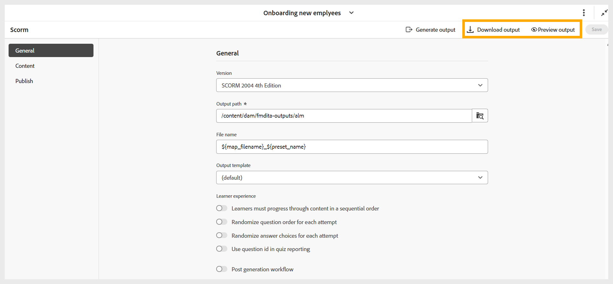

# Générer une sortie SCORM

Effectuez les étapes suivantes pour générer une sortie SCORM :

1. Après avoir configuré tous les paramètres requis pour la sortie SCORM en fonction de vos préférences, accédez à la barre d’outils de la page des paramètres prédéfinis SCORM.
1. Sélectionnez **Générer la sortie**.

   {width="650"}

1. Une fois la génération terminée, un message de réussite s’affiche confirmant que le fichier **filename.zip** a été créé. Vous pouvez prévisualiser la sortie à l’aide de l’option **Afficher la sortie** sur le message de réussite.

   {width="350"}

1. Vous pouvez télécharger ou prévisualiser la sortie en sélectionnant respectivement **Télécharger la sortie** ou **Prévisualiser la sortie**.

   {width="650"}

Vous pouvez charger le fichier ZIP dans votre LMS pour rendre le cours disponible pour vos élèves.
