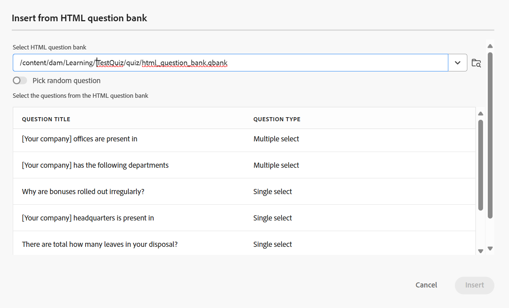

# Insérer des questions à partir de la banque de questions

Pour insérer des questions issues de la banque de questions dans le quiz, procédez comme suit :

1. Sélectionnez l’option **Insérer à partir de la banque de questions** dans le menu déroulant **Questions** de la barre d’outils, comme illustré ci-dessous.

   {width="350" align="left"}

   La boîte de dialogue **Insérer à partir de la banque de questions HTML** s’affiche.

1. Indiquez le chemin d’accès à la banque de questions stockée dans votre référentiel et sélectionnez les questions que vous souhaitez insérer dans votre quiz, comme illustré ci-dessous. Vous pouvez également sélectionner toutes les questions de la banque de questions à l’aide de **Tout sélectionner**.

   {width="650" align="left"}

1. Les questions sélectionnées sont insérées dans le quiz avec une mise en surbrillance bleue, indiquant qu’elles ne sont pas modifiables. Toutefois, ils apparaîtront normalement dans la sortie publiée.

   {width="650" align="left"}

1. En outre, vous pouvez activer l’option **Choisir une question aléatoire** à l’aide du bouton (bascule). Une fois cette option activée, vous pouvez définir le nombre de questions à sélectionner de manière aléatoire. Le quiz affiche alors un espace réservé indiquant qu’une question aléatoire a été insérée, comme illustré dans la deuxième capture d’écran. Lors de la publication, le système sélectionne et insère automatiquement le nombre spécifié de questions aléatoires dans la banque de questions.

   {width="650" align="left"}

   Les questions aléatoires sont ajoutées au quiz, comme illustré ci-dessous.

   {width="650" align="left"}

Pour un aperçu rapide de la vidéo, reportez-vous à la section [ Utilisation de la banque de questions ](https://video.tv.adobe.com/v/3475212/learning-content-aem-guides).
