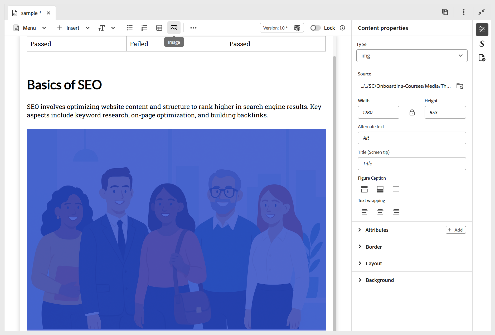
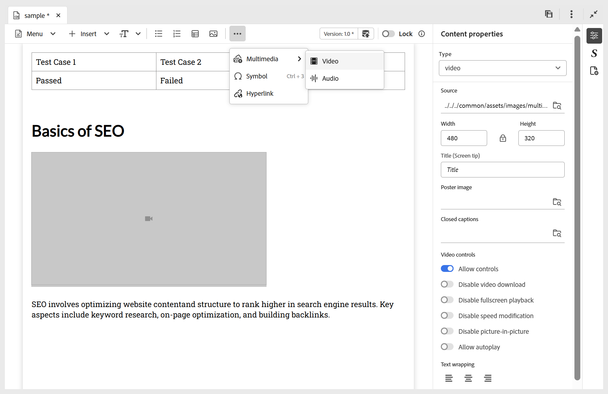

# Ajouter des blocs de création de base à votre rubrique

Pour mieux comprendre comment créer une rubrique d’apprentissage et y ajouter des éléments de base, la vidéo suivante présente un bref aperçu des fonctionnalités disponibles.

>[!VIDEO](https://video.tv.adobe.com/v/3469535/learning-content-aem-guides)

Vous pouvez utiliser les fonctions de modification de base disponibles dans la barre d’outils de l’éditeur, comme décrit ci-dessous :

- **Insérer des options** : fournit des options permettant d’ajouter [ajouter des widgets interactifs](./lc-widgets.md) tels que l’accordéon, le carrousel, la zone réactive, les onglets, les cartes retournées et l’option Cliquer pour afficher, ainsi que des [éléments structurels](./lc-other-insert-options.md) tels que l’iframe, les guillemets, le bloc de code, etc. Utilisez ce menu pour ajouter des fonctionnalités et de la variété à votre contenu d’apprentissage, ce qui le rend attrayant et bien structuré.

  {width="650" align="left"}

- **Composants de texte** : ajoute un en-tête, un paragraphe, une citation en ligne, un exposant, un indice et une citation à votre contenu.

  >[!NOTE]
  >
  > Vous pouvez également inclure un Titre et un sous-titre dans votre contenu de formation. Pour plus d’informations sur la manière de l’ajouter au contenu, consultez la page [Ajouter un titre et un sous-titre au contenu d’apprentissage](#add-title-and-subtitle-to-learning-content).

  {width="650" align="left"}

- **Liste non triée** : ajoute une liste non triée à votre contenu.

  {width="650" align="left"}

- **Liste ordonnée** : insère une liste numérotée dans votre contenu.

  {width="650" align="left"}

- **Tableau** : insère un tableau des dimensions requises dans le contenu. Vous pouvez gérer différentes propriétés de tableau à l’aide du panneau **Propriétés du contenu**, comme illustré ci-dessous.

  {width="650" align="left"}

- **Image** : insérez des images dans le contenu avec un texte secondaire et une info-bulle. Les images peuvent être ajoutées à partir du référentiel ou via une URL externe. De plus, les propriétés d’image peuvent être modifiées à l’aide du panneau **Propriétés du contenu**.

  {width="650" align="left"}

- **Multimédia** : ajoute des données vidéo et audio au contenu. Vous pouvez personnaliser leurs propriétés à l’aide du panneau **Propriétés du contenu**.

  {width="650" align="left"}

- **Contenu réutilisable** : permet d’incorporer du contenu existant issu de vos ressources ou de votre référentiel pour le réutiliser. Pour insérer un contenu réutilisable, procédez comme suit :

   1. Sélectionnez **Contenu réutilisable** dans la barre d’outils.
La boîte de dialogue **Réutiliser le contenu** s’ouvre.
   2. Accédez au sujet souhaité et sélectionnez-le pour inclure son contenu dans le cours actuel.
   3. Sélectionnez l’identifiant du contenu que vous souhaitez ajouter ; un aperçu sera affiché à côté de pour référence.

      {width="650" align="left"}

   4. Choisissez **Sélectionner**.

  Le contenu est inséré. Par exemple, la section sur la structure du véhicule est un élément de contenu qui est réutilisé et ajouté au sujet du cours. Le type s’affiche sous la forme **Référence** et son **ID** est reflété dans le panneau **Propriétés du contenu**.

  {width="650" align="left"}

- **Symboles** : ajoute les symboles de votre choix au contenu d’une liste, comme illustré ci-dessous.

  {width="350" align="left"}

- **Hyperliens** : ajoute des liens hypertexte à l’emplacement requis dans votre contenu. Il peut s’agir d’une référence de fichier, d’une URL web ou d’un lien de courrier électronique, comme illustré ci-dessous.

  {width="650" align="left"}

De plus, la liste déroulante **Menu** permet d’accéder aux actions d’édition (Couper, Copier, Supprimer), Rechercher et remplacer et au libellé Version.

## Ajouter un titre et un sous-titre au contenu d’apprentissage

Pour inclure un titre et un sous-titre dans votre contenu d’apprentissage, procédez comme suit :

1. Ouvrez le cours d’apprentissage dans la console Carte.
1. Ouvrez le sujet, le quiz ou tout autre composant de cours dans lequel vous souhaitez ajouter un titre ou un sous-titre.
1. Accédez au panneau Propriétés du fichier et sélectionnez **Ajouter un titre**.

   
1. Lorsque vous y êtes invité, choisissez d’utiliser l’en-tête existant comme titre.

   >[!NOTE]
   >
   > Si vous ne souhaitez pas utiliser l’en-tête existant comme titre, insérez d’abord un en-tête à l’aide du composant Texte dans la barre d’outils de l’éditeur, puis sélectionnez **Ajouter un titre**. Un exemple **Titre** est ainsi ajouté au contenu, que vous pouvez modifier selon vos besoins.
1. Dans Propriétés du fichier, sélectionnez **Ajouter un sous-titre**.
Un exemple **Sous-titre** est ajouté au contenu.

   

Pour supprimer un titre, désélectionnez l’option **Ajouter un titre** dans les propriétés du fichier. La suppression du titre supprime automatiquement le sous-titre associé.

