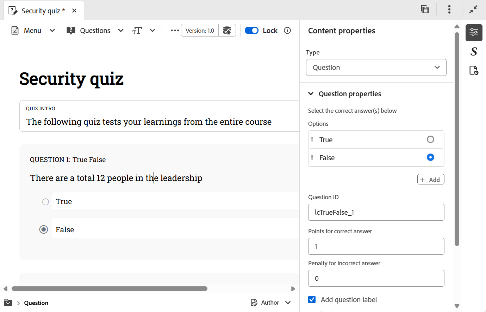
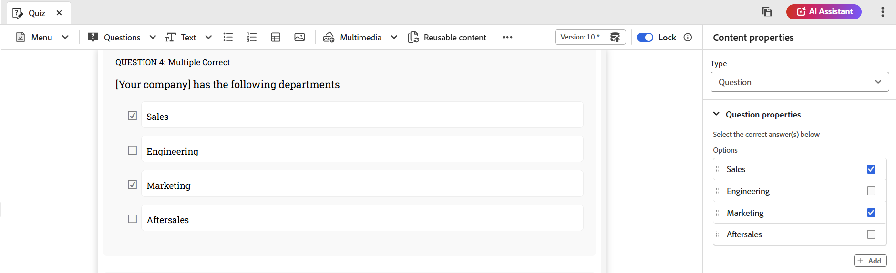
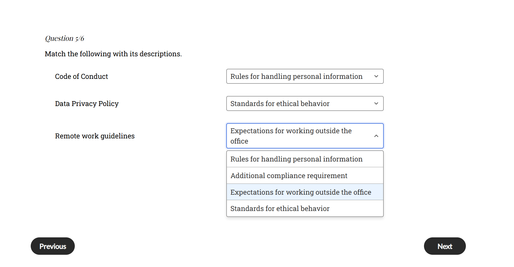

# Insérer des questions dans un quiz

Pour insérer des questions dans un quiz, procédez comme suit :

1. Sélectionnez le type de question souhaité dans le menu déroulant **Questions** de la barre d’outils. Selon vos besoins, vous pouvez ajouter des questions à l’aide de l’un des quatre formats disponibles : Vrai ou Faux, Correction simple, Correction multiple, Correspondance des éléments suivants et Réponse courte comme illustré ci-dessous. Pour plus d’informations, consultez la section [Types de questions](#question-types).

   {width="650"}

   Lors de l&#39;insertion d&#39;une question, si votre curseur se trouve sur un bloc de questions, la nouvelle question est ajoutée juste après par défaut.

   Pour insérer une question entre les deux questions existantes, commencez [insérez un paragraphe](#insert-paragraph-within-the-quiz), puis insérez des questions.

1. Une question est insérée dans le format sélectionné. Vous pouvez ensuite modifier la question en fonction de vos besoins.

1. Vous pouvez sélectionner n’importe quelle question et configurer ses propriétés à l’aide du panneau **Propriétés du contenu**.

   {width="650"}

1. Enregistrez toutes les modifications apportées au quiz.

## Propriétés de la question

Vous pouvez configurer les questions à l’aide des propriétés de question suivantes dans le panneau **Propriétés du contenu** :

{width="350"}

- **Options** : indiquez la bonne réponse à la question
- **Question Id** : indique l’ID de question pour chaque question. Si un ID de question n’est pas présent, il est recommandé de toujours l’ajouter.
- **Points pour la bonne réponse** : indiquez les points à attribuer pour la bonne réponse.
- **Sanction en cas de réponse incorrecte** : indiquez les points à déduire en cas de réponse incorrecte.
- **Libellé de question** : permet d&#39;ajouter un libellé de question.
- **Commentaires** : activez cette option pour fournir des commentaires en cas de réponse correcte ou incorrecte.
- **Épingler l’option à la position** : lorsqu’une option spécifique pour une question est épinglée, elle reste fixe à la position spécifiée dans la liste des options, même si **Randomiser les choix de réponse pour chaque tentative** est activé dans la configuration des paramètres prédéfinis SCORM, ce qui redistribuerait autrement les options disponibles. Vous pouvez pointer sur l’option souhaitée d’une question dans le panneau Propriétés du contenu et l’épingler.

  {width="350"}

## Insérer un paragraphe dans le quiz

Lorsque vous placez le curseur sur une question spécifique ou sur un espace vide entre les deux questions, une ligne horizontale bleue s&#39;affiche avec une flèche bleue dans le coin le plus à droite de l&#39;écran. En sélectionnant la flèche bleue, vous pouvez insérer un paragraphe dans l’interface de création de quiz.

{width="650"}

- Lorsqu’elle est utilisée dans une question, elle vous permet d’ajouter d’autres éléments tels que des images, un tableau, des éléments de texte, etc. dans la question.
- Lorsqu’elle est utilisée entre les questions, elle vous permet d’insérer une autre question ou d’ajouter d’autres éléments de création comme mentionné ci-dessus.

## Supprimer la question ou l’option

Pour supprimer une question ou une option spécifique d’un quiz, procédez comme suit :

1. Cliquez avec le bouton droit sur la question ou l’option à supprimer.
1. Dans le menu contextuel, sélectionnez **Supprimer la question** (pour supprimer la question entière) ou **Supprimer option** (pour supprimer uniquement l’option sélectionnée).

{width="650"}

## Types de questions

Les types de questions suivants sont pris en charge dans un quiz :

- **Correction unique** : question avec plusieurs options pour laquelle une seule réponse est correcte.

  {width="650"}

- **Vrai/Faux** : question basée sur des instructions où les élèves choisissent s’il s’agit de Vrai ou Faux.

  {width="650"}

- **Plusieurs corrects** : question avec plusieurs options pour laquelle plusieurs réponses peuvent être correctes.

  {width="650"}

- **Correspondre aux éléments suivants** : permet aux élèves de faire correspondre des éléments de deux listes afin de former des paires correctes. Vous pouvez ajouter de nouveaux ensembles d’options à partir du panneau **Propriétés du contenu**. Pour augmenter la complexité, vous pouvez supprimer une option de la première liste et inclure une correspondance supplémentaire dans la colonne Correspondance . Cela crée un élément de difficulté en exigeant des élèves qu’ils réfléchissent de manière critique à l’option qui n’a pas de paire directe.

  {width="650"}

  Dans la sortie publiée, la question **Faire correspondre le suivant** s’affiche avec un menu déroulant pour chaque élément, ce qui vous permet de sélectionner la correspondance appropriée parmi les options disponibles.

  {width="650"}

- **Réponse courte** : permet aux élèves de répondre à l’aide d’une brève entrée de texte. Il accepte les réponses alphanumériques, applique une distinction majuscules/minuscules aux réponses et fournit une barre de défilement horizontale pour les réponses très longues.

  {width="650"}
