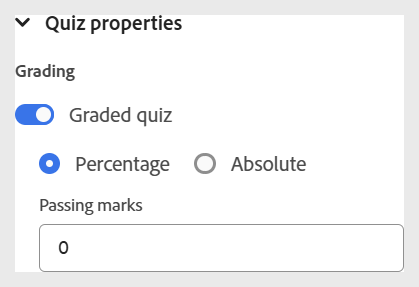

# Propriétés du quiz

Vous pouvez configurer les propriétés du quiz à l’aide des options suivantes :

- Placez le curseur sur le titre du quiz ou l’intro du quiz, puis ouvrez le panneau **Propriétés du contenu** dans le panneau de droite. Vous pouvez modifier les propriétés du quiz ici.

  {width="650" align="left"}

- Assurez-vous que le titre et l’introduction du quiz ne restent pas vides lors de leur création, car ils apparaissent sur la première diapositive du quiz publié. Si vous les supprimez par erreur, vous pouvez les restaurer en sélectionnant les options **Ajouter le titre du quiz** et **Ajouter une introduction au quiz**.
- Vous pouvez activer la notation pour votre quiz en activant le bouton (bascule) **Quiz noté**. Une fois cette option activée, vous pouvez choisir la méthode de classement, basée sur un pourcentage ou absolue, et définir les critères de réussite en conséquence.

  {width="350" align="left"}

- Vous pouvez également configurer des paramètres supplémentaires tels que les options d’envoi de réponse, les options de commentaires et de révision, la durée du quiz et les préférences de disposition, comme illustré ci-dessous.

  {width="350" height="200" align="left"}

- Vous pouvez utiliser l’option **Autoriser une nouvelle visite du contenu** dans les propriétés du quiz pour consulter à nouveau le contenu du cours au cours d’un quiz en cours, comme pour un test de livre ouvert. Cependant, lorsque cette option est activée, vous ne pouvez pas configurer d’options d’envoi et la fonction de minutage du quiz est désactivée.
  {width="350" height="200" align="left"}
