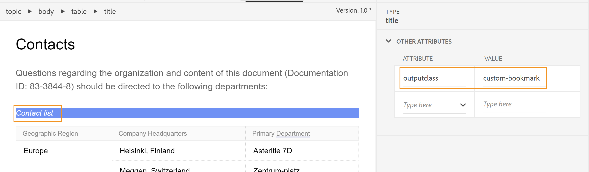

# Ajout d’un signet personnalisé dans la sortie PDF

En règle générale, la table des matières d’un mappage DITA est répliquée en tant que signets dans la sortie finale du PDF. Cette table des matières est créée à partir des titres de rubrique ou de section dans votre mappage DITA. Parfois, vous souhaiterez peut-être ajouter un signet personnalisé sur un contenu particulier dans la sortie de votre PDF pour une navigation facile. Pour ce faire, ajoutez une `outputclass` sur l’élément et en lui appliquant l’attribut suivant :

`bookmark-level: 3`

Ici, le `bookmark-level` est un attribut et un nombre `3` est la valeur qui indique le niveau dans la hiérarchie des signets où le signet est ajouté. Dans l&#39;exemple suivant, la rubrique de premier niveau &quot;Contacts&quot; comporte une table, &quot;Liste de contacts&quot;, sur laquelle nous avons ajouté une `outputclass` avec la valeur de `custom-bookmark`.




La définition suivante de la variable `custom-bookmark` est ajoutée dans le fichier CSS :

```css
…
/*Adding a custom bookmark*/
.custom-bookmark{
    bookmark-level: 2
}
…
```

Dans la sortie du PDF, la variable *Liste de contacts* est ajouté au deuxième niveau dans la liste des signets du PDF, comme illustré ci-dessous :


>[!NOTE]
>
>Vous devez choisir le niveau correct où le signet personnalisé est ajouté. Si vous indiquez un nombre inférieur au signet de la rubrique parente, le signet personnalisé prend la position du signet parent et tous les autres signets sont affichés en tant qu’enfants. Cela peut entraîner une structure de signet inattendue.
