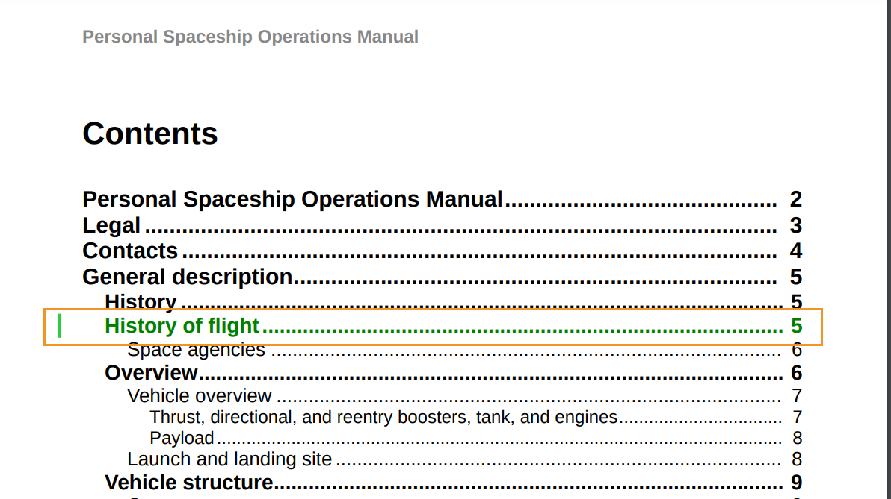

# Utilisation des styles de barres de modification personnalisés

Une barre de modification est une ligne verticale qui identifie visuellement le contenu nouveau ou révisé. AEM Guides vous permet d’afficher une barre de modification à gauche du contenu modifié dans les rubriques, ainsi que les rubriques modifiées dans la table des matières de la sortie du PDF.

Pour plus d’informations sur l’affichage de la barre de modification, voir le paramètre *Créer un PDF avec la barre de modification entre les versions publiées* dans [Publish PDF Output](../web-editor/native-pdf-web-editor.md).

## Modification du contenu dans les rubriques

La barre de modification s’affiche à gauche du contenu dans les rubriques qui ont été insérées, modifiées ou supprimées.

Vous pouvez modifier les styles suivants pour afficher le contenu modifié et parmi les barres de modification.


>[!NOTE]
>
>Ces styles font partie du fichier `layout.css` et vous pouvez les modifier selon vos besoins.

Par exemple, vous pouvez utiliser l’attribut de couleur dans le style `.inserted-block` pour définir la manière dont le contenu inséré s’affiche dans la sortie du PDF publiée.


```css
...
.inserted-block { 
  color: #2ECC40; 
  display: inline; 
  -ro-comment-content: " "; 
  -ro-comment-style: underline; 
  -ro-comment-title: "Inserted"; 
  -ro-comment-date: attr(data-time); 
  -ro-comment-dateformat: "yyyy/dd/MM HH:mm:ss"; 
} 
...
```

De même, vous pouvez utiliser le style `.deleted-block` pour définir la manière dont votre contenu supprimé apparaît dans la sortie du PDF publiée.

```css
...
.deleted-block { 
  display: inline; 
  color: #FF6961; 
  text-decoration: line-through; 
  -ro-comment-content: " "; 
  -ro-comment-style: strikeout; 
  -ro-comment-title: "Deleted"; 
  -ro-comment-date: attr(data-time); 
  -ro-comment-dateformat: "yyyy/dd/MM HH:mm:ss"; 
} 
...
```

Vous pouvez utiliser les styles `.inserted-change-bar` et `.deleted-change-bar` pour modifier l’aspect des barres de modification qui apparaissent à gauche du contenu mis à jour.

Par exemple, vous pouvez utiliser l’attribut `-ro-change-bar-color` dans le style `.inserted-change-bar` pour afficher la barre de modification insérée en vert. Vous pouvez également utiliser l’attribut `-ro-change-bar-color` dans le style `.deleted-change-bar` pour afficher la barre de modification supprimée en rouge.

```css
...
.inserted-change-bar { 
  -ro-change-bar-color: #2ECC40; 
} 

.deleted-change-bar { 
  -ro-change-bar-color: #FF6961; 
  } 
...
```


## Modification de la rubrique dans la table des matières (table des matières)

Vous pouvez également ajouter une barre de modification à gauche des rubriques modifiées dans la table des matières de la sortie du PDF. Vous pouvez utiliser l’attribut `-ro-change-bar-color` dans le style `.changed-topic` pour ajouter une barre de modification dans la couleur de votre choix pour les rubriques mises à jour dans la liste de la table des matières.

Par exemple, vous pouvez ajouter une barre de modification de couleur verte.

```css
...
.changed-topic { 
 -ro-change-bar-color: #2ECC40; 
}  
...
```


Cette option affiche une barre de modification verte par rapport à toutes les rubriques de la table des matières dans lesquelles certaines mises à jour ont été effectuées. Vous pouvez cliquer sur la rubrique modifiée dans la table des matières et afficher les modifications détaillées.


