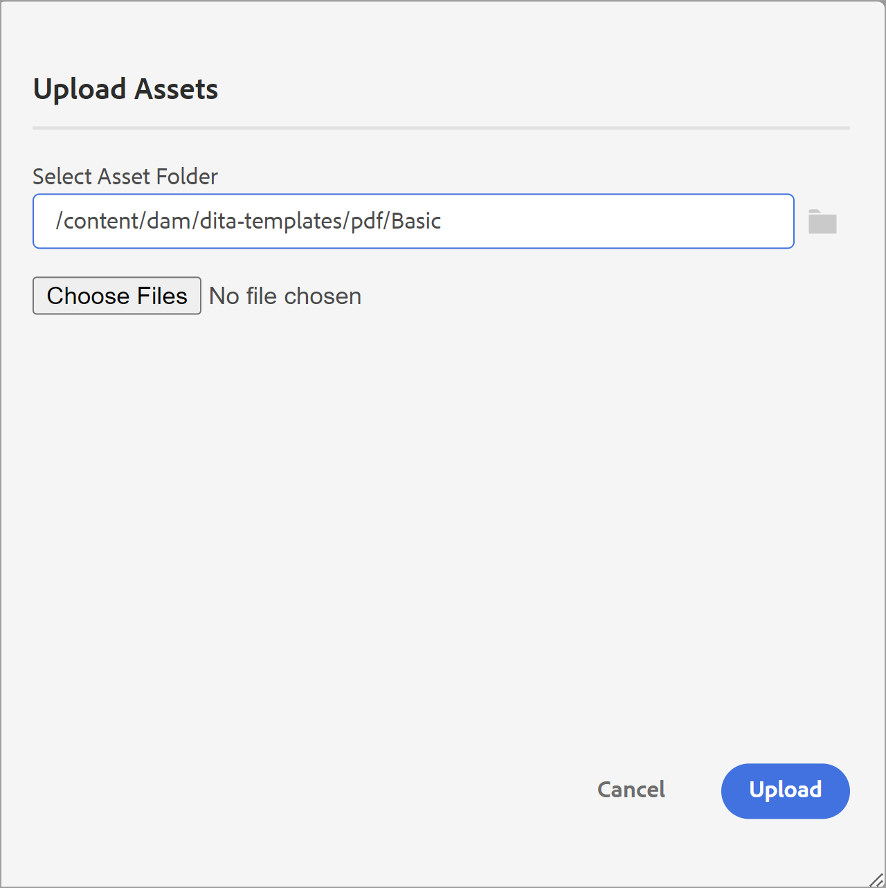

# Composants d’un modèle de PDF {#components-pdf-template}

Un modèle de PDF comporte quatre composants : dispositions de page, feuilles de style, ressources et paramètres. Vous pouvez créer un modèle en personnalisant ces composants individuels et en associant le modèle à un paramètre prédéfini de sortie lors de la génération d’une sortie de PDF. Les sections suivantes couvrent en détail ces composants et leur processus de personnalisation.

## Création et personnalisation de mises en page {#create-customize-page-layout}

Les paramètres du composant Mise en page vous permettent de concevoir la structure d’une page en définissant l’en-tête, le pied de page et la zone de contenu d’une page. L’éditeur de mise en page WYSIWYG vous permet de créer une mise en page pour différentes sections d’un PDF, telles que les pages de couverture recto et verso, le chapitre, la table des matières (table des matières), l’index, la page vierge, les pages de la matière première, les pages de la matière première, la liste des figures (LOT), le glossaire ou de créer une mise en page pour une page personnalisée. Dans les paramètres du modèle de PDF, vous pouvez attribuer une mise en page avec différentes sections dans un PDF, qui sont ensuite utilisées pour générer la sortie du PDF.

### Création d’une mise en page {#create-page-layout}

>[!NOTE]
>
>Il existe des exemples de mise en page prêts à l’emploi. Vous pouvez les personnaliser ou créer de nouvelles mises en page.

1. Dans l’éditeur Web, accédez à la **Sortie** .
1. Développez la barre latérale gauche et cliquez sur **Modèles**.
1. Ouvrez le modèle que vous souhaitez utiliser.

   >[!NOTE]
   >
   >Vous pouvez ouvrir un modèle en double-cliquant sur son nom ou en cliquant sur l’icône > située en regard de son nom.

1. Pour créer une mise en page, effectuez l’une des opérations suivantes :

   * Survol **Disposition de page** et cliquez sur (*Options* icon) **..** et choisissez **Nouvelle mise en page**.

   * Dans le **Modèles** , cliquez sur **+** en regard de **Modèles** et choisissez **Disposition de page** dans le menu contextuel.

     Cela ouvre la fenêtre **Ajouter une mise en page** boîte de dialogue.

     

1. Attribuez un nom à la nouvelle mise en page.
   >[!NOTE]
   >
   >Évitez d’utiliser des caractères spéciaux lors de l’attribution d’un nom à une mise en page. Un espace dans le nom est remplacé par un trait de soulignement &quot;_&quot;.

1. Cliquez sur **Terminé**.

   La nouvelle mise en page est créée et ajoutée sous Mises en page .

### Dupliquer une mise en page {#duplicate-page-layout}

1. Dans le **Modèles** du modèle à dupliquer, double-cliquez sur  **Disposition de page** ou cliquez sur le bouton **>** avant **Disposition de page**.

   Cette option affiche la liste des mises en page dans le modèle.

1. Pointez sur la mise en page à dupliquer, puis cliquez sur (*Options* icon) **..** et sélectionnez **Dupliquer** dans le menu contextuel.

1. Dans le _Dupliquer la mise en page_ , saisissez le nom de la mise en page.

1. Cliquez sur **Terminé**.
Une copie de la mise en page sélectionnée est créée et ajoutée sous Mises en page.

### Personnalisation de la mise en page {#customize-page-layout}

1. Dans le **Modèles** du modèle à modifier, double-cliquez sur **Disposition de page** ou cliquez sur le bouton **>** avant **Disposition de page**.

   Cette option affiche la liste des mises en page dans le modèle.
1. Pour personnaliser n’importe quelle mise en page, effectuez l’une des opérations suivantes :
   * Double-cliquez sur une mise en page.
   * Pointez sur une mise en page, puis cliquez sur (*Options* icon) **..** et sélectionnez **Modifier** dans le menu contextuel.

   L’éditeur de mise en page s’ouvre alors pour une personnalisation.
1. Une fois les modifications souhaitées effectuées, cliquez sur *Enregistrer tout* (ou `Crl+S`).

   Pour plus d’informations sur la définition d’éléments de disposition individuels tels que l’en-tête, le pied de page, le numéro de page, le titre, etc., voir [Concevoir une mise en page](design-page-layout.md).

## Utiliser des feuilles de style pour personnaliser PDF {#stylesheet-customization}

Les paramètres du composant Feuilles de style vous permettent de mettre en forme les composants de mise en page et le contenu DITA à l’aide de l’éditeur WYSIWYG ou de travailler directement avec le fichier CSS. Vous pouvez créer vos propres styles ou personnaliser les propriétés de style par défaut. L’éditeur WYSIWYG vous donne accès à la plupart des propriétés dont vous avez besoin pour mettre en forme votre mise en page ou votre contenu DITA. Pour les personnalisations avancées, vous pouvez travailler directement en mode Source.

### Créer une nouvelle feuille de style {#create-stylesheet}

Bien que les fichiers CSS soient fournis pour le contenu et la mise en page, vous pouvez créer une feuille de style pour appliquer plusieurs personnalisations à un type de style spécifique qui peut ensuite être appliqué à un composant cible. Par défaut, les exemples de fichiers CSS sont regroupés dans le produit. Ces fichiers CSS ont pour but de vous aider à organiser vos informations de style dans le contenu et les mises en page. Vous pouvez choisir de fusionner ces styles dans un ou plusieurs fichiers CSS.

Par défaut, chaque fois que vous créez une mise en page, la variable `layout.css` est inclus dans la nouvelle mise en page. Si vous souhaitez que la mise en page contienne des styles provenant d’un autre fichier CSS, vous pouvez simplement faire glisser et déposer le fichier CSS de votre choix dans la zone d’édition du contenu de la nouvelle mise en page. Pour vérifier si le fichier CSS a été incorporé dans la mise en page, passez en mode Source et vous trouverez un lien vers le fichier CSS dans la variable `<head>` élément .

Pour créer une feuille de style, procédez comme suit :
1. Dans le **Modèles** effectuez l’une des opérations suivantes :
   * Passez la souris sur le **Feuilles de style** et cliquez sur l’icône (*Options* icon) **..** et choisissez **Nouvelle feuille de style**.
   * Cliquez sur le bouton **+** en regard de **Modèles** et choisissez **Feuille de style** dans le menu contextuel.

   La boîte de dialogue Ajouter une feuille de style s’ouvre alors.

   
1. Nommez la nouvelle feuille de style.
1. Cliquez sur **Terminé**.

   Une nouvelle feuille de style est créée et ajoutée sous la section Feuilles de style .

### Création d’un style {#create-style}

Par défaut, les fichiers CSS fournis avec le modèle contiennent des styles pour les styles d’en-tête, de paragraphe, de caractère, d’hyperlien, d’image, de tableau, de balise div, de page et d’autres styles. Vous pouvez remplacer le format de style par défaut ou créer un nouveau style.

Vous pouvez créer un style pour l’utiliser dans la mise en page du modèle ou appliquer un style personnalisé pour tout élément DITA. Pour appliquer ces styles personnalisés à l’élément DITA, vous devez vous assurer que le nom de classe du style est identique au nom de l’élément DITA ou au `outputclass` attribut.  Par exemple : `
` dans DITA, est régi par `.div {}` dans CSS ou dans `outputclass` attribut. Si vous appliquez `
` dans DITA, il est régi par la variable `.div {}` ou `.my-div {}` dans le fichier CSS.

Pour créer un style, procédez comme suit :
1. Développez la barre latérale gauche et double-cliquez sur le modèle dans lequel vous souhaitez créer le style.
1. Développez l’objet **Feuilles de style** . Elle ouvre la fenêtre **Styles** qui contient toutes les options de style.
1. Cliquez sur l’icône + pour ajouter un nouveau style.

   **Ajouter un style** s’ouvre.

   

1. Spécifiez un **Classe** nom. Pour appliquer un style à l’élément DITA, assurez-vous que le nom de classe du style est identique au nom de l’élément DITA ou à la variable `outputclass` attribut.
1. Dans le **Balise** (facultatif), choisissez une balise pour laquelle vous souhaitez créer un style.

1. Sélectionnez une **Classe Pseudo** pour mettre en forme un élément. Une pseudo-classe permet de définir un état spécial de l’élément. Par exemple, utilisez une pseudo-classe pour mettre en forme un élément lorsque vous placez le pointeur de la souris dessus ou lorsque vous vous concentrez dessus. Vous pouvez également sélectionner plusieurs pseudo-classes. Par exemple, vous pouvez utiliser une pseudo-classe `a::visited {color: blue;}` pour mettre en forme les liens visités.

1. Ajoutez le sélecteur correspondant au nouveau style. La variable **Sélecteur** vous permet d’ajouter des sélecteurs personnalisés en plus de la combinaison Classe, Balise et Classe de pseudo. Par exemple, vous pouvez créer des `table a.link` style de tous les liens hypertexte d’un tableau.

   Pour plus d’informations sur les balises CSS, voir [Reportez-vous à la grammaire des styles CSS](https://www.w3.org/TR/CSS21/syndata.html#characters).

1. Cliquez sur **Terminé**.

   Un nouveau style est créé et ajouté à la liste des styles.

### Personnalisation d’un style prédéfini ou nouveau {#customize-style}

Une fois que vous avez créé un fichier CSS avec des styles par défaut ou que vous souhaitez personnaliser les styles dans un fichier CSS existant, vous pouvez utiliser l’éditeur de styles pour ce faire.

Pour personnaliser un style, procédez comme suit :
1. Double-cliquez **Feuilles de style** ou cliquez sur le bouton **>** avant **Feuilles de style**.

   Il affiche les fichiers CSS par défaut (Contenu et mise en page) et personnalisés.
1. Ouvrez une feuille de style à modifier.

   Pour ouvrir une feuille de style en vue de la modifier, effectuez l’une des opérations suivantes :
   * Double-cliquez sur le nom de la feuille de style.
   * Placez le pointeur de la souris sur le nom de la feuille de style, cliquez sur l&#39;icône (Options)... et choisissez Modifier.

   Cette opération ouvre la feuille de style à modifier et affiche la liste des styles dans le panneau Styles.

   

1. Pour personnaliser un style, sélectionnez-le à l’aide de l’éditeur de styles.

### Propriétés des styles

Dans le panneau central, vous pouvez modifier les propriétés, mais il peut s’avérer difficile d’obtenir un instantané de toutes les valeurs présentes.  La variable **Propriétés** Le volet donne un aperçu rapide de tous les attributs et valeurs du style.

Dans le panneau central, vous pouvez modifier les propriétés les plus utilisées, mais pas toutes les propriétés prises en charge par CSS. Dans le **Propriétés** vous pouvez modifier toutes les propriétés prises en charge par CSS et les prévisualiser. Vous n’avez pas besoin de basculer vers la vue source pour modifier les propriétés.

En savoir plus sur l’utilisation de l’éditeur de style pour [Utilisation des styles de contenu communs](stylesheet.md).

## Utilisation des ressources {#work-with-resources}

Il s’agit d’un conteneur pour toutes les ressources utilisées pour concevoir un modèle. Vous pouvez le considérer comme un dossier contenant des ressources telles que des images d’arrière-plan, des polices personnalisées, des logos, etc. Chaque fois que vous ajoutez une ressource dans votre modèle, elle est chargée ou archivée dans le dossier de ressources. Vous pouvez ensuite utiliser ces ressources pour personnaliser ou concevoir vos modèles de PDF.

Pour ajouter un fichier de ressource au dossier Resources, procédez comme suit :

1. Pointez sur l’onglet du dossier Ressources, cliquez sur l’icône (Options) ... et sélectionnez Importer.

   La boîte de dialogue Télécharger les ressources s’ouvre alors.

   

   Le chemin d’accès à l’emplacement où le fichier de ressource sera chargé est indiqué dans la variable **Sélectionner le dossier de ressources** champ .
   >[!NOTE]
   >
   >Vous ne pouvez pas modifier le chemin d’accès pour le chargement de ressources. Par défaut, toutes les ressources sont stockées sous la variable `/content/dam/dita-templates/pdf/<PDF-template-name>` dossier.

1. Cliquez sur **Choisir les fichiers** pour parcourir le fichier de ressources à partir de votre ordinateur local

1. Cliquez sur **Télécharger**.
Le fichier sélectionné est importé et répertorié sous le dossier Ressources .

## Paramètres du PDF avancé {#advanced-pdf-settings}

Utilisez la section Paramètres pour configurer les paramètres avancés de mise en page de la page du PDF, en commençant par une page impaire ou paire, les formats des références croisées et en activant les marques d’impression dans le PDF final généré à l’aide du modèle.

Pour configurer, cliquez sur **Paramètres** dans le **Modèles** pour afficher les options suivantes :

### Général

Définissez les paramètres de configuration de base pour démarrer un chapitre à partir d’une page impaire ou pair, la structure de la table des matières et définissez le format de ligne de conduite pour les entrées de la table des matières. Vous pouvez définir les paramètres suivants :

* **Commencer tout nouveau chapitre depuis**: permet de définir la manière dont chaque chapitre est publié dans le PDF final. Vous pouvez choisir parmi **Nouvelle page**, **Page impaire**, **Page paire**, ou **Page en cours**  options. Si vous choisissez de commencer un nouveau chapitre à partir d’une page impaire, une page vierge est insérée après un chapitre qui se termine sur une page impaire. Par exemple, si votre chapitre se termine à la page 15, le processus de publication insère un 16 vide.th afin que le nouveau chapitre puisse commencer à partir du 17th page.  Si vous choisissez l’option **Page en cours** , tous les chapitres sont publiés dans la suite sans sauts de page. Par exemple, si un chapitre se termine au milieu de la page 15, le chapitre suivant est également démarré à partir de la 15e page elle-même.

* **Démarrage de chaque rubrique à partir d’une nouvelle page**: si vous souhaitez que chaque rubrique de votre chapitre commence à partir d’une nouvelle page, sélectionnez **Démarrage de chaque rubrique à partir d’une nouvelle page** . Si vous souhaitez que vos rubriques se poursuivent sans espaces de page, désélectionnez cette option.

* **Structure de la table des matières**: permet de personnaliser la hiérarchie de la table des matières. Il utilise les paramètres supplémentaires suivants :

   * **Utilisation des en-têtes jusqu’au niveau**: permet d’ajuster le nombre de niveaux d’en-tête à afficher dans la structure de table des matières de votre PDF.
   * **N’affiche pas le numéro de page du premier niveau dans la table des matières**: sélectionnez cette option pour masquer les numéros de page correspondants pour tous les chapitres contenant des rubriques imbriquées ou enfants. Examinez l’exemple suivant dans lequel une sortie est créée sans sélectionner cette option.

  

  Dans l’exemple ci-dessus, Paramètres avancés du PDF, Annexe et Mentions légales sont les en-têtes de rubrique ou les titres de chapitre de premier niveau. Un numéro de page est affecté à tous ces en-têtes.

  Maintenant, si vous sélectionnez cette option et générez la sortie, vous obtiendrez la table des matières suivante :

  

  Vous pouvez constater ici que le premier chapitre Paramètres avancés du PDF ne reçoit aucun numéro de page, car il contient des rubriques imbriquées ou enfants. En revanche, un numéro de page s’il est affecté à l’Annexe et aux Mentions légales, car il s’agit de rubriques autonomes sans rubrique enfant.

* **N’affiche pas le numéro de chapitre dans la table des matières** : sélectionnez cette option pour afficher les noms des chapitres sans les numéros de chapitre dans la table des matières.   Par défaut, les numéros de chapitre s’affichent dans la table des matières de la sortie de votre PDF.
* **Format de filet**: utilisez la liste déroulante pour sélectionner les lignes de filet de conduite Pointe, Pleine ou Espace afin de lier les niveaux d’en-tête aux numéros de page correspondants.
Pour appliquer la structure de table des matières et le style des niveaux d’en-tête, voir [Ajout d’une table des matières de chapitre](design-page-layout.md#add-chapter-toc).

  >[!NOTE]
  >
  >Si vous êtes un développeur CSS, vous pouvez également définir le format de filet de conduite directement dans le fichier CSS.

* **Marqueur de continuation de tableau**: sélectionnez cette option pour définir des marqueurs pour les tables longues qui s’étendent sur plusieurs pages.
Vous pouvez définir le texte à afficher avant et après le saut. Par exemple, un tableau se casse sur la page 5 et vous définissez `<Continued on page %page-num%>` pour **Texte avant saut**.  Le texte affiche &quot;Suite à la page 6&quot; au bas de la page 5.

  Utilisez des variables de langue pour définir le texte du marqueur de continuation avant et après la coupure. Selon la langue choisie, la valeur localisée est automatiquement sélectionnée dans la sortie du PDF. Par exemple, vous pouvez publier `Continued on page %page-num%` comme texte en anglais et `Fortsetzung auf Seite %page-num%` en allemand.

  Survol  près de l’option pour afficher plus de détails sur celle-ci.
* **Lier des termes du glossaire à la page du glossaire**: sélectionnez cette option pour afficher les termes du glossaire sous forme de liens hypertexte dans le contenu et les lier aux termes de la page du glossaire. Cela permet aux lecteurs d’afficher rapidement la définition d’un terme défini dans le glossaire.

  Pour convertir les termes du glossaire en hyperliens, vous devez :
   * Activer **Glossaire** dans le **Ordre de mise en page** pour un mappage DITA.
   * Ajoutez le glossaire dans la carte des pages de fond pour un livre.

  Si vous n’activez pas la page Glossaire, les termes du glossaire dans le contenu ne sont pas convertis en liens hypertexte dans la sortie du PDF.
  <!--For more information on using table continuation markers, see Use table continuation markers.-->

### Disposition de page {#page-layouts}

Les paramètres de mise en page vous permettent de contrôler entièrement la spécification de la mise en page à utiliser pour une section spécifique de votre document. Par exemple, pour sélectionner une mise en page pour la table des matières, cliquez sur le menu déroulant sous le champ Table des matières et sélectionnez la mise en page que vous avez conçue pour générer la table des matières.

Il est important de noter que les paramètres de la mise en page ont la priorité sur ceux de la mise en page.

Les paramètres suivants sont disponibles sous la section Mise en page de page :

**Disposition de page par défaut**: sélectionnez une mise en page qui agit comme mise en page par défaut pour toutes les pages de votre PDF. Il s’agit de la mise en page de base appliquée aux sections ou rubriques pour lesquelles vous n’avez pas créé de mise en page dédiée.

**Disposition des pages pour différentes sections**: vous pouvez mapper une mise en page avec les sections suivantes de la sortie de votre PDF. Si vous avez conçu une mise en page pour la section associée, sélectionnez-la dans la liste déroulante. Si aucune mise en page n’a été créée pour des sections spécifiques, la mise en page par défaut est appliquée.

* **Chapitres et rubriques**: vous pouvez spécifier la disposition de la page pour le chapitre et les rubriques. La mise en page sélectionnée sera appliquée à tous les chapitres et rubriques.

* **Table des matières**: si vous avez conçu la mise en page de la table des matières, sélectionnez **Table des matières** dans la liste déroulante, et toutes les pages de la table des matières de votre document auront la mise en page de la table des matières.

* **Liste des figures et liste des tableaux**: vous pouvez également spécifier la mise en page des chiffres et des tableaux. La mise en page sélectionnée sera appliquée à tous les tableaux et figures.

* **Index**: si vous avez conçu une mise en page de page Index, mappez-la à l’option Index . Les feuilles de style permettent de mettre en forme différents éléments d&#39;index dans la sortie du PDF. Utilisation des styles d’index `.idx-header`, `.idx-footer`, `.idx-body`, `.idx-title`, `.idx-keyword-group`, `.idx-unit`,  `.idx-keyword`, `.idx-name`, `.idx-link` et `.idx-child` pour personnaliser les styles des éléments de l’index.

* **Glossaire**: si vous disposez d’une mise en page de page Glossaire, mappez-la à l’option Glossaire .

  Les termes du glossaire de la sortie de votre PDF sont toujours triés par ordre alphabétique.

  Vous pouvez également ajouter la balise `sort-as` pour définir une clé de tri pour les termes du glossaire. Les guides du Experience Manager utilisent ensuite la touche de tri pour trier les termes du glossaire à la place des termes du glossaire. Si vous n’avez pas défini la clé de tri, elle utilise les termes du glossaire pour le tri. Par exemple, vous pouvez ajouter la balise . `sort-as` à la fonction `glossterm` et définissez sa valeur sur `A` pour le terme &quot;USB&quot; (par exemple, `<glossterm>USB<sort-as>A</sort-as></glossterm>`). De même, vous pouvez ajouter `sort-as` et définissez sa valeur sur `B` pour le terme &quot;Pen Drive&quot;. Lorsque vous triez ces termes dans le glossaire, la clé de tri `A` pour le glossaire, le terme &quot;USB&quot; apparaît avant la clé de tri. `B` pour le glossaire &quot;Pen Drive&quot;. Ainsi, dans la sortie du PDF, &quot;USB&quot; se trouve avant &quot;Pen Drive&quot; sur la page du glossaire.

  Les feuilles de style permettent de mettre en forme différents éléments du glossaire dans la sortie du PDF. Utilisation des styles du glossaire `.glo-header`, `.glo-footer`, `.glo-body`, `.glo-title`, `.glo-unit`, `.glo-link`, et `.glo-term` pour personnaliser les styles des éléments du glossaire.

  En savoir plus sur l’utilisation de l’éditeur de style pour [Utilisation des styles de contenu communs](stylesheet.md).

* **Pages de premier plan et pages de premier plan**: ces mises en page définissent la mise en forme des pages d’avant ou d’arrière-plan de votre livre. Si vous avez conçu la disposition du recto, mappez-la au **Pages de premier plan** . Lorsque vous sélectionnez la mise en page du recto dans la liste déroulante, la mise en page du recto s’applique à toutes les rubriques présentes dans le recto.

  Si vous avez conçu la mise en page de la matière recto, mappez-la à l’objet **Pages de matière noire** . Lorsque vous sélectionnez la mise en page de la dernière page dans la liste déroulante, la mise en page de la dernière page est appliquée à toutes les rubriques présentes dans la dernière page.

  **Pages de premier plan** est également utilisé comme disposition de secours pour la variable **Table des matières**, **Liste des figures** et Liste des tableaux.  De même, **Pages de matière noire** est également utilisé comme disposition de secours pour la variable **Index** et **Glossaire** dispositions. Si vous n’avez pas sélectionné la mise en page pour ces pages, la mise en page Page avant ou de fond sélectionnée est appliquée.  Si vous n’avez pas sélectionné la disposition Pages avant ou arrière, la mise en page par défaut leur est appliquée.

* **Disposition de page pour les pages vides**: vous pouvez également spécifier la mise en page des pages vides. La mise en page sélectionnée sera appliquée à toutes les pages vides. Par exemple, si vous avez conçu une mise en page vierge pour toutes les pages vides, sélectionnez **Vide** dans la liste déroulante, et toutes les pages vides de votre document auront une mise en page vierge.

* **Page de couverture et page de début**: si vous avez conçu une mise en page de page de garde, mappez-la à l’événement **Page de couverture** . De même, si vous disposez d’une mise en page de back-page, mappez-la à l’événement **Page précédente** . Si aucune mise en page de garde ou de sauvegarde n’a été créée, la mise en page par défaut est appliquée.

Pour plus d’informations sur les mises en page, voir [Concevoir une mise en page](design-page-layout.md).

### Ordre de mise en page {#page-order}

Vous pouvez afficher ou masquer les sections suivantes dans votre PDF et organiser l’ordre dans lequel elles doivent apparaître dans la sortie finale du PDF :

* Table des matières
* Chapitres et rubriques
* Liste des figures
* Liste des tableaux
* Index
* Glossaire
* Citation

  

  Si vous ne souhaitez pas afficher une section spécifique dans la sortie de votre PDF, vous pouvez masquer cela en désactivant le bouton d’activation/désactivation.

  Vous pouvez également définir l’ordre dans lequel ces différentes sections sont générées dans votre PDF. Pour modifier l’ordre par défaut de ces sections, sélectionnez les barres en pointillés à faire glisser et déposez-les à l’emplacement souhaité.

  >[!NOTE]
  >
  > Les paramètres d’ordre et d’inclusion s’appliquent uniquement à un mappage DITA. Dans le cas d’une carte d’utilisateur, ces paramètres ne sont pas applicables. Les pages d’un bookmap sont affichées dans l’ordre des sections du bookmap.

.
**Chapitre et rubriques** La mise en page est toujours activée par défaut. Vous ne pouvez pas le basculer.

**Fusion de pages**

Par défaut, toutes les sections commencent sur une nouvelle page. Sélectionnez la variable **Page précédente** ou **Page suivante** de l’option **Fusionner avec** pour fusionner une section avec une page précédente ou suivante. La section sera alors publiée avec la page sélectionnée dans la sortie du PDF. Avec cela, il n’y aura aucun saut de page entre les deux.

>[!NOTE]
>
> Ce paramètre s’applique uniquement à la section et non à ses composants.  Par exemple, si vous sélectionnez l’option **Page précédente** option pour **Chapitres et rubriques**, la variable **Chapitres et rubriques** fusionne avec la page précédente. Les différents chapitres et sujets sont publiés selon les **Général** settings.Par exemple, si dans **Commencer tout nouveau chapitre à partir du paramètre**, sélectionnez **Page impaire**, une page vierge est alors insérée après un chapitre qui se termine sur une page impaire.

Lorsque vous fusionnez une section avec sa page précédente ou suivante, le contenu est fusionné et le style de la section cible dans laquelle le contenu est fusionné est appliqué.

Par exemple, si vous activez **Table des matières** et **Chapitre et rubriques** et sélectionnez la variable **Page suivante** pour **Table des matières**, la variable **Table des matières** fusionne avec la section suivante, à savoir : **Chapitre et rubriques**. Le style de la variable **Chapitre et rubriques** s’applique au contenu fusionné des deux sections.

L’option de fusion fonctionne successivement, de sorte que si vous avez sélectionné **Page suivante** pour plusieurs sections continues, elles fusionnent toutes avec la première section (dans la direction suivante), qui n’a pas cette propriété définie. Par exemple, vous pouvez activer **Table des matières**, **Chapitre et rubriques**, **Liste des figures**, et **Index**. Si vous définissez **Page suivante** pour **Table des matières**, **Chapitre et rubriques**, **Liste des figures**, et **Aucun** pour **Index**, ils fusionnent tous avec  **Index**.

**Pages statiques**

Les différentes mises en page vous aident à concevoir la sortie des différentes sections. Ces sections sont générées à partir du mappage DITA lorsque vous publiez la sortie.
Vous pouvez également créer des mises en page personnalisées et les publier en tant que pages statiques dans la sortie du PDF. Cela vous permet d’ajouter du contenu statique tel que des notes ou des pages vierges.

Pour ajouter une mise en page personnalisée, procédez comme suit :

1. Sélectionner **Ajouter**  pour ajouter une nouvelle mise en page. Le panneau Ajouter la mise en page s’ouvre.
2. Sélectionnez la mise en page dans la liste, puis cliquez sur Ajouter. La nouvelle mise en page est ajoutée à la liste des mises en page.

Vous pouvez également effectuer les actions suivantes :

* Sélectionnez les barres en pointillés pour faire glisser et déposer la mise en page à l’emplacement souhaité.

* Sélectionner **Supprimer la mise en page**   pour supprimer une mise en page.

* Vous pouvez également fusionner une page statique avec la page précédente ou la page suivante.

* Vous pouvez également ajouter une disposition personnalisée plusieurs fois et la classer. Vous pouvez ainsi publier le contenu statique en conséquence.

  Par exemple, vous pouvez utiliser une disposition personnalisée pour publier un avertissement statique plusieurs fois dans la sortie du PDF.

### Organisation de la page

Les pages d’un document de PDF sont généralement publiées en fonction du contenu organisé dans le mappage DITA ou le fichier bookmap. Cependant, vous pouvez également modifier l’ordre des pages dans le document du PDF. Par exemple, vous pouvez imprimer un document de plusieurs pages en tant que signet d’applet. Lorsque vous assemblez, pliez et agrafez les feuilles, le résultat est un seul livre avec l’ordre de page correct.  Vous pouvez ensuite lire la brochure publiée comme un livre.

Les paramètres suivants sont disponibles sous la variable **Organisation de la page** section :

#### Ordre de page

Sélectionnez un ordre de page qui détermine la séquence des pages dans votre document de PDF. Vous pouvez choisir les options suivantes dans la liste déroulante :

* **Par défaut**: ordre par défaut des pages selon le fichier source.
* **Pages impaires en premier**: toutes les pages impaires sont déplacées avant toutes les pages paires.
* **Pages paires en premier**: toutes les pages paires sont déplacées avant toutes les pages impaires.
* **Reverse**: l’ordre de la page est inversé.
* **Petit livre**: toutes les pages sont classées comme dans un signet.
* **Petit livre à droite et à gauche**: toutes les pages sont dans l’ordre de droite à gauche du signet d’applet.
* **Personnalisé**: définissez un ordre personnalisé de pages au lieu d’un ordre prédéfini.
   * &quot;a..b&quot; — Toutes les pages consécutives de a à b.
   * &quot;a,b,c&quot; — nouvel ordre de page a, b, c.
   * &quot;a*b&quot; — La page a est répétée par fois.
   * &quot;-a&quot; : les numéros de page négatifs sont comptabilisés en amont à partir de la dernière page et peuvent être combinés à d’autres commandes personnalisées.
   * &quot;X&quot; — Toutes les pages du document. Même résultat que &quot;1..-1&quot;.

Par exemple, vous pouvez donner une commande personnalisée telle que &quot;2,3,5*2,7.10,-1,-2.
L’ordre de page donné entraîne l’affichage des numéros de page suivants dans le document d’origine, en supposant qu’il comporte 25 pages au total : 2, 3, 5, 5, 7, 8, 9, 10, 25, 24.

#### Configuration de plusieurs pages par feuille

Choisissez cette option pour publier plusieurs pages sur une seule feuille de papier.  Sélectionnez ensuite le nombre de lignes et de colonnes et publiez les pages comme une grille sur une seule feuille. Vous pouvez par exemple publier les pages sous la forme d’une grille de 2 lignes et de 4 colonnes.

Définissez la taille de la feuille cible et l’orientation dans laquelle vous souhaitez publier la feuille. Vous pouvez également spécifier la marge et les propriétés de remplissage de la feuille.

### Impression

Configurez les paramètres de production d’impression pour attribuer des repères d’impression, sélectionner des modèles de couleur et spécifier les propriétés liées à l’impression de la sortie de votre PDF.

* **Marques de l’imprimante**: lorsque vous préparez un document en vue de l’impression, des repères d’impression sont ajoutés aux bordures de page afin de faciliter l’alignement, le rognage et la sélection des couleurs lors de l’impression. Si vous sélectionnez une marque d’imprimante, la limite de page est étendue pour s’adapter à la marque, qui est ajustée lors de l’impression. Vous pouvez choisir d’afficher les repères d’impression suivants dans la sortie de votre PDF :
   * **Traits de rognage**: sélectionnez l’option permettant de placer une marque à chaque coin de la zone de rognage pour indiquer où le papier doit être coupé après impression.
   * **Marques de fond perdu**: sélectionnez cette option pour placer une marque à chaque coin de la zone de fond perdu afin d’indiquer la zone de rognage de l’image étendue.
   * **Marques d’enregistrement**: choisissez de placer une marque en dehors de la zone de recadrage pour aligner les différentes séparations dans un document de couleur.
   * **Bars de couleurs**: choisissez d’ajouter une bande de couleurs en dehors de la zone de rognage pour maintenir la cohérence des couleurs et ajuster la densité de l’encre lors de l’impression.

  Définissez des dimensions pour les marques d’imprimante sélectionnées à l’aide du **Largeur de ligne**, **Couleur de ligne**, et **Largeur de la zone de fond perdu** options.

* **Taille de la zone de média**: taille totale de la page, y compris la zone étendue occupée par les repères d’impression. Utilisez l’option de liste déroulante pour sélectionner la taille de page de votre sortie de PDF ou créer votre propre taille personnalisée.

* **Color Space**: vous avez la possibilité de choisir parmi les espaces colorimétriques de RGB ou CMJN pour imprimer votre document de PDF. Sélectionnez RGB pour afficher le PDF généré numériquement et CMJN pour l’impression physique. Les couleurs définies dans le document sont converties dans l’espace colorimétrique choisi.
  >[!NOTE]
  >
  >Un profil colorimétrique ICC est nécessaire pour la création du PDF/A en cas d’utilisation de l’espace colorimétrique CMJN.

  <!--For more information on applying these print settings, see *Printing preferences*.-->

### Références croisées {#cross-references}

Utilisez la variable **Référence croisée** pour définir comment les références croisées sont publiées dans le PDF. Vous pouvez mettre en forme les références croisées pour le titre de la rubrique, les tableaux, les chiffres, etc.

>[!NOTE]
>
> Si vous avez défini le texte du lien lors de l’insertion de la référence croisée, celle-ci prévaut sur le format de référence croisée défini dans le modèle PDF natif .

Vous pouvez également utiliser des variables pour définir une référence croisée.  Lorsque vous utilisez une variable, sa valeur est sélectionnée dans les propriétés. Vous pouvez utiliser une seule ou une combinaison de variables pour définir une référence croisée. Vous pouvez également combiner une chaîne et une variable.

Par exemple, vous pouvez utiliser `View details on {chapter}`. Si le nom du chapitre est &quot;Paramètres généraux&quot;, la référence croisée dans la sortie est &quot;Voir les détails sur les paramètres généraux&quot;.

AEM Guides fournit les variables d’usine suivantes :

* {title}: crée une référence croisée au titre de la rubrique. Voir, par exemple, Liens utiles, page 2.
* {page} Ajoute une référence croisée aux numéros de page. Par exemple, reportez-vous à la page 1.
* {description}: ajoute une référence croisée au texte de la description. Par exemple, consultez les détails des Guides d’AEM.
* {chapter}: ajoute une référence croisée aux numéros de chapitre. Voir, par exemple, Chapitre 1.
* {bookmarkText}: crée une référence croisée au texte mis en signet. Par exemple, voir stop_words à la page 5.
* {captionText}: crée une référence croisée à la légende de la figure ou du tableau de votre rubrique. Voir, par exemple, la section Débit aérien sur la page 2.
* {figure}: ajoute une référence croisée au numéro de la figure. Récupère le numéro de la figure dans les styles de numéro automatique que vous avez définis pour la légende de la figure.  Par exemple, vous pouvez utiliser &quot;Voir {figure} sur la page {page}&quot;. La référence croisée dans la sortie contient le numéro de figure généré automatiquement et son numéro de page, &quot;Voir la figure 1 à la page 5&quot;.
* {table}: ajoute une référence croisée au numéro du tableau. Récupère le numéro de tableau à partir des styles de numéro automatique que vous avez définis pour la légende. Par exemple, vous pouvez utiliser &quot;Voir {table} sur la page {page}&quot;. La référence croisée dans la sortie contient le numéro de tableau généré automatiquement et son numéro de page, &quot;Voir le tableau 1 à la page 5&quot;.

  >[!NOTE]
  >
  >Vous pouvez créer des styles de numéro automatique pour les balises de légende et de fitrage.

#### Format de référence croisée par défaut

Si vous laissez le champ de texte vide et que vous n’avez pas défini le texte du lien lors de l’insertion d’une référence croisée, Experience Manager Guides ajoute les variables suivantes pour les références croisées respectives :

* **Titre** : `{title}`
* **Description** : `{description}`
* **Paragraphe**: `{bookmarkText}`
* **Signet**: `{bookmarkText}`
* **Figure**: `{captionText}`
* **Tableau**: `{captionText}`

L’ordre de priorité des références croisées est le suivant :
* Texte du lien ajouté dans les références croisées
* Format de référence croisée défini dans le modèle de PDF natif
* Format de référence croisée par défaut

#### Variables linguistiques dans les références croisées

Vous pouvez également utiliser des variables de langue pour définir des références croisées localisées. Selon la langue choisie, la valeur localisée est automatiquement sélectionnée dans la sortie du PDF.

Par exemple, vous pouvez ajouter une variable de langue &quot;reference-label&quot; et définir les valeurs en anglais et en allemand.

* Anglais - &quot;Afficher sur la page {page}&quot;
* Allemand : &quot;Einzelheiten finden Sie auf der Seite {page}&quot;

Lorsque vous ajoutez `${lng:<variable name>}` à la section Paragraphe , les références croisées dans les paragraphes de la sortie contiennent le texte localisé et le numéro de page.\
Par exemple, les captures d’écran suivantes montrent les références croisées &quot;Afficher sur la page 1&quot; en anglais et &quot;Einzelheiten finden Sites auf der Seite 1&quot; en allemand.

*Référence croisée dans un paragraphe lorsqu’elle est publiée en anglais.*

*Référence croisée dans un paragraphe lorsqu’elle est publiée en allemand.*

<!--For more information, see *Format cross-references*.-->
