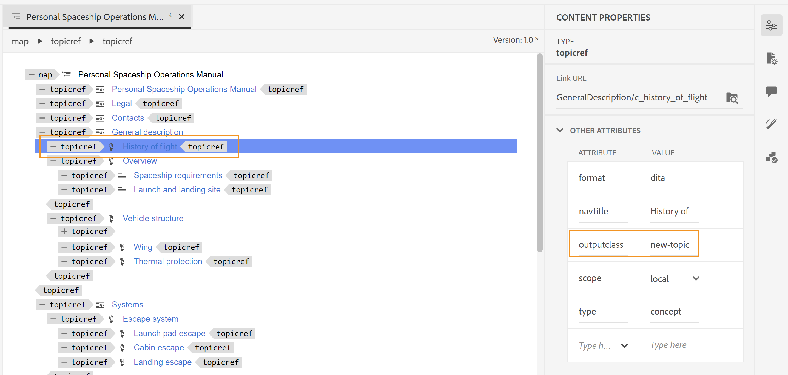
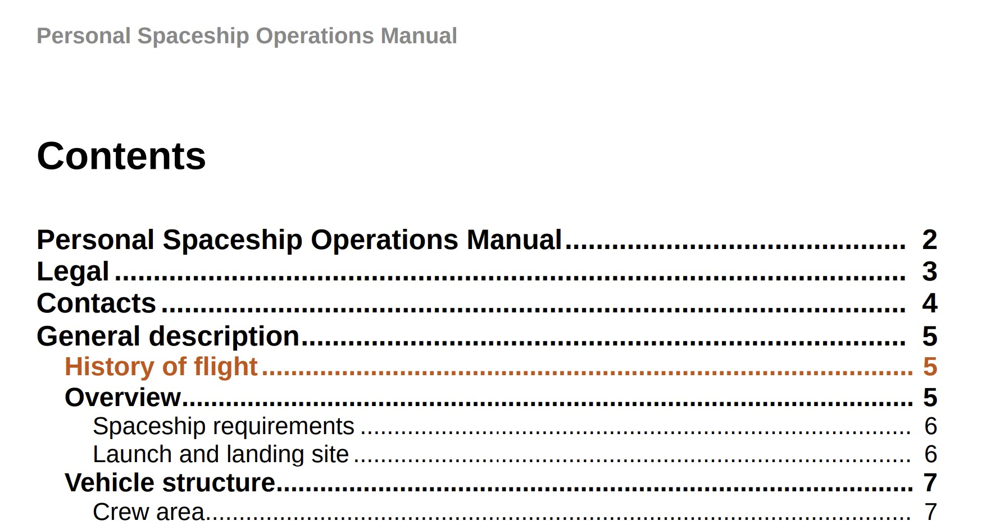

# Application d’un style personnalisé aux entrées de la table des matières et au contenu de la rubrique

Parfois, vous pouvez appliquer un style personnalisé aux entrées de la table des matières ou à une rubrique particulière. Pour ce faire, associez un attribut `outputclass` à l&#39;élément `<topicref>` dans votre plan DITA. En outre, si vous souhaitez appliquer un format personnalisé à une rubrique entière, vous pouvez également y parvenir en étendant la définition de style de l’attribut dans le CSS.

Prenons un exemple de nouveau sujet que vous souhaitez envoyer pour révision. Pour identifier facilement la rubrique mise à jour, vous devez ajouter un attribut `outputclass` à l&#39;élément `<topicref>` dans votre plan DITA, puis définir un style personnalisé pour celui-ci dans le CSS.

Dans l’exemple suivant, un attribut `outputclass` a été affecté à la rubrique *Historique des vols* avec la valeur `new-topic`.



La définition de classe du `new-topic` dans un CSS peut vous permettre de définir le style des éléments suivants :
* Entrée principale de la table des matières ou de la mini-table des matières
* Titre de la rubrique dans le contenu principal
* L’intégralité du contenu de la rubrique, y compris le titre

Voyons comment chacun de ces scénarios peut être défini dans le CSS. Dans la définition CSS suivante de la classe `new-topic`, la couleur du texte a été modifiée.

```css
…
.new-topic {
  color: #CC5309
}
…
```

Cette définition contrôle la couleur du texte dans la table des matières et le titre de la rubrique. La sortie PDF ci-dessous affiche la couleur différente appliquée à l’entrée de la table des matières :



Le titre du sujet est également stylisé à l’aide de la même couleur.


Si vous souhaitez que l’entrée de la table des matières et le titre du sujet aient des styles différents, vous pouvez les définir séparément, comme illustré ci-dessous :

```css
...
/*for styling TOC entry */
.new-topic {
  color: #CC3509
}

/* for styling topic's title */
.new-topic.title {
  color: #092ACC
}
...
```

Enfin, vous pouvez également appliquer des styles à l’ensemble du contenu dans la rubrique. Pour cela, vous devez ajouter un suffixe « `-content` » au nom de la classe. Dans l&#39;exemple suivant, une barre de modification a été ajoutée sur l&#39;ensemble du contenu de la rubrique :

```css
...
/* for styling the topic's content */
.new-topic-content {
  -ro-change-bar-color: #A609CC;
}
...
```

À l’aide des attributs de style ci-dessus, une barre de modification est ajoutée à gauche de la rubrique *Historique des vols*, comme illustré ci-dessous :


## Supprimer les lignes vides de la table des matières

Si vous n’avez défini le titre d’aucune rubrique, des lignes vides apparaissent dans la table des matières pour ces rubriques.

Pour supprimer les lignes vides de la table des matières et de la mini table des matières, ajoutez le style suivant dans la `layout.css` :

```css
.toc-body a:empty,
.chaptoc-body a:empty {
    display: none;
} 
```

