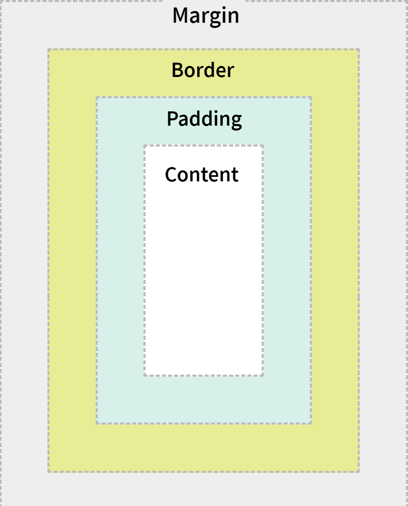
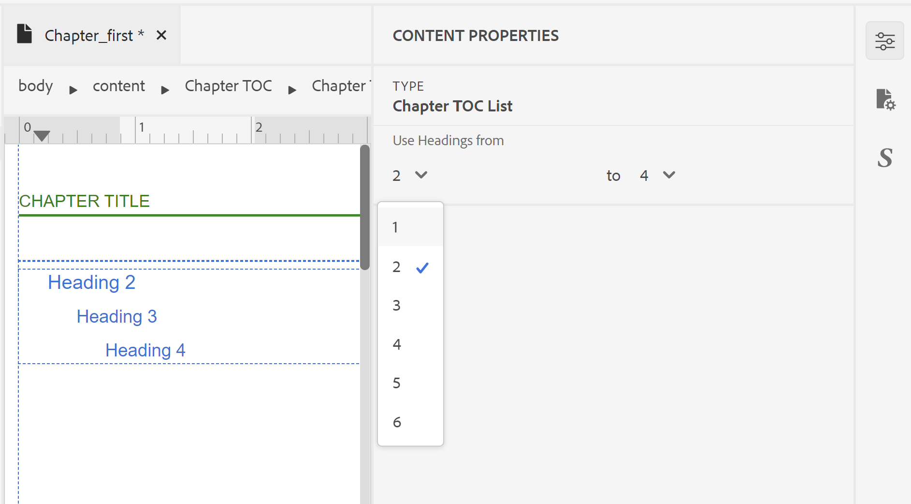

# Concevoir une mise en page {#design-page-layout}

Lors de la création d’un document de PDF, vous disposez de différentes sections pour présenter différents types d’informations. Par exemple, un document de PDF commence à partir d’une page d’accueil ou d’une page de couverture, qui contiendra le logo de votre entreprise, le titre du livre ou les informations sur la version. Ensuite, il y avait des chapitres, des annexes ou des pages de glossaire. Chaque section d’un document de PDF a un aspect différent. Pour ce faire, créez et personnalisez la mise en page.

Lorsque vous concevez la mise en page, vous pouvez définir les différents éléments qui constituent une page. Par exemple, vous pouvez définir la taille, les marges, l’en-tête et le pied de page, l’orientation et d’autres spécifications de page sur une page. La fonction Publication de PDF natif vous permet de concevoir votre page conformément aux [ normes de médias de page ](https://www.w3.org/TR/css-page-3/). La plupart des paramètres couverts par les normes de médias paginés peuvent être facilement personnalisés à l’aide de l’interface utilisateur de la fonction Publication de PDF natif . Pour une autre mise en forme de niveau avancé, vous pouvez utiliser la vue Source pour écrire votre propre code CSS.

Une fois que vous avez conçu les mises en page, vous devez associer ces mises en page à leurs sections respectives dans les paramètres de mise en page de PDF. Pour plus d’informations sur la création et l’ouverture d’une mise en page à des fins de personnalisation, reportez-vous à la section [Créer et personnaliser des mises en page](components-pdf-template.md#create-customize-page-layout) .

## Types de mise en page {#types-of-page-layout}

Un document PDF contient généralement les sections suivantes :

* Page de couverture
* Table des matières
* Effet élévateur de chiffres
* Effet élévateur des tableaux
* Pages de chapitre ou de rubrique
* Glossaire
* Index
* Page précédente

Ces sections doivent avoir une mise en page correspondante pour présenter les informations dans un format spécifique. En outre, vous pouvez également disposer d’une page vierge qui est utilisée comme remplissage pour commencer un nouveau chapitre à partir d’une page impaire ou paire. Dans ce cas, vous pouvez utiliser la mise en page par défaut ou créer une mise en page pour une page vierge. Pour plus d’informations, voir [Création d’une mise en page](components-pdf-template.md#create-page-layout) .

Les paramètres Mise en page des pages de la section **Modèle>Paramètres** vous permettent de définir la mise en page à utiliser pour différentes sections de votre PDF. Chaque mise en page peut également comporter des variantes de première, de droite ou de gauche.

### Créer les premières variantes de mise en page de page droite ou gauche {#page-layout-variants}

Il est possible de personnaliser davantage différentes mises en page de votre modèle de PDF en proposant différentes variantes de mise en page de première, de droite ou de gauche. Vous pouvez concevoir ces pages différemment à l’aide du concepteur de mises en page.

>[!NOTE]
>
>Si vous souhaitez qu’une seule page soit mise en page pour une section de votre livre, il n’est pas nécessaire de créer les mises en page Première, Droite ou Gauche.

Tenez compte des points suivants lors de la création des mises en page :

>[!NOTE]
>
>Les points suivants ont pris comme exemple la mise en page de la page Chapitre . Cependant, ces points sont également valides pour d’autres mises en page.

* Si vous souhaitez utiliser une seule mise en page pour toutes les pages d’un chapitre, vous ne créez qu’une seule mise en page de chapitre sans aucune variante.

* Si vous souhaitez avoir une apparence différente pour la première page des chapitres de votre livre, vous devez créer une variante de mise en page Première page pour vos chapitres.

* Si vous souhaitez avoir une apparence différente pour chaque page latérale gauche et droite de votre livre, vous devez créer les variantes latérales gauche et droite pour la mise en page de votre page de chapitre.

* Si vous souhaitez que vos chapitres commencent à partir d’une page paire ou impaire, vous pouvez choisir de créer une mise en page pour la page vierge. Cette mise en page est utilisée pour combler l’écart entre deux chapitres afin de s’assurer que le chapitre commence à partir de la page impaire ou paire souhaitée.

  >[!NOTE]
  >
  >Si vous ne créez pas de mise en page vierge distincte, la mise en page par défaut est utilisée. Pour créer une mise en page, reportez-vous à la section [Création d’une mise en page](components-pdf-template.md#create-page-layout).

L’exemple suivant vous guide tout au long du processus de création de variantes d’une mise en page :

1. Créez une mise en page &quot;Chapitre&quot; en suivant les étapes de la procédure &quot;Créer une mise en page&quot;.

   Une mise en page de chapitre vierge est créée et ajoutée sous les mises en page de page.

   Par défaut, lorsque vous créez une mise en page, elle est également ouverte pour modification. La capture d’écran suivante affiche une mise en page vierge (par défaut) :

   

   L’en-tête, le pied de page et la zone de contenu d’un modèle sont créés par défaut. Vous pouvez facilement personnaliser ces zones à l’aide des propriétés de page, des propriétés de contenu et de divers outils (comme l’insertion d’images, de champs, etc.) fournis dans l’interface utilisateur.

   >[!NOTE]
   >
   >Pour une configuration avancée, vous pouvez utiliser la vue Source et ajouter votre HTML personnalisé et votre code CSS.

1. Passez la souris sur la disposition **Chapitre** et cliquez sur **Options** pour afficher le menu contextuel.

1. Passez la souris sur **Ajouter une variante de mise en page** et choisissez la mise en page souhaitée (Première, Gauche ou Droite) que vous souhaitez créer.

La mise en page sélectionnée est créée à l’aide d’une copie de la mise en page de chapitre de base. En d’autres termes, si vous avez apporté des modifications à la mise en page par défaut du chapitre, les mêmes modifications sont répliquées dans la mise en page des variantes au moment de la création de la mise en page.

## Utilisation des propriétés de page d’une mise en page {#page-props-page-layout}

Lors de la conception d’une mise en page, un contrôle sur les différentes propriétés de page est essentiel. La fonction Publication de PDF natif englobe toutes les propriétés principales de la page dans le panneau Propriétés de la page . Le panneau Propriétés de page permet d’accéder à diverses propriétés dans les sections suivantes :

>[!NOTE]
>
>Le panneau Propriétés de la page encapsule les propriétés et suit les règles définies sous les [standards de médias de page](https://www.w3.org/TR/css-page-3/).

* **Taille de page** : spécifiez la taille de page à utiliser pour la mise en page. La liste déroulante Taille de page vous permet de choisir parmi plus de 15 formats de page. Vous pouvez également créer une mise en page à l’aide d’une taille de page personnalisée. Pour plus d’informations, reportez-vous à la section [Définition de la taille de page](#set-page-size) .

* **Orientation** : spécifiez l’orientation de page à utiliser pour la mise en page. Vous pouvez choisir parmi les orientations de page Portrait ou Paysage. Notez que vous pouvez choisir d’appliquer différentes orientations à différentes variantes de page dans une mise en page. Par exemple, si votre contenu contient un tableau large ou une image volumineuse, vous pouvez créer une mise en page paysage et l’appliquer au tableau ou à l’image plus large.

* **Afficher la rotation** : spécifiez le côté ou la direction dans lequel le côté supérieur d’origine est représenté après la rotation. Vous pouvez choisir entre 90, 90 ou 90 dans le sens des aiguilles d’une montre ou 180 degrés dans le sens inverse des aiguilles d’une montre. Cela s’avère très utile lorsque vous souhaitez utiliser une combinaison de mises en page Portrait et Paysage dans votre sortie. Par exemple, vous pouvez utiliser le format portrait comme mise en page générique et définir une mise en page paysage pour le rendu de tableaux larges. Dans ce cas, vous pouvez définir pour afficher le contenu du tableau dans le sens des aiguilles d’une montre à 90 degrés. Ainsi, la page sera orientée en mode paysage et le contenu sera pivoté de 90 degrés afin de maintenir la continuité dans la vue. Nous verrons comment y parvenir à titre d’exemple dans la suite de cette section.

* **Numérotation de page** : la numérotation des pages, par défaut, est continue dans un PDF. Par exemple, un PDF de 100 pages peut avoir des numéros de page continus de 1 à 100. Vous pouvez également redémarrer la numérotation à partir d’un numéro spécifique dans toutes les différentes sections ou à partir de la première occurrence d’une section.
   * **Redémarrer à partir de** : indiquez le numéro de page à partir duquel commencera la numérotation de cette mise en page. Par exemple, vous pouvez définir le numéro de page à redémarrer pour chaque chapitre. Dans ce cas, vous devez définir le redémarrage de la propriété sur 1 sur la variante Première mise en page de la mise en page du chapitre. Par défaut, la numérotation des pages se poursuit à partir de la page précédente.

   * **Appliquer à la première occurrence uniquement** : vous pouvez également commencer à partir d’un nombre spécifique uniquement pour la première occurrence d’une section. Par exemple, vous ne pouvez commencer que le premier chapitre à partir de 1 et continuer les numéros de page des autres chapitres.

* **Disposition** : spécifiez des marges de page avec marge intérieure pour les bords supérieur, inférieur, gauche et droit. L’illustration suivante explique comment les marges, la marge intérieure et les bordures sont générées autour du contenu. Notez que la marge en haut et en bas d’une page contient l’en-tête et le pied de page.

  

* **Arrière-plan** : incluez une image ou une couleur comme arrière-plan de la mise en page. Pour une image, vous pouvez spécifier la hauteur et la largeur de l’image, ainsi que les propriétés de répétition et de position.

* **Note de bas de page** : spécifiez les propriétés à afficher dans la sortie pour les notes de bas de page. Vous pouvez choisir de spécifier les propriétés de marge et de marge intérieure avec un style de bordure.

### Définir la taille de page {#set-page-size}

La première chose que vous devez définir dans une mise en page est la taille de la page. Dans les Propriétés de page, vous pouvez choisir plus de 15 formats de page pour une mise en page. Vous pouvez également créer une taille de page personnalisée en procédant comme suit :

1. Ouvrez la mise en page requise pour la modifier.

   >[!NOTE]
   >
   >Voir la section [Personnaliser une mise en page](components-pdf-template.md#customize-page-layout) pour ouvrir une mise en page à des fins de personnalisation ou de modification.

1. Dans le panneau de droite, cliquez sur **Propriétés de page**.
1. Dans la liste déroulante **Page Size**, sélectionnez **Personnalisé**.

   Les champs Largeur de page et Hauteur de page s’affichent.

1. Saisissez les dimensions de page souhaitées dans les champs **Largeur de page** et **Hauteur de page** .

   >[!NOTE]
   >
   >Certaines des unités les plus couramment utilisées sont px (pixels), pt (points), rem, em, % (pourcentage) et in (pouces).

### Utilisation de l’orientation de page et de la rotation des vues {#page-orientation-rotation}

Examinons un exemple dans lequel une combinaison de l’orientation portrait et paysage des pages et des propriétés de rotation des vues est utilisée. Dans cet exemple, nous allons créer un PDF avec une orientation portrait par défaut, mais un tableau sera rendu en orientation paysage avec du contenu dans une vue à 90 degrés dans le sens des aiguilles d’une montre. La sortie finale ressemble à ce qui suit :


Dans la sortie ci-dessus, les informations de la liste de contacts sont présentées en mode paysage avec un contenu également pivoté de 90 degrés. Le contenu restant s’affiche en mode portrait normal.

Pour obtenir ce type de sortie, nous devons exécuter les tâches principales suivantes :

1. Créez une mise en page avec l’orientation Paysage.

1. Modifiez la propriété **View Rotation** pour afficher le contenu dans 90°.

1. Créez un style personnalisé pour utiliser la nouvelle mise en page.

1. Ajoutez le style dans la définition de classe de sortie du tableau que nous voulons rendre dans la mise en page paysage.

Effectuez les étapes suivantes pour réaliser les tâches ci-dessus :

1. Créez une mise en page avec l’orientation Paysage.
   1. Créez une mise en page &quot;Paysage&quot; en suivant les étapes de la procédure &quot;Créer une mise en page&quot;.

   1. Dans le panneau de droite, cliquez sur **Propriétés de page**.

      
   1. Remplacez le **Orientation** par **Paysage**.

1. Modifiez la propriété View Rotation pour effectuer le rendu du contenu dans le sens 90° horaire.

   1. Sélectionnez **Clockwise 90°** dans la liste déroulante Afficher la rotation .
   

   1. Cliquez sur **Enregistrer tout** pour enregistrer les propriétés de mise en page mises à jour.

1. Créez un style personnalisé pour utiliser la nouvelle mise en page.
   1. Développez la barre latérale gauche et double-cliquez sur le modèle dans lequel vous souhaitez créer le style.

   1. Développez la section Feuilles de style .

   1. Pointez sur la feuille de style Mise en page, cliquez sur l’icône (_Options_)... et choisissez Modifier.

      La feuille de style Mise en page est ouverte pour modification.

   1. Cliquez avec le bouton droit de la souris sur **Autres styles** et choisissez **Nouveau style**.
      

   1. Dans la fenêtre contextuelle Ajouter un style, saisissez **paysage-style** dans le **nom de classe**.
      

   1. Cliquez sur **Terminé**.

      Un nouveau style nommé `.landscape-style` est créé et ajouté à la fin de la liste Autres styles .

   1. Double-cliquez sur le style `.landscape-style` pour l’ouvrir en mode d’édition.

   1. Développez la propriété **Pagination**.

   1. Saisissez `Landscape` dans la propriété **Page Layout**.

      

   1. Cliquez sur **Enregistrer tout** pour enregistrer les propriétés de style mises à jour.

1. Ajoutez le style dans la définition `outputclass` de la table dont nous voulons effectuer le rendu dans la mise en page paysage.
   1. Dans un éditeur de fichier DITA, ouvrez le fichier dans lequel vous souhaitez appliquer la nouvelle mise en page.

   1. Recherchez l’élément `<table>` qui doit être rendu en mode Paysage.

   1. Dans le chemin de navigation, cliquez sur l’élément de tableau pour sélectionner le tableau.

      

   1. Dans le panneau de droite, cliquez sur , puis ouvrez le panneau Propriétés du contenu .

   1. Dans le panneau Propriétés du contenu, ajoutez une nouvelle propriété **outputclass** avec la valeur de propriété **paysage-style**.

      

1. Cliquez sur **Enregistrer tout** pour enregistrer le fichier mis à jour.
1. Générez la sortie du PDF.

Le contenu du tableau est rendu en mode paysage dans le PDF final, comme indiqué au début de l’exemple.

### Ajout d’une image d’arrière-plan {#add-bg-image}

Selon vos besoins, vous pouvez ajouter une image d’arrière-plan qui s’affiche sur chaque première page d’une sortie de chapitre (PDF). Les propriétés Arrière-plan sous Propriétés de la page vous permettent d’ajouter facilement une image d’arrière-plan. Vous pouvez choisir de répliquer cette image sur une page et de la positionner n’importe où dans la zone supérieure, inférieure ou centrale de la page.

Par exemple, pour insérer une image d’arrière-plan dans la partie centrale de votre zone de contenu, procédez comme suit :

1. Ouvrez la mise en page requise pour la modifier.

   >[!NOTE]
   >
   >Voir la section [Personnaliser une mise en page](components-pdf-template.md#customize-page-layout) pour ouvrir une mise en page à des fins de personnalisation ou de modification.

1. Cliquez n’importe où dans la zone de contenu.

1. Dans le panneau de droite, cliquez sur **Propriétés de page**.

1. Développez la section **Arrière-plan** .

1. Cliquez sur le bouton Parcourir dans le champ d’emplacement **Chemin de l’image**.

1. Recherchez et sélectionnez l’image à utiliser comme image d’arrière-plan.

   L’image est insérée et répliquée pour couvrir la page entière.

1. Modifiez la taille de l’image en ajustant les propriétés de hauteur et de largeur.

   >[!NOTE]
   >
   >Vous pouvez saisir les propriétés de hauteur ou de largeur, car l’image est automatiquement mise à l’échelle pour conserver les proportions.

1. Définissez les autres propriétés pour ajuster la manière dont vous souhaitez que l’image d’arrière-plan s’affiche.

   * **Répétition en arrière-plan** : indiquez si vous souhaitez que l’arrière-plan se répète ou non.

   * **Position de l’arrière-plan** : spécifiez la position de l’image d’arrière-plan sur votre page.

La capture d’écran suivante affiche l’image d’arrière-plan avec la propriété Background Repeat définie sur _no-repeat_ et la propriété Background Position définie sur _center_.


## Utilisation de l’en-tête et du pied de page {#work-header-footer}

Lorsque vous incluez des informations dans un en-tête ou un pied de page dans une mise en page, ces informations sont répétées sur toutes les pages utilisant cette mise en page. En règle générale, la zone d’en-tête est utilisée pour le titre du chapitre ou de la rubrique et la zone de pied de page pour l’affichage des numéros de page.

Lorsque vous créez une mise en page, la zone d’en-tête et de pied de page est créée par défaut. Vous pouvez effectuer de nombreuses personnalisations dans la zone d’en-tête et de pied de page d’une mise en page. Vous pouvez par exemple insérer une image (comme un logo), des variables (contenant des informations dynamiques) ou du contenu statique.

### Modification des marges et des lignes de l’en-tête et du pied de page {#header-footer-margins}

Par défaut, les marges de l’en-tête et du pied de page sont définies sur 1 pouce. Vous pouvez modifier cette valeur par défaut en modifiant le paramètre Marge dans le panneau Propriétés de la page . Effectuez les étapes suivantes pour modifier la taille de l’en-tête et du pied de page :

1. Ouvrez la mise en page requise pour la modifier.

   >[!NOTE]
   >
   >Voir la section [Personnaliser une mise en page](components-pdf-template.md#customize-page-layout) pour ouvrir une mise en page à des fins de personnalisation ou de modification.

1. Dans le panneau de droite, cliquez sur **Propriétés de page**.
1. Développez la section **Disposition** .
1. Cliquez sur l’icône de verrouillage en regard de la propriété **Margin**.
1. Pour modifier la taille de l’en-tête, saisissez la valeur souhaitée dans le champ Marge supérieure .

   >[!NOTE]
   >
   >Certaines des unités les plus couramment utilisées sont px (pixels), pt (points), rem, em, % (pourcentage) et in (pouces).

1. Pour modifier la taille du pied de page, saisissez la valeur souhaitée dans le champ Marge inférieure .

Vous pouvez concevoir la zone d’en-tête et de pied de page qui contiendra plusieurs lignes. Pour ce faire, ajoutez une balise \&lt;p\> à l’aide de l’option Insérer des éléments d’HTML () dans la zone d’en-tête ou de pied de page.

| _Developer Corner_ :  |
|---|

Si vous souhaitez travailler directement avec le code CSS et d’HTML, vous pouvez modifier les valeurs de marge comme illustré dans le fragment de code suivant :

```css
…

<meta name="page-style" content="size:A4 portrait;margin-top:3cm;margin-right:30pt;margin-bottom:1in;margin-left:90px;" />

…
```

>[!NOTE]
>
>Dans l&#39;exemple ci-dessus, différentes unités sont utilisées pour spécifier les valeurs de marge.

### Suppression de l’en-tête et du pied de page {#remove-header-footer}

L’en-tête et le pied de page sont superposés dans les marges supérieure et inférieure. Techniquement, cela signifie que si vous souhaitez avoir un en-tête et un pied de page dans la mise en page, vous devez réserver l’espace nécessaire dans les marges supérieure et inférieure.

Si vous ne souhaitez pas qu’une mise en page comporte un en-tête et un pied de page, deux méthodes sont possibles :

* Si vous souhaitez conserver les marges supérieure et inférieure, laissez la zone d’en-tête et de pied de page vide.
* Si vous ne souhaitez pas conserver les marges supérieure et inférieure (comme la conception de la couverture avant et arrière d’un magazine), vous pouvez supprimer les marges en définissant les propriétés de marge supérieure et inférieure sur 0. L’en-tête et le pied de page n’ont alors plus d’espace.

### Ajouter une image ou un logo dans l’en-tête {#add-image-header}

Selon vos besoins, vous pouvez ajouter une image qui s’affiche dans la zone d’en-tête (ou toute autre partie) de la mise en page. Vous pouvez ajouter une image dans la mise en page de deux façons :

* Utilisez une image provenant des ressources du modèle.
* Utilisez l’outil \&lt;Ajouter une image\> dans l’éditeur de mise en page.

>[!NOTE]
>
>Il est recommandé d’utiliser le dossier Ressources pour gérer toutes vos ressources de modèle, telles que les images ou les polices.

Pour insérer une image telle que le logo de votre entreprise dans la zone d’en-tête, procédez comme suit :

1. Ouvrez la mise en page requise pour la modifier.

>[!NOTE]
>
>Voir la section [Personnaliser une mise en page](components-pdf-template.md#customize-page-layout) pour ouvrir une mise en page à des fins de personnalisation ou de modification.

1. Cliquez sur Modifier l’en-tête () pour placer le curseur dans la zone d’en-tête.

   Vous pouvez également cliquer à l’intérieur de la zone d’en-tête.

1. Pour ajouter une image, sélectionnez l’une des méthodes suivantes :
1. Cliquez sur le bouton **Inert Image** () dans la barre d’outils. Dans la fenêtre contextuelle **Sélectionner le chemin**, accédez à l’emplacement de l’image et cliquez sur **Sélectionner** pour l’insérer dans la zone d’en-tête.
1. Faites glisser et déposez une image du dossier Ressources dans la zone d’en-tête.

La capture d’écran suivante présente un exemple d’image ajoutée à la zone d’en-tête.


Une fois qu’une image est insérée, vous pouvez modifier ses attributs pour lui donner l’apparence souhaitée. La méthode la plus simple pour modifier l’aspect d’une image ou de tout autre élément de votre mise en page consiste à utiliser le panneau Propriétés du contenu . Voir [Utilisation du panneau Propriétés du contenu](#work-with-content-props) pour connaître les différentes propriétés disponibles par le biais de l’interface utilisateur à personnaliser.

### Ajout de champs et de métadonnées {#add-fields-metadata}

Les champs sont très utiles lorsque vous souhaitez insérer une information prédéfinie. Par exemple, vous pouvez inclure un champ Titre du chapitre dans la zone d’en-tête de votre chapitre qui est remplacé par le titre réel du chapitre une fois publié.

Il existe les catégories suivantes pour les champs que vous pouvez insérer dans la mise en page :

* Métadonnées
* Titre de la rubrique
* Titre du chapitre
* Titre de la carte
* Numéro de page
* Numéro de chapitre
* Nombre total de pages
* Date 
* estimé


Chacune de ces catégories de champs contient différentes variantes dans lesquelles les informations du champ peuvent être insérées. Par exemple, un champ Date peut avoir différentes variations telles que `YYYY-MM-DD`, `MM/DD/YY`, `MM/DD/YYYY`, etc. De même, le numéro de page peut avoir des variations sous la forme de formats romains, décimaux ou même spécifiques à des paramètres régionaux tels que _Arabic_, _Devanagari_, _Hebrew_, etc.


Outre les champs prédéfinis, vous pouvez ajouter des informations de métadonnées sous la forme de variables ou de champs dans la mise en page. Ces métadonnées sont stockées dans le DITA source **Contenu de la carte**, ou elles peuvent être sélectionnées dans les **propriétés du fichier de carte** de la DITA ou les **propriétés du fichier de rubrique** et facilement insérées dans la mise en page.

Vous pouvez sélectionner les métadonnées parmi les options suivantes :

* **Le contenu de la carte** comprend les métadonnées que vous avez définies dans l’élément `<topicmeta>` de la carte DITA.
* **Les propriétés du fichier de carte** incluent les métadonnées, auxquelles vous pouvez accéder à partir de la page **Propriétés** d’un mappage DITA.
* **Les propriétés du fichier de rubrique** incluent les métadonnées, auxquelles vous pouvez accéder à partir de la page **Propriétés** d’une rubrique.


Vous pouvez combiner des métadonnées à partir des **propriétés de fichier de carte** et des **propriétés de fichier de rubrique** dans un seul document. Par exemple, vous pouvez publier un PDF avec le titre de mappage sur la page de couverture et le titre de rubrique dans l’en-tête d’autres pages. Pour ce faire, vous pouvez ajouter les métadonnées de titre de mappage des **Propriétés du fichier de mappage** à la mise en page de garde. Ajoutez ensuite les métadonnées de titre de rubrique des **propriétés du fichier de rubrique** à l’en-tête dans la mise en page Chapitres et rubriques.

Si une rubrique se termine sur une page, tandis que l’autre commence sur la même page, les métadonnées de la première rubrique sont sélectionnées. Vous pouvez également ajouter des propriétés personnalisées, puis les insérer en tant que champs dans la mise en page.


>[!NOTE]
>
> Les champs de métadonnées s’affichent en fonction de votre sélection de ressources ou de mappage dans la liste déroulante **De**.


<!--For more information, see [Add fields and metadata](design-page-layout.md#add-fields-and-metadata).-->

Dans l’exemple suivant, nous allons insérer un numéro de page et un titre de chapitre dans la zone de pied de page d’une mise en page.

1. Ouvrez la mise en page requise pour la modifier.

   >[!NOTE]
   >
   >Voir la section [Personnaliser une mise en page](components-pdf-template.md#customize-page-layout) pour ouvrir une mise en page à des fins de personnalisation ou de modification.

1. Cliquez sur l’icône **Modifier le pied de page** () pour placer le curseur dans la zone de pied de page.

   Vous pouvez également cliquer à l’intérieur de la zone de pied de page.

1. Insérez un élément de paragraphe en cliquant sur **Insérer des éléments d’HTML** () et en sélectionnant Paragraphe dans la liste des éléments.

1. Cliquez sur l’icône **Insérer des champs** ().

   La fenêtre contextuelle Champs s’affiche.

1. Sélectionnez la catégorie **Numéro de page** dans la liste Champ, le format de numéro de page **default(1)** dans la liste Format, puis cliquez sur **Insérer**.

   

   >[!NOTE]
   >
   >Vous pouvez également éditer le format de tous les champs, à l&#39;exception du format par défaut. Pour ce faire, cliquez sur l’icône Modifier en regard du format à modifier, apportez des modifications, puis cliquez sur OK. Pour plus d’informations, voir [Ajout de champs et de métadonnées](#add-fields-metadata).

   Le champ du numéro de page par défaut est inséré dans la zone de pied de page de la mise en page.

   

   Le chemin de navigation supérieur répertorie les éléments dans lesquels les informations sont stockées.

1. Saisissez un espace vide après le champ du numéro de page et cliquez sur l’icône **Insérer des champs** .

1. Sélectionnez la catégorie **Titre du chapitre** dans la liste Champ, le format **Titre du chapitre** dans la liste Format, puis cliquez sur **Insérer**.

   Le champ _Titre du chapitre_, qui est renseigné avec le titre du chapitre au moment de la publication, est inséré dans la zone de pied de page. Pour l’instant, les champs numéro de page et titre du chapitre sont séparés par un espace.

   

1. Pour aligner le titre du chapitre avec le bouton droit de la souris, procédez comme suit :

   1. Cliquez sur l’élément Champ du chemin de navigation pour sélectionner le champ Titre du chapitre .

   1. Dans le panneau de droite, cliquez sur les **propriétés du contenu** ().

   1. Développez la section de propriétés **Layout** et définissez la valeur de propriété **Float** sur **right**.
      

      Le champ Titre du chapitre est aligné vers le côté droit du pied de page.
      


| _Developer Corner_ :  |
|---|

Si vous souhaitez travailler directement avec le code CSS et d’HTML, vous pouvez également y parvenir en accédant à la vue Source de la mise en page et en apportant des modifications au code. Le fragment de code suivant affiche le même paramètre de pied de page effectué via le code :

```css
…
<p>

<span data-field="page-number" data-format="default">1</span>

<span data-field="chapter-title" data-format="default" style="float: right">Chapter Title</span>

</p>
…
```

## Utilisation de la zone de contenu {#content-area}

La zone de contenu est la plus grande zone en termes d’espace de contenu. La zone de contenu est renseignée avec le contenu de votre rubrique. Dans certains cas particuliers, vous pouvez ajouter du contenu standard dans la zone de contenu. Ce contenu est publié à l’emplacement spécifié dans la mise en page. Par exemple, l’en-tête de votre table des matières, de votre glossaire et de votre index peut être ajouté sous forme de contenu standard, publié &quot;en l’état&quot; dans la sortie finale. Autre exemple : la table des matières du chapitre, généralement ajoutée à la première page de chaque chapitre.

La mise en page à plusieurs colonnes est l’une des personnalisations les plus couramment utilisées dans la zone de contenu. Grâce au puissant concepteur de mise en page, vous pouvez personnaliser des pages spécifiques pour un rendu sur plusieurs colonnes, tout en conservant le contenu sur d’autres pages dans une seule colonne.

Dans les sections suivantes, nous aborderons différents scénarios de personnalisation de la zone de contenu.

### Ajout d’une table des matières de chapitre {#add-chapter-toc}

Une table des matières de chapitre sert de référence rapide aux lecteurs pour savoir ce qu’il y a dans le chapitre. En règle générale, une table des matières de chapitre est ajoutée au tout début d’un chapitre. Ainsi, si vous souhaitez utiliser une table des matières de chapitre, vous pouvez l’ajouter dans la zone de contenu de la mise en page de chapitre principale ou de la première variante de mise en page d’un chapitre.

Dans l&#39;exemple suivant, nous allons insérer une table des matières de chapitre dans la première mise en page d&#39;un chapitre :

>[!NOTE]
>
>Pour cette procédure, on suppose que vous avez créé la variante Première page pour une mise en page de page de chapitre. Pour plus d&#39;informations sur la création d&#39;une variante de page, voir [Création des premières variantes de mise en page à droite ou à gauche](#page-layout-variants).

1. Ouvrez la mise en page requise pour la modifier.

   >[!NOTE]
   >
   >Voir la section [Personnaliser une mise en page](components-pdf-template.md#customize-a-page-layout) pour ouvrir une mise en page à des fins de personnalisation ou de modification.

1. Placez le curseur dans la zone de contenu de la mise en page.

1. Cliquez sur la table des matières du chapitre ().

   La table des matières du chapitre par défaut est insérée dans la zone de contenu.

   

   >[!NOTE]
   >
   >La table des matières du chapitre par défaut contient les en-têtes 1 à 4. Ici, Titre 1 est le Titre du chapitre lui-même. Par conséquent, vous pouvez ne plus avoir le titre du chapitre dans la table des matières ou augmenter le niveau des en-têtes que vous souhaitez dans la table des matières. Vous pouvez personnaliser la table des matières en modifiant les propriétés.

1. Ouvrez le panneau Propriétés du contenu pour personnaliser les niveaux d’en-tête de la table des matières.

   Par exemple, si vous souhaitez commencer à partir de En-tête 2, modifiez la première liste déroulante pour qu’elle commence à 2.

   

   De même, si vous souhaitez obtenir des en-têtes jusqu’au niveau 5, modifiez la deuxième liste déroulante en 5. La table des matières mise à jour s’affiche comme illustré ci-dessous :

   

   >[!NOTE]
   >
   >Le PDF publié final n’affichera que les entrées de la table des matières en fonction du contenu de vos chapitres. Si aucun titre de niveau 5 n’apparaît dans un chapitre, il ne sera pas affiché dans la sortie finale.

L’aspect de la table des matières par défaut peut être personnalisé à l’aide des feuilles de style. Le style commençant par `chaptoc-level-#` (comme `chaptoc-level-1`, `chaptoc-level-2`, etc.) est utilisé pour personnaliser les styles de la table des matières du chapitre. <!--For more details on the stylesheet elements used in the TOC and how to customize them, see _Customize default chapter TOC_-->.

>[!IMPORTANT]
>
>Actuellement, si vous effectuez des mises à jour de style dans une feuille de style, il se peut qu’elles ne soient pas répercutées dans l’aperçu du contenu. Toutefois, la sortie est générée avec les styles mis à jour.

### Utilisation de la mise en page à plusieurs colonnes {#multi-column-layout}

Les mises en page à plusieurs colonnes sont très courantes dans les magazines de publication ou les index d’un livre. La fonction Publication avec PDF natif vous permet de fractionner facilement votre document en plusieurs colonnes. En utilisant différentes mises en page, vous pouvez choisir de ne conserver qu’une section spécifique divisée en plusieurs colonnes, tout en conservant les autres sections dans une seule mise en page colonne (ou normale).

Pour créer une mise en page avec plusieurs colonnes, procédez comme suit :

1. Ouvrez la mise en page requise pour la modifier.

   >[!NOTE]
   >
   >Voir la section [Personnaliser une mise en page](components-pdf-template.md#customize-a-page-layout) pour ouvrir une mise en page à des fins de personnalisation ou de modification.

1. La mise en page à plusieurs colonnes étant appliquée au contenu, à l’exception de la zone d’en-tête et de pied de page, vous devez sélectionner l’élément de contenu dans le chemin de navigation.

   Une fois que vous avez sélectionné le chemin de navigation du contenu, le panneau Propriétés du contenu affiche les propriétés de plusieurs colonnes.

   

1. Utilisez les propriétés à plusieurs colonnes pour personnaliser la mise en page à plusieurs colonnes :

   * **Nombre de colonnes :** Spécifiez le nombre de colonnes pour diviser la page. Utilisez les flèches haut et bas ou saisissez un nombre pour définir le nombre de colonnes.

   * **Largeur de colonne :** Spécifiez la largeur d’une colonne dans une mise en page à plusieurs colonnes. Par défaut, la taille est définie en pixels (px), vous pouvez également la spécifier en pt, rem, em, % ou en unités.

     >[!NOTE]
     >
     >Si vous ne spécifiez pas de taille, les colonnes sont divisées uniformément pour s’adapter à la page donnée. Dans la plupart des cas, il n’est pas nécessaire de spécifier cette valeur.

   * **Graphique de colonnes** : spécifiez l’espace entre les colonnes individuelles.

   * **Étendue de colonne** : si vous souhaitez que l’un des éléments de la mise en page s’étende sur plusieurs colonnes, vous devez utiliser cette propriété. Pour ce faire, modifiez le style de l’élément souhaité à l’aide des feuilles de style. <!--for more information see _Section explaining style customization_-->.

   Dans votre mise en page, si vous souhaitez qu’un certain texte apparaisse sur la première page de toutes les mises en page de page de chapitre, vous pouvez l’ajouter à la variante Première page de la mise en page de chapitre.

   Comme illustré dans l’exemple suivant, la propriété Span Column du texte du titre est définie sur all. Ainsi, même si le document comporte plusieurs colonnes, l’en-tête s’étend sur plusieurs colonnes.

   

   >[!IMPORTANT]
   >
   >Vous pouvez appliquer la propriété Span Column à n’importe quel élément DITA à l’aide de l’attribut outputclass .

   * **Remplissage de colonne** : spécifiez le mode de remplissage des colonnes par le contenu. Par défaut, il est défini sur Équilibrage qui remplit chaque colonne avec un contenu égal.

   * **Règle de colonne** : si vous souhaitez qu’une ligne se trouve entre les colonnes, utilisez cette propriété pour définir les styles de ligne ou de règle. Spécifiez les valeurs des options Style, Couleur et Largeur de règle pour ajouter une ligne entre les colonnes.

## Utilisation du panneau Propriétés du contenu {#work-with-content-props}

Le panneau Propriétés du contenu vous permet de mettre facilement à jour l’aspect des éléments de votre mise en page. Les propriétés du panneau Propriétés du contenu sont divisées en plusieurs sections :

* **Font** : contient des propriétés liées au texte. Vous pouvez définir la famille de polices, le poids, la taille, la décoration de texte (comme souligné, surligné, ligne publicitaire), le style de texte (comme gras, italique, etc.), l’alignement du texte (comme à gauche, à droite, au centre ou justifié), gérer les espaces blancs (comme le format prédéfini, l’absence de retour automatique à la ligne, l’espace de début, l’interlettrage et l’insertion de texte.

* **Bordure** : contient des propriétés permettant d’ajouter et de formater une bordure à un élément dans la mise en page. Vous pouvez définir le côté de la bordure (comme tout, haut, bas, droite ou gauche), le style de la bordure (comme des lignes pleines, en pointillés, en pointillés ou plus), la couleur de la bordure, la largeur et le rayon pour obtenir une bordure incurvée. Dans l’exemple suivant, une bordure incurvée a été ajoutée dans la zone d’en-tête de la page.

  

* **Mise en page** : contient des propriétés pour configurer la mise en page d’un élément dans la mise en page. Vous pouvez définir la hauteur, la largeur, les marges et la marge (pour le haut, le bas, la gauche ou la droite), l’alignement horizontal ou vertical, le flottement (comme gauche, la droite ou aucune), le effacement (comme gauche, droite, les deux ou aucune), la position de l’élément (comme absolu, fixe, relatif ou plus), l’affichage (comme bloc, contenu, fixe ou plus), l’index Z, la transparence, la transformation (par rotation ou ) et Transformer l’origine (en décalé X et Y).

* **Arrière-plan** : contient des propriétés pour inclure une image d’arrière-plan ou un nuage de couleur. Vous pouvez définir la Taille de l’image (en définissant la Hauteur ou la Largeur), la Répétition en arrière-plan (en répétition, sans répétition, arrondie ou plus) et la Position en arrière-plan (en haut à gauche, au centre, au centre en bas ou plus).
* **Plusieurs colonnes** : contient des propriétés permettant de configurer des propriétés à plusieurs colonnes pour la page ou tout élément spécifique, tel que la table des matières du chapitre. Pour plus d’informations sur les propriétés et leur utilisation, voir [Utilisation de la mise en page à plusieurs colonnes](#multi-column-layout).
