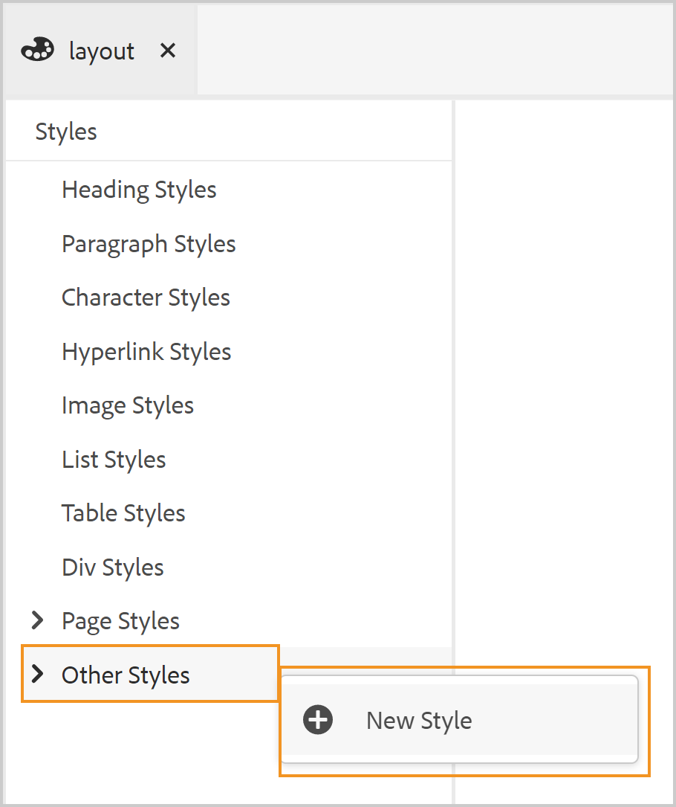
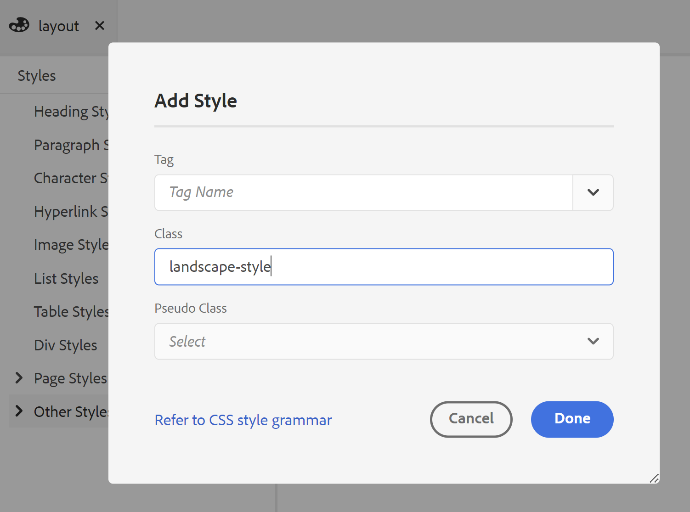
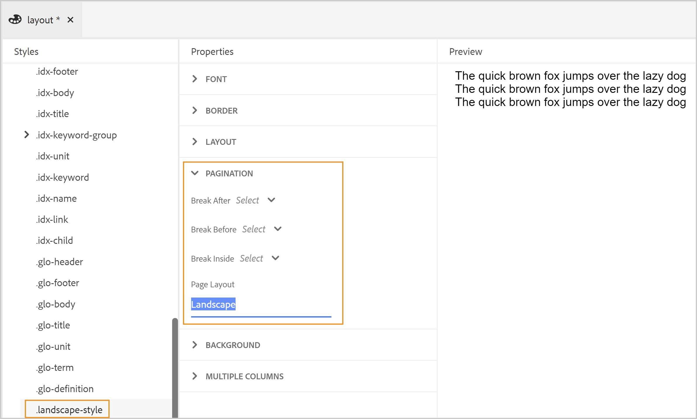
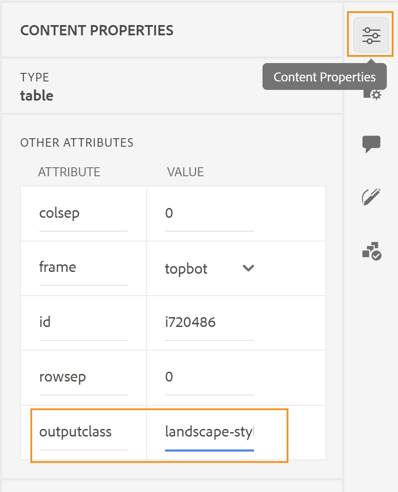
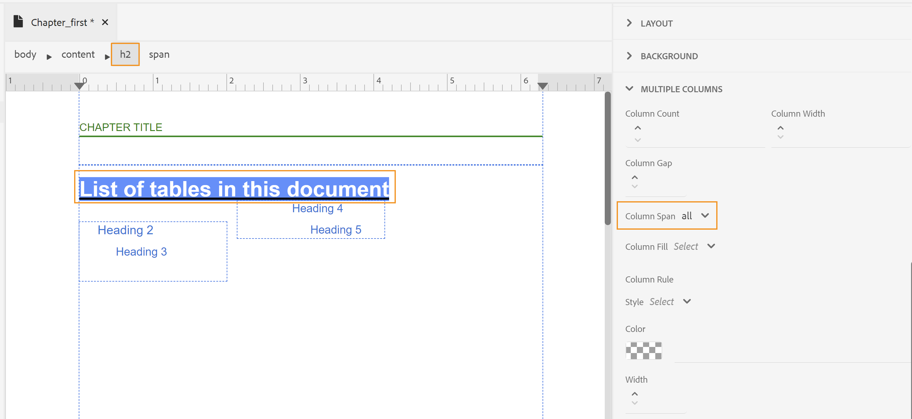

# Conception d’une mise en page {#design-page-layout}

Lors de la création d’un document PDF, vous disposez de différentes sections pour présenter différents types d’informations. Par exemple, un document PDF démarrerait à partir d’une page d’accueil ou d’une page de garde, qui contiendrait le logo de votre société, le titre du livre ou des informations sur la version. Il y aurait ensuite des chapitres, des annexes ou des pages de glossaire. Chaque section d’un document PDF a un aspect différent, ce qui est possible en créant et en personnalisant la mise en page.

Lorsque vous concevez votre mise en page, vous pouvez définir les différents éléments qui constituent une page. Par exemple, vous pouvez définir la taille de la page, les marges, l’en-tête et le pied de page, l’orientation et d’autres spécifications de page sur une page. La fonction de publication native de PDF vous permet de concevoir votre page conformément aux [normes des médias de page](https://www.w3.org/TR/css-page-3/). La plupart des paramètres couverts par les normes des médias paginés peuvent être facilement personnalisés à l’aide de l’interface utilisateur de la fonction Publication native de PDF. Pour une autre mise en forme de niveau avancé, vous pouvez utiliser la vue Source pour écrire votre propre code CSS.

Une fois les mises en page conçues, vous devez les associer à leurs sections respectives dans les paramètres de mise en page de PDF. Consultez la section [Créer et personnaliser des mises en page](components-pdf-template.md#create-customize-page-layout) pour plus d’informations sur la création et l’ouverture d’une mise en page à des fins de personnalisation.

## Types de mises en page {#types-of-page-layout}

Un document PDF contient généralement les sections suivantes :

* Page de garde
* Table des matières
* Augmentation des chiffres
* Effet élévateur des tables
* Pages de chapitre ou de rubrique
* Glossaire
* Index
* Page précédente

Ces sections auraient besoin d’une mise en page correspondante pour présenter les informations dans un format spécifique. En outre, vous pouvez également utiliser une page vierge comme remplissage pour commencer un nouveau chapitre à partir d’une page paire ou impaire. Dans ce cas, vous pouvez utiliser la mise en page par défaut ou créer une mise en page pour une page vierge. Pour plus d’informations](components-pdf-template.md#create-page-layout) voir [Créer une mise en page.

Les paramètres des mises en page de la section **Modèle>Paramètres** vous permettent de définir la mise en page à utiliser pour les différentes sections de votre PDF. Chaque mise en page peut en outre comporter différentes variantes de première, de droite ou de gauche.

### Créer les variantes de mise en page de première, droite ou gauche {#page-layout-variants}

Différentes mises en page de votre modèle PDF peuvent être personnalisées en utilisant des variantes de mise en page de gauche, de droite ou de première page différentes. Vous pouvez concevoir ces pages différemment à l’aide du concepteur de mise en page.

>[!NOTE]
>
>Si vous souhaitez avoir une seule mise en page pour une section de votre livre, vous n&#39;avez pas besoin de créer les mises en page Première, Droite ou Gauche.

Tenez compte des points suivants lors de la création des mises en page :

>[!NOTE]
>
>Les points suivants ont pris comme exemple la mise en page Chapitre . Toutefois, ces points s’appliquent également à d’autres mises en page.

* Si vous souhaitez utiliser une seule mise en page de page pour toutes les pages d’un chapitre, vous devez créer une seule mise en page de chapitre sans aucune variante.

* Si vous souhaitez modifier l’aspect de la première page des chapitres de votre livre, vous devez créer une variante de mise en page Première page pour vos chapitres.

* Si vous souhaitez donner un aspect différent à chaque page de gauche et de droite de votre livre, vous devez créer les variantes de gauche et de droite pour la mise en page de votre page de chapitre.

* Si vous souhaitez que les chapitres commencent sur une page paire ou impaire, vous pouvez choisir de créer une mise en page pour la page vierge. Cette mise en page est utilisée pour combler l’écart entre deux chapitres afin de s’assurer que le chapitre commence à partir de la page paire ou impaire souhaitée.

  >[!NOTE]
  >
  >Si vous ne créez pas de mise en page vierge distincte, la mise en page par défaut est utilisée. Pour créer une mise en page, voir [Créer une mise en page](components-pdf-template.md#create-page-layout).

L’exemple suivant vous guide tout au long du processus de création de variantes d’une mise en page :

1. Créez une mise en page de type « Chapitre » selon les étapes décrites dans la procédure « Créer une mise en page ».

   Une mise en page de chapitre vierge est créée et ajoutée sous les mises en page.

   Par défaut, lorsque vous créez une mise en page, elle est également ouverte pour modification. La capture d’écran suivante affiche une mise en page vide (par défaut) :

   

   La zone d’en-tête, de pied de page et de contenu d’un modèle est créée par défaut. Vous pouvez facilement personnaliser ces zones à l’aide des propriétés de la page, des propriétés de contenu et de divers outils (tels que l’insertion d’images, de champs, etc.) fournis dans l’interface utilisateur.

   >[!NOTE]
   >
   >Pour une configuration avancée, vous pouvez utiliser la vue Source et ajouter votre code HTML et CSS personnalisé.

1. Pointez sur la disposition **Chapitre**, puis cliquez sur **Options** pour afficher le menu contextuel.

1. Cliquez ou passez la souris sur **Ajouter une variante de mise en page** et choisissez la mise en page souhaitée (Première, Gauche ou Droite) que vous souhaitez créer.

La mise en page sélectionnée est créée à l’aide d’une copie de la mise en page Chapitre de base. Cela signifie que si vous avez apporté des modifications à la mise en page par défaut du chapitre, les mêmes modifications sont répliquées dans la variante de mise en page au moment de la création de la mise en page.

## Utilisation des propriétés de page d’une mise en page {#page-props-page-layout}

Lors de la conception d’une mise en page, il est essentiel de contrôler diverses propriétés de page. La fonction Publication native de PDF encapsule toutes les propriétés de page principales sous le panneau Propriétés de page. Le panneau Propriétés de la page permet d’accéder à diverses propriétés dans les sections suivantes :

>[!NOTE]
>
>Le panneau Propriétés de la page encapsule les propriétés et suit les règles définies sous les [Normes des médias de page](https://www.w3.org/TR/css-page-3/).

* **Taille de la page** : indiquez la taille de page à utiliser pour la mise en page. La liste déroulante Taille de la page vous permet de choisir parmi plus de 15 tailles de page. Vous pouvez également créer une disposition à l’aide d’un format de page personnalisé. Pour plus d’informations, voir [Définir le format de page](#set-page-size).

* **Orientation** : spécifiez l’orientation de page à utiliser pour la mise en page. Vous pouvez choisir entre les orientations Portrait ou Paysage . Notez que vous pouvez choisir d’appliquer différentes orientations à différentes variantes de page dans une mise en page. Par exemple, si votre contenu contient un tableau large ou une grande image, vous pouvez créer une disposition de page paysage et appliquer cette disposition au tableau ou à l’image au sens large.

* **Afficher la rotation** : spécifiez le côté ou la direction dans lequel le côté supérieur d’origine est représenté après la rotation. Vous pouvez choisir entre 90 degrés dans le sens des aiguilles d&#39;une montre, 90 degrés dans le sens inverse des aiguilles d&#39;une montre ou 180 degrés. Cela s’avère très utile dans les cas où vous souhaitez utiliser une combinaison de dispositions Portrait et Paysage dans votre sortie. Par exemple, vous pouvez utiliser le format portrait comme mise en page générique et vous pouvez définir une mise en page paysage pour le rendu des tableaux larges. Dans ce cas, vous pouvez définir pour afficher le contenu du tableau dans le sens des aiguilles d’une montre à 90 degrés. Ainsi, la page sera orientée dans le paysage et le contenu fera l’objet d’une rotation de 90 degrés pour maintenir la continuité en vue. Nous verrons comment cela est réalisé à titre d’exemple plus loin dans cette section.

* **Numérotation des pages** : par défaut, la numérotation des pages est continue dans un PDF. Par exemple, un PDF de 100 pages peut avoir des numéros de page continus compris entre 1 et 100. Vous pouvez également redémarrer la numérotation à partir d&#39;un numéro spécifique dans toutes les différentes sections ou la première occurrence d&#39;une section.
   * **Redémarrer à partir de** : indiquez le numéro de page à partir duquel la numérotation de cette disposition commencera. Par exemple, vous pouvez définir le numéro de page à redémarrer pour chaque chapitre. Dans ce cas, vous devez définir le redémarrage à partir de la propriété sur 1 dans la variante Première page de la mise en page du chapitre. Par défaut, la numérotation des pages se poursuit à partir de la page précédente.

   * **Appliquer uniquement à la première occurrence** : vous pouvez également partir d’un nombre spécifique uniquement pour la première occurrence d’une section. Par exemple, vous pouvez commencer uniquement le premier chapitre à partir de 1 et continuer les numéros de page pour les autres chapitres.

* **Disposition** : spécifiez les marges de la page ainsi que la marge intérieure pour les côtés supérieur, inférieur, gauche et droit. L’illustration suivante explique comment les marges, la marge intérieure et les bordures sont rendues autour du contenu. Notez que la marge en haut et en bas d’une page contient l’en-tête et le pied de page.

  

* **Arrière-plan** : incluez une image ou une couleur comme arrière-plan de votre disposition de page. Pour une image, vous pouvez spécifier la hauteur et la largeur de l’image ainsi que les propriétés de répétition et de position.

* **Note de bas de page** : spécifiez les propriétés pour afficher les notes de bas de page dans votre sortie. Vous pouvez choisir de spécifier les marges et les propriétés de remplissage avec un style de bordure.

### Définir la taille de la page {#set-page-size}

La toute première chose que vous devez définir dans une mise en page est la taille de la page. Dans les propriétés de page, vous pouvez choisir plus de 15 formats de page pour une mise en page. Vous pouvez également créer une taille de page personnalisée en procédant comme suit :

1. Ouvrez la mise en page requise pour la modification.

   >[!NOTE]
   >
   >Consultez la section [Personnalisation d’une mise en page](components-pdf-template.md#customize-page-layout) pour ouvrir une mise en page à des fins de personnalisation ou de modification.

1. Dans le panneau de droite, cliquez sur **Propriétés de la page**.
1. Dans la liste déroulante **Taille de la page**, sélectionnez **Personnalisé**.

   Les champs Largeur de page et Hauteur de page s’affichent.

1. Saisissez les dimensions de page souhaitées dans les champs **Largeur de page** et **Hauteur de page**.

   >[!NOTE]
   >
   >Certaines des unités les plus couramment utilisées sont px (pixels), pt (points), rem, em, % (pourcentage) et in (pouces).

### Utilisation de l’orientation des pages et de la rotation des vues {#page-orientation-rotation}

Prenons un exemple dans lequel une combinaison de propriétés d’orientation de page portrait et paysage et de rotation de vue est utilisée. Dans cet exemple, nous allons créer un PDF avec une orientation portrait par défaut, mais un tableau sera rendu en orientation paysage avec du contenu dans le sens des aiguilles d’une montre à 90 degrés. La sortie finale ressemblera à ce qui suit :


Dans la sortie ci-dessus, les informations de la liste de contacts sont présentées en mode paysage avec du contenu également pivoté à 90 degrés. Le contenu restant s’affiche en mode portrait normal.

Pour obtenir ce type de résultat, nous devons effectuer les tâches principales suivantes :

1. Créez une mise en page avec l’orientation Paysage .

1. Modifiez la propriété **Afficher la rotation** pour effectuer le rendu du contenu à 90°.

1. Créez un style personnalisé pour utiliser la nouvelle mise en page.

1. Ajoutez le style dans la définition de classe de sortie du tableau dont nous voulons effectuer le rendu dans la mise en page du paysage.

Effectuez les étapes suivantes pour réaliser les tâches ci-dessus :

1. Créez une mise en page avec l’orientation Paysage .
   1. Créez une mise en page « Paysage » en suivant les étapes décrites dans la section « Création d’une mise en page ».

   1. Dans le panneau de droite, cliquez sur **Propriétés de la page**.

      
   1. Remplacez **Orientation** par **Paysage**.

1. Modifiez la propriété Afficher la rotation pour effectuer le rendu du contenu à 90° dans le sens des aiguilles d’une montre.

   1. Sélectionnez **90°** dans le sens des aiguilles d&#39;une montre dans la liste déroulante Rotation de la vue.
   

   1. Cliquez sur **Tout enregistrer** pour enregistrer les propriétés de mise en page mises à jour.

1. Créez un style personnalisé pour utiliser la nouvelle mise en page.
   1. Développez la barre latérale gauche et double-cliquez sur le modèle dans lequel vous souhaitez créer le style.

   1. Développez la section Feuilles de style .

   1. Pointez sur la feuille de style Disposition, puis cliquez sur (_icône Options_)... et choisissez Modifier.

      La feuille de style de disposition est ouverte pour modification.

   1. Cliquez avec le bouton droit sur **Autres styles** et choisissez **Nouveau style**.
      

   1. Dans la fenêtre contextuelle Ajouter un style, saisissez **paysage-style** dans le **nom de la classe**.
      

   1. Cliquez sur **Terminé**.

      Un nouveau style nommé `.landscape-style` est créé et ajouté à la fin de la liste Autres styles .

   1. Double-cliquez sur le style `.landscape-style` pour l’ouvrir en vue de le modifier.

   1. Développez la propriété **Pagination**.

   1. Saisissez `Landscape` dans la propriété **Mise en page**.

      

   1. Cliquez sur **Tout enregistrer** pour enregistrer les propriétés de style mises à jour.

1. Ajoutez le style dans la définition de `outputclass` du tableau dont vous souhaitez effectuer le rendu dans la mise en page Paysage.
   1. Dans un éditeur de fichiers DITA, ouvrez le fichier dans lequel vous souhaitez appliquer la nouvelle mise en page.

   1. Recherchez l’élément `<table>` dont le rendu doit être effectué en mode Paysage.

   1. Dans le chemin de navigation, cliquez sur l’élément du tableau pour sélectionner le tableau.

      

   1. Dans le panneau de droite, cliquez sur le panneau Propriétés du contenu , puis ouvrez-le.

   1. Dans le panneau Propriétés du contenu , ajoutez une nouvelle propriété **outputclass** avec **paysage-style** comme valeur de propriété.

      

1. Cliquez sur **Enregistrer tout** pour enregistrer le fichier mis à jour.
1. Générez la sortie PDF.

Le contenu du tableau sera rendu en mode paysage dans le PDF final, comme illustré au début de l’exemple.

### Ajouter une image d’arrière-plan {#add-bg-image}

Selon vos besoins, vous pouvez ajouter une image d’arrière-plan qui s’affiche sur chaque première page d’une sortie de chapitre (PDF). Les propriétés d’arrière-plan sous Propriétés de la page vous permettent d’ajouter facilement une image d’arrière-plan. Vous pouvez choisir de répliquer cette image sur une page et de la positionner n’importe où dans la zone supérieure, inférieure ou centrale de la page.

Par exemple, pour insérer une image d&#39;arrière-plan au centre de votre zone de contenu, procédez comme suit :

1. Ouvrez la mise en page requise pour la modification.

   >[!NOTE]
   >
   >Consultez la section [Personnalisation d’une mise en page](components-pdf-template.md#customize-page-layout) pour ouvrir une mise en page à des fins de personnalisation ou de modification.

1. Cliquez n’importe où dans la zone de contenu.

1. Dans le panneau de droite, cliquez sur **Propriétés de la page**.

1. Développez la section **Arrière-plan**.

1. Cliquez sur le bouton de navigation dans le champ d’emplacement **Chemin de l’image**.

1. Recherchez et sélectionnez l’image que vous souhaitez utiliser comme image d’arrière-plan.

   L’image est insérée et répliquée pour couvrir toute la page.

1. Modifiez la taille de l’image en ajustant les propriétés de hauteur et de largeur.

   >[!NOTE]
   >
   >Vous pouvez entrer l’une des propriétés de hauteur ou de largeur, car l’image est automatiquement mise à l’échelle pour conserver les proportions.

1. Définissez les autres propriétés pour ajuster l’affichage de l’image d’arrière-plan.

   * **Répétition en arrière-plan** : indiquez si vous souhaitez que l’arrière-plan se répète ou non.

   * **Position de l’arrière-plan** : spécifiez la position de l’image d’arrière-plan sur votre page.

La capture d’écran suivante affiche l’image d’arrière-plan avec la propriété Répéter en arrière-plan définie sur _aucune répétition_ et la propriété Position en arrière-plan définie sur _centre_.


## Utiliser l’en-tête et le pied de page {#work-header-footer}

Lorsque vous incluez des informations dans un en-tête ou un pied de page dans une mise en page, ces informations sont répétées sur toutes les pages utilisant cette mise en page. En règle générale, la zone d’en-tête est utilisée pour le titre du chapitre ou du sujet et la zone de pied de page est utilisée pour afficher les numéros de page.

Lorsque vous créez une mise en page, la zone d’en-tête et de pied de page est créée par défaut. Vous pouvez effectuer de nombreuses personnalisations dans la zone d’en-tête et de pied de page d’une mise en page. Vous pouvez, par exemple, insérer une image (comme un logo), des variables (contenant des informations dynamiques) ou du contenu statique.

### Modifier les marges et les lignes d&#39;en-tête et de pied de page {#header-footer-margins}

Par défaut, les marges d’en-tête et de pied de page sont définies sur 1 pouce. Vous pouvez modifier cette valeur par défaut en modifiant le paramètre Marge dans le panneau Propriétés de la page . Effectuez les étapes suivantes pour modifier la taille de l’en-tête et du pied de page :

1. Ouvrez la mise en page requise pour la modification.

   >[!NOTE]
   >
   >Consultez la section [Personnalisation d’une mise en page](components-pdf-template.md#customize-page-layout) pour ouvrir une mise en page à des fins de personnalisation ou de modification.

1. Dans le panneau de droite, cliquez sur **Propriétés de la page**.
1. Développez la section **Disposition**.
1. Cliquez sur l’icône de verrouillage en regard de la propriété **Margin**.
1. Pour modifier la taille de l’en-tête, saisissez la valeur souhaitée dans le champ Marge supérieure .

   >[!NOTE]
   >
   >Certaines des unités les plus couramment utilisées sont px (pixels), pt (points), rem, em, % (pourcentage) et in (pouces).

1. Pour modifier la taille du pied de page, saisissez la valeur souhaitée dans le champ Marge inférieure .

Vous pouvez concevoir la zone d’en-tête et de pied de page pour contenir plusieurs lignes. Pour ce faire, ajoutez une balise \&lt;p\> à l’aide de l’option Insérer des éléments HTML () dans la zone d’en-tête ou de pied de page.

| _Coin des développeurs_ :  |
|---|

Si vous souhaitez travailler directement avec le code CSS et HTML, vous pouvez modifier les valeurs de marge comme illustré dans le fragment de code suivant :

```css
…

<meta name="page-style" content="size:A4 portrait;margin-top:3cm;margin-right:30pt;margin-bottom:1in;margin-left:90px;" />

…
```

>[!NOTE]
>
>Dans l’exemple ci-dessus, différentes unités sont utilisées pour spécifier les valeurs de marge.

### Supprimer l’en-tête et le pied de page {#remove-header-footer}

Superposition de l’en-tête et du pied de page dans les marges supérieure et inférieure. Techniquement, cela signifie que si vous souhaitez avoir un en-tête et un pied de page dans votre mise en page, vous devez réserver l’espace requis dans les marges supérieure et inférieure.

Si vous ne souhaitez pas qu’une mise en page contienne un en-tête et un pied de page, deux méthodes permettent d’y parvenir :

* Si vous souhaitez conserver les marges supérieure et inférieure, laissez la zone d’en-tête et de pied de page vide.
* Si vous ne souhaitez pas conserver les marges supérieure et inférieure (comme lors de la conception de la couverture avant et arrière d&#39;un magazine), vous pouvez supprimer les marges en définissant les propriétés de marge supérieure et inférieure sur 0. Cela ne laisse aucun espace pour l’en-tête et le pied de page.

### Ajouter une image ou un logo dans l’en-tête {#add-image-header}

Selon vos besoins, vous pouvez ajouter une image qui s’affiche dans la zone d’en-tête (ou dans toute autre partie) de la mise en page. Vous pouvez ajouter une image à votre disposition de deux manières différentes :

* Utilisez une image issue des ressources du modèle.
* Utilisez l’outil \&lt;Ajouter une image\> dans l’éditeur de mise en page.

>[!NOTE]
>
>Il est recommandé d’utiliser le dossier Ressources pour gérer toutes vos ressources de modèle telles que les images ou les polices.

Pour insérer une image telle que le logo de votre entreprise dans la zone d’en-tête, procédez comme suit :

1. Ouvrez la mise en page requise pour la modification.

>[!NOTE]
>
>Consultez la section [Personnalisation d’une mise en page](components-pdf-template.md#customize-page-layout) pour ouvrir une mise en page à des fins de personnalisation ou de modification.

1. Cliquez sur Modifier l’en-tête () pour placer le curseur dans la zone d&#39;en-tête.

   Ou cliquez dans la zone d’en-tête.

1. Pour ajouter une image, choisissez l’une des méthodes suivantes :
1. Cliquez sur le bouton **Insérer une image** () dans la barre d’outils ; dans le pop-up **Sélectionner le chemin**, accédez à l’emplacement de l’image et cliquez sur **Sélectionner** pour l’insérer dans la zone d’en-tête.
1. Faites glisser et déposez une image du dossier Ressources dans la zone d’en-tête.

La capture d’écran suivante montre un exemple d’image ajoutée à la zone d’en-tête.


Une fois l’image insérée, vous pouvez modifier ses attributs pour lui donner l’aspect souhaité. Pour modifier plus facilement l’apparence d’une image ou de tout autre élément de votre disposition, utilisez le panneau Propriétés du contenu . Consultez [Utilisation du panneau Propriétés du contenu](#work-with-content-props) pour connaître les différentes propriétés que l’interface utilisateur permet de personnaliser.

### Ajout de champs et de métadonnées {#add-fields-metadata}

Les champs sont très utiles lorsque vous souhaitez insérer une information prédéfinie. Par exemple, vous pouvez inclure un champ Titre du chapitre dans la zone d’en-tête de votre chapitre, qui est remplacé par le titre réel du chapitre lors de sa publication.

Vous pouvez insérer les catégories suivantes pour les champs dans votre mise en page :

* Métadonnées
* Titre du sujet
* Titre du chapitre
* Titre de la carte
* Numéro de page
* Numéro de chapitre
* Nombre total de pages
* Date 
* estimé


Chacune de ces catégories de champs contient des variations différentes dans lesquelles les informations de champ peuvent être insérées. Par exemple, un champ Date peut avoir différentes variations telles que `YYYY-MM-DD`, `MM/DD/YY`, `MM/DD/YYYY`, etc. De même, les numéros de page peuvent présenter des variations sous la forme de nombres romains, décimaux ou même de formats spécifiques aux paramètres régionaux tels que _Arabe_, _Dévanagari_, _Hébreu_, etc.


Outre les champs prédéfinis, vous pouvez également ajouter des informations de métadonnées sous la forme de variables ou de champs dans votre mise en page. Ces métadonnées peuvent être stockées dans votre DITA source **contenu de carte**, **contenu de rubrique** ou peuvent être sélectionnées à partir des DITA **propriétés de fichier de carte**, **propriétés de fichier de rubrique**.

Vous pouvez sélectionner les métadonnées à partir des options suivantes :

* **Contenu du mappage** inclut les métadonnées que vous avez définies dans l&#39;élément `<topicmeta>` du mappage DITA.
* **Propriétés du fichier de mappage** inclut les métadonnées auxquelles vous pouvez accéder à partir de la page **Propriétés** d&#39;un mappage DITA.
* **Contenu de la rubrique** inclut les métadonnées définies dans l&#39;élément `<prolog>` d&#39;une rubrique DITA, telles que les droits d&#39;auteur, l&#39;auteur et d&#39;autres détails. Pour récupérer des éléments de `<prolog>` individuels, vous pouvez utiliser des expressions XPath simples (par exemple //author pour le nom de l’auteur). Pour les métadonnées d’attribut, incluez le symbole `@` dans le XPath (par exemple, //critdates/review/@modified pour la date modifiée).
* Le **Propriétés du fichier de rubrique** inclut les métadonnées auxquelles vous pouvez accéder à partir de la page **Propriétés** d’une rubrique.


Vous pouvez combiner dans un seul document des métadonnées provenant des **Propriétés du fichier de carte** et **Propriétés du fichier de rubrique**. Par exemple, vous pouvez publier un PDF avec le titre de carte sur la page de garde et le titre de rubrique dans l’en-tête des autres pages. Pour ce faire, vous pouvez ajouter les métadonnées du titre de la carte à partir des **Propriétés du fichier de carte** à la disposition de la page de garde. Ajoutez ensuite les métadonnées de titre de rubrique à partir des **propriétés de fichier de rubrique** dans l&#39;en-tête de la mise en page Chapitres et rubriques.

Si une rubrique se termine sur une page tandis que l’autre commence sur la même page, les métadonnées de la première rubrique sont sélectionnées. Vous pouvez également ajouter des propriétés personnalisées, puis les insérer en tant que champs dans la mise en page.


>[!NOTE]
>
> Les champs de métadonnées s’affichent en fonction de la ressource ou du mappage que vous avez sélectionné dans la liste déroulante **De**.


<!--For more information, see [Add fields and metadata](design-page-layout.md#add-fields-and-metadata).-->

Dans l&#39;exemple suivant, nous allons insérer un numéro de page et un titre de chapitre dans la zone de pied de page d&#39;une mise en page.

1. Ouvrez la mise en page requise pour la modification.

   >[!NOTE]
   >
   >Consultez la section [Personnalisation d’une mise en page](components-pdf-template.md#customize-page-layout) pour ouvrir une mise en page à des fins de personnalisation ou de modification.

1. Cliquez sur l&#39;icône **Modifier le pied de page** () pour placer le curseur dans la zone du pied de page.

   Ou cliquez dans la zone du pied de page.

1. Insérez un élément de paragraphe en cliquant sur le **Insérer des éléments HTML** () et en sélectionnant Paragraphe dans la liste d’éléments.

1. Cliquez sur l’icône **Insérer des champs** ().

   Le pop-up Champs s’affiche.

1. Sélectionnez la catégorie **Numéro de page** dans la liste Champ, le format de numéro de page **default(1)** dans la liste Format, puis cliquez sur **Insérer**.

   

   >[!NOTE]
   >
   >Vous pouvez également modifier le format de tous les champs, à l’exception du format par défaut. Pour ce faire, cliquez sur l’icône Modifier en regard du format à modifier, apportez des modifications, puis cliquez sur OK. Pour plus d’informations, voir [Ajouter des champs et des métadonnées](#add-fields-metadata).

   Le champ Numéro de page par défaut est inséré dans la zone de pied de page de la mise en page.

   

   Le chemin de navigation supérieur répertorie les éléments dans lesquels les informations sont stockées.

1. Saisissez un espace vide après le champ du numéro de page, puis cliquez sur l’icône **Insérer des champs**.

1. Sélectionnez la catégorie **Titre du chapitre** dans la liste Champ, le format **Titre du chapitre** dans la liste Format, puis cliquez sur **Insérer**.

   Le champ _Titre du chapitre_, qui est renseigné avec le titre du chapitre au moment de la publication, est inséré dans la zone de pied de page. Actuellement, les champs Numéro de page et Titre du chapitre sont séparés par un espace.

   

1. Pour aligner à droite le titre du chapitre, procédez comme suit :

   1. Cliquez sur l’élément Champ dans le chemin de navigation pour sélectionner le champ Titre du chapitre .

   1. Dans le panneau de droite, cliquez sur **Propriétés du contenu** ().

   1. Développez la section des propriétés **Disposition** et définissez la valeur de la propriété **Float** sur **right**.
      

      Le champ Titre du chapitre est aligné sur le côté droit du pied de page.
      


| _Coin des développeurs_ :  |
|---|

Si vous souhaitez travailler directement avec le code CSS et HTML, vous pouvez également y parvenir en accédant à l’affichage Source de la mise en page et en apportant des modifications au code. L’extrait de code suivant affiche le même paramètre de pied de page défini dans le code :

```css
…
<p>

<span data-field="page-number" data-format="default">1</span>

<span data-field="chapter-title" data-format="default" style="float: right">Chapter Title</span>

</p>
…
```

## Utiliser la zone de contenu {#content-area}

La zone de contenu est la plus grande en termes d’espace de contenu. La zone de contenu est renseignée avec le contenu de votre rubrique. Dans certains cas spéciaux, vous pouvez ajouter du contenu standard dans la zone de contenu. Ce contenu est publié à l’emplacement spécifié dans votre mise en page. Par exemple, l’en-tête de votre table des matières, de votre glossaire et de votre index peut être ajouté comme contenu standard, qui est publié « en l’état » dans la sortie finale. Un autre exemple est la table des matières du chapitre, qui est généralement ajoutée à la première page de chaque chapitre.

La disposition à plusieurs colonnes est l’une des personnalisations les plus couramment utilisées dans la zone de contenu. Grâce à son puissant concepteur de mise en page, vous pouvez personnaliser des pages spécifiques pour les rendre sur plusieurs colonnes, tout en conservant le contenu des autres pages dans une seule colonne.

Dans les sections suivantes, nous aborderons divers scénarios de personnalisation de la zone de contenu.

### Ajouter une table des matières de chapitre {#add-chapter-toc}

Une table des matières de chapitre sert de référence rapide pour que les lecteurs et lectrices sachent ce qu’il y a dans le chapitre. En règle générale, une table des matières de chapitre est ajoutée au tout début d’un chapitre. Ainsi, si vous souhaitez utiliser une table des matières de chapitre, vous pouvez l&#39;ajouter dans la zone de contenu de la mise en page du chapitre principal ou dans la première variante de mise en page d&#39;un chapitre.

Dans l’exemple suivant, nous allons insérer une table des matières de chapitre dans la première mise en page d’un chapitre :

>[!NOTE]
>
>Pour cette procédure, on suppose que vous avez créé la première variante de page pour une mise en page de chapitre. Pour plus d’informations sur la création d’une variante de page, voir [Création des variantes de mise en page première, droite ou gauche](#page-layout-variants).

1. Ouvrez la mise en page requise pour la modification.

   >[!NOTE]
   >
   >Consultez la section [Personnalisation d’une mise en page](components-pdf-template.md#customize-a-page-layout) pour ouvrir une mise en page à des fins de personnalisation ou de modification.

1. Placez le curseur dans la zone de contenu de la mise en page.

1. Cliquez sur la table des matières du chapitre ().

   La table des matières du chapitre par défaut est insérée dans la zone de contenu.

   

   >[!NOTE]
   >
   >La table des matières du chapitre par défaut contient les en-têtes 1 à 4. Ici, le Titre 1 est le Titre du Chapitre lui-même. Il se peut donc que vous ne souhaitiez pas retrouver le titre du chapitre dans la table des matières ou que vous souhaitiez augmenter le niveau des en-têtes souhaités dans la table des matières. Vous pouvez personnaliser la table des matières en modifiant les propriétés.

1. Ouvrez le panneau Propriétés du contenu pour personnaliser les niveaux d’en-tête de la table des matières.

   Par exemple, si vous souhaitez commencer à partir de Titre 2, modifiez la première liste déroulante pour commencer à partir de 2.

   

   De même, si vous souhaitez afficher les en-têtes jusqu’au niveau 5, modifiez la deuxième liste déroulante en 5. La table des matières mise à jour se présentera comme illustré ci-dessous :

   

   >[!NOTE]
   >
   >La version finale de PDF publiée n’affiche que les entrées de la table des matières en fonction du contenu de vos chapitres. Si vous n&#39;avez pas de titres de niveau 5 dans un chapitre, il ne sera pas affiché dans la sortie finale.

L’aspect de la table des matières par défaut peut être personnalisé à l’aide des feuilles de style. Le style commençant par `chaptoc-level-#` (par `chaptoc-level-1`, `chaptoc-level-2`, etc.) est utilisé pour personnaliser les styles de la table des matières du chapitre. <!--For more details on the stylesheet elements used in the TOC and how to customize them, see _Customize default chapter TOC_-->.

>[!IMPORTANT]
>
>Actuellement, si vous effectuez des mises à jour de style dans une feuille de style, elles peuvent ne pas se refléter dans l’aperçu du contenu. Toutefois, la sortie est rendue avec les styles mis à jour.

### Utilisation de la mise en page multi-colonnes {#multi-column-layout}

Les mises en page à plusieurs colonnes sont très courantes dans la publication de magazines ou d’index dans un livre. La fonction de publication native de PDF vous permet de diviser facilement votre document en plusieurs colonnes. En utilisant différentes mises en page, vous pouvez choisir de ne conserver qu’une section spécifique divisée en plusieurs colonnes tout en conservant les autres sections dans une seule mise en page de colonne (ou normale).

Pour créer une mise en page à plusieurs colonnes, procédez comme suit :

1. Ouvrez la mise en page requise pour la modification.

   >[!NOTE]
   >
   >Consultez la section [Personnalisation d’une mise en page](components-pdf-template.md#customize-a-page-layout) pour ouvrir une mise en page à des fins de personnalisation ou de modification.

1. Comme la disposition à plusieurs colonnes est appliquée au contenu, à l’exclusion de la zone d’en-tête et de pied de page, vous devez sélectionner l’élément de contenu dans le chemin de navigation.

   Une fois que vous avez sélectionné le chemin de navigation du contenu, le panneau Propriétés du contenu affiche les propriétés de plusieurs colonnes.

   

1. Utilisez les propriétés à plusieurs colonnes pour personnaliser la mise en page à plusieurs colonnes :

   * **Nombre de colonnes :** indiquez le nombre de colonnes à diviser pour la page. Utilisez les icônes fléchées vers le haut et vers le bas ou saisissez un nombre pour définir le nombre de colonnes.

   * **Largeur de colonne :** spécifiez la largeur d’une colonne dans une disposition à plusieurs colonnes. Par défaut, la taille est définie en pixels (px), vous pouvez également la spécifier en pt, rem, em, % ou en unités.

     >[!NOTE]
     >
     >Si vous ne spécifiez pas de taille, les colonnes sont divisées de manière uniforme pour s’adapter à la page donnée. Dans la plupart des cas, il n’est pas nécessaire de spécifier cette valeur.

   * **Écart entre les colonnes** : spécifiez l’espace entre les colonnes individuelles.

   * **Étendue des colonnes** : si vous souhaitez que les éléments de votre disposition s’étendent sur plusieurs colonnes, vous devez utiliser cette propriété. Pour ce faire, modifiez le style de l’élément souhaité à l’aide des feuilles de style. <!--for more information see _Section explaining style customization_-->.

   Dans votre mise en page, si vous souhaitez qu&#39;un certain texte apparaisse sur la première page de toutes les mises en page de chapitre, vous pouvez l&#39;ajouter à la variante Première page de la mise en page de chapitre.

   Comme illustré dans l’exemple suivant, la propriété Span Column du texte d’en-tête est définie sur all. Ainsi, même si le document comporte plusieurs colonnes, l’en-tête s’étend sur plusieurs colonnes.

   

   >[!IMPORTANT]
   >
   >Vous pouvez appliquer la propriété Span Column à n&#39;importe quel élément DITA à l&#39;aide de l&#39;attribut outputclass.

   * **Remplissage des colonnes** : indiquez comment le contenu remplit les colonnes. Par défaut, il est défini sur Solde qui remplit chaque colonne avec une quantité égale de contenu.

   * **Règle de colonne** : si vous souhaitez qu’une ligne se situe entre les colonnes, utilisez cette propriété pour définir les styles de ligne ou de règle. Spécifiez les valeurs des paramètres Style, Couleur et Largeur de la règle pour ajouter une ligne entre les colonnes.

## Utilisation du panneau Propriétés du contenu {#work-with-content-props}

Le panneau Propriétés du contenu permet de mettre à jour facilement l’aspect des éléments de votre disposition. Les propriétés du panneau Propriétés du contenu sont divisées en sections suivantes :

* **Font** : contient des propriétés liées au texte. Vous pouvez définir la famille de polices, l’épaisseur, la taille, la décoration du texte (soulignement, surlignement, trait transparent), le style du texte (gras, italique, etc.), l’alignement du texte (gauche, droite, centré ou justifié), gérer les espaces blancs (en tant que format prédéfini, pas d’habillage, espace de rupture, etc.), la hauteur de la ligne, l’espacement des lettres et le retrait du texte.

* **Bordure** : contient des propriétés permettant d’ajouter et de mettre en forme une bordure sur un élément de votre disposition. Vous pouvez définir le côté de la bordure (comme tout, haut, bas, droite ou gauche), le style de bordure (sous forme de traits pleins, en tirets, en pointillés ou plus), la couleur, la largeur et le rayon de la bordure pour obtenir une bordure incurvée. Dans l’exemple suivant, une bordure incurvée a été ajoutée dans la zone d’en-tête de la page.

  

* **Disposition** : contient des propriétés pour configurer la disposition d’un élément dans votre disposition de page. Vous pouvez définir la hauteur, la largeur, les marges et la marge intérieure (pour le haut, le bas, la gauche ou la droite), l’alignement horizontal ou vertical, le flottement (gauche, droite ou aucun), l’effacement (gauche, droite, les deux ou aucun), la position de l’élément (absolue, fixe, relative ou plus), l’affichage (en bloc, contenu, fixe ou plus), l’index Z, la transparence, la transformation (par rotation ou mise à l’échelle) et l’origine de la transformation (par décalage X et Y).

* **Arrière-plan** : contient les propriétés permettant d’inclure une image ou une nuance de couleur d’arrière-plan. Vous pouvez définir la taille de l’image (en définissant la hauteur ou la largeur), la répétition de l’arrière-plan (répétition, pas de répétition, arrondi ou plus) et la position de l’arrière-plan (en haut à gauche, au centre à droite, au centre en bas ou plus).
* **Colonnes multiples** : contient les propriétés permettant de configurer les propriétés multi-colonnes de la page ou tout élément spécifique, tel que la table des matières du chapitre. Pour plus d’informations sur les propriétés et leur utilisation, voir [Utilisation de la disposition sur plusieurs colonnes](#multi-column-layout).
