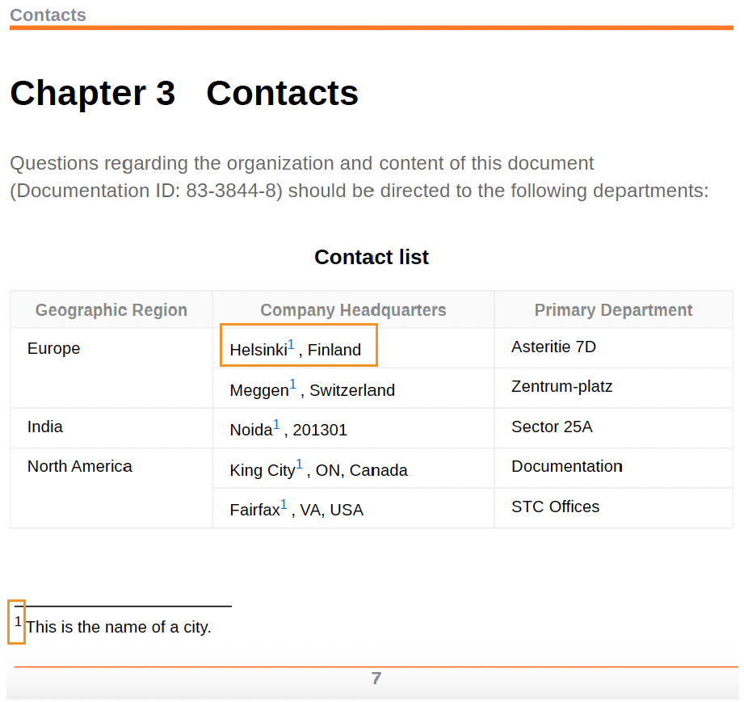

# Application des styles de note de bas de page


Les notes de bas de page sont des notes placées au bas d’une page qui commentent ou citent une référence pour une partie désignée du texte.

Chaque note de bas de page comporte un marqueur de note de bas de page au bas de la page, qui est généralement un nombre ou un symbole comme un astérisque. Dans le contenu principal, le même marqueur de note de bas de page apparaît comme un appel de note de bas de page et est indiqué par le même numéro ou symbole qu’un exposant.


## Modification des styles des appels de note de bas de page et des marqueurs

Vous pouvez modifier les styles des appels de note de bas de page et des marqueurs, ainsi que leur aspect dans la sortie PDF. Ces styles vous permettent d’identifier rapidement les notes de bas de page dans le document.


**Exemple 1** :

Utilisez l’exemple donné pour ajouter un crochet avant et après l’appel de note de bas de page et le marqueur :

* Ajoutez le préfixe « ( » et le suffixe «) » à l’aide de l’attribut content dans le style `footnote-call`, qui ajoute les crochets autour du numéro de note de bas de page dans le contenu du sujet.
* Ajoutez le préfixe « ( » et le suffixe «) » à l’aide de l’attribut content dans le style `footnote-marker`, qui ajoute les crochets autour du numéro de note de bas de page au bas de la page.

```css
...
.fn::footnote-call { 
content: "(" counter(footnote, decimal) ")"; 
} 

.fn::footnote-marker { 
content: "(" counter(footnote, decimal) ")"; 
} 

...
```


*Ajoutez des crochets autour de l’appel de note de bas de page et du marqueur de note de bas de page.*

**Exemple 2** :

Vous pouvez également marquer l’appel de note de bas de page et le marqueur avec un astérisque ou un caractère grec inférieur au lieu d’un nombre.


```css
.fn::footnote-call {
 content: counter(footnote, asterisks);
}
.fn::footnote-marker {
 content: counter(footnote, asterisks) " ";
}
```

Dans la sortie, vous pouvez afficher des éléments tels que :


*Ajouter un astérisque à un appel de note de bas de page et à un marqueur.*

## Masquer un appel de note de bas de page

Vous pouvez également appliquer un style aux appels de note de bas de page avec des attributs spécifiques. Par exemple, utilisez le style suivant pour masquer une note de bas de page avec les identifiants :
L’appel de note de bas de page est masqué dans le contenu principal, mais l’indicateur de note de bas de page s’affiche au bas de la page.

```css
.fn[id]::footnote-call {
        display: none;
                        }
```

## Mise en forme de la zone de la note de bas de page

Toutes les notes de bas de page sont placées dans la zone de note de bas de page, généralement en bas de la page. Vous pouvez mettre en forme la zone de note de bas de page à l’aide des mises en page ou des styles CSS.


### Mises en page

Vous pouvez utiliser les propriétés de page des mises en page pour appliquer un style à la zone de note de bas de page dans les différentes sections d’un document PDF. Par exemple, vous pouvez spécifier les marges et les propriétés de remplissage de la zone de note de bas de page dans un chapitre. Vous pouvez également modifier le côté, le style, la couleur, la largeur et le rayon de la bordure.

Découvrez comment [utiliser les propriétés de page d’une mise en page](./design-page-layout.md#page-props-page-layout).

### Styles CSS

Vous pouvez appliquer des styles et mettre en forme la zone de note de bas de page dans un document PDF. Vous pouvez, par exemple, modifier la longueur, le style, la couleur et la largeur de la bordure.

```css
   @page {
     @footnote {
           border-top-style: solid;
           border-top-color: #FF0000;
           border-top-width: 3px;
                 }
         }
```

## Redémarrer la numérotation des notes de bas de page

Par défaut, les notes de bas de page sont numérotées en continu dans un document. Vous pouvez toutefois utiliser des mises en page de page ou des styles CSS pour redémarrer la numérotation des notes de bas de page.


### Mises en page

Vous pouvez spécifier un nombre dans les mises en page pour redémarrer la numérotation des notes de bas de page dans les différentes sections d’un document PDF. Par exemple, sélectionnez un nombre dans le champ **Redémarrer la numérotation depuis** du panneau Propriétés de la page pour redémarrer la numérotation des notes de bas de page pour chaque chapitre.

### Styles CSS

Utilisez le style suivant pour réinitialiser la numérotation des notes de bas de page sur chaque page de la sortie PDF :

```css
@page
{
counter-reset: footnote
}
```

Ainsi, les notes de bas de page de chaque page redémarrent à partir de 1.

## Afficher les notes de bas de page intégrées

En règle générale, chaque note de bas de page s’affiche sous la forme d’un bloc ou commence sur une nouvelle ligne. Mais vous pouvez également les placer en ligne ou à côté les uns des autres.

```css
.fn{
      display: inline;
              }
```

## Application de styles aux références croisées de note de bas de page

Vous pouvez également faire référence à une note de bas de page de manière croisée et faire référence à la même note de bas de page plusieurs fois dans votre sortie PDF. Cela vous permet de faire référence à la même citation ou note détaillée à plusieurs reprises dans le document sans créer de note de bas de page pour celui-ci.

Par exemple, la capture d’écran ci-dessous montre comment la même note de bas de page est référencée de manière croisée à toutes les villes dans la sortie PDF.


*Insérer la référence croisée à une note de bas de page.*


À l’aide des styles CSS, vous pouvez également mettre en forme les références croisées avec les notes de bas de page. Par exemple, vous pouvez modifier la couleur d&#39;arrière-plan des références croisées.

```css
    .xref-fn{
    background-color: red;
    }
```


