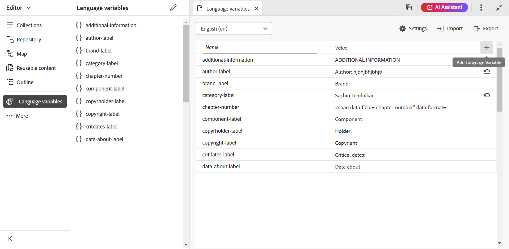

# Prise en charge des variables de langue

AEM Guides fournit la fonctionnalité permettant d’utiliser des variables de langue. Vous pouvez utiliser des variables de langue pour définir des chaînes localisées dans la sortie du PDF ou pour localiser tout texte statique dans les modèles de sortie. Vous pouvez utiliser des styles CSS pour localiser les chaînes provenant d’une page CSS.

## Utilisation de variables de langue dans la sortie du PDF

Vous pouvez utiliser des variables de langue pour définir une version localisée des libellés prêts à l’emploi tels que Remarque, Attention et Avertissement ou texte statique dans la sortie du PDF. Le nom de la variable est le même pour toutes les langues, mais il peut avoir des valeurs différentes pour les différentes langues. Vous pouvez mettre à jour la valeur de ces variables dans une ou plusieurs langues, puis la valeur localisée est automatiquement sélectionnée dans la sortie du PDF.

Par exemple, vous pouvez présenter l’étiquette `Note` de la manière suivante dans la sortie du PDF :

- Anglais : Remarque

- Français : Remarque

- Allemand : Hinweis


*Exemple de note en anglais, français et allemand.*

>[!NOTE]
>
> Si la valeur d’une variable n’est pas définie dans une langue particulière, AEM Guides la sélectionne dans la langue de l’interface utilisateur (interface utilisateur de l’application) comme mécanisme de secours.
>
> Si vous n’avez pas défini la valeur dans la langue de l’interface utilisateur, elle recherche l’anglais (`en_us`), ou sinon elle sélectionne la valeur English(`en`) et affiche la même valeur dans la sortie du PDF.

## Types de variables de langue

AEM Guides prend en charge deux types de variables : les variables Application et User .

### Variables d’application

AEM Guides fournit un ensemble de variables d’application prédéfinies ou prêtes à l’emploi. Vous pouvez utiliser ces variables prédéfinies pour ajouter des informations sur un document spécifique à AEM Guides. Par exemple, la variable `chapter-number`, si elle est incluse dans une page, affiche le numéro du chapitre auquel appartient la page. La variable `author-label` affiche le nom de l’auteur du document.

>[!NOTE]
>
> Vous pouvez remplacer la valeur d’une variable d’application.


### Variables utilisateur

Vous pouvez également créer de nouvelles variables de langue. Par exemple, vous pouvez créer une variable utilisateur Éditeur pour le libellé de l’éditeur du document.

>[!NOTE]
>
>  Vous devez disposer de droits d’administrateur pour créer des variables utilisateur et modifier les variables d’application.



*Ajoutez et affichez les variables de langue pour une langue sélectionnée.*

## Ajouter une nouvelle variable de langue

1. Dans l’éditeur Web, accédez à l’onglet Sortie .
1. Sélectionnez **Variables de langue**  dans le panneau de gauche.
1. Sélectionnez **Modifier** pour ouvrir la fenêtre **Variables de langue** . L&#39;application et les variables utilisateur présentes dans la langue sélectionnée sont répertoriées par ordre alphabétique. Les valeurs sont affichées en fonction de la langue sélectionnée. Par exemple, si vous sélectionnez la langue française, &quot;Conseil&quot; s’affiche.
1. Dans la liste déroulante **Langue**, sélectionnez la langue souhaitée dans laquelle vous souhaitez modifier une variable.

   >[!NOTE]
   >
   > Si vous n’affichez pas les langues souhaitées, activez la langue de votre choix dans les **Paramètres de variable de langue**. Sélectionner les paramètres  pour ouvrir la boîte de dialogue **Paramètres des variables de langue**.

1. Saisissez le nom de la variable dans la colonne **Nom** et sa valeur dans la colonne **Valeur**.

   >[!NOTE]
   >
   >Vous pouvez utiliser n’importe quel contenu d’HTML comme valeur de variable pour afficher la valeur de variable dans une mise en forme spécifique. Par exemple, vous pouvez ajouter la balise `<b>` à la valeur de la variable pour afficher l’ Éditeur en gras.

1. Sélectionnez **Ajouter la variable de langue**  pour ajouter une nouvelle variable de langue à la langue sélectionnée. L’ajout d’une variable à une langue l’ajoute automatiquement à toutes les langues. Vous ne pouvez pas créer de variable portant le même nom qu’une variable existante. Une erreur s’affiche.

>[!NOTE]
>
> Si vous ne sélectionnez pas **Ajouter la variable de langue**, la variable n’est pas créée et ajoutée à la liste.

## Exportation et importation de variables de langue

Experience Manager Guides prend en charge l’exportation et l’importation des variables de langue présentes dans la langue sélectionnée. Vous pouvez facilement exporter toutes les variables de langue avec les valeurs définies. Cela inclut les variables d’application et d’utilisateur. Utilisez le fichier exporté pour apporter les modifications souhaitées aux valeurs ou les localiser dans d’autres langues.

Vous pouvez également importer le fichier XML, qui contient les variables de langue. Experience Manager Guides importe uniquement les variables de langue déjà définies, y compris les variables d’application et d’utilisateur. Elle n’importe aucune variable qui n’est pas déjà définie.

### Exporter des variables de langue

Pour exporter les variables de langue pour une langue, sélectionnez la langue dans la liste déroulante et sélectionnez **Exporter** .
Il crée un fichier XML au format `language_variable_<ln>` où `<ln>` est le code de la langue sélectionnée. Par exemple, `language_variable_en.xml` pour l’anglais et `language_variable_fr.xml` pour le français.

>[!NOTE]
> 
>Si des modifications non enregistrées sont apportées aux variables de langue, vous ne pouvez pas les exporter. Enregistrez les modifications pour afficher l’option activée **Export** Icône .

### Importation de variables de langue

Pour importer les variables de langue :

1. Sélectionnez une langue dans la liste déroulante et sélectionnez **Importer** .
2. Recherchez et sélectionnez le XML, qui contient les variables de langue. Par exemple, language_variable_en.xml.
Vous pouvez importer des fichiers XML au format suivant :

```
<?xml version="1.0" encoding="UTF-8"?>
<variables>    
<variable id="note-important">Important: </variable>    
<variable id="note-caution">Avertir: </variable>    
<variable id="image-with-text">Text and image &lt;img src=&quot;/content/dam/assets/images/image_with_text.png&quot; /&gt; </variable> 
</variables> 
```

Les variables avec le même ID sont importées une fois le fichier importé. Les valeurs des variables de la langue sélectionnée sont mises à jour avec celles du fichier XML.  Un message sur le nombre de variables mises à jour s’affiche.

>[!NOTE]
> 
><ul><li>Si le fichier n’est pas un fichier XML ou s’il contient un format incorrect qui ne correspond pas aux variables de langue, vous obtenez une erreur indiquant qu’il y a un problème avec le fichier XML. 
&gt;<li>Si le fichier ne contient aucune variable avec le même ID, vous voyez un avertissement indiquant qu’aucune variable de langue correspondante n’est trouvée dans le fichier importé.

### Options d’une variable de langue

Passez la souris sur la variable pour afficher le menu **Options** correspondant.


*Utilisez le menu **Options**pour supprimer, prévisualiser ou dupliquer une variable de langue.*

Vous pouvez prévisualiser les variables utilisateur et application. Pour afficher l’affichage de la valeur de la variable dans la sortie, sélectionnez **Preview** dans le menu **Options** de la variable sélectionnée.
Vous pouvez également choisir de **Supprimer** ou **Dupliquer** les variables utilisateur. La suppression d’une variable d’une langue la supprime automatiquement de toutes les langues.

### Modification ou restauration des variables d’application

Vous pouvez également modifier les valeurs d’une variable d’application. Par la suite, vous pouvez rétablir la valeur d’origine d’une variable d’application. **Rétablir la variable**  apparaît pour une variable d’application avec une valeur modifiée.

## Utiliser des variables de langue dans les modèles de sortie

Vous devez ajouter des variables de langue dans vos documents localisés. Vous pouvez insérer ces variables de langue dans la mise en page qui s’affiche sur différentes pages de vos documents localisés. Par exemple, vous pouvez ajouter la variable de langue pour le `author-name` qui apparaît dans la zone d’en-tête de la mise en page (ou toute autre partie comme le pied de page ou le corps).


*L&#39;auteur et le nom de la marque localisés dans la sortie du PDF générée pour la langue française.*

Pour insérer une variable de langue comme votre `copyright-label` dans la zone d’en-tête, procédez comme suit :

1. Ouvrez la mise en page requise pour la modifier.

   >[!NOTE]
   >
   > Afficher la section [Personnaliser une mise en page](../native-pdf/components-pdf-template.md#customize-a-page-layout-customize-page-layout) pour ouvrir une mise en page à des fins de personnalisation ou de modification.

1. Sélectionnez l’en-tête pour activer l’insertion d’une variable.
1. Sélectionnez **Insérer la variable**   dans la barre d’outils.
1. Dans la fenêtre contextuelle **Insérer la variable**, sélectionnez le nom de la variable de langue à insérer et cliquez sur **Insérer** pour l&#39;insérer dans la zone d&#39;en-tête.

   >[!NOTE]
   >
   > Vous pouvez également saisir la chaîne de recherche dans la zone de texte. Les noms des variables contenant la chaîne donnée sont filtrés et affichés dans la liste.
   > La variable de langue sélectionnée est insérée dans la zone d’en-tête.


*Le `copyright-label` ajouté dans la zone d’en-tête.*

### Application du style de contenu aux variables de langue

Outre la valeur que vous affectez à une variable de langue, vous pouvez également utiliser des balises d’HTML pour afficher la valeur de la variable dans une mise en forme spécifique. Par exemple, vous pouvez afficher la valeur de `publisher-label` en gras.

- Vous pouvez également mettre en forme les styles des valeurs à l’aide de la balise <span> . Par exemple, à l’aide de la variable de langue du numéro de page, vous pouvez afficher le numéro de page au format Roman number (numéro romain) en anglais et spécifier le format des autres langues.

  Valeur pour l’anglais :
  `<span data-field="page-number" data-format="upper-roman">1</span>`

  Valeur pour le tamoul :
  `<span data-field="page-number" data-format="tamil">1</span>`

De même, vous pouvez ajouter des variables de langue et mettre en forme d’autres champs répertoriés dans la fonction Insérer des champs des mises en page. Pour plus d&#39;informations sur l&#39;ajout de champs, consultez [Ajout de champs et de métadonnées](../native-pdf/design-page-layout.md#add-fields-metadata).

- Vous pouvez également ajouter des images localisées dans les valeurs. Par exemple, vous pouvez ajouter une icône d’image dans la langue du numéro de chapitre et obtenir des images localisées de l’icône dans la sortie du PDF.

  Pour l’anglais, la valeur de la variable d’une image peut ressembler à ``, et pour la même variable en allemand, elle peut être ``. Donc, il sélectionne les images selon le langage.

## Localisation des chaînes à l’aide des styles CSS

En utilisant des styles CSS, vous pouvez également localiser les chaînes utilisées dans le numéro d’autonumérique telles que Chapitre, Section, Figure et Tableau. Ces chaînes provenant de fichiers CSS, vous ne pouvez pas les localiser à l’aide de variables de langue. Pour localiser ces chaînes, vous pouvez créer des styles CSS pour chaque langue dans laquelle vous souhaitez les localiser.
Vous pouvez, par exemple, utiliser le CSS suivant pour afficher le préfixe Chapitre et le format de nombre correspondant dans différentes langues.
Par exemple, vous pouvez utiliser le CSS suivant pour afficher le chapitre en tant que Hoofdstuk en allemand et le numéro du chapitre au format décimal. Tandis que pour le japonais, vous pouvez utiliser le format de numéro japonais pour afficher les numéros de chapitre dans la table des matières.

```
// for English
h1:before {
  counter-increment: h11;
  content: "Chapter " counter(h11, decimal)".";
}

// for German
:root:lang(de) h1:before {
  content: "Hoofdstuk " counter(h11, decimal)".";
}

// for Japanese
:root:lang(ja) h1:before {
  content: "章 " counter(h11, japanese-formal)".";
}
```

Les captures d’écran suivantes affichent les chaînes localisées en sortie PDF allemande et japonaise .


### Mise en forme des préfixes

Les styles CSS vous permettent également de formater les préfixes. Par exemple, vous pouvez mettre en forme le libellé `Note` de sorte qu’il apparaisse en rouge dans la sortie PDF de différentes langues.

```
.note .prefix-content 
{
color: red;
} 
```
