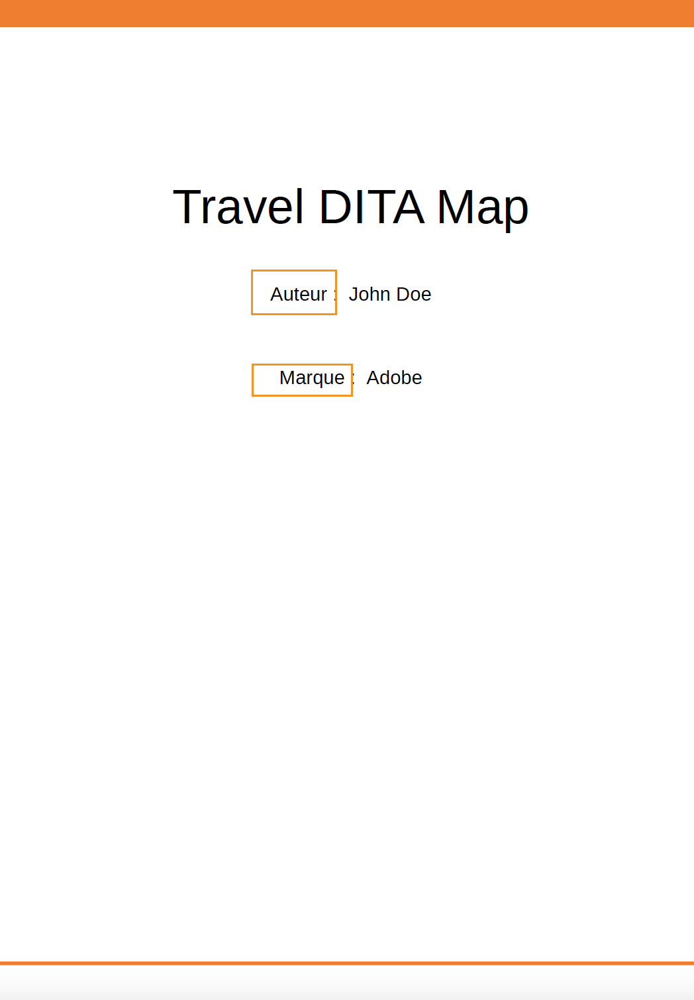

# Prise en charge des variables de langue

Adobe Experience Manager Guides permet d’utiliser des variables de langue. Vous pouvez utiliser des variables de langue pour définir des chaînes localisées dans la sortie PDF ou pour localiser du texte statique dans les modèles de sortie. Vous pouvez utiliser des styles CSS pour localiser les chaînes provenant d’un fichier CSS.

## Utilisation de variables de langue dans la sortie PDF

Vous pouvez utiliser des variables de langue pour définir une version localisée des libellés d’usine tels que Note, Attention et Avertissement ou du texte statique dans la sortie PDF. Le nom de variable est le même pour toutes les langues, mais peut avoir des valeurs différentes pour les différentes langues. Vous pouvez mettre à jour la valeur de ces variables dans une ou plusieurs langues, puis la valeur localisée est automatiquement sélectionnée dans la sortie PDF.

Par exemple, vous pouvez présenter le libellé `Note` de la manière suivante dans la sortie PDF :

- Anglais : Remarque

- Français : Remarque

- Allemand : Hinweis


*Exemple de note en anglais, français et allemand.*

>[!NOTE]
>
> Si la valeur d’une variable n’est pas définie dans une langue particulière, AEM Guides sélectionne la chaîne dans la langue de l’interface utilisateur (interface utilisateur de l’application) comme mécanisme de secours.
>
> Si vous n’avez pas défini la valeur dans la langue de l’interface utilisateur, elle recherche l’anglais (`en_us`), ou bien elle sélectionne la valeur l’anglais (`en`) et l’affiche dans la sortie PDF.

## Types de variables de langue

AEM Guides prend en charge deux types de variables : les variables Application et Utilisateur .

### Variables de l’application

AEM Guides fournit un ensemble de variables d’application prédéfinies ou prêtes à l’emploi. Vous pouvez utiliser ces variables prédéfinies pour ajouter des informations sur un document spécifique à AEM Guides. Par exemple, la variable `chapter-number`, si elle est incluse dans une page, affiche le numéro du chapitre auquel la page appartient. La variable `author-label` affiche le nom de l’auteur du document.

>[!NOTE]
>
> Vous pouvez remplacer la valeur d’une variable d’application.


### Variables utilisateur

Vous pouvez également créer de nouvelles variables de langue. Par exemple, vous pouvez créer une variable utilisateur Publisher pour le libellé de l&#39;éditeur du document.

>[!NOTE]
>
>  Vous devez disposer de droits d’administrateur pour créer des variables utilisateur et modifier les variables d’application.


*Ajoutez et affichez les variables de langue pour une langue sélectionnée.*

## Ajouter une nouvelle variable de langue

1. Dans l’éditeur, accédez au panneau de gauche et sélectionnez **Variables de langue**. Cette option est disponible sous la section Plus .
1. Sélectionnez **Modifier** pour ouvrir la fenêtre **Variables de langue**. L’application et les variables utilisateur présentes dans la langue sélectionnée sont répertoriées par ordre alphabétique. Les valeurs s’affichent en fonction de la langue sélectionnée. Par exemple, si vous sélectionnez la langue Français, « Conseil » s’affiche sous la forme « Conseil ».
1. Dans le menu déroulant **Langue**, sélectionnez la langue dans laquelle vous souhaitez modifier une variable.

   >[!NOTE]
   >
   > Si vous ne visualisez pas les langues souhaitées, activez la langue souhaitée à partir des paramètres **Configurer les langues**. Sélectionner les paramètres  ouvrir la boîte de dialogue **Configurer les langues**.

1. Saisissez le nom de la variable dans la colonne **Nom** et sa valeur dans la colonne **Valeur**.

   >[!NOTE]
   >
   >Vous pouvez utiliser n’importe quel contenu HTML comme valeur de variable pour afficher la valeur de la variable dans une mise en forme spécifique. Par exemple, vous pouvez ajouter `<b>` balise à la valeur de la variable pour afficher l’éditeur en gras.

1. Sélectionnez **Ajouter une variable de langue**  d’ajouter une nouvelle variable de langue à la langue sélectionnée. L’ajout d’une variable à une langue l’ajoute automatiquement à toutes les langues. Vous ne pouvez pas créer de variable portant le même nom qu’une variable existante. Une erreur s’affiche.

>[!NOTE]
>
> Si vous ne sélectionnez pas **Ajouter une variable de langue**, la variable n’est pas créée et ajoutée à la liste

## Exporter et importer des variables de langue

Experience Manager Guides prend en charge l’exportation et l’importation des variables de langue présentes dans la langue sélectionnée. Vous pouvez facilement exporter toutes les variables de langue avec les valeurs définies. Cela inclut les variables d’application et d’utilisateur. Utilisez le fichier exporté pour apporter les modifications souhaitées aux valeurs ou les localiser dans d’autres langues.

Vous pouvez également importer le fichier XML, qui contient les variables de langue. Experience Manager Guides importe uniquement les variables de langue déjà définies, y compris les variables d’application et d’utilisateur. Il n’importe pas les variables qui ne sont pas déjà définies.

### Exporter les variables de langue

Pour exporter les variables de langue d’une langue, sélectionnez la langue dans la liste déroulante, puis sélectionnez **Exporter** .
Il crée un fichier XML au format `language_variable_<ln>` où `<ln>` correspond au code de la langue sélectionnée. Par exemple, `language_variable_en.xml` pour l’anglais et `language_variable_fr.xml` pour le français.

>[!NOTE]
> 
>Si des modifications apportées aux variables de langue ne sont pas enregistrées, vous ne pouvez pas les exporter. Enregistrez les modifications pour afficher l’**Exportation** activé. Icône .

### Importer les variables de langue

Pour importer les variables de langue :

1. Sélectionnez une langue dans la liste déroulante, puis sélectionnez **Importer** .
2. Recherchez et sélectionnez le fichier XML qui contient les variables de langue. Par exemple, language_variable_en.xml.
Vous pouvez importer des fichiers XML au format suivant :

```
<?xml version="1.0" encoding="UTF-8"?>
<variables>    
<variable id="note-important">Important: </variable>    
<variable id="note-caution">Avertir: </variable>    
<variable id="image-with-text">Text and image &lt;img src=&quot;/content/dam/assets/images/image_with_text.png&quot; /&gt; </variable> 
</variables> 
```

Les variables avec le même ID sont importées une fois le fichier importé. Les valeurs des variables dans la langue sélectionnée sont mises à jour avec celles du fichier XML.  Un message concernant le nombre de variables mises à jour s’affiche.

>[!NOTE]
> 
><ul><li>Si le fichier n’est pas un fichier XML ou s’il contient un format incorrect qui ne correspond pas aux variables de langue, une erreur s’affiche indiquant qu’il existe un problème avec le fichier XML. 
>&gt;<li>Si le fichier ne contient aucune variable portant le même ID, un avertissement s’affiche indiquant qu’aucune variable de langue correspondante n’a été trouvée dans le fichier importé.

### Options d’une variable de langue

Pointez sur la variable pour afficher le menu **Options** correspondant.


*Utilisez le menu **Options**&#x200B;pour supprimer, prévisualiser ou dupliquer une variable de langue.*

Vous pouvez prévisualiser les variables d’application et d’utilisateur. Pour afficher la valeur de la variable dans la sortie, sélectionnez **Aperçu** dans le menu **Options** de la variable sélectionnée.
Vous pouvez également choisir de **Supprimer** ou **Dupliquer** les variables utilisateur. La suppression d’une variable d’une langue la supprime automatiquement de toutes les langues.

### Modifier ou rétablir les variables d’application

Vous pouvez également modifier les valeurs d’une variable d’application. Par la suite, vous pouvez rétablir la valeur d’origine d’une variable d’application. **Réinitialiser**  s’affiche pour une variable d’application dont la valeur a été modifiée.

## Utilisation de variables de langue dans les modèles de sortie

Vous devez ajouter des variables de langue dans vos documents localisés. Vous pouvez insérer ces variables de langue dans la mise en page qui s’affiche sur différentes pages de vos documents localisés. Par exemple, vous pouvez ajouter la variable de langue pour la `author-name` qui apparaît dans la zone d’en-tête de la mise en page (ou toute autre partie comme le pied de page ou le corps).





*L’auteur et le nom de la marque localisés dans la sortie PDF générée pour la langue française.*

Pour insérer une variable de langue telle que votre `copyright-label` dans la zone d’en-tête, procédez comme suit :

1. Ouvrez la mise en page requise pour la modification.

   >[!NOTE]
   >
   > Consultez la section [Personnalisation d’une mise en page](../native-pdf/components-pdf-template.md#customize-a-page-layout-customize-page-layout) pour ouvrir une mise en page à des fins de personnalisation ou de modification.

1. Sélectionnez l’en-tête pour activer l’insertion d’une variable.
1. Sélectionnez **Insérer une variable**   dans la barre d’outils.
1. Dans le pop-up **Insérer une variable**, sélectionnez le nom de la variable de langue à insérer et cliquez sur **Insérer** pour l’insérer dans la zone d’en-tête.

   >[!NOTE]
   >
   > Vous pouvez également saisir la chaîne de recherche dans la zone de texte. Les noms des variables contenant la chaîne donnée sont filtrés et affichés dans la liste.
   > La variable de langue sélectionnée est insérée dans la zone d’en-tête.


*Le `copyright-label` ajouté dans la zone d’en-tête.*

### Application d’un style de contenu aux variables de langue

Outre la valeur que vous attribuez à une variable de langue, vous pouvez également utiliser les balises HTML pour afficher la valeur de la variable dans une mise en forme spécifique. Par exemple, vous pouvez afficher la valeur du `publisher-label` en gras.

- Vous pouvez également mettre en forme les styles des valeurs à l’aide de <span> balise . Par exemple, à l’aide de la variable de langue numéro de page, vous pouvez afficher le numéro de page au format numérique romain en anglais et spécifier le format pour d’autres langues.

  Valeur pour l’anglais :
  `<span data-field="page-number" data-format="upper-roman">1</span>`

  Valeur pour le tamoul :
  `<span data-field="page-number" data-format="tamil">1</span>`

De même, vous pouvez ajouter des variables de langue et mettre en forme d’autres champs répertoriés dans la fonction Insérer des champs des mises en page. Pour plus d’informations sur l’ajout de champs, voir [Ajouter des champs et des métadonnées](../native-pdf/design-page-layout.md#add-fields-metadata).

- Vous pouvez également ajouter des images localisées dans les valeurs. Par exemple, vous pouvez ajouter une icône d’image dans la langue du numéro de chapitre et obtenir des images localisées de l’icône dans la sortie PDF.

  Pour l’anglais, la valeur de variable d’une image peut être semblable à ``, et pour la même variable en allemand, elle peut être ``. Il récupère donc les images en fonction de la langue.

## Localiser les chaînes à l’aide de styles CSS

À l’aide des styles CSS, vous pouvez également localiser les chaînes utilisées dans Autonumber comme Chapter, Section, Figure, and Table. Comme ces chaînes proviennent de fichiers CSS, vous ne pouvez pas les localiser à l’aide de variables de langue. Pour localiser ces chaînes, vous pouvez créer des styles CSS pour chaque langue dans laquelle vous souhaitez les localiser.
Par exemple, vous pouvez utiliser la feuille de style CSS suivante pour afficher le préfixe de chapitre et le format numérique correspondant dans différentes langues.
Par exemple, vous pouvez utiliser la feuille de style CSS suivante pour afficher le chapitre en tant que Hoofdstuk en allemand et le numéro du chapitre au format décimal. Alors que pour le japonais, vous pouvez utiliser le format numérique japonais pour afficher les numéros de chapitre dans la table des matières.

```
// for English
h1:before {
  counter-increment: h11;
  content: "Chapter " counter(h11, decimal)".";
}

// for German
:root:lang(de) h1:before {
  content: "Hoofdstuk " counter(h11, decimal)".";
}

// for Japanese
:root:lang(ja) h1:before {
  content: "章 " counter(h11, japanese-formal)".";
}
```

Les captures d’écran suivantes affichent les chaînes localisées en allemand et en japonais dans la sortie PDF .


### Mise en forme des préfixes

À l’aide des styles CSS, vous pouvez également mettre en forme les préfixes. Par exemple, vous pouvez mettre en forme le libellé `Note` pour qu’il apparaisse en rouge dans la sortie PDF de différentes langues.

```
.note .prefix-content 
{
color: red;
} 
```
