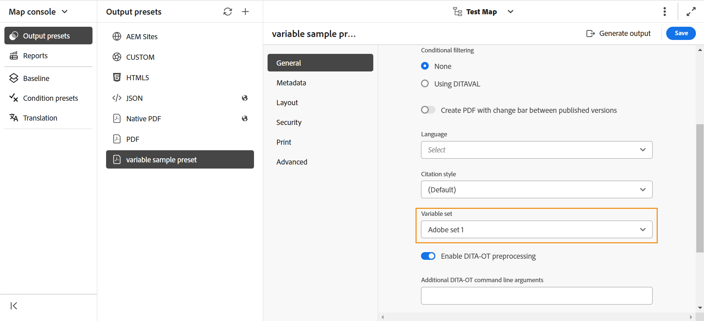

# Variables de la sortie PDF

Une variable est une paire de données nom-valeur qui sert d’information réutilisable. Cela rend votre contenu portable et facile à mettre à jour. Lorsque vous modifiez une variable ou sa valeur, chaque occurrence de cette variable ou valeur est mise à jour.

## Création d’une variable

Pour créer une variable, procédez comme suit :

{width="800" align="left"}

*Créer des variables et définir des valeurs pour celles-ci.*

1. Dans l’éditeur, accédez au panneau de gauche et sélectionnez **Variables** . Cette option est disponible sous la section Plus .
1. Sélectionnez **Modifier**  d’ouvrir l’éditeur **Variables**.
Les variables sont répertoriées par ordre alphabétique.
1. Entrez le nom de la variable dans la **colonne Nom** et sa valeur dans la **colonne Valeur** .
   >[!TIP]
   >
   >Vous pouvez utiliser n’importe quel contenu HTML comme valeur de variable pour afficher la valeur de variable dans une mise en forme spécifique. Par exemple, vous pouvez ajouter une balise `<b>` à la valeur de la variable pour afficher la valeur **Experience Manager Guides** en gras. Vous pouvez également ajouter des images du référentiel sous forme de valeurs.

1. Sélectionnez **Ajouter une variable**  d’ajouter une nouvelle variable. Vous ne pouvez pas créer de variable portant le même nom qu’une variable existante. Une erreur s’affiche.

   >[!NOTE]
   >
   >Si vous ne sélectionnez pas **Ajouter une variable** , la variable n’est pas créée et ajoutée à la liste.

Ainsi, vous pouvez créer des variables avec des valeurs par défaut. Par exemple :
* Nom du produit : Experience Manager Guides
* Numéro de version : 2300
* Date de publication : 01/01/2023

### Modification d’une variable

Vous pouvez modifier une variable de deux manières :

**Dans le panneau Variables sur le côté gauche**

1. Sélectionnez une variable dans le panneau **Variables**.
1. Pointez sur la variable pour afficher le menu **Options**, puis sélectionnez l’option **Modifier**.
1. Dans la boîte de dialogue **Modifier la variable**, vous pouvez modifier la valeur par défaut de la variable sélectionnée.
1. Sélectionnez **Terminé**.

**Dans l’éditeur de variables**

1. Sélectionnez **Variables**  dans le panneau de gauche.
1. Sélectionnez **Modifier**  d’ouvrir l’éditeur **Variables**.

1. Dans l’éditeur **de variables** , vous pouvez modifier la valeur de la variable sélectionnée.

Vous devez enregistrer toutes les modifications que vous apportez à partir de l’éditeur **de variables** pour les afficher dans le **panneau Variables** sur le côté gauche.

>[!NOTE]
>
> Si vous modifiez une valeur de variable, Adobe Experience Manager Guides met simultanément à jour toutes les références, le cas échéant.

### Search et aperçu d’une variable

Vous pouvez rechercher et prévisualiser la valeur d’une variable. Saisissez une chaîne dans la zone de recherche du panneau **Variables**. Elle effectue une recherche en fonction du nom de la variable et de sa valeur.
Vous pouvez prévisualiser une variable de deux manières :

L’aperçu de la variable affiche la valeur par défaut. Par exemple, si vous avez défini la valeur par défaut de la variable ProductName sur « Adobe Experience Manager Guides », elle affiche cette valeur dans l’aperçu.

**Dans le panneau Variables sur le côté gauche**

1. Sélectionnez une variable dans le panneau **Variables**.
1. Pointez sur la variable pour afficher le menu **Options**, puis sélectionnez l’option **Aperçu**.

   {width="550" align="left"}

*Prévisualiser la valeur par défaut d’une variable.*

**Dans l’éditeur de variables**

1. Pointez sur la variable dans la liste pour afficher le menu **Options**.
1. Sélectionnez **Aperçu**.

### Dupliquer une variable

Vous pouvez dupliquer une variable et la modifier selon vos besoins.

1. Placez le pointeur de la souris sur la variable dans la liste pour afficher le **menu Options** .
1. Sélectionnez **Dupliquer**.

Le nom par défaut de la variable est `<selected variable name>` (comme « exemple »). Vous pouvez modifier le nom en fonction de vos besoins.

### Supprimer une variable

Vous pouvez supprimer une variable de deux manières :

**Dans le panneau Variables sur le côté gauche**

1. Sélectionnez une variable dans le panneau **Variables**.
1. Pointez sur la variable pour afficher le menu **Options**, puis sélectionnez l’option **Supprimer**.

**Dans l’éditeur de variables**

1. Pointez sur la variable dans la liste pour afficher le menu **Options**.
1. Sélectionnez l’option **Supprimer**.

La variable est supprimée de tous les jeux de variables.

## Jeux de variables pour les paramètres prédéfinis de sortie

Adobe Experience Manager Guides prend également en charge les ensembles de variables, qui vous permettent d’affecter d’autres valeurs à vos variables. Par exemple, une entreprise peut vendre deux produits, A et B. Il a des spécifications différentes pour chacun d’eux. Ces spécifications peuvent inclure le nom du produit, le numéro de version et la date de publication. Il peut y avoir d’autres différences dans l’image de marque. Les jeux de variables vous permettent de définir un jeu de valeurs différent pour vos variables. Lorsque vous générez la sortie, vous choisissez le jeu de variables approprié et générez la sortie requise.

### Configuration d’ensembles de variables

Vous devez configurer des ensembles de variables avant d’y ajouter des variables.

1. Sélectionnez **Paramètres**  d’ouvrir la boîte de dialogue **Configurer des ensembles de variables**.
   {width="550" align="left"}
1. Saisissez le nom du jeu de variables dans la colonne **Nom**.
1. Sélectionnez **Ajouter une variable**  d’ajouter un nouveau jeu de variables. Les ensembles de variables sont répertoriés par ordre alphabétique.
1. Vous pouvez sélectionner **Supprimer** pour supprimer un ensemble de variables.

### Opérations d’ensemble de variables

Tous les ensembles de variables comportent les mêmes variables, mais peuvent avoir des valeurs différentes.

Vous pouvez afficher, modifier et prévisualiser les valeurs d’un ensemble de variables spécifique. Sélectionnez un ensemble de variables dans le menu déroulant **Ensembles de variables**. Les valeurs s’affichent en fonction du jeu de variables choisi.
Lorsque vous modifiez les valeurs des variables dans des jeux de variables spécifiques, cela remplace les valeurs par défaut et modifie les valeurs du jeu de variables sélectionné.
Par exemple, vous pouvez définir les valeurs suivantes pour les ensembles de variables, *Adobe-set1* et *Adobe-set2* .

**Ensemble de variables 1** : *Adobe-set1*

* ProductName : ProductA
* Numéro de version : 2311
* Date de publication : 11/02/2023

**Ensemble de variables 2** : *Adobe-set2*

* ProductName : ProductB
* Numéro de version : 2310
* Date de publication : 09/07/2023

Chaque nouvelle variable est ajoutée à tous les jeux de variables. Lorsque vous supprimez ou dupliquez une variable, elle est mise à jour pour tous les jeux de variables.

Vous pouvez également prévisualiser les valeurs d’un ensemble de variables.
Par exemple, pour l’ensemble de variables *Adobe-Set1*, vous avez défini la valeur de la variable ProductName sur « ProductA », puis elle affiche cette valeur dans l’aperçu de l’éditeur de variables .

{width="550" align="left"}

*Prévisualisez la valeur que vous avez définie dans le jeu de variables sélectionné.*

### Réinitialiser la valeur d’une variable

Si vous avez modifié la valeur, vous pouvez également réinitialiser une variable à la valeur par défaut.
Réinitialiser  s’affiche pour une variable dont la valeur a été modifiée.
Par exemple, vous pouvez réinitialiser la valeur de la variable ProductName sur la valeur par défaut Experience Manager Guides.

## Utilisation de variables dans les modèles PDF natifs

Vous pouvez ajouter des variables pendant que vous générez la sortie de vos documents produit pour les rendre portables et faciles à mettre à jour. Vous pouvez insérer ces variables dans la mise en page qui s’affiche sur les différentes pages de vos documents. Par exemple, vous pouvez ajouter la variable ProductName qui apparaît dans la zone d’en-tête de la mise en page (ou dans toute autre partie comme le pied de page ou le corps).

Pour insérer une variable telle que votre ProductName dans la zone d’en-tête, procédez comme suit :
1. Ouvrez la mise en page requise pour la modification.

   >[!NOTE]
   >
   > Consultez la section [Personnalisation d’une mise en page](../native-pdf/components-pdf-template.md#customize-a-page-layout-customize-page-layout) pour ouvrir une mise en page à des fins de personnalisation ou de modification.

1. Sélectionnez l’en-tête pour activer l’insertion d’une variable.

1. Vous pouvez insérer la variable de deux manières :

   **Dans le panneau Variables sur le côté gauche**

   * Faites glisser une variable à partir du panneau Variables **et déposez-la dans la zone d’en-tête**.

   **À partir de la barre d’outils**

   1. Sélectionnez **Insérer une variable/des champs** .
   1. Dans la boîte de dialogue **Variable**, sélectionnez le nom de la variable pour l’insérer dans la zone d’en-tête.
   1. Vous pouvez également saisir la chaîne de recherche dans la zone de texte. Les noms des variables contenant la chaîne donnée sont filtrés et affichés dans la liste. La variable sélectionnée est insérée dans la zone d’en-tête. Vous pouvez afficher la valeur par défaut de la variable.
   1. Pour remplacer une variable, double-cliquez sur la valeur de la variable et sélectionnez une autre variable dans la boîte de dialogue **Variable**. La variable est remplacée.

## Générer une sortie PDF avec des variables

Vous pouvez générer la sortie PDF avec les valeurs de différentes variables. Avant de générer la mise en page, choisissez un jeu de variables dans la liste déroulante **Jeu de variables** d’un paramètre prédéfini de sortie pour sélectionner ses valeurs.

{width="550" align="left"}

*Sélectionnez un jeu de variables dans la liste déroulante du paramètre prédéfini de sortie que vous souhaitez utiliser pour générer la sortie PDF.*

>[!NOTE]
>
> Vous pouvez également sélectionner (Par défaut) dans la liste déroulante pour publier les valeurs par défaut de toutes les variables.

Selon l’ensemble de variables choisi, vous obtiendrez une sortie correspondant aux valeurs de variable définies dans l’ensemble de variables. Par exemple, si vous sélectionnez l’ensemble de variables *Adobe-set1*, votre sortie affiche les valeurs des variables telles que définies dans cet ensemble.

*Générez la sortie PDF à l’aide de variables dans la mise en page.*

Vous pouvez également mettre à jour rapidement les valeurs de n’importe quel jeu de variables si nécessaire et régénérer la sortie. Par exemple, si vous devez mettre à jour les détails d’une version, vous pouvez mettre à jour la valeur de la version dans la variable VersionNumber et régénérer la sortie.
