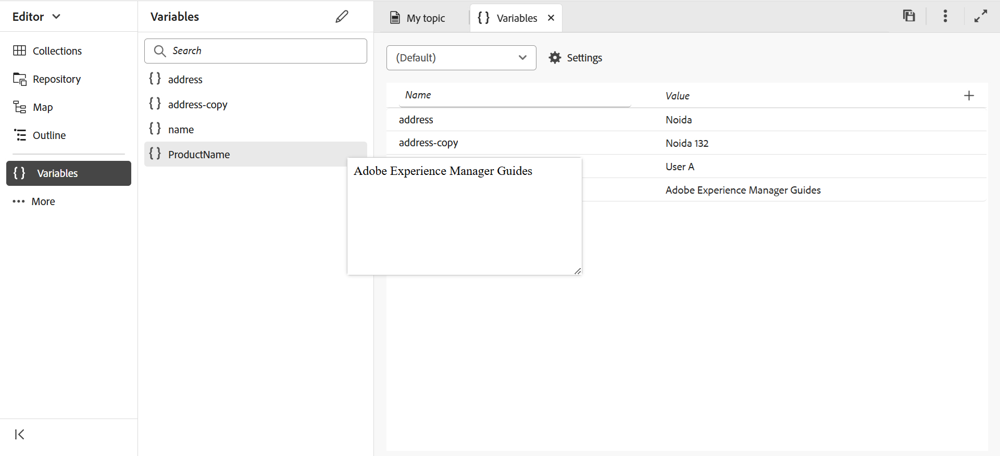

# Variables de la sortie PDF

Une variable est une paire de données nom-valeur qui sert d’information réutilisable. Cela rend votre contenu portable et facile à mettre à jour. Lorsque vous modifiez une variable ou sa valeur, chaque occurrence de cette variable ou valeur est mise à jour.

## Création d’une variable

Pour créer une variable, procédez comme suit :

{width="800" align="left"}

*Créez des variables et définissez des valeurs pour elles.*

1. Dans l’éditeur Web, accédez à l’onglet **Output**.
1. Sélectionnez **Variables**  dans le panneau de gauche.
1. Sélectionnez **Edit**  pour ouvrir l’éditeur **Variables**.
Les variables sont classées par ordre alphabétique.
1. Entrez le nom de la variable dans la **colonne Nom** et sa valeur dans la **colonne Valeur** .
   >[!TIP]
   >
   >Vous pouvez utiliser n’importe quel contenu HTML comme valeur de variable pour afficher la valeur de variable dans une mise en forme spécifique. Par exemple, vous pouvez ajouter une `<b>` balise à la valeur de la variable pour afficher la valeur **Experience Manager guides** en gras. Vous pouvez également ajouter des images du référentiel sous forme de valeurs.

1. Sélectionnez **Ajouter une variable**  pour ajouter une nouvelle variable. Vous ne pouvez pas créer de variable portant le même nom qu’une variable existante. Une erreur s’affiche.

   >[!NOTE]
   >
   >Si vous ne sélectionnez pas **Ajouter une variable** , la variable n’est pas créée et ajoutée à la liste.

Ainsi, vous pouvez créer des variables avec des valeurs par défaut. Par exemple :
* ProductName : Experience Manager Guides
* VersionNumber : 2300
* Date de publication : 01/01/2023

### Modification d’une variable

Vous pouvez modifier une variable de deux manières :

**Dans le panneau Variables sur le côté gauche**

1. Sélectionnez une variable dans le panneau **Variables** .
1. Passez la souris sur la variable pour afficher le menu **Options** , puis sélectionnez l’option **Modifier** .
1. Dans la boîte de dialogue **Modifier la variable**, vous pouvez modifier la valeur par défaut de la variable sélectionnée.
1. Cliquez sur **Terminé**.

**À partir de l’éditeur de variables**

1. Sélectionnez **Variables**  dans le panneau de gauche.
1. Sélectionnez **Edit**  pour ouvrir l’éditeur **de variables** .

1. Dans l’éditeur **de variables** , vous pouvez modifier la valeur de la variable sélectionnée.

Vous devez enregistrer toutes les modifications que vous apportez à partir de l’éditeur **de variables** pour les afficher dans le **panneau Variables** sur le côté gauche.

>[!NOTE]
>
> Si vous modifiez une valeur de variable, Adobe Experience Manager Guides met simultanément à jour toutes les références, le cas échéant.

### Search et aperçu d’une variable

Vous pouvez rechercher et prévisualiser la valeur d’une variable. Entrez une chaîne dans la zone de recherche du panneau **Variables**. Il effectue des recherches en fonction du nom de la variable et de sa valeur.
Vous pouvez prévisualiser une variable de deux manières :

L’aperçu de la variable affiche la valeur par défaut. Par exemple, si vous avez défini la valeur par défaut de la variable ProductName comme &quot;Adobe Experience Manager Guides&quot;, elle affiche cette valeur dans l’aperçu.

**Dans le panneau Variables sur le côté gauche**

1. Sélectionnez une variable dans le panneau **Variables** .
1. Passez la souris sur la variable pour afficher le menu **Options** , puis sélectionnez l’option **Aperçu** .

{width="550" align="left"}

*Prévisualisez la valeur par défaut d&#39;une variable.*

**À partir de l’éditeur de variables**

1. Passez la souris sur la variable de la liste pour afficher le menu **Options**.
1. Sélectionnez **Aperçu**.

### Duplication d’une variable

Vous pouvez dupliquer une variable et modifier la valeur en fonction de vos besoins.

1. Placez le pointeur de la souris sur la variable dans la liste pour afficher le **menu Options** .
1. Sélectionnez **Dupliquer**.

Le nom par défaut de la variable est `<selected variable name>` (comme &quot;sample&quot;). Vous pouvez modifier le nom en fonction de vos besoins.

### Supprimer une variable

Vous pouvez supprimer une variable de deux manières :

**Dans le panneau Variables sur le côté gauche**

1. Sélectionnez une variable dans le panneau **Variables** .
1. Passez la souris sur la variable pour afficher le menu **Options** , puis sélectionnez l’option **Supprimer** .

**À partir de l’éditeur de variables**

1. Passez la souris sur la variable de la liste pour afficher le menu **Options**.
1. Sélectionnez l&#39;option **Supprimer** .

La variable est supprimée de tous les jeux de variables.

## Jeux de variables pour les paramètres prédéfinis de sortie

Adobe Experience Manager Guides prend également en charge les ensembles de variables, qui vous permettent d’affecter d’autres valeurs à vos variables. Par exemple, une entreprise peut vendre deux produits, A et B. Il a des spécifications différentes pour chacun d’eux. Ces spécifications peuvent inclure le nom du produit, le numéro de version et la date de publication. Il peut y avoir d’autres différences dans la valorisation de marque. À l’aide d’ensembles de variables, vous définissez un jeu de valeurs différent pour vos variables. Lorsque vous générez la sortie, vous choisissez le jeu de variables approprié et générez la sortie requise.

### Configuration des jeux de variables

Vous devez configurer des jeux de variables avant d’y ajouter des variables.

1. Sélectionnez **Settings**  pour ouvrir la boîte de dialogue **Configurer les jeux de variables**.
   {width="550" align="left"}
1. Saisissez le nom du jeu de variables dans la colonne **Nom**.
1. Sélectionnez **Ajouter une variable**  pour ajouter un nouveau jeu de variables. Les jeux de variables sont répertoriés par ordre alphabétique.
1. Vous pouvez sélectionner **Supprimer** pour supprimer un jeu de variables.

### Opérations de définition de variables

Tous les jeux de variables comportent les mêmes variables, mais peuvent avoir des valeurs différentes.

Vous pouvez afficher, modifier et prévisualiser les valeurs d’un jeu de variables spécifique. Sélectionnez un jeu de variables dans la liste déroulante **Jeux de variables** . Les valeurs s’affichent en fonction de l’ensemble de variables sélectionné.
Lorsque vous modifiez les valeurs des variables d’ensembles de variables spécifiques, elles remplacent les valeurs par défaut et modifient les valeurs de l’ensemble de variables sélectionné.
Par exemple, vous pouvez définir les valeurs suivantes pour les ensembles de variables, *Adobe-set1* et *Adobe-set2* .

**Jeu de variables 1** : *Adobe-set1*

* ProductName : ProductA
* VersionNumber : 2311
* Date de publication : 11/02/2023

**Jeu de variables 2** : *Adobe-set2*

* ProductName : ProductB
* VersionNumber : 2310
* Date de publication : 09/07/2023

Chaque nouvelle variable est ajoutée à tous les jeux de variables. Lorsque vous supprimez ou dupliquez une variable, elle est mise à jour pour tous les jeux de variables.

Vous pouvez également prévisualiser les valeurs d’un jeu de variables.
Par exemple, pour le jeu de variables *Adobe-Set1*, vous avez défini la valeur de la variable ProductName comme &quot;ProductA&quot;, puis elle affiche cette valeur dans l’aperçu de l’éditeur de variables .

{width="550" align="left"}

*Prévisualisez la valeur que vous avez définie dans le jeu de variables sélectionné.*

### Réinitialisation de la valeur d’une variable

Si vous avez modifié la valeur, vous pouvez également réinitialiser une variable sur la valeur par défaut.
Réinitialiser  apparaît pour une variable avec une valeur modifiée.
Par exemple, vous pouvez réinitialiser la valeur de la variable ProductName sur la valeur par défaut Guides Experience Manager.

## Utilisation de variables dans les modèles de PDF natif

Vous pouvez ajouter des variables lorsque vous générez la sortie de vos documents de produit afin de les rendre portables et faciles à mettre à jour. Vous pouvez insérer ces variables dans la mise en page des différentes pages de vos documents. Par exemple, vous pouvez ajouter la variable ProductName qui apparaît dans la zone d’en-tête de la mise en page (ou toute autre partie comme le pied de page ou le corps).

Pour insérer une variable comme votre ProductName dans la zone d’en-tête, procédez comme suit :
1. Ouvrez la mise en page requise pour la modifier.

   >[!NOTE]
   >
   > Afficher la section [Personnaliser une mise en page](../native-pdf/components-pdf-template.md#customize-a-page-layout-customize-page-layout) pour ouvrir une mise en page à des fins de personnalisation ou de modification.

1. Sélectionnez l’en-tête pour activer l’insertion d’une variable.

1. Vous pouvez insérer la variable de deux manières :

   **Dans le panneau Variables sur le côté gauche**

   * Faites glisser une variable à partir du panneau Variables **et déposez-la dans la zone d’en-tête**.

   **À partir de la barre d’outils**

   1. Sélectionnez **Insérer la variable/les champs** .
   1. Dans la boîte de dialogue **Variable**, sélectionnez le nom de la variable à insérer dans la zone d’en-tête.
   1. Vous pouvez également saisir la chaîne de recherche dans la zone de texte. Les noms des variables contenant la chaîne donnée sont filtrés et affichés dans la liste. La variable sélectionnée est insérée dans la zone d’en-tête. Vous pouvez afficher la valeur par défaut de la variable.
   1. Pour remplacer une variable, double-cliquez sur la valeur de la variable et sélectionnez une autre variable dans la boîte de dialogue **Variable**. La variable est remplacée.

## Générer une sortie de PDF avec des variables

Vous pouvez générer la sortie du PDF avec les valeurs de différentes variables. Avant de générer la mise en page, choisissez un jeu de variables dans la liste déroulante **Jeu de variables** d’un paramètre prédéfini de sortie pour sélectionner ses valeurs.

{width="550" align="left"}

*Sélectionnez un jeu de variables dans la liste déroulante du paramètre prédéfini de sortie que vous souhaitez utiliser pour générer la sortie PDF.*

>[!NOTE]
>
> Vous pouvez également sélectionner (Par défaut) dans la liste déroulante pour publier les valeurs par défaut de toutes les variables.

Selon le jeu de variables choisi, vous obtiendrez une sortie correspondant aux valeurs de variable définies dans le jeu de variables. Par exemple, si vous sélectionnez le jeu de variables *Adobe-set1*, votre sortie affiche les valeurs des variables telles que définies dans cet ensemble.

*Générez la sortie du PDF à l’aide de variables dans la mise en page.*

Vous pouvez également mettre rapidement à jour les valeurs de n’importe quel jeu de variables, le cas échéant, et générer à nouveau la sortie. Par exemple, si vous devez mettre à jour les détails d’une version, vous pouvez mettre à jour la valeur de la version dans la variable VersionNumber et générer à nouveau la sortie.
